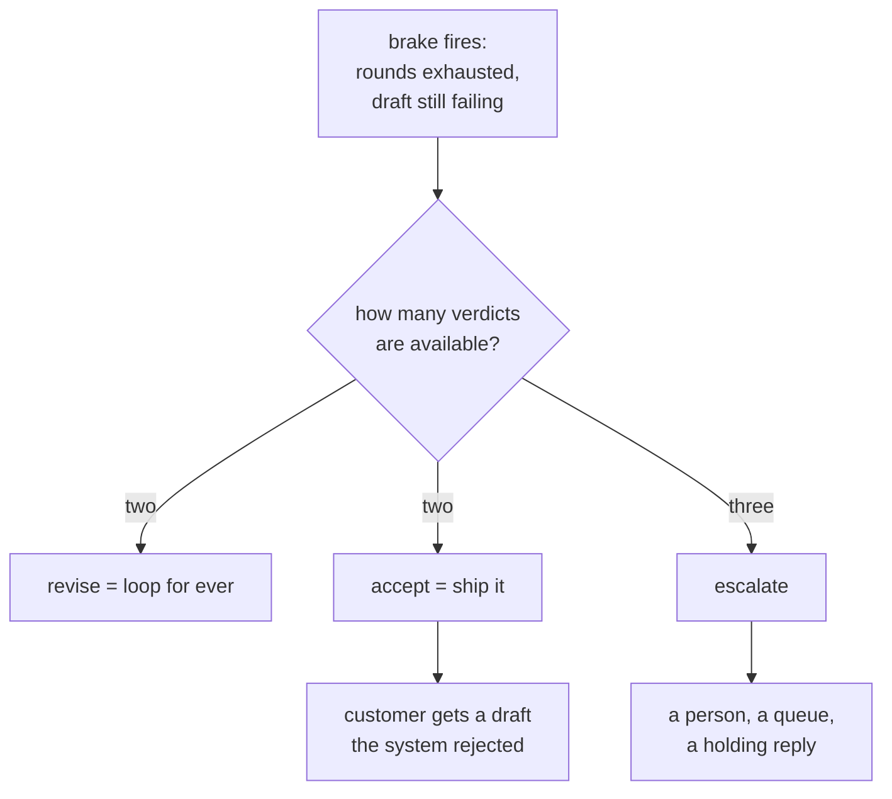

# 4.3 — The third verdict

## One-line answer

With only *accept* and *revise*, a brake that fires has to pick one of them, and it picks accept —
so the draft that could not meet the standard is sent to the customer and the run is logged as a
success.

## The story

A pharmacy counter has a queue and a rule: the pharmacist checks every prescription before it is
handed over.

Most of the time the check has two outcomes. It is fine, and the bag goes across the counter. Or
something is wrong, and it goes back to be corrected.

Then a prescription arrives where the dose is unusual. It is not obviously wrong. It is not
obviously right either. It has been sent back twice already and it has come back the same both times,
because the person who wrote it meant it.

If the only two things the pharmacist is allowed to do are *hand it over* and *send it back*, then
the third time it comes back she has to hand it over, because sending it back a fourth time is the
same as never resolving it and there is a queue behind you.

What she actually does is put it to one side and telephone the surgery.

That is a third outcome, and it is not a compromise between the other two. It is a different action
with a different destination, and a counter that does not have it will eventually hand over
something it should not have.

## The idea in plain language

A **verdict** is the decision the critic returns and the graph routes on. The obvious design has two
values, because there are two obvious things to do with a draft.

Two is not enough, and the reason is entirely mechanical. The brake from
[4.2](4.2-the-brake-belongs-to-the-graph.md) fires when the loop has run out of rounds. At that
moment the draft still does not meet the standard — that is *why* the loop was still going. The
brake now has to route somewhere, and its options are:

- **revise** — which sends it back to the writer, which is the loop it was just stopping. Not
  available.
- **accept** — which sends a draft that fails the standard to the customer.

So a two-verdict system does not have a choice at the brake. It has an inevitability, and the
inevitability is to ship the thing it just spent six model calls establishing was not good enough.

The third verdict — call it **escalate** — is a different destination: a queue, a human, a fallback
template, a "we are looking into this" holding reply. What it is matters less than the fact that it
is **not the customer**, and that the run records the outcome truthfully.

There is a second, quieter argument for it, and it arrives from
[2.3](../02-the-orchestrator/2.3-two-descriptions-that-overlap-are-one-bug.md). That part's remaining
routing failure was a request belonging to *neither* specialist, and the fix was not better
descriptions but the ability to say "neither". **Any component that classifies needs a way to
decline**, and a critic is a classifier. Without it, every uncertain case is forced into a confident
answer, and confident wrong answers are the expensive kind.

## Why Sutra needs it

The desk has a ticket that cannot satisfy its own standard. `ticket:5044` — the recurring calendar
event — has a cause that takes a long sentence to explain honestly, and the standard says replies are
at most seventy words. Explaining the cause properly and keeping the reply short are, for this
ticket, incompatible.

That is not a defect in the standard. Both rules are good rules, and on the other four tickets they
coexist happily. It is a real conflict on a real case, and it is the case where the system has to do
something other than pretend.

Day 62 builds the human-in-the-loop patterns that give `escalate` somewhere to go, and Days 63 and 64
build the approval gate on the same seam. This part is where the *need* for that destination is
established, with a number.

## The mechanism

The same loop, the same brake, and the difference is only in what the brake is allowed to return.

```python
def loop(two_verdicts: bool) -> tuple[str, str, list[str]]:
    """Run the pair to the brake. Returns (verdict, where it went, what was still failing)."""
    writer = Writer(ticket=TICKET)
    writer.calls = 3
    critic = Critic()
    draft = writer.draft()
    rounds = 1

    while True:
        verdict, found = critic.review(draft)
        if verdict == "accept":
            return "accept", "sent to the customer", []
        if rounds >= MAX_ROUNDS:
            if two_verdicts:
                # Only accept and revise exist. The brake has to pick one, and revise would
                # loop for ever, so the brake accepts - and ships a draft that fails.
                return "accept", "sent to the customer", found
            return "escalate", "queued for a person", found
        draft = writer.draft(told=found)
        rounds += 1
```

**Line by line:**

- `writer.calls = 3` starts the writer on its fourth pass, aiming at the **whole** standard. This is
  deliberate: the failure below is not a lazy writer, it is a writer doing everything right against a
  standard that cannot be satisfied for this ticket.
- The `two_verdicts` branch returns `"accept"` **with `found` still populated**. That combination —
  a verdict of accept and a non-empty list of failures — is the bug written as data, and it is worth
  looking at because it is exactly what a two-verdict system produces at the brake.
- The comment on that branch is the honest reasoning of whoever wrote it. Nobody decides to ship bad
  drafts. They notice that `revise` would loop forever, and `accept` is the only other value, so
  `accept` it is.
- The `escalate` branch returns a **different destination string**, not a different flag on the same
  destination. That is the point: the third verdict has to lead somewhere else, or it is a label on
  the same behaviour.
- `while True` with no hard stop is safe here precisely because the brake exists — which is the
  argument of [4.2](4.2-the-brake-belongs-to-the-graph.md) restated as a control-flow fact.

```bash
cd days/day-57-orchestrator-and-critic/lab
uv run python escalate.py
uv run python escalate.py --two
```

**Line by line:**

- The default arm has three verdicts; `--two` removes `escalate`. Same ticket, same writer, same
  critic, same round cap.
- Both print `still failing`, because that column is what makes the two-verdict outcome visible. A
  system reporting only the verdict would show `accept` in both runs.

Measured on 2026-09-05:

```text
verdicts available: accept, revise, escalate
  ticket:           ticket:5044
  after 3 rounds:   escalate
  the draft:        queued for a person
  still failing:    ['short']
```

```text
verdicts available: accept, revise
  ticket:           ticket:5044
  after 3 rounds:   accept
  the draft:        sent to the customer
  still failing:    ['short']

  the loop reported success. The standard says it did not succeed.
```

Read the two `still failing` lines. **They are identical.** The system's knowledge of the draft is
exactly the same in both runs — it knows the reply is over length, it knows which rule, it has that
information in a variable. The only difference is whether there was a value it could return that
means *"I know, and this is not for the customer."*

Without one, the same knowledge is thrown away at the last line of the loop, and the customer gets a
106-word reply that the system had already determined was too long.



## When it breaks

The break is the third verdict that exists in the enumeration and goes nowhere.

Somebody adds `escalate`, the critic returns it, and the graph has no edge for that route. In ADK's
node graph a route with no matching edge does not raise — the run simply stops advancing down that
path, which Day 53's failure lab measured directly: a join reached down a route that triggers only
one predecessor silently skipped everything downstream, two events instead of five, exit 0, no
warning at all.

So the symptom of an unwired `escalate` is that the ticket **disappears**. No error, no reply, no
queue entry, exit code zero. The customer is waiting for something nobody is holding.

You can see the shape of it without a graph:

```bash
cd days/day-57-orchestrator-and-critic/lab
uv run python -c "
import escalate
verdict, went, failing = escalate.loop(two_verdicts=False)
routes = {'accept': 'send', 'revise': 'writer'}   # escalate is missing
print('verdict:', verdict)
print('edge for it:', routes.get(verdict, 'NONE - the ticket stops here'))
print('still failing:', failing)
"
```

```text
verdict: escalate
edge for it: NONE - the ticket stops here
still failing: ['short']
```

The verdict is correct, the reasoning is correct, and the ticket is gone. This is why the third
verdict is a *destination* rather than a value: adding the enum member is the easy half, and the half
that matters is that something is on the other end of it.

The second break is escalation as the easy answer. A critic that escalates whenever it is unsure
produces a queue no human can keep up with, which is the failure Day 62 measures from the human's
side — and a queue nobody works is functionally the same as the disappearing ticket above.

## In production

**What a professional writes instead.** Three routes, all three wired, and the escalate path carries
**why**: which rules failed, how many rounds it ran, and the last draft, so that whoever picks it up
does not start from nothing. The holding reply to the customer is separate from the escalation, and
it goes out immediately — the customer's experience of an escalated ticket should be a slower answer,
not silence. That decision is the one that most often gets left out, because the escalation looks
handled from inside the system.

**What degrades at scale.** The escalation rate is a number nobody budgets for. It is near zero on
the fixture and on launch day, and it grows as the standard grows and as traffic diversifies, because
every added rule adds conflicts. Then one day the queue has more in it than the team can read, and
the pressure to "reduce escalations" arrives — which, if handled by loosening the brake or the
standard, converts a visible backlog into invisible bad replies. The rate belongs on a dashboard from
the beginning, next to the converged rate.

**The failure mode that only appears with real traffic.** Escalations are not uniformly distributed.
They cluster on the ticket types where rules conflict — the long technical explanations, the angry
customers, the unusual products. So the queue fills with the hardest cases, which is correct, and the
team's experience of the system is that it handles the easy work and hands them everything difficult.
That is the right outcome and it needs saying out loud when the system is introduced, or it reads as
the system failing.

**The review comment a senior engineer leaves:** *"There are two verdicts, so when the round cap
fires we return accept with a non-empty failure list. That is us sending a reply we have already
decided is wrong, and logging it green. Add escalate, wire an edge for it, and put the failing rules
and the round count on the escalation payload. Also: what does the customer see while it sits in that
queue?"*

**The interview question:** *"What happens when your review loop runs out of rounds?"* An honest
answer names the trap: *"With only accept and revise, it accepts — there is nothing else it can do,
because revise is the loop it is stopping. So the draft the system just spent several calls deciding
was not good enough goes to the customer, and the run logs as a success. I hit this on a real case
where two of my rules genuinely conflicted: explaining the cause honestly made the reply longer than
the length limit, and no number of rounds was going to fix it. The answer is a third verdict with a
real destination — a person, a queue, a holding reply — and the important part is wiring the route,
because an escalate with no edge behind it means the ticket silently disappears with exit code zero.
I also watch the escalation rate, because if it climbs the temptation is to loosen the standard,
which just converts a visible queue into invisible bad replies."*

## Check yourself

```bash
cd days/day-57-orchestrator-and-critic/lab
uv run python escalate.py
uv run python escalate.py --two
```

Now change `MAX_ROUNDS` to `10` and run the default arm again. Write down whether `ticket:5044`
converges, and say what that tells you about raising a round cap to reduce escalations.

**Out loud, without scrolling up:** explain why a two-verdict critic must ship a failing draft when
the brake fires, and say what has to exist besides the new enum value.

**Next:** [5.1 — Did the critic actually help?](../05-does-it-help/5.1-did-the-critic-actually-help.md).
