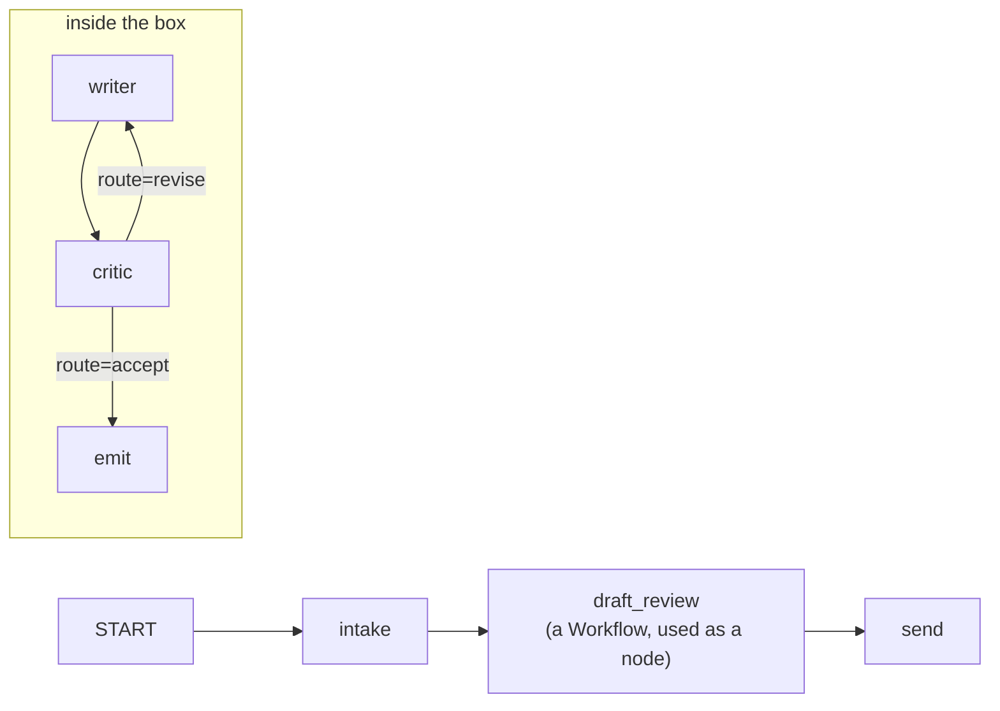

# 6.1 — A workflow is a node

## One-line answer

In ADK 2.x a `Workflow` is itself a `BaseNode`, so the whole Writer↔Critic loop drops into a bigger
graph as **one node** — the outer graph has three nodes and one of them happens to contain a cycle.

## The story

A council office has a department that handles one thing: checking that a planning application is
complete before it goes to the committee.

From the corridor it is a door with a name on it. You hand your papers in at the door and, some time
later, papers come back out — either stamped and ready for committee, or returned with a list of
what is missing.

Inside that door there are four people and an argument that goes round twice. You do not know that.
You do not need to know that, and the committee upstairs does not either. The committee's process
says: *papers go to Completeness Checking; papers come back from Completeness Checking; then the
committee sits.* Three steps.

The department can hire someone, change how the argument goes, or add a second round, and the
committee's process does not change at all — because what the committee depends on is the **door**,
not what happens behind it.

## The idea in plain language

Day 53 established the 2.x composition model and named the first of the four 1.x → 2.x traps: in 1.x
you composed agents into trees with `sub_agents` and reached for special workflow agent classes; in
2.x the **graph Workflow Runtime is the composition layer**, nodes are the unit, and an agent is one
kind of node.

This part is the consequence that makes multi-agent design tractable: **a `Workflow` is a node too.**

That is not a metaphor or a convention. In installed `google-adk==2.7.1`, `Workflow` is a subclass of
`BaseNode`, and it carries the same fields any other node carries — `name`, `description`,
`input_schema`, `output_schema`, `retry_config`, `timeout`. Anywhere a node can go, a whole workflow
can go.

Two things follow, and both matter for the rest of the curriculum:

- **Composition nests.** A graph can be built out of graphs, so a complicated flow does not have to
  be one large diagram. The Writer↔Critic loop is three nodes and a cycle; the flow that uses it sees
  one node.
- **The boundary is real.** The inner graph's state, its rounds, and its intermediate drafts are
  concerns of the inner graph. The outer graph sees what comes out. That is the same argument
  [3.3](../03-the-critic/3.3-what-the-critic-is-allowed-to-see.md) made about evidence, now expressed
  in structure rather than in discipline — and structure is the version that survives someone else
  editing the code.

The unit worth naming here is the **sealed box**: a subgraph with one way in, one way out, and a
guarantee that it terminates. The termination guarantee is not free — it is
[4.2](../04-stopping/4.2-the-brake-belongs-to-the-graph.md)'s brake, and it is what makes the box
safe to treat as a single node from outside.

## Why Sutra needs it

Day 58 assembles five stages. If the revision loop were spread across that diagram — a back edge from
review to draft, a round counter in the shared state, a route from the critic into the middle of the
pipeline — then the triage graph would be five stages **plus** a cycle threaded through two of them,
and every future change to either would have to reason about both.

As a box, the triage graph is: intake → classify → research → **reply box** → send. The loop exists,
it is bounded, and it is one node in the sequence. That is the difference between a diagram somebody
can review and one they nod at.

## The mechanism

First the claim, checked against the installed package rather than asserted:

```python
from google.adk import Workflow
from google.adk.workflow import BaseNode

print("Workflow MRO:", [c.__name__ for c in Workflow.__mro__][:4])
print("is BaseNode:", issubclass(Workflow, BaseNode))
print("BaseNode fields:", list(BaseNode.model_fields))
```

**Line by line:**

- `Workflow.__mro__` is the method resolution order — the chain of classes Python searches. Printing
  it is the cheapest possible proof that this is a real subclass relationship and not a duck-typing
  coincidence.
- `issubclass(Workflow, BaseNode)` is the assertion this whole part rests on, and it is one line you
  can run rather than a sentence you have to believe.
- `BaseNode.model_fields` is a Pydantic attribute listing the declared fields, which shows *what* a
  workflow inherits by being a node — the retry, timeout and schema machinery that any node has.
- Verified against installed `google-adk==2.7.1` and the `adk.dev/graphs/` page fetched on
  2026-09-05.

```text
Workflow MRO: ['Workflow', 'BaseNode', 'BaseModel', 'object']
is BaseNode: True
BaseNode fields: ['name', 'description', 'rerun_on_resume', 'wait_for_output', 'retry_config', 'timeout', 'input_schema', 'output_schema', 'state_schema']
```

Now the box itself — the pair from sections 3 and 4, wired as its own graph:

```python
box = Workflow(
    name="draft_review",
    edges=[
        (START, writer_node, critic_node),
        Edge(from_node=critic_node, to_node=writer_node, route="revise"),
        Edge(from_node=critic_node, to_node=exit_node, route="accept"),
    ],
)
```

**Line by line:**

- `(START, writer_node, critic_node)` is the chain tuple Day 53 showed is sugar over a list of
  `Edge` objects: start, then writer, then critic.
- The two explicit `Edge`s carry a `route`, which is how a branch is expressed in 2.x. The critic's
  event names one of them, and [6.2](6.2-the-verdict-steers-the-edges.md) is about that mechanism.
- `route="revise"` goes **back** to `writer_node`. That back edge is the cycle, and Day 54 established
  that the runtime does not bound it — the brake is `MAX_ROUNDS`, checked inside `review`, which is
  the loop's own code rather than the critic's judgement.
- `exit_node` exists so the box has exactly **one** exit. A box with two exits is not a node; it is a
  branch that the outer graph has to know about, and the encapsulation is gone.

```python
line = Workflow(
    name="reply",
    edges=[
        (
            START,
            FunctionNode(func=intake, name="intake"),
            box,
            FunctionNode(func=send, name="send"),
        )
    ],
)
```

**Line by line:**

- `box` sits in the chain **between two ordinary function nodes**, with no wrapper, no adapter and no
  special construction. That is the entire payoff of `Workflow` being a `BaseNode`.
- The outer workflow declares three nodes. It does not mention the writer, the critic, the round
  count or the standard, and nothing in it would change if the box grew a fourth node tomorrow.
- This is the shape Day 58 assembles, with three more stages in front of the box.

```bash
cd days/day-57-orchestrator-and-critic/lab
uv run python box.py
```

**Line by line:**

- The script prints the outer graph's node names, checks the subclass claim, and then runs the whole
  thing once on a real ticket from the fixture.
- Every node is a plain Python function, so the run costs **zero** model calls — the graph runtime is
  a scheduler, and a scheduler can be watched without spending quota.

Measured on 2026-09-05:

```text
outer graph nodes: ['intake', 'draft_review', 'send']
box is a node?     True

one run of the outer graph:
    intake                             'ticket ticket:4610'
    writer                             'About your report that you signed out in the middle of ...'
    critic                             "revise: missing ['next_step', 'no_jargon', 'short']"
    writer                             'About your report that you signed out in the middle of ...'
    critic                             'accept after 2 pass(es)'
    emit                               'reply ready (accept after 2 pass(es))'
    send                               'SENT'
    7 events
```

**`['intake', 'draft_review', 'send']`** — three nodes. The loop ran twice, the critic issued two
verdicts, and from the outer graph's declaration none of that exists.

Seven events came out, though, and five of them were produced inside the box. That is the part worth
pausing on and it is [6.3](6.3-what-escapes-the-box.md)'s subject: **the box hides the structure, not
the events.** Encapsulation in a graph runtime is about who declares what, not about what the trace
shows.



## When it breaks

A box that cannot terminate is not a node, whatever the type system says — and the outer graph has
no way to find out.

Remove the brake and run the same outer graph:

```bash
cd days/day-57-orchestrator-and-critic/lab
uv run python -c "
import _flow, box
box.MAX_ROUNDS = 99
print('with MAX_ROUNDS=99, events:', len(_flow.run(box.line, 'ticket:4610')))
"
```

```text
with MAX_ROUNDS=99, events: 7
```

Here the loop still terminates at seven events, because the honest critic accepts on round two — the
brake was never the thing stopping it. That is exactly [4.1](../04-stopping/4.1-a-critic-will-always-find-something.md)'s
point arriving in the runtime: **the brake is the second line of defence and the closed standard is
the first.** Swap in the insatiable critic and the same graph runs until the runtime's own limits
stop it, and the outer graph's `send` node never fires.

The failure that costs an afternoon is subtler and comes from the boundary being weaker than it
looks. A box shares the run's state, so an inner node writing `ctx.state["rounds"]` is writing a key
the *outer* graph can also see and, worse, that a **second** box would also use. Two boxes in one
graph, both counting rounds in a key called `rounds`, is a bug with no error message: the second box
inherits the first one's count and hits its brake early. The defence is to namespace inner state
keys, or to declare a `state_schema` on the box so the boundary is enforced rather than remembered.

## In production

**What a professional writes instead.** They give the box an `input_schema` and an `output_schema`, so
the door has a shape rather than a convention. That turns "the box returns a reply" from a thing you
know into a thing the runtime checks, and it means the outer graph breaks loudly when the box changes
what it emits — which is the entire point of a boundary. They also give it a `timeout`, because a box
containing a loop is a box that can take an unbounded amount of wall-clock even when it is bounded in
rounds.

**What degrades at scale.** Nesting is easy to overdo. Three levels of box mean an event path like
`reply@1/draft_review@1/critic@2`, and a stack trace that has to be read the same way; debugging cost
grows with depth, and so does the difficulty of answering "which node actually set this state key?".
The rule that holds is that a box should be worth a name a reviewer recognises — *draft and review* is
one; *step 2b* is not, and a box nobody can name is usually two things.

**The failure mode that only appears with real traffic.** A box's cost is variable and its interface
is not. The outer graph treats `draft_review` as one step, so a queue behind it looks like a queue
behind one step — but the box takes one round on easy tickets and hits the brake on hard ones, so its
service time has a long tail that the diagram gives no hint of. Day 44's tail-at-scale reasoning
applies directly: the box is the component whose 99th percentile matters, and it is the component the
outer graph is least likely to instrument, because it is one node.

**The review comment a senior engineer leaves:** *"The box is fine but it has no schema and no timeout.
Right now the outer graph's contract with it is a comment. Add `output_schema` so a change inside the
box breaks the caller instead of producing a reply that is subtly the wrong shape, and namespace the
`rounds` state key — the moment we have a second review box these will collide silently."*

**The interview question:** *"How do you keep a multi-agent flow from becoming an unreadable graph?"*
An honest answer is structural: *"By nesting. In ADK 2.x a `Workflow` is a `BaseNode`, so a whole
subgraph drops into a bigger graph as one node — my Writer↔Critic loop is three nodes and a cycle
inside, and the flow that uses it declares `['intake', 'draft_review', 'send']`. The important part is
what makes that legitimate: the box has one entry, one exit, and a guaranteed stop, because a
subgraph that can loop forever is not a node no matter what it subclasses. And I would namespace its
state keys and give it an output schema — the boundary is only real if the runtime enforces it, since
inner nodes can otherwise write straight into shared state and two boxes will pick the same key."*

## Check yourself

```bash
cd days/day-57-orchestrator-and-critic/lab
uv run python box.py
uv run python -c "from google.adk import Workflow; from google.adk.workflow import BaseNode; print(issubclass(Workflow, BaseNode))"
```

Now put a **second** copy of the box into the outer chain, between `draft_review` and `send`, and run
it. Write down the event count and what happens to the round counter.

**Out loud, without scrolling up:** state what makes a subgraph safe to treat as a single node, and
name the one thing the type system does not check for you.

**Next:** [6.2 — The verdict steers the edges](6.2-the-verdict-steers-the-edges.md).
