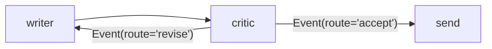

# 6.2 — The verdict steers the edges

## One-line answer

The critic returns an `Event` carrying a `route`, and the runtime matches that route against the
edges leaving the node — so the branch is chosen by a value the critic produced, and no orchestration
call is spent asking a model which way to go.

## The story

At a sorting office, parcels come off a belt and go into one of three cages.

There is no supervisor standing there deciding. Each parcel already has a code printed on it, and the
machine reads the code and drops the parcel into the cage that matches. The person who printed the
code made the decision; the machine only carries it out.

Now picture the alternative, which some offices genuinely used to run: parcels arrive with a
handwritten note taped to them — *"this one's for the north run, unless it's after four, in which
case hold it"* — and a person stands at the belt reading each note and deciding.

The second version needs a person on the belt. The first one does not, and it is not because the
machine is cleverer. It is because the decision was **written down in a form the machine could act
on** at the moment it was made, instead of being described in a form that needed interpreting later.

## The idea in plain language

Day 53 established the two halves of ADK 2.x's branching:

- An **`Edge`** may declare a `route` — a label on that particular path out of a node.
- A node's **`Event`** may carry a `route` — the label of the path it wants taken.

The runtime matches them. That is the whole mechanism, and everything in this part follows from it.

The consequence that matters for design is one [2.4](../02-the-orchestrator/2.4-the-orchestrators-own-bill.md)
priced: **a node that produces a decision can steer the graph itself, with no orchestrator in
between.** The critic has already decided whether the draft is acceptable — that is its entire job —
so asking a separate model which way the graph should go afterwards is spending a request to
rediscover something already known.

Two properties are worth naming because they are what a route buys you over prose:

1. **It is a value, matched exactly.** There is no interpretation step, so there is nothing to get
   wrong. [3.4](../03-the-critic/3.4-the-verdict-is-a-list-not-a-paragraph.md) measured the
   alternative: a careful regex read three of four ordinary sentences correctly.
2. **It appears in the trace as a route**, not as an opinion someone acted on. When you are asking
   *why did this go back to the writer?*, the answer is a field rather than an inference.

And the decision and its reasons travel separately: the `route` steers, and `ctx.state` carries the
failing rule keys to the writer. One value for the machine, one list for the next agent.

## Why Sutra needs it

Day 58's triage graph has two real branches — skip research when classification is confident, and
send the draft back when the critic rejects it. [2.4](../02-the-orchestrator/2.4-the-orchestrators-own-bill.md)
showed what it costs to resolve those with model calls: four orchestration calls per ticket out of
ten total, forty per cent of the request budget spent deciding things.

Routing on the verdict removes one of those branches entirely, for nothing. The critic is being called
anyway; its answer is already a decision; the edge reads it directly. That is the difference between
ten calls per ticket and eight, which on the allowance [5.2](../05-does-it-help/5.2-what-the-pair-costs-in-requests.md)
uses is 25 tickets a day against 31.

## The mechanism

The critic node, returning a route rather than describing one:

```python
def review_typed(ctx: Context, node_input: str) -> Event:
    """The verdict travels as `route`, which the graph reads directly. Nothing is parsed."""
    missing = failures(node_input)
    ctx.state["told"] = missing
    if missing and ctx.state.get("rounds", 0) < 3:
        return Event(route="revise", output=f"missing {missing}")
    return Event(route="accept", output="ready")
```

**Line by line:**

- The function returns an `Event`, not a string. Day 53 established that a node may return a plain
  value *or* an `Event`, and the `Event` is what lets a node say something to the runtime as well as
  to the next node — here, which way to go.
- `route="revise"` and `route="accept"` are the two labels, and they must match the `route=` on the
  edges exactly. A typo here does not raise — it produces a route no edge matches, the runtime logs a
  warning and the branch ends, and the process still exits zero. That is
  [4.3](../04-stopping/4.3-the-third-verdict.md)'s disappearing ticket, measured below.
- `ctx.state["told"] = missing` is the **reasons** channel, going to the writer. Keeping it out of the
  route is what lets the route stay a small closed set: the graph needs three possible values, not
  every possible combination of failing rules.
- `ctx.state.get("rounds", 0) < 3` is the brake, evaluated in the node's own code
  ([4.2](../04-stopping/4.2-the-brake-belongs-to-the-graph.md)). When it trips, the function returns
  `accept` — which is precisely the two-verdict trap [4.3](../04-stopping/4.3-the-third-verdict.md)
  measured, left visible here because this is the shape most people write first and the build brief
  asks you to fix it.
- `output=` is for the human reading the trace and nothing branches on it.
- Verified against installed `google-adk==2.7.1` and the `adk.dev/graphs/routes/` page fetched on
  2026-09-05.

The edges that receive those labels:

```python
return Workflow(
    name="pair",
    edges=[
        (START, writer_node, critic_node),
        Edge(from_node=critic_node, to_node=writer_node, route="revise"),
        Edge(from_node=critic_node, to_node=done, route="accept"),
    ],
)
```

**Line by line:**

- Two edges leave `critic_node`, distinguished only by `route`. This is how a branch is expressed in
  the 2.x node model — not by a conditional inside a node, and not by an agent choosing a sub-agent,
  which is trap #1's 1.x habit.
- The `revise` edge points **backwards**, at a node that already ran. The graph is a graph, not a
  tree, and Day 53's part on composition is where that distinction was made.
- Day 53's lab surfaced a detail worth carrying: an edge is identified by its **endpoints**, not by
  its route, so two routes leading to the same node need `route=[...]` on a single `Edge` rather than
  two `Edge` objects.

```bash
cd days/day-57-orchestrator-and-critic/lab
uv run python steer.py
```

**Line by line:**

- Runs the typed critic inside a real `Workflow` with the real runtime. No model is called: the
  writer and critic are plain functions, which is what makes the routing observable for free.
- The output prints one line per event, so the loop's second pass through the critic is visible as a
  second `critic` line rather than as a summary.

Measured on 2026-09-05:

```text
verdict as a typed route:
    writer                             'About your report that you signed out in the middle of ...'
    critic                             "missing ['next_step', 'no_jargon', 'short']"
    writer                             'About your report that you signed out in the middle of ...'
    critic                             'ready'
    send                               'SENT'
    5 events
```

Five events, one branch taken twice — once back to the writer and once forward to `send` — and **no
node in this graph exists to make that choice**. The critic made it as a by-product of doing its job.



## When it breaks

The break that matters is the route that no edge accepts, and the reason it is dangerous is that it
does not raise.

```bash
cd days/day-57-orchestrator-and-critic/lab
uv run python -c "
import _flow
from google.adk import Event, Workflow
from google.adk.workflow import START, Edge, FunctionNode

def writer(node_input=None) -> str:
    return 'a draft'

def critic(node_input: str) -> Event:
    return Event(route='escalate', output='needs a person')

w = FunctionNode(func=writer, name='writer')
c = FunctionNode(func=critic, name='critic')
s = FunctionNode(func=lambda node_input: 'SENT', name='send')
flow = Workflow(name='unwired', edges=[(START, w, c), Edge(from_node=c, to_node=s, route='accept')])
events = _flow.run(flow, 'ticket:4610')
print('events:', [_flow.leaf(e) for e in events])
print('did send run?', 'send' in [_flow.leaf(e) for e in events])
"
```

```text
Node 'critic' has conditional/DEFAULT edges but none were matched by the emitted route(s): escalate. The branch will end.
events: ['writer', 'critic']
did send run? False
```

The critic returned `escalate`. No edge carries that route. The run **ended**: `send` never fired, no
reply was produced, and the process exited **zero**.

Credit where it is due — 2.7.1 does not do this in total silence. It logs a genuinely good warning,
naming the node, the unmatched route and the consequence. That is better than the behaviour Day 53's
failure lab found for a skipped join, which produced nothing at all.

But read what the warning is and is not. It is a **log line**, not an exception, and the exit code is
still zero. Every default alerting setup in existence watches exit codes and unhandled exceptions, so
this passes through all of them. The ticket is gone, the run is green, and the only evidence is a
line in a log that nobody greps for a string they have never seen before. It is the same failure
[4.3](../04-stopping/4.3-the-third-verdict.md) predicted from the design side: adding the third
verdict is the easy half, and wiring the edge for it is the half that matters.

The naive fix is worth naming so it can be refused. 😬 *"Add a default edge so nothing is ever
stranded."* 💥 That converts a stranded ticket into a **wrongly routed** ticket, which is worse: the
escalation now flows down the accept path and the customer receives the draft the critic rejected.
💡 The default edge is right only when there is a genuinely correct default. For a verdict, there is
not — the whole point of three verdicts is that they go to three different places.

## In production

**What a professional writes instead.** The set of routes and the set of edges are derived from **one
declaration**, not written twice. An enumeration of verdicts, and a construction of the graph that
iterates over it, so a verdict without an edge is impossible to express rather than merely
discouraged. Where that is not practical, the fallback is a test that asserts every member of the
verdict enum has a matching edge — a handful of lines, and the only thing that catches a typo in a
route string before production does.

**What degrades at scale.** Routes are strings, and strings drift. Someone renames `revise` to
`needs_work` in the critic and not in the edge, and the graph starts silently stopping for every
draft that is not perfect on the first pass. The symptom is a fall in completed runs with no
corresponding rise in errors, which is a shape nobody's default alerting notices, because all the
alerting is on exceptions.

**The failure mode that only appears with real traffic.** The unmatched route is usually on the rare
path. `accept` and `revise` are exercised on every ticket and are obviously fine; `escalate` fires on
the small fraction of tickets that reach the brake, so a missing edge for it can sit in production for
weeks. When it is finally noticed, the evidence is not an error log but a set of tickets that were
never answered — and those are, by construction, the hardest tickets you had.

**The review comment a senior engineer leaves:** *"The critic can return `escalate` and there is no
edge for it. The runtime logs a warning and exits zero, so we lose the ticket and the run looks
green — nothing we alert on fires. Derive the edges from the verdict enum, add a test that fails if
any verdict has no edge, and get that warning promoted to an error in our logging config. And do not
solve it with a catch-all edge: that would send escalations down the accept path, which is the
outcome we built the third verdict to avoid."*

**The interview question:** *"How does a branch work in ADK 2.x, and what goes wrong with it?"* An
honest answer names the mechanism and the silent failure: *"An edge can carry a route label and a
node's event can carry a route, and the runtime matches them — so a node that has made a decision
steers the graph directly, with no separate routing call. That is worth real money on a free tier,
because the critic has already decided and asking a model to re-decide costs a request per branch.
The failure mode is that a route with no matching edge does not raise. I ran it: the node emitted
`escalate`, nothing downstream fired, and the process exited zero with no reply produced. The runtime
did log a warning naming the node and the unmatched route, which is more than I expected — but a log
line with a zero exit code gets through every alert we had, so I promoted it to an error, derived the
edges from the verdict enum, and added a test that every verdict has one. What I specifically did not
do is add a default edge, because that turns a stranded ticket into one routed to the wrong place."*

## Check yourself

```bash
cd days/day-57-orchestrator-and-critic/lab
uv run python steer.py
uv run python steer.py --prose
```

Now change `review_typed` to return `route="accepted"` — one letter different from the edge — and run
it. Write down the event list and the exit code, then say what a monitoring system would have to be
watching to notice.

**Out loud, without scrolling up:** describe how a node steers the graph in 2.x, and say what happens
when the route it names has no edge.

**Next:** [6.3 — What escapes the box](6.3-what-escapes-the-box.md).
