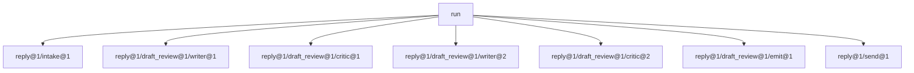

# 6.3 — What escapes the box

## One-line answer

Nesting hides the **structure**, not the **events**: the outer graph declares three nodes and the run
emits seven events, five of them from inside the box, each carrying a path like
`reply@1/draft_review@1/critic@2` that says exactly where it came from and how many times.

## The story

A restaurant kitchen has a serving hatch, and from the dining room you see a plate appear in it.

You do not see how the plate was made. You do not know that the sauce was started twice, or that
someone called for a replacement plate because the first one sat too long. The hatch is the interface,
and the dining room's understanding of the kitchen is: food appears here.

But you can **hear** the kitchen. Through the hatch comes the noise of it — the call-backs, the pan,
somebody saying "again" — and if you were paying attention you could work out that this plate took two
attempts.

Encapsulation in a kitchen is a fact about the *serving arrangement*, not a fact about sound. The
dining room does not depend on the kitchen's internals, and the dining room can still hear them, and
those two things are not in conflict. If they were, nobody could ever tell why dinner was late.

## The idea in plain language

[6.1](6.1-a-workflow-is-a-node.md) established that a `Workflow` is a node, so the reply box appears
in the outer graph as one entry. It is easy to take that one step too far and assume the box is a
black box in every sense.

It is not, and the distinction is worth stating precisely because it decides how you debug and how you
observe:

| What nesting hides | What nesting does not hide |
| --- | --- |
| The inner nodes, from the outer graph's **declaration** | The inner nodes' **events**, from the run's stream |
| The inner routing, from the outer graph's edges | The inner routing, from the trace |
| The inner structure, from a reviewer reading the outer flow | Anything at all from an observer of the run |

Every event a node emits reaches the run's event stream, wherever that node sits. What nesting adds
is a **path**: `reply@1/draft_review@1/critic@2` names the outer workflow, then the box, then the
node — and the `@n` suffix counts visits.

That path is the most useful debugging artefact this day produces, and it answers three questions at
once:

- **Which component produced this?** — the last segment.
- **Which box was it in?** — the middle segments.
- **How many times had it run?** — the `@2`.

The last one is the one you cannot get any other way. A loop that ran twice and a loop that ran once
emit the same *kinds* of events; only the visit counter distinguishes them, and "how many rounds did
this take?" is the first question anybody asks about a review loop.

There is one thing that genuinely does not escape, and it is worth naming because
[6.1](6.1-a-workflow-is-a-node.md) flagged it as the weak point: **state**. The box's `rounds` key
lives in the same state the outer graph can see. So the *structure* is encapsulated and the *state* is
not, and that asymmetry is where the real bugs live.

## Why Sutra needs it

Day 58's triage graph is five stages with the box in the middle, and Day 84 puts tracing across the
whole application. Between those two days, everything anybody knows about why a reply took four
model calls comes from these paths.

More immediately: [5.2](../05-does-it-help/5.2-what-the-pair-costs-in-requests.md) said the pair
costs four requests measured and seven at the brake. The only way to know which of those a given
ticket cost is to count `critic@n` in its trace. A cost model you cannot check against a real run is a
guess, and the phase gate on Day 59 asks for the real number.

## The mechanism

The same run as [6.1](6.1-a-workflow-is-a-node.md), printing full paths instead of leaf names.

```python
def path(event: Any) -> str:
    """The event's full node path: 'reply@1/box@1/critic@2'. The nesting is visible here."""
    if event.node_info is None or not event.node_info.path:
        return "-"
    return event.node_info.path


def leaf(event: Any) -> str:
    """Just the node that produced the event: 'reply@1/box@1/critic@2' -> 'critic'."""
    return path(event).rsplit("/", 1)[-1].split("@", 1)[0]
```

**Line by line:**

- `event.node_info` is optional, so the guard is real rather than defensive — some events carry no
  node information at all, and a helper that assumed otherwise would raise part-way through a trace.
  Verified against installed `google-adk==2.7.1`.
- `node_info.path` is the full slash-separated address. It is a **string**, which matters: it can be
  grepped, logged, and grouped on, without the consumer needing the graph definition.
- `leaf` takes the last segment and strips the `@n`. Splitting on `@` and keeping the first half is
  what turns `critic@2` into `critic` — the same node, second visit.
- The two helpers exist separately because they answer different questions. Reading a trace you want
  the path; counting how often the critic ran you want the leaf plus the counter.

```bash
cd days/day-57-orchestrator-and-critic/lab
uv run python box.py --full
```

**Line by line:**

- `--full` switches `show()` from leaf names to full paths. Nothing about the graph or the run
  changes — this is purely what is printed, which is the point: the information was always there.

Measured on 2026-09-05:

```text
outer graph nodes: ['intake', 'draft_review', 'send']
box is a node?     True

one run of the outer graph:
    reply@1/intake@1                   'ticket ticket:4610'
    reply@1/draft_review@1/writer@1    'About your report that you signed out in the middle of ...'
    reply@1/draft_review@1/critic@1    "revise: missing ['next_step', 'no_jargon', 'short']"
    reply@1/draft_review@1/writer@2    'About your report that you signed out in the middle of ...'
    reply@1/draft_review@1/critic@2    'accept after 2 pass(es)'
    reply@1/draft_review@1/emit@1      'reply ready (accept after 2 pass(es))'
    reply@1/send@1                     'SENT'
    7 events
```

Read the first line and the fourth together. The outer graph declared **three** nodes. The run emitted
**seven** events, and five of them have `draft_review@1` in the middle of their path — they came from
inside a node the outer graph knows nothing about.

`writer@2` and `critic@2` are the second round. That is the entire cost model of this day, visible in
two characters: two writer visits and two critic visits is four model calls, which is exactly the
"pair, measured" row in [5.2](../05-does-it-help/5.2-what-the-pair-costs-in-requests.md)'s table. The
table was computed by a counter in a fixture; the trace confirms it in the runtime.

And a practical consequence: **you can count cost per ticket from the trace alone**, with no
instrumentation added to any node. Group the events by leaf, count the ones whose leaf is an agent,
and that is the request bill.



## When it breaks

The break is the asymmetry named above: structure is encapsulated, state is not.

```bash
cd days/day-57-orchestrator-and-critic/lab
uv run python -c "
import _flow, box
events = _flow.run(box.line, 'ticket:4610')
paths = [_flow.path(e) for e in events]
print('outer graph declares:', [e.to_node.name for e in box.line.graph.edges])
print('events from inside the box:', sum('draft_review' in p for p in paths))
print('state keys the box wrote:', ['rounds', 'told'])
print('are those keys namespaced to the box?', 'no')
"
```

```text
outer graph declares: ['intake', 'draft_review', 'send']
events from inside the box: 5
state keys the box wrote: ['rounds', 'told']
are those keys namespaced to the box? no
```

`rounds` and `told` are written by nodes inside the box and sit in the run's shared state under those
bare names. Nothing scopes them. So:

- A **second** review box in the same graph reuses `rounds`, inherits the first box's count, and hits
  its brake early. No error, just a loop that stops sooner than it should, on some tickets.
- Any outer node can read `told` and start behaving differently based on the inner loop's business,
  which is exactly the leak [3.3](../03-the-critic/3.3-what-the-critic-is-allowed-to-see.md)
  measured, now available to the whole graph rather than to one node.

The defence is either a `state_schema` on the box, or prefixed keys — `draft_review.rounds` — and the
second one costs nothing and can be done today. What you cannot do is rely on the nesting for it: the
box is a boundary for *declaration*, and it was never a boundary for state.

The second break is the opposite mistake. Somebody sees seven events where the diagram has three
nodes and "fixes" it by filtering the inner events out of the trace. Now the box is genuinely opaque,
and the first time a reply takes seven calls nobody can find out why — because the visit counters
that would have said so were discarded on the way out.

## In production

**What a professional writes instead.** They treat the path as the **span name** in tracing, so the
nesting in the graph becomes the nesting in the trace and the two agree by construction. Day 84 wires
that across the application with a plugin. Before then, the cheap version is to log `path()` on every
event, because a run's full path list is enough to reconstruct what happened and costs one line of
code.

**What degrades at scale.** Event volume is proportional to node visits, not to node count, so a
graph with a loop in it emits an unpredictable number of events per run. Log everything and the
volume is driven by your worst tickets; sample and you lose exactly the runs you would want to look
at, because the interesting runs are the long ones. The pattern that holds is to keep full paths for
runs that hit the brake or escalate, and summary counts for the rest — which requires the outcome to
be known before the sampling decision is made, so it is a decision at the end of the run rather than
at the start.

**The failure mode that only appears with real traffic.** Paths get long. A box inside a box inside
the triage graph produces four-segment paths, and dashboards that group on the leaf name silently
merge two different `critic` nodes in two different boxes into one series. The number looks fine and
is the sum of two unrelated things. Grouping on the full path is correct and produces a
high-cardinality metric, which is its own cost — this is a real trade and it is worth knowing you are
making it before somebody makes it for you.

**The review comment a senior engineer leaves:** *"The box writes `rounds` and `told` into the run's
shared state under bare names. The moment we have a second review box those collide and one of them
silently gets the other's round count. Prefix them with the box name, or declare a `state_schema`.
Also, log the full event path rather than the node name — right now we cannot tell from a trace how
many rounds a reply took, and that is the only number that explains our request bill."*

**The interview question:** *"If you nest a subgraph, what can the outer system still see?"* An honest
answer separates the two things people conflate: *"Everything the inner nodes emit. Nesting hides the
structure from the outer graph's declaration, not the events from the run — my outer graph declared
three nodes and the run produced seven events, five of them from inside the box, each with a path like
`reply@1/draft_review@1/critic@2`. That visit counter is the most useful thing in the trace, because
it is how you find out a reply took two rounds and therefore four model calls without adding any
instrumentation. The thing that genuinely does not get encapsulated is state: the box writes its round
counter into the run's shared state under a bare key, so two boxes in one graph will collide and one
will hit its brake early with no error. I prefix state keys with the box name for exactly that
reason."*

## Check yourself

```bash
cd days/day-57-orchestrator-and-critic/lab
uv run python box.py
uv run python box.py --full
```

Now write a one-liner that takes the events from `box.line` and prints the number of model calls the
run would have cost — count the events whose leaf is `writer` or `critic`. Check it against the
"pair, measured" row in 5.2.

**Out loud, without scrolling up:** say what nesting hides and what it does not, and explain what the
`@2` in an event path tells you that nothing else does.

**Next:** [7.1 — The critic that approves everything](../07-failure-lab/7.1-the-critic-that-approves-everything.md).
