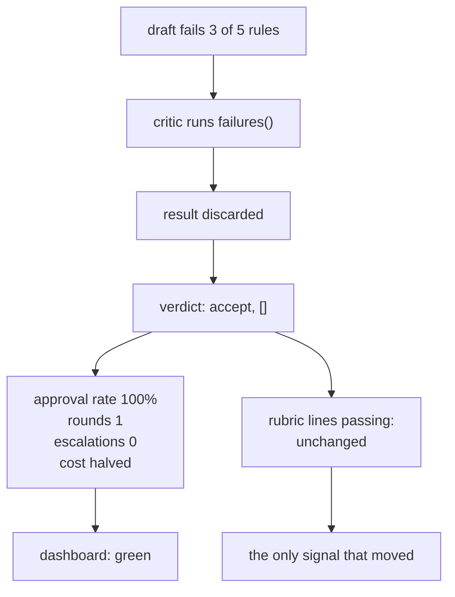

# 7.1 — The critic that approves everything

## One-line answer

A critic that accepts every draft is the most expensive component you can own: it spends ten model
calls across five replies, moves nothing, and turns every dashboard green — because approval rate,
round count and error rate all *improve* when the review stops working.

## The story

A building has a fire door with a sign-off sheet on it, checked monthly.

For two years the sheet is signed. Twelve entries a year, all initialled, all dated, never a gap. The
folder is in order and the auditor is happy every time, because an unbroken record of checks is
exactly what an unbroken record of checks looks like.

Then a contractor doing unrelated work notices the door has been wedged with a fire extinguisher for
a long time — the paint has grown over the wedge.

Nobody forged anything. The person signing genuinely walked past the door each month. What they did
not do is *open* it, because opening it was never a step, and the sheet only ever asked whether the
check had been done. Every month the honest answer to the question on the sheet was yes.

The wedge was visible the entire time. The record was perfect the entire time. It is the perfection
of the record that kept anybody from looking.

## The idea in plain language

A **sycophantic critic** is one that returns accept regardless of the artifact. It is not a
hypothetical failure — it is the natural resting state of a reviewer with a weak standard, because
accepting is always defensible and rejecting requires a reason.

What makes it the failure worth putting in a lab is that **it improves every metric a team is likely
to have**:

| Metric | Working critic | Sycophantic critic |
| --- | --- | --- |
| Replies produced | same | same |
| Approval rate | lower | **100%** |
| Rounds per reply | 2 | **1** |
| Escalations | some | **0** |
| Errors | 0 | 0 |
| Requests per reply | 4 | **2** |

Every arrow points the right way. It is faster, cheaper, cleaner and calmer. A team optimising the
dashboard would *choose* this critic, and a team that quietly broke it would be congratulated.

The only measurement that moves in the other direction is the one from
[5.1](../05-does-it-help/5.1-did-the-critic-actually-help.md): rubric lines passing on the replies
that were sent, scored by something that is not the critic. That is the whole reason that measurement
exists, and it is why it has to be built before it is needed rather than after somebody suspects a
problem.

There is a sharper version of the danger, which is that a sycophantic critic is **worse than no
critic**. Without a reviewer, everybody knows the drafts are unreviewed and treats them accordingly.
With one, the drafts carry a mark of approval that means nothing, and downstream — Day 63's approval
gate, Day 64's audit record — will treat that mark as evidence.

## Why Sutra needs it

Day 58 wires the reviewer into the triage graph, and Day 59's phase gate has to decide whether the
graph is working. If the gate's criteria are output metrics, a broken reviewer passes the gate more
comfortably than a working one.

It also matters for Days 63 and 64. The approval gate records *who approved what*. If the approver is
a critic that approves everything, the audit trail is a list of meaningless approvals — and an audit
trail that records rubber stamps as approvals is worse than no audit trail, because somebody will
later rely on it.

## The mechanism

The sycophant is one branch, and it is deliberately the shortest path through the function:

```python
def review(self, draft: str) -> tuple[str, list[str]]:
    """Return (verdict, the rubric keys that failed). The list is the useful half."""
    self.calls += 1
    missing = failures(draft)
    if self.mode == "sycophant":
        return "accept", []
    ...
```

**Line by line:**

- `missing = failures(draft)` runs **before** the sycophant branch, and its result is then thrown
  away. That is not an accident of ordering — it is the honest model of the failure. The information
  was computed and available; the verdict simply did not use it. A real sycophantic critic is not one
  that cannot see the problems.
- `return "accept", []` returns an **empty** failure list, which is the part that makes it
  indistinguishable from a genuine pass. A verdict of accept with an empty list is exactly what a good
  draft produces.
- The branch is two lines and sits above the real logic, which is roughly how it happens in
  practice — a "temporary" bypass, an early return added while debugging, a prompt that drifted into
  agreeableness.

```bash
cd days/day-57-orchestrator-and-critic/lab
uv run python sycophant.py
```

**Line by line:**

- The script runs one ticket through the pair with the sycophantic critic, prints the verdict and the
  call count, then prints what the **written standard** says about the draft that was approved.
- Printing the standard's verdict next to the critic's verdict is the entire experiment. Either one
  alone is unremarkable.

Measured on 2026-09-05:

```text
the critic said: 'accept', found []
model calls spent: 2

what was sent to the customer:
    About your report that you signed out in the middle of the onboarding form. This happened becaus...
    cause=ok fix=ok next_step=NO no_jargon=NO short=NO
    words: 94

  the written standard fails this draft on ['next_step', 'no_jargon', 'short']
  the reply went out with the engineer's word for the bug in it,
  no next step, and ninety-four words of apology.

  every dashboard reads: reviewed, approved, one round. Nothing is red.
```

Now the same critic across the whole fixture, from
[5.1](../05-does-it-help/5.1-did-the-critic-actually-help.md)'s harness:

```text
critic mode: sycophant   (each reply is scored out of 5)

  without a critic: 10/25 rubric lines pass
  with a critic:    10/25 rubric lines pass
  bought with:      10 model calls for 5 replies
  nothing was gained. Every call was spent for no measured change.
```

**Ten calls, zero movement.** Compare with the working critic's 23 calls for 14 rubric lines gained.
The sycophant is less than half the cost and delivers none of the benefit, and *cost per reply is one
of the numbers on the dashboard*.

That is the trap stated as arithmetic: on every metric a team routinely watches, the broken component
looks like an optimisation.



## When it breaks

The failure is already the break, so what belongs here is the **detection** — and specifically, a
detection that does not depend on anyone suspecting anything.

The cheapest reliable one is a canary: a draft you know is bad, put through the critic on a schedule.

```bash
cd days/day-57-orchestrator-and-critic/lab
uv run python -c "
from _desk import Critic, failures
canary = 'Sorry about that. The SameSite cookie was dropped on the redirect.'
print('known failures in the canary:', failures(canary))
for mode in ('honest', 'sycophant'):
    verdict, found = Critic(mode=mode).review(canary)
    status = 'PASS' if verdict == 'revise' else 'ALARM - the critic approved a known-bad draft'
    print(f'  {mode:<10} -> {verdict:<7} {status}')
"
```

```text
known failures in the canary: ['cause', 'fix', 'next_step', 'no_jargon']
  honest     -> revise  PASS
  sycophant  -> accept  ALARM - the critic approved a known-bad draft
```

Three lines of test, run on every deploy and periodically in production, and the failure that no
dashboard could see becomes a red build. Note what the canary asserts: **not** that the critic
approves good drafts, but that it *rejects* a bad one. Those are different tests and only the second
one catches this.

The other break is the slow version, and it is the one that actually happens. A prompt is edited to
make the critic "less pedantic" after somebody complains about too many revision rounds. It becomes
slightly more agreeable. Then again. Nothing is ever wholesale broken, and there is no commit you
could point at — which is why the canary needs to be a **standing** check rather than a one-off, and
why the [5.1](../05-does-it-help/5.1-did-the-critic-actually-help.md) comparison belongs on a
schedule.

## In production

**What a professional writes instead.** They keep a small **held-out set of known-bad artifacts** with
recorded expected verdicts, and they run the reviewer against it as a test. This is an eval in the
Principle 11 sense: it can go red, and it goes red for the failure that matters rather than for a
crash. Alongside it, the approval rate is treated as a **suspicious** metric — an approval rate of
100% is investigated, not celebrated, and a sudden rise in it is an incident rather than an
improvement.

**What degrades at scale.** Reviewers drift agreeable, always in the same direction, because the
feedback pressure is asymmetric: a false rejection is visible and annoying — somebody's good draft was
bounced — while a false acceptance is invisible. Every complaint pushes towards leniency and nothing
pushes back except a measurement. Over a year, a critic that is never re-measured will have become
noticeably softer with no single change responsible.

**The failure mode that only appears with real traffic.** Partial sycophancy is the real-world version
and it is much harder to see. The critic still rejects obvious failures — missing fix, no next step —
and quietly stops enforcing the subjective ones, tone and length. So the canary built from an
obviously-bad draft still passes, the approval rate rises only slightly, and the rules that stopped
being enforced are the ones that matter on the hardest tickets. A canary set needs a *marginal* case
in it, not only a terrible one.

**The review comment a senior engineer leaves:** *"Approval rate went from 71% to 100% this month and
rounds-per-reply dropped, and the pull request describes that as an improvement. Those are the exact
symptoms of a reviewer that stopped reviewing. Show me rubric lines passing on sent replies, and add
the known-bad draft to the test suite — right now nothing in CI would notice if the critic returned
accept unconditionally."*

**The interview question:** *"How would you know if your reviewer agent silently stopped working?"* An
honest answer is uncomfortable and specific: *"Not from any of the obvious metrics, because they all
improve. A critic that approves everything gives you a 100% approval rate, one round per reply, zero
escalations, no errors, and half the request cost — I measured it: ten calls across five replies with
the rubric pass rate completely unchanged at 10 of 25, against 23 calls and 24 of 25 for the working
one. So the broken version is cheaper and calmer on every dashboard. The two things that catch it are
a canary — a known-bad draft the critic must reject, run in CI and on a schedule — and a periodic
comparison of rubric lines passing with and without the critic, scored by the rubric rather than by
the critic. And I would treat a rising approval rate as an alert, not as good news."*

## Check yourself

```bash
cd days/day-57-orchestrator-and-critic/lab
uv run python sycophant.py
uv run python improve.py --sycophant
```

Now write a canary of your own: a draft that fails exactly **one** rubric line, and a check that the
critic rejects it. Run it against both critic modes and say which failure a one-rule canary catches
that the three-rule one does not.

**Out loud, without scrolling up:** name three metrics that improve when a critic stops working, and
give the one check that catches it.

**Next:** [7.2 — The critic that rewrites](7.2-the-critic-that-rewrites.md).
