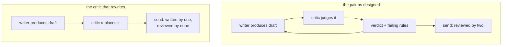

# 7.2 — The critic that rewrites

## One-line answer

A critic that hands back its own version has become the writer, and its version is the only text in
the system nobody reviews — on the desk's fixture the rewrite scores **1 of 5** against the draft's
2 of 5, and goes out anyway.

## The story

You ask a friend to read a covering letter before you send it for a job.

What you wanted was: *does this make sense, have I left anything out, is the tone right.*

What comes back is a rewritten letter. It is shorter, it is confident, and it is in her voice rather
than yours. It also no longer mentions the two years you spent doing exactly the thing the job
advertisement asks for, because she did not know that was the important part — you knew that, which
is why it was in your draft.

Now think about what has happened to the checking. Your draft was read by someone. **Her draft has
been read by nobody.** You are not going to review it properly, because it arrived as the *output* of
the review and you asked for her help precisely because you had stopped being able to see your own
letter.

Two people worked on it, and the version being sent has had exactly one pair of eyes on it — hers,
while writing.

## The idea in plain language

There are two jobs on the table, and this failure is one agent quietly taking both.

**Judging** produces a verdict about an artifact. It does not produce an artifact.

**Writing** produces an artifact. It cannot judge its own, for the reason
[3.1](../03-the-critic/3.1-a-check-you-never-ran-cannot-fail.md) measured: a check you never ran
cannot fail.

When the critic rewrites, three things go wrong at once, and only the first is obvious:

1. **The rewrite is unreviewed.** It is the last text produced, and everything downstream treats it as
   the reviewed output. The pair has collapsed to a single head, and it is the head with **less
   information** — the critic never saw the ticket's full context, by design
   ([3.3](../03-the-critic/3.3-what-the-critic-is-allowed-to-see.md)).
2. **The writer stops learning what to fix.** A verdict naming rules changes the next draft
   ([3.2](../03-the-critic/3.2-a-critic-needs-something-it-can-fail-against.md) measured that at three
   rules moved). A replacement text tells the writer nothing, so if the loop continues, the writer's
   next attempt repeats the same mistakes.
3. **The loop's stopping condition is gone.** The graph routes on a verdict
   ([6.2](../06-the-adk-box/6.2-the-verdict-steers-the-edges.md)). A critic that returns prose returns
   no route, and there is now nothing to branch on.

The reason this failure is common is that it feels like the *most* helpful thing a reviewer can do.
Nobody adds a rewriting critic on purpose. It arrives as an instruction that reads well —
*"if the draft can be improved, provide an improved version"* — and every word of that instruction
sounds like good service.

## Why Sutra needs it

The desk's whole justification for a second agent is
[1.3](../01-when-to-split/1.3-the-three-questions-that-decide-a-split.md)'s three questions, and the
first is **different judgement**. A critic that writes is answering the writer's question — *what
should I say?* — rather than its own. The split has been paid for and not taken.

Day 63 makes the consequence formal. An approval gate's value comes from the approver being a
different party from the actor. A reviewer that produces the thing it approves is not a second party,
and the audit record it generates is a record of one component approving itself — which is precisely
what the gate exists to prevent.

## The mechanism

The rewriting critic, and what its output actually scores:

```python
def critic_that_rewrites(draft: str) -> str:
    """Asked to review, it hands back its own version. Helpful, and it breaks the pair."""
    return (
        "About your report. Sorry about that. The SSO cookie was dropped on the redirect, "
        "which is a SameSite issue. It should work now."
    )
```

**Line by line:**

- The return type is `str`, not `tuple[str, list[str]]`. That signature change is the failure made
  visible at the type level: there is no verdict and no rule list, so nothing downstream can route or
  act.
- The text is a plausible, competent rewrite. It is **shorter** than the original and reads more
  confidently, which is exactly why this failure survives review — held next to the draft it looks
  like an improvement.
- It contains `SSO` and `SameSite` — the engineer's words. The critic used the vocabulary it saw in
  the ticket's technical notes, because it does not hold the rule that the reader is a customer in
  the way the writer does. This is what point 1 above means concretely: the rewrite comes from the
  party with less context.
- `draft` is accepted and never used. The rewrite is not a revision of anything; it is a fresh
  composition that happens to arrive in the review slot.

```bash
cd days/day-57-orchestrator-and-critic/lab
uv run python rewrite.py
```

**Line by line:**

- The script grades both texts against the same five rules and prints the failing keys for each, so
  the comparison is the standard's, not the reader's impression.
- Both are printed in full-ish, because the rewrite *reading better* while *scoring worse* is the
  whole finding and a reader has to be able to feel both halves.

Measured on 2026-09-05:

```text
  the writer's draft
    About your report that you signed out in the middle of the onboarding form. This happene...
    cause=ok fix=ok next_step=NO no_jargon=NO short=NO   fails ['next_step', 'no_jargon', 'short']
  the critic's rewrite
    About your report. Sorry about that. The SSO cookie was dropped on the redirect, which i...
    cause=NO fix=NO next_step=NO no_jargon=NO short=ok   fails ['cause', 'fix', 'next_step', 'no_jargon']

  the rewrite scores worse, and no one graded it: the only reader in the
  system produced it. The loop has one head again, and it is the wrong head.
```

The draft fails **three** rules. The rewrite fails **four** — it lost the cause and the fix, which
were the two things the original got right, and it gained nothing except brevity.

And read the `short=ok` on the rewrite. It is the one rule the rewrite satisfies, and it is the rule
that is easiest to satisfy by saying less. A reviewer optimising the visible property while dropping
the substance is [7.3](7.3-five-out-of-five-and-worse.md)'s subject, arriving here first by accident.



## When it breaks

The break that costs the afternoon is what happens to the **graph**, not to the text — and it is the
silent one from [6.2](../06-the-adk-box/6.2-the-verdict-steers-the-edges.md).

A critic returning prose returns no route. In ADK 2.7.1 that means the node emits an event with no
route, and edges that carry route labels do not match it:

```bash
cd days/day-57-orchestrator-and-critic/lab
uv run python -c "
import _flow
from google.adk import Event, Workflow
from google.adk.workflow import START, Edge, FunctionNode

def writer(node_input=None) -> str:
    return 'a draft'

def critic(node_input: str) -> Event:
    return Event(output='Here is a better version: ...')

w = FunctionNode(func=writer, name='writer')
c = FunctionNode(func=critic, name='critic')
s = FunctionNode(func=lambda node_input: 'SENT', name='send')
flow = Workflow(name='rewriter', edges=[(START, w, c), Edge(from_node=c, to_node=s, route='accept')])
names = [_flow.leaf(e) for e in _flow.run(flow, 'ticket:4610')]
print('events:', names)
print('did send run?', 'send' in names)
"
```

```text
Node 'critic' has conditional/DEFAULT edges but none were matched by the emitted route(s): None. The branch will end.
events: ['writer', 'critic']
did send run? False
```

The reply was rewritten, the rewrite is sitting in an event, and **nothing was sent**. The warning
names the node and reports the emitted route as `None` — that word is the tell-tale, and it is what
distinguishes this from [6.2](../06-the-adk-box/6.2-the-verdict-steers-the-edges.md)'s misspelled
route, which reports the wrong label rather than no label. Exit code zero, as before.

So the rewriting critic has two distinct failure modes depending on how the graph is wired: with
routed edges the ticket stops dead, and with a default edge the unreviewed rewrite goes to the
customer. Neither raises.

The naive fix is worth refusing explicitly. 😬 *"Let the critic return both — a verdict and a
suggested rewrite — and use the rewrite when it is provided."* 💥 That is the same failure with a
route attached: the text that ships is still the one nobody judged, and now it also carries an
`accept` verdict, so the audit record says it was reviewed. 💡 If a rewrite is genuinely wanted, it
has to go **back through the writer's slot** and be judged on the next pass like any other draft.
The rule is not "the critic must not produce text" — it is **nothing is sent that has not been
judged**.

## In production

**What a professional writes instead.** The critic's return type has no field that can hold a
replacement artifact. That is the enforcement — not an instruction telling it not to rewrite, but a
structure with nowhere to put one, which is [3.4](../03-the-critic/3.4-the-verdict-is-a-list-not-a-paragraph.md)'s
argument doing double duty. Where a suggested wording is genuinely valuable, it goes in a field named
so that its status is unambiguous, and the graph routes it to the **writer**, never to send.

**What degrades at scale.** Instructions drift towards helpfulness. *"Explain what is wrong"* becomes
*"explain what is wrong and suggest how to fix it"* becomes *"provide a corrected version"*, over
three separate well-meant edits by three people, none of whom changed the architecture on purpose.
The structural defence survives all three; a prompt-level one survives none of them.

**The failure mode that only appears with real traffic.** The rewrite is *better* on easy tickets —
the critic has the ticket and the standard, and on a simple case that is enough to write a decent
reply, so the failure produces a small improvement and nobody objects. It is worse on exactly the
tickets where the writer's extra context mattered: the long causes, the ones where retrieval found
something specific, the ones where the reply had to name a particular prior ticket. So the
architecture quietly degrades in proportion to how much the case needed the pipeline you built.

**The review comment a senior engineer leaves:** *"The critic returns a rewritten reply. Two problems:
that text is the only thing in the flow nobody has judged, and it comes from the agent we
deliberately did not give the retrieval context to — ours dropped the cause and the fix and scored
worse than the draft it replaced. Also the node emits no route, so with our current edges the ticket
just stops. Make the return type a verdict plus rule keys, with no field a draft can live in."*

**The interview question:** *"Your reviewer keeps rewriting instead of reviewing. Why is that bad?"*
An honest answer names what actually breaks: *"Because the text that ships is then the one nobody
reviewed. The pair collapses to a single head, and it is the head with less context — my critic
deliberately does not see the retrieval output or the writer's reasoning, so when it rewrote, it
dropped the cause and the fix and scored 1 of 5 against the draft's 2 of 5, while reading better and
being shorter. The writer also learns nothing, because a replacement text names no rule to change.
And mechanically it breaks the graph: a critic returning prose emits no route, so the branch just
ends and nothing is sent, with exit code zero. I fix it structurally — the verdict type has no field
that can hold a draft — rather than with an instruction, because instructions drift back towards
being helpful."*

## Check yourself

```bash
cd days/day-57-orchestrator-and-critic/lab
uv run python rewrite.py
```

Now change `critic_that_rewrites` to return a text you think is genuinely better than the writer's
draft, and grade it. Write down its score, and then say who reviewed it.

**Out loud, without scrolling up:** give the three things that break when a critic rewrites, and state
the rule that replaces "the critic must not produce text".

**Next:** [7.3 — Five out of five, and worse](7.3-five-out-of-five-and-worse.md).
