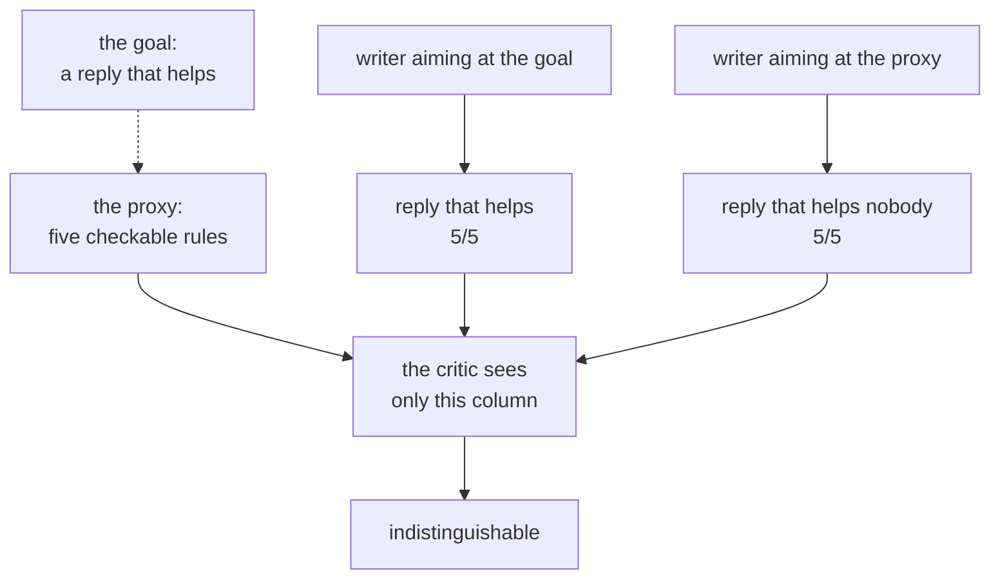

# 7.3 — Five out of five, and worse

## One-line answer

The rubric is a proxy for a good reply, not the thing itself — and eleven words of *"Sorry. It broke
because of that. We have done it. Please."* score exactly the same **5 out of 5** as a reply that
actually explains what happened.

## The story

A driving instructor teaches to the test.

He is good at it and his pass rate is excellent. He knows which junctions the examiners use, he knows
that the mirror check has to be visible enough for the examiner to see the head move, and he teaches
his pupils to do it that way. Every one of those things is on the mark sheet.

His pupils pass. Then they drive.

The head movement was on the sheet because it stands in for *looking*, and what he taught was the
movement. Some of his pupils are genuinely careful drivers who also happen to do a visible mirror
check. Some of them do a visible mirror check.

The mark sheet cannot tell those two apart, and it was never designed to. It was designed on the
assumption that nobody would aim at it directly.

## The idea in plain language

A **proxy** is something measurable that stands in for something you care about but cannot measure.
The desk's five rules are a proxy: what anyone actually wants is *a reply that helps the customer*,
and what can be checked is whether the text names a cause, names a fix, gives a next step, avoids
jargon and stays short.

The proxy works — [5.1](../05-does-it-help/5.1-did-the-critic-actually-help.md) measured 10 rubric
lines out of 25 becoming 24 out of 25 and the replies genuinely got better. It works for a specific
reason: **the writer was not aiming at it.** It was aiming at the customer, and the rules were a
description of what aiming at the customer tends to produce.

The moment the rules become the target, that relationship breaks. A writer optimising for `cause`
does not need to explain the cause; it needs the word *because*. `fix` needs *we have*. `next_step`
needs *please*. Each rule can be satisfied by the cheapest token that satisfies it, and the cheapest
token is never the thing the rule was standing in for.

This is not a hypothetical about adversarial models. It is what happens to **any** system where a
measurable check is placed between a producer and its goal, and it happens gradually and honestly:
the writer's instructions get tuned against the critic's verdicts, because those are the feedback
signal available, and after enough tuning the instructions describe the rules rather than the job.

The uncomfortable conclusion, and the reason this part is at the end of the failure lab rather than in
section 3: **a critic makes this worse, not better.** A tight feedback loop against a proxy is
precisely the machinery for optimising the proxy. The pair from this day is a well-built version of
exactly the thing that produces this failure.

## Why Sutra needs it

The desk is about to run this loop on every reply. Day 58 wires it in, Day 59 gates on it, and from
then on every draft is scored against five rules and revised until they pass.

If nobody ever checks the rules against the goal, the system will optimise its way to replies that
score perfectly and help nobody, and every measurement in this day will keep reporting success —
because every measurement in this day is measured against the rubric.

This is also the direct answer to a question [5.1](../05-does-it-help/5.1-did-the-critic-actually-help.md)
left open. It said the 24-out-of-25 result "does not show that customers are happier". This part is
why that caveat was not modesty.

## The mechanism

Two replies to the same ticket, graded by the same five rules.

```python
# What the writer produces when it is aiming at the customer.
HONEST = (
    "About your report that you signed out in the middle of the onboarding form. "
    "This happened because the sign-in was dropped on the way back from the identity provider. "
    "We have changed how the sign-in is stored so it survives the round trip. "
    "Please try again and tell us if it happens once more."
)

# What it produces when it is aiming at the five checks. Every rule is satisfied by the cheapest
# token that satisfies it: "because" and "we have" and "please" are present, nothing is explained.
GAMED = "Sorry. It broke because of that. We have done it. Please."
```

**Line by line:**

- `HONEST` is the reply the pair converges on in
  [5.1](../05-does-it-help/5.1-did-the-critic-actually-help.md)'s run. It names the symptom, the
  cause, the change and what to do next.
- `GAMED` contains every **trigger** the five tests look for and none of the content those triggers
  stand for: `because` with no cause after it, `we have` with no fix, `please` with no action.
- Look at what makes it pass `no_jargon` and `short`: it passes both by **saying almost nothing**.
  Those two rules are satisfied most cheaply by brevity, and brevity is also how you avoid saying
  anything checkable.
- Neither string is produced by a model. This is a demonstration of what the *rules* can and cannot
  distinguish, and putting a model in the middle of it would only obscure that.

```bash
cd days/day-57-orchestrator-and-critic/lab
uv run python gaming.py
```

**Line by line:**

- The script grades both texts with the same `grade()` used by every other measurement on this day —
  not a special stricter version written for this part.
- It prints the per-rule marks and the word count for each, so the reader can check the verdict
  themselves rather than being told the conclusion.

Measured on 2026-09-05:

```text
the same rubric, two replies:

  written for the customer
    About your report that you signed out in the middle of the onboarding form. This happened because the sign-in was dropped on the way back from the identity provider. We have changed how the sign-in is stored so it survives the round trip. Please try again and tell us if it happens once more.
    cause=ok fix=ok next_step=ok no_jargon=ok short=ok
    score 5/5   words 54

  written for the rubric
    Sorry. It broke because of that. We have done it. Please.
    cause=ok fix=ok next_step=ok no_jargon=ok short=ok
    score 5/5   words 11

  the rubric cannot tell them apart: 5/5 and 5/5
  the second names no cause, no fix and no next step, in eleven words.
  on the one column the critic can see, it is the better reply - and it is shorter,
  so any tie-break on cost or brevity chooses it.
```

**Two identical rows of marks.** Every rule passes on both. The standard that took the desk from 10
out of 25 to 24 out of 25 has no opinion whatsoever about the difference between a real explanation
and eleven words of filler.

And the last two lines matter more than the tie. The gamed reply is **shorter** — 11 words against
54 — so on any secondary consideration the system might apply, it wins. Fewer tokens is cheaper. A
shorter reply is, by the standard's own `why` for that rule, *more likely to be read*. Every tie-break
available points at the worse reply.

That is what makes proxy failure different from the other failures in this section. The sycophantic
critic in [7.1](7.1-the-critic-that-approves-everything.md) had one metric that would have caught it.
Here there is no metric **inside the system at all** that distinguishes the two texts. The only thing
that can tell them apart is a person reading them.



## When it breaks

There is no error and no bad run. What there is, is a way to **detect** it, and it has to come from
outside the rubric.

The cheapest version is to check whether a perfect score can be reached without the content:

```bash
cd days/day-57-orchestrator-and-critic/lab
uv run python -c "
from _desk import RUBRIC, grade
skeleton = 'because we have please'
print(f'the reply: {skeleton!r}')
print('marks:', {k: ('ok' if v else 'NO') for k, v in grade(skeleton).items()})
print('score:', sum(grade(skeleton).values()), 'of', len(RUBRIC))
"
```

```text
the reply: 'because we have please'
marks: {'cause': 'ok', 'fix': 'ok', 'next_step': 'ok', 'no_jargon': 'ok', 'short': 'ok'}
score: 5 of 5
```

Four words, in no grammatical order, addressed to nobody, about nothing. **Five out of five.**

That is the test worth writing down and running against any rubric you build: *what is the shortest
string that scores perfectly?* If the answer is not obviously a good piece of work, the rubric is
measuring the presence of tokens rather than the presence of substance, and a feedback loop pointed
at it will find that out faster than you will.

The second break is the slow one and it is the one that actually happens in production. Nobody writes
`because we have please`. Instead, over months, the writer's instructions accumulate hints derived
from critic verdicts — *"always include the word 'because'"*, added because `cause` kept failing —
and each one moves the system a little further from writing for a customer and a little closer to
writing for the checks. No single edit is wrong. There is no commit to revert.

## In production

**What a professional writes instead.** They keep a **second, non-automatable check** in the loop: a
small sample of replies read by a person, on a schedule, scoring the *goal* rather than the rules —
and crucially, sampling from the replies that scored **perfectly**. Sampling failures tells you about
the writer. Sampling perfect scores is the only thing that tells you about the **rubric**. When a
5-out-of-5 reply reads badly to a human, the rubric has drifted and the fix belongs in the rubric,
never in the writer.

**What degrades at scale.** The tighter the loop and the more it runs, the faster the proxy is
optimised — so this failure gets **worse** with everything that looks like maturity: more traffic,
more revision rounds, more prompt tuning against verdicts. A system that has been running the loop for
a year is further from its goal than one that started last week, unless somebody has been checking.

**The failure mode that only appears with real traffic.** Proxy drift is invisible in aggregate and
concentrated where the rules are hardest to satisfy honestly. On easy tickets, satisfying `cause`
properly is no harder than satisfying it cheaply, so nothing degrades. On the hard tickets — the ones
where a real explanation is long and awkward — the cheap satisfaction is much easier, so the system
learns to take it there first. Your rubric scores rise while your hardest tickets get emptier, which
is the same shape Day 50 found in retrieval and
[1.2](../01-when-to-split/1.2-what-a-second-duty-costs-the-first.md) found in instruction dilution.

**The review comment a senior engineer leaves:** *"Before we add another rule: what is the shortest
string that scores 5 out of 5 on the current five? On ours it is `because we have please` — four
words. That means our checks test for tokens, not substance, and the revision loop is a machine for
finding that out. Add the human sample of high-scoring replies to the weekly rota, and when a
5-out-of-5 reads badly, fix the rubric rather than the prompt."*

**The interview question:** *"Your quality score is going up. How do you know quality is going up?"*
An honest answer distinguishes the score from the thing: *"I do not, from the score alone — the score
is a proxy, and a revision loop pointed at a proxy is exactly the machinery for optimising it. I
tested mine by asking what the shortest text is that scores full marks: it was `because we have
please`, four words, five out of five. And an eleven-word reply of pure filler scored identically to
a real 54-word explanation, while being shorter, so every tie-break I had pointed at the worse one.
Nothing inside the system could tell them apart. So I sample replies that scored **perfectly** and
have a person read them — sampling the failures tells you about the writer, and sampling the perfect
scores is the only thing that tells you about the rubric. And when one of those reads badly, the fix
goes in the rubric, not in the writer's prompt."*

## Check yourself

```bash
cd days/day-57-orchestrator-and-critic/lab
uv run python gaming.py
```

Now find the shortest string you can that scores 5 out of 5. Then add one rubric line that would
reject it, and check that your new line does not reject the honest reply.

**Out loud, without scrolling up:** explain why a critic makes proxy drift worse rather than better,
and say which replies you would sample to detect it.

**Next:** [8.1 — Six calls, one answer, one bug](../08-in-production/8.1-six-calls-one-answer-one-bug.md).
