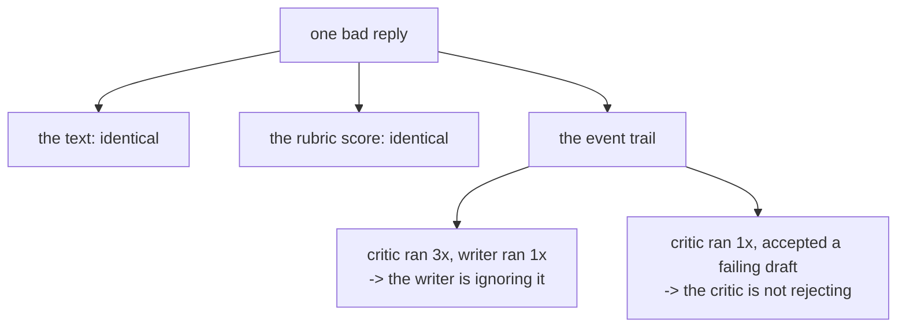

# 8.1 — Six calls, one answer, one bug

## One-line answer

When several agents produce one output, the output cannot tell you which of them was wrong — a
writer that ignores the verdict and a critic that approves everything produce the **identical** reply
with the identical score, and the only thing that separates them is the call count.

## The story

A car comes back to a garage with a rattle that was not there before, after a service.

Four people touched it. One did the brakes, one did the exhaust bracket, one did the wheels and one
road-tested it and signed it off. Everybody did their own job properly, as far as they know, and
nobody remembers anything unusual.

The customer's report is one sentence: *there is a rattle*. That sentence is the only evidence, and it
points at all four people equally.

What sorts it out is not cleverness. It is the **job card**: the sheet in the folder that says which
work was done in what order and by whom, with a tick and a time against each line. The rattle does
not tell you anything. The job card tells you that the wheels went on after the road test, which is
not how it is supposed to go, and now there is one person to talk to.

A workshop without job cards does not diagnose the rattle. It takes the wheels off and hopes.

## The idea in plain language

The debugging problem with multiple agents is not that there are more places to look. It is that
**the output loses the information about where it came from**.

One agent is a function: bad output means bad instructions, bad input or bad luck, and you read one
instruction block. Six agents is a pipeline where each stage transforms the last, and the final text
is the composition of six transformations — so a defect anywhere shows up as the same thing at the
end: a reply that is not good enough.

Three distinct failures that this day has already met produce **outputs you cannot tell apart**:

- The **writer ignores the verdict** ([3.2](../03-the-critic/3.2-a-critic-needs-something-it-can-fail-against.md)'s
  vague-feedback case, where nothing the critic says changes anything).
- The **critic approves everything** ([7.1](../07-failure-lab/7.1-the-critic-that-approves-everything.md)).
- The **verdict names no rules**, so the writer has nothing to act on.

All three end with an unimproved draft going out. The reply is the same reply. The rubric score is
the same score. Reading the reply — which is what everyone does first — cannot distinguish them, and
each has a completely different fix.

What *does* distinguish them is the **shape of the run**: how many times each component ran, in what
order, and what each one returned. That is a job card, and [6.3](../06-the-adk-box/6.3-what-escapes-the-box.md)
showed the runtime already keeps one — the event paths with their visit counters.

## Why Sutra needs it

Day 58's triage graph is five stages plus a revision loop. From Day 59 onwards, every complaint about
a reply arrives as a complaint about *the reply*, and somebody has to work backwards from it.

Day 84 puts full tracing across the application, but that is a long way off, and the debugging problem
starts the day the second agent is added. What this part establishes is that the run's event stream is
already enough — no extra instrumentation, no new dependency — provided somebody knows what to read
in it.

## The mechanism

Two broken pipelines, one healthy one, and the same ticket through all three.

```python
def writer_ignores_the_verdict() -> tuple[str, int]:
    """The critic works. The writer never acts on what it is told, so nothing improves."""
    writer = Writer(ticket=TICKET)
    critic = Critic()
    draft = writer.draft()
    for _ in range(3):
        verdict, _found = critic.review(draft)
        if verdict == "accept":
            break
        # The verdict arrives and is dropped. The draft is handed back unchanged.
    return draft, writer.calls + critic.calls


def critic_approves_everything() -> tuple[str, int]:
    """The writer would have revised. It is never asked to."""
    writer = Writer(ticket=TICKET)
    critic = Critic(mode="sycophant")
    draft = writer.draft()
    critic.review(draft)
    return draft, writer.calls + critic.calls
```

**Line by line:**

- In the first function the critic is **healthy** — it is the real `Critic()` and it produces correct
  verdicts naming real failures. The defect is entirely on the writer's side, and `_found` is
  deliberately named with an underscore to mark that the information arrived and was discarded.
- The loop still runs three times, so the critic is called three times. That is where the call count
  comes from, and it is the only externally visible trace of the difference.
- In the second function the writer is healthy and would revise correctly if asked. It is called once
  because nothing ever asks for a second draft.
- Both return `(draft, calls)`. The draft is what a person sees; the call count is what the run
  records. The whole part is about which of those two is diagnostic.

```bash
cd days/day-57-orchestrator-and-critic/lab
uv run python blame.py
```

**Line by line:**

- The script runs all three pipelines on the same ticket and prints score, calls and the start of the
  final text side by side.
- It then asserts the three comparisons explicitly rather than leaving the reader to eyeball the
  table, because "these are identical" is a claim that should be checked by code.

Measured on 2026-09-05:

```text
one bad reply, two suspects:

    what is broken               score  calls  reply
    nothing (healthy)              5/5     4    'About your report that you sig'
    the writer ignores the verdict 2/5     4    'About your report that you sig'
    the critic approves everything 2/5     2    'About your report that you sig'

  identical final text?  True
  identical score?       True   failing: ['next_step', 'no_jargon', 'short']
  identical call count?  False   (4 vs 2)

  the reply cannot tell you which component failed. The call count can.
```

**Identical text. Identical score. Identical failing rules.** Two completely different bugs, requiring
two completely different fixes, and every artifact a customer or a dashboard sees is the same.

The discriminator is `4 vs 2`. The writer-ignores case spent four calls — one draft plus three
reviews — because the critic kept correctly rejecting and the writer kept handing back the same text.
The sycophant case spent two, because one review ended it. **The bug is visible in the cost and
nowhere else.**

Now notice the first row. The healthy run *also* spent four calls. So the call count alone is not a
diagnosis either — 4 calls with a 5/5 result and 4 calls with a 2/5 result are different situations.
It takes both numbers, and in a real system it takes the sequence:

| What the run shows | What it means |
| --- | --- |
| `critic@1..3` all returning revise, `writer@1` only | the writer is not revising |
| `critic@1` returning accept, draft failing the rubric | the critic is not rejecting |
| `critic@1..3` returning revise with an empty rule list | the verdict carries nothing actionable |
| `writer@1..3`, `critic@1..3`, ending accepted | healthy |

Every row of that table is readable straight off the event paths from
[6.3](../06-the-adk-box/6.3-what-escapes-the-box.md). No extra logging is required — the visit
counters and the outputs are already there.



## When it breaks

Debugging by re-running is the trap, and it is worth reaching for once to see why it fails.

```bash
cd days/day-57-orchestrator-and-critic/lab
uv run python -c "
import blame
a = blame.writer_ignores_the_verdict()
b = blame.writer_ignores_the_verdict()
print('run 1:', a[1], 'calls,', repr(a[0][:28]))
print('run 2:', b[1], 'calls,', repr(b[0][:28]))
print('reproducible?', a == b)
"
```

```text
run 1: 4 calls, 'About your report that you s'
run 2: 4 calls, 'About your report that you s'
reproducible? True
```

Here it reproduces, because every component in this lab is deterministic — and that determinism is
the reason this day's numbers can be trusted. **In production it will not.** The writer is a model,
the drafts differ between runs, and the critic's verdicts differ with them, so a re-run produces a
*different* bad reply and the thing you were trying to compare is gone. That is why the trail has to
be captured from the failing run rather than reconstructed afterwards.

The second break is worse and comes from the loop. When a stage runs more than once, "which call was
wrong?" has more than one answer, and a trace that records only the last verdict per node cannot
answer it at all. A critic that rejected correctly twice and then approved a still-failing draft on
the third round looks, in a last-value-wins log, exactly like a critic that approved immediately.
This is the practical reason [6.3](../06-the-adk-box/6.3-what-escapes-the-box.md)'s visit counters
matter: `critic@3` is a different fact from `critic@1`, and a log keyed on node name loses it.

## In production

**What a professional writes instead.** Every run carries a **correlation identifier** through every
call, and each stage logs its inputs' identifiers, its outputs, and its visit number. The rule that
makes it useful is that a stage logs what it **received and decided**, not a summary — a critic logs
the verdict and the rule keys, not "reviewed the draft". Attached to a ticket, that turns a complaint
into a reconstruction.

**What degrades at scale.** Log volume grows with visits, not with runs, so the hardest tickets — the
ones with the most rounds — produce the most log lines, and those are exactly the ones you cannot
afford to sample away. The pattern that survives is to decide sampling at the **end** of a run based
on its outcome: keep everything for runs that escalated or hit the brake, keep summaries for the rest.

**The failure mode that only appears with real traffic.** Nobody debugs the case in this part. They
debug a complaint from three weeks ago, on a ticket whose retrieval results have since changed and
whose model version has moved. Without the captured trail, the run is not reproducible in principle,
and the investigation becomes an argument about what probably happened. This is the single strongest
practical argument for keeping the trail: it converts a class of unanswerable question into an
answerable one.

**The review comment a senior engineer leaves:** *"When this reply came out wrong, how would we know
whether the writer ignored the verdict or the critic never rejected it? Right now we log the final
draft and the final verdict, and those are identical in both cases — I checked, same text, same
score, and the only difference is four calls against two. Log the verdict and the failing rule keys
per round, with the visit number, and put the run identifier on the ticket."*

**The interview question:** *"A multi-agent system produced a bad answer. How do you find out which
agent was at fault?"* An honest answer starts by ruling out the obvious move: *"Not from the answer,
because different faults produce the same answer. I had two bugs — a writer that ignored the critic's
verdict and a critic that approved everything — and they produced byte-identical replies with the
same rubric score and the same failing rules. The only difference was the call count: four against
two, because in one case the critic kept correctly rejecting and nothing changed, and in the other
one review ended it. So I read the run's event trail — which component ran, how many times, and what
each returned — and in ADK the visit counter in the event path gives you that for free. The thing I
would not do is re-run it: in production the writer is a model, so a re-run gives you a different bad
reply and you have lost the case you were investigating."*

## Check yourself

```bash
cd days/day-57-orchestrator-and-critic/lab
uv run python blame.py
uv run python box.py --full
```

Now, using only the `--full` event paths, write down the rule you would use to detect "the writer is
ignoring the verdict" automatically. Then say what that rule would do to a healthy run that happened
to converge in one round.

**Out loud, without scrolling up:** explain why the output of a multi-agent run is not diagnostic, and
name the two things you need from the trail to separate the failures.

**Next:** [8.2 — How many heads is too many](8.2-how-many-heads-is-too-many.md).
