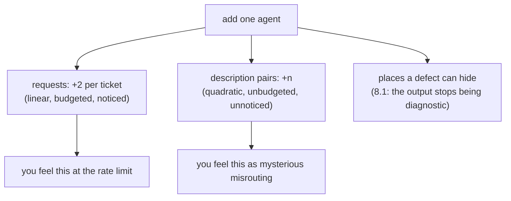

# 8.2 — How many heads is too many

## One-line answer

Requests grow in a straight line as you add agents and the number of description pairs that must stay
distinct grows as a square — two agents is one pair to keep straight, eight agents is twenty-eight,
and the second number is the one that gets you.

## The story

A small building firm has two people and no meetings.

If the plasterer needs to know when the electrician is finishing, he asks him. There is one
relationship to keep straight and both of them hold it in their heads without effort.

The firm grows to eight. Nobody has become worse at their job and everyone still knows what they are
doing. But now there is a WhatsApp group, and a Monday morning where somebody explains the week, and
a recurring argument about who was supposed to tell the tiler.

The work did not get four times harder when the firm got four times bigger. What got harder is the
number of **pairs of people who need to have understood the same thing** — and that went from one to
twenty-eight.

## The idea in plain language

Adding an agent adds two costs, and they grow at different rates. Confusing them is why teams are
surprised.

**Requests grow linearly.** Each specialist is a call, and — as
[2.4](../02-the-orchestrator/2.4-the-orchestrators-own-bill.md) established — each transition that is
decided by a model is another. Add an agent, add a couple of calls per ticket. This cost is
predictable, easy to budget, and the one everybody counts.

**Ambiguity grows quadratically.** [2.3](../02-the-orchestrator/2.3-two-descriptions-that-overlap-are-one-bug.md) showed
that an orchestrator chooses between specialists using their descriptions, so every **pair** of
descriptions has to be distinguishable. Pairs of `n` things is `n(n-1)/2`. Two agents: one pair.
Eight agents: twenty-eight.

Nobody checks twenty-eight pairs. They check the description they are writing, against the one or two
they happen to remember, and this is not carelessness — it is that the review unit is a pull request
containing one new agent, and the defect lives in a relationship that no pull request contains.

There is a third cost with no clean formula, and [8.1](8.1-six-calls-one-answer-one-bug.md) is its
measurement: the number of places a defect can hide, and the collapse of the output's diagnostic
value. That one is why "we will just add observability later" does not rescue a design that has too
many parts.

So the guidance this day ends on is not a number, it is a **test**: for every agent in the system,
name the rule it owns that no other agent owns
([1.3](../01-when-to-split/1.3-the-three-questions-that-decide-a-split.md)'s counter-test). An agent
you cannot answer for is one to merge.

## Why Sutra needs it

Day 58 has five stages. Days 60 to 65 add durability and a human approver. By Day 70 the desk has a
quota router. Every one of those is a plausible place to put an agent, and if each one becomes an
agent then the desk is running eleven model calls per ticket, on a free tier that
[5.2](../05-does-it-help/5.2-what-the-pair-costs-in-requests.md) measures in tens of requests a
minute.

The counter-pressure has to be written down now, before the graph exists, because every individual
addition will look justified at the time it is made. That is exactly how the firm got to eight people
without anybody deciding to.

## The mechanism

The two growth curves, side by side, against a fixed allowance.

```python
def pairs(n: int) -> int:
    """Every pair of descriptions that could collide - the thing 2.3 measured, counted."""
    return n * (n - 1) // 2
```

**Line by line:**

- `n * (n - 1) // 2` is the number of unordered pairs. It is worth writing out rather than gesturing
  at, because the whole argument of this part is the difference between this shape and a straight
  line, and a reader who has not seen the numbers will assume both costs behave the same way.
- Integer division `//` because a pair is a pair; there are no half pairs to round.
- The docstring names what a pair *is* here — two descriptions that could match the same request —
  so the number stays attached to the failure it predicts rather than becoming abstract.

```bash
cd days/day-57-orchestrator-and-critic/lab
uv run python heads.py
```

**Line by line:**

- `calls = n + max(0, n - 1)` is one call per specialist plus one orchestration decision before each
  one after the first. That is the model-decides-every-transition shape from
  [2.4](../02-the-orchestrator/2.4-the-orchestrators-own-bill.md), which is deliberately the
  *pessimistic* accounting — moving fixed transitions into edges is what improves it.
- `RPD` is a placeholder, as it is in `price.py`, and the learner substitutes their provider's real
  figure from the page named in the hub's §8.

Measured on 2026-09-05:

```text
a day's allowance: 250 requests

    agents  calls/ticket  tickets/day  description pairs to check
      1          1            250                  0
      2          3            83                   1
      3          5            50                   3
      4          7            35                   6
      5          9            27                   10
      6          11           22                   15
      7          13           19                   21
      8          15           16                   28

  2 agents -> 1 pair to keep distinct;  8 agents -> 28.
  the request cost grows in a straight line. The thing that has to stay
  correct in a human's head does not.
```

Read the last two columns against each other. Going from two agents to eight multiplies the request
cost by five — painful, and entirely predictable from the first two rows. It multiplies the pairs by
**twenty-eight**, and nothing in the first two rows would let you predict that.

The `tickets/day` column is the one that ends arguments. At five agents the desk serves 27 tickets a
day on this allowance. Most support desks receive more than that before lunch. So the honest reading
is that a five-agent design is not a design this project can run at all, and that conclusion arrives
from arithmetic rather than from taste.

And the pairs column is where [2.3](../02-the-orchestrator/2.3-two-descriptions-that-overlap-are-one-bug.md)'s measurement
lands. With two vague descriptions, ten out of ten requests tied and routing was a coin toss. That was
**one** pair. Nobody is holding twenty-eight of those correct in their head, which means that beyond a
handful of specialists the routing quality is not a thing anyone is maintaining — it is a thing that
is happening.



## When it breaks

The break is that the quadratic cost is invisible **in the unit that work is reviewed in**.

```bash
cd days/day-57-orchestrator-and-critic/lab
uv run python -c "
import heads
for n in range(2, 9):
    print(f'{n} agents: {heads.pairs(n)} pairs total, {heads.pairs(n) - heads.pairs(n-1)} new')
"
```

```text
2 agents: 1 pairs total, 1 new
3 agents: 3 pairs total, 2 new
4 agents: 6 pairs total, 3 new
5 agents: 10 pairs total, 4 new
6 agents: 15 pairs total, 5 new
7 agents: 21 pairs total, 6 new
8 agents: 28 pairs total, 7 new
```

The `new` column is what one pull request is responsible for, and it is the number that explains why
this cost is never caught in review. Adding the eighth agent introduces **seven** new pairs — one
against each agent that already exists — while the pull request contains exactly **one** new
description. The author checks the thing they wrote. The seven relationships it created are not in
the diff.

That is also why the total is the wrong number to quote at people. Twenty-eight sounds like a
workload nobody would accept, so it reads as hyperbole; seven-new-pairs-per-change sounds
manageable, and it is the honest per-change figure. The two are the same fact, and the second one is
the one that gets a reviewer to actually open the other descriptions.

The second break is the one with no numbers: an agent added for a reason nobody records. Six months
later, no one can argue for removing it, because the argument for adding it was a conversation. The
defence is [1.3](../01-when-to-split/1.3-the-three-questions-that-decide-a-split.md)'s rule — the
commit that adds an agent names the rule it rescues — and the removal argument is then just checking
whether that rule is still failing without it.

## In production

**What a professional writes instead.** They keep an explicit table: one row per agent, with the rule
it owns and the measurement that justified it. Adding a row requires filling both columns; a row
whose measurement has not been re-run in six months is a candidate for removal. This is the same
artefact [1.3](../01-when-to-split/1.3-the-three-questions-that-decide-a-split.md) asked for, kept
alive rather than written once, and it is what makes a multi-agent system *shrinkable* — which is
much rarer than making one growable.

**What degrades at scale.** Agent count only goes up, because adding is a feature and removing is a
risk with no advocate. The pressure that works is a hard budget: a stated maximum number of agents,
so that adding one requires arguing to merge two. That sounds bureaucratic and is the only mechanism
that has ever been observed to reduce the count.

**The failure mode that only appears with real traffic.** Misrouting from description overlap does not
look like a bug. It looks like the system being *unhelpful* on a particular kind of question — the
handbook confidently answering something that needed ticket history — and it gets reported as a
quality problem, so people go and improve the specialists. The specialists are fine. The failure is in
the pairs, and no amount of improving individual components touches it. The signal that identifies it
correctly is the tie rate from [2.3](../02-the-orchestrator/2.3-two-descriptions-that-overlap-are-one-bug.md), which nobody
measures unless they have been told to.

**The review comment a senior engineer leaves:** *"This makes it five agents, which on our allowance is
27 tickets a day and we do more than that. It also takes us from six description pairs to ten, and I
do not believe anyone has read all ten together. Before this lands: which rule does this agent own
that no existing agent owns, and can that rule instead be a deterministic check?"*

**The interview question:** *"How many agents is the right number?"* An honest answer refuses the
number and gives the test: *"As few as can own the rules, and I would argue it down rather than up.
Two costs grow when you add one and they grow differently: requests go up linearly, which everyone
budgets for, and the number of description pairs that have to stay distinguishable goes up as a
square — two agents is one pair, eight agents is twenty-eight — which nobody budgets for and nobody
reviews, because a pull request contains one description and the defect lives in a relationship. On my
own allowance five agents meant 27 tickets a day, which is not a working desk, so the arithmetic
settled it before taste did. The test I apply per agent is: name the rule it owns that no other agent
owns. If I cannot, I merge it — and if the rule is checkable in code, like a length limit, it should
not have been an agent at all."*

## Check yourself

```bash
cd days/day-57-orchestrator-and-critic/lab
uv run python heads.py
uv run python heads.py --rpd 1000
```

Now list the agents Day 58's triage graph would have if every stage were one, work out the calls per
ticket and the pairs, and then name the rule each one owns. Cross out the ones you cannot answer for.

**Out loud, without scrolling up:** give the two costs of adding an agent and how each grows, and
state the test for whether a given agent should exist.

**Next:** the parts are done. Now read the paper the day argued with:
[Self-Refine](../../papers/01-self-refine.md).
