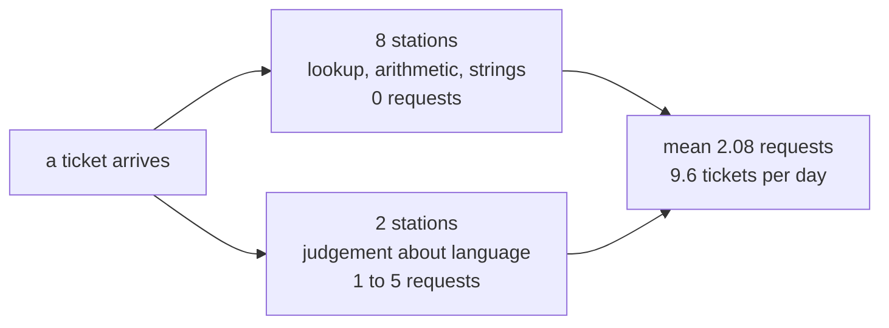

# 1.1 — Ten stations, two of which think

## One-line answer

A production agent pipeline is mostly plumbing around very few brains: this floor has ten stations
and exactly **two** of them would call a model, and that ratio — not the station count — is what
makes a five-stage pipeline affordable on a free tier.

## The story

Go into the accident and emergency department of any large hospital at nine on a Saturday evening
and count the people in the room.

There is someone at the door asking your name and what happened. There is a nurse who takes your
blood pressure and writes a number on a card. There is a clerk who finds your old file. There is a
porter who takes you down the corridor. There is someone who prints the labels for your blood
sample, and someone else who carries the sample to the lab, and a machine that reads it. There is a
person who puts the result in the file and brings the file back.

And there is **one doctor**.

The room is full of people, and almost all of them are doing work that does not need a doctor. That
is not a failure of staffing. It is the entire design. A doctor is the scarcest thing in the
building, and every job that can be done by somebody who is not a doctor has been moved to somebody
who is not a doctor — not to save money, but because there is exactly one of the scarce thing and
the queue does not care.

Staff that room with eight doctors and the queue moves at the same speed for eight times the cost.
Staff it with one doctor doing all eight jobs and the queue stops.

## The idea in plain language

Today you assemble five stages — intake, classify, research, draft, review — into one running
system. Before any of the wiring there is a decision that governs everything after it: **which
stages need a model at all?**

A **model call** is a request to a language model: you send text, you wait, you are billed, and you
may be refused. In this project you are not billed in money, because Sutra runs on free tiers only.
You are billed in **requests**, which is a smaller number and a harder one. The pinned model has a
free allowance of **twenty requests per day** (`docs/PACKAGES.md`, read off a live refusal on Day
2). Twenty. Not twenty per minute.

So "which stages need a model?" is not an efficiency question. It is the question of whether this
system can run at all.

The answer is that most stages do not. Look at what the five actually ask for:

| Stage | The question it answers | Does it need judgement? |
| --- | --- | --- |
| intake | Does this ticket exist, and what is its text? | No. It is a lookup. |
| classify | What kind of problem is this? | **Yes.** |
| research | What else in the archive is about this? | No. It is arithmetic over vectors. |
| draft | What should we say? | **Yes.** |
| review | Is the draft good enough to send? | Partly — see [4.2](../04-the-box/4.2-the-brake-belongs-to-the-critic.md) |

Two of the five need a model. The other three are lookups, arithmetic and string handling, which
Python does exactly, instantly, for free, and the same way every time.

There is a name for the mistake this table prevents. A station that uses a model to answer a
question the code already knows the answer to is doing **judgement where certainty was available**,
and it is worse than wasteful. A lookup that returns the wrong row is a bug you can find. A model
that guesses the wrong category is a bug that surfaces as a slightly odd sentence three stations
later.

## Why Sutra needs it

Day 53 built a nine-node skeleton in which every node was a plain function, and said in as many
words that Day 58 would replace the ones needing judgement with agents. This is that day, and this
part is where you decide **how many** get replaced.

Get it wrong in the generous direction — a model at every stage — and the arithmetic below says the
desk handles about four tickets a day before the free tier refuses it. Day 70 builds a Quota-Router
precisely because this number is small. The router buys headroom; it cannot buy back a request you
spent asking a model to look up a dictionary key.

## The paper behind it

> **ReAct: Synergizing Reasoning and Acting in Language Models**
> arXiv:2210.03629 (2022) · <https://arxiv.org/abs/2210.03629>

It proposed interleaving a model's reasoning with its actions in one loop, so the model decides
what to do next at every step.

Taught in [Day 3 — ReAct](../../../day-03-loop-hand-rolled/papers/01-react.md). The reason to name
it *here* is the contrast. In a ReAct loop the model is in the driving seat at every step, so the
number of model calls is whatever the model decides it is. A graph moves that decision out of the
model and into the edge list, which is what makes the count in this part a number you can compute
in advance rather than one you discover on the bill.

## The mechanism

The floor is already assembled in the lab. Ask it what it is made of:

```bash
cd days/day-58-triage-graph-v1/lab
uv run python ratio.py
```

**Line by line:**

- `ratio.py` does not run the graph. It reads the station list out of `_stations.py` and prints it,
  because the ratio is a property of the design and can be known before a single ticket goes
  through. Anything you can check without running is a thing you should check without running.
- There is no argument to pass. The count is not a measurement of one ticket's journey; it is the
  whole floor.

Measured on 2026-09-05:

```text
  stations on the floor   10
  stations that think     2  ['classify', 'draft_review_box']
  ratio                   2/10

           intake
           no_such_ticket
    MODEL  classify
           escalate_lane
           archive_clerk
           kb_clerk
           evidence_join
           assemble_evidence
    MODEL  draft_review_box
           finalize
```

Read the unmarked lines first, because they are the ones people forget to count.

`intake` looks up a key in a dictionary. `no_such_ticket` writes a fixed sentence. `escalate_lane`
formats three fields. `archive_clerk` runs Day 49's cosine similarity over a term-weighted index —
real retrieval, real ranking, no model. `kb_clerk` intersects two sets of words. `evidence_join`
waits for its two predecessors and hands on a dictionary. `assemble_evidence` copies values into a
declared type. `finalize` runs one regular expression over the draft.

Eight stations. Zero requests. Every one of them is a station a reader might have reached for a
model to write, and not one of them needs it.

Now the two marked `MODEL`. `classify` reads a ticket and decides what kind of problem it is, which
is a judgement about language and is exactly what the scarce thing is for. `draft_review_box` is not
one station but a whole graph of its own — a writer and a critic going round until the critic is
satisfied ([4.1](../04-the-box/4.1-the-newsroom-drops-in-as-one-node.md)) — and every trip around
that loop is two more requests.

Here is the arithmetic that decides whether this floor can exist:

```bash
uv run python model.py
```

**Line by line:**

- `model.py` builds the classifier as a real `LlmAgent` and prints what it was configured with. It
  sends nothing: constructing an agent is not calling one, which is why the last line can honestly
  say `requests sent 0`.
- `CLASSIFIER_MODEL` is a pin read from `docs/PACKAGES.md`, never the framework default. This is the
  trap **ADK-73** names, and it is worth being exact about what the trap is on this version: on the
  installed 2.7.1, `LlmAgent._default_model` is `gemini-3.5-flash`, which is a real model and not the
  one this repo measured a quota for. Leave the model unset and your floor silently runs on
  something whose free-tier allowance you have never checked, and which the framework may change in
  a patch release. Pin it, and a version bump cannot move it underneath you.
- The final block divides the free daily allowance by the mean cost of one ticket, measured by
  `price.py` in [3.3](../03-the-research-floor/3.3-what-a-lane-costs.md).

Measured on 2026-09-05:

```text
  node type        LlmAgent
  name             classify
  model (pinned)   gemini-3.7-flash
  output_schema    TriageResult
  waits with header    [30]
  waits without header [1, 2, 4, 8]
  requests sent    0
  framework default    gemini-3.5-flash   <- what you get if you do not pin

  free tier        20 requests per day
  mean per ticket  2.08 model calls
  tickets per day  9.6
  whole archive    5.4 days of free tier
```

**Nine point six tickets a day.** That is the honest capacity of this desk, and it is the number to
keep in your head for the rest of Phase 8.

Now the counterfactual, because a ratio only means something against its alternative. Suppose you
had reached for a model at each of the five stages, and the draft/review box still went round
twice. Intake, research and finalize would each cost a request on top of the five already there:
eight instead of five on a revised ticket, six instead of three on a clean one. The mean would rise
from 2.08 to a little over five, and nine point six tickets a day would become under four.

The eight stations that do not think are the difference between a desk that handles a morning's
work and a desk that handles a coffee break.



## When it breaks

This does not break because somebody writes a bad station. It breaks because somebody writes a
**reasonable** one.

Imagine `intake` written with a model, because ticket references arrive in a dozen formats —
`4521`, `#4521`, `ticket 4521`, `please look at 4521 again` — and asking a model to pull the number
out feels robust. It even works. Then run the whole archive through it and the request count goes
from 108 to 160, and the free tier that lasted five days lasts three and a half.

Worse, it works *until it does not*, and that failure is silent. A regular expression that cannot
find a reference returns nothing, and you can test for nothing. A model that cannot find a
reference returns its best guess, confidently, in the right format.

There is also a real error waiting behind the free tier, which is why the ladder is printed above.
When the twenty requests are gone the call does not get slower or return a worse answer. It is
refused, and the refusal carries a hint:

```text
429 RESOURCE_EXHAUSTED: You exceeded your current quota.
Please retry in ~53s
```

Day 2 recorded something important about that hint, and `docs/PACKAGES.md` carries the note:
twenty-eight requests spread across fifteen minutes, each obeying the stated wait, were **all**
still refused. The window is a day, not a minute, and `retry-after` here is a backoff suggestion
rather than a promise about when the allowance returns. A retry ladder that trusts the hint will
sit in a loop until midnight.

## In production

**What a professional writes instead.** They put the ratio in the pull request description. Not the
node count, not a diagram — the sentence *"seven of nine nodes are deterministic; the two that are
not are classify and the drafting loop, and a revised ticket costs five requests."* A reviewer given
that sentence finds the mistake in ten seconds. A reviewer given only a diagram cannot, because a
diagram draws a model call and a dictionary lookup as identical boxes.

**What degrades at scale.** The deterministic stations degrade the way ordinary code degrades:
`archive_clerk` gets slower as the index grows, and the fix is a real vector database (Day 50's
production part names them). The two thinking stations degrade differently — they get **rate
limited**, which is not slowness, it is refusal, and no amount of hardware fixes it. The two halves
of your pipeline fail in categorically different ways, and they want different monitoring: one wants
latency percentiles, the other wants a requests-remaining gauge, which is what Day 70 builds.

**The failure mode that only appears with real traffic.** The ratio drifts. Nobody sets out to add
model calls. They add a station that "just needs a quick summary", then one that "just checks
whether the tone is right", and each is individually defensible. Six months later the mean is seven
requests a ticket and nobody can point at the commit that did it, because no single commit did. The
defence is a test that asserts the count — which is exactly what `run_stays_in_budget` is in this
day's gate, and it goes red on the commit that adds the seventh call rather than on the bill three
weeks later.

**The review comment a senior engineer leaves:** *"Why is this node an agent? It takes a string and
returns one of four labels, and the labels are in a fixed list. A dictionary does that exactly,
never rate limits, and can be unit tested without a network. If the argument is that the input
format varies, show me the inputs a regex misses before you spend a request per ticket on it."*

**The interview question:** *"How many model calls does your pipeline make, and where?"* The answer
that shows you have shipped one: *"Two of ten stations call a model — the classifier and the
writer-critic loop. Everything else is lookup, retrieval arithmetic or string handling. A ticket
that gets a reply costs three requests, five if the critic asks for a revision, and a ticket that
escalates costs one, because the escalation check runs before any expensive station. Across our
fifty-two ticket archive the mean is 2.08. That matters because the free tier is twenty requests a
day, so the desk's honest capacity is about nine tickets — and I know that number because a test
fails if a run goes over six calls, not because I read a bill."*

## Check yourself

```bash
cd days/day-58-triage-graph-v1/lab
uv run python ratio.py
uv run python model.py
```

Now look at the eight unmarked stations and pick the one you would most be tempted to write with a
model. Write down what it would cost across fifty-two tickets, and what would go wrong quietly
rather than loudly.

**Out loud, without scrolling up:** name the two stations on this floor that call a model, say why
each genuinely needs judgement, and give the desk's capacity in tickets per day.

**Next:** [1.2 — The baton has a declared shape](1.2-the-baton-has-a-declared-shape.md).
