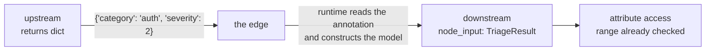

# 1.2 — The baton has a declared shape

## One-line answer

Assembly is not connecting stations, it is **declaring what travels between them**: annotate the
receiving side with a type and ADK 2.7.1 turns the sender's plain dictionary into that type on the
way across the edge, so a seam that disagrees fails at the seam instead of four stations later.

## The story

A blood sample is taken from your arm into a small tube. Somebody writes on the tube — your name,
the date, which test — and puts it in a rack. A porter carries the rack to the lab. In the lab
somebody picks the tube out of the rack, reads the label, and puts it in the right machine.

The person who took the blood and the person who runs the machine never meet. They may not work the
same shift. Neither of them knows what the other's job involves. The only thing connecting them is
what is written on that tube, and the whole system rests on the label being complete.

Now think about what happens when the label is missing the test name. Nothing dramatic happens at
the moment the tube is filled — that part went perfectly. Nothing happens on the trolley. The
failure happens in the lab, in front of the person who did nothing wrong, and their only options are
to guess or to throw the sample away and ask for another arm.

The label is not paperwork. The label is the interface.

## The idea in plain language

Between any two stations there is a **seam**: the sending side produces something, the receiving
side consumes it, and the two must agree about what it is. That agreement is the interface, and in
a pipeline you have one at every arrow.

You can leave the agreement unwritten. Everyone starts that way. The sender returns a dictionary,
the receiver reads the keys it needs, and it works — until somebody renames a key, or adds a station
in the middle, or a branch returns a slightly different shape on the unusual path. Then you have a
bug whose symptom is nowhere near its cause.

Or you can **declare** it. A declared seam is a named type with named fields, written down once,
and both sides point at the same declaration. In Python that is a Pydantic model: a class whose
fields have types, which knows how to check a dictionary against itself and refuses one that does
not fit.

Two terms, defined here because the rest of the day leans on them constantly:

- **Baton** — the value that travels along one edge, from one station to the next. Sutra's word,
  not ADK's. The framework calls it the node's `output` on the way out and its `node_input` on the
  way in; "baton" is a reminder that it is *one object being handed over*, not a shared pool.
- **Pydantic model** — a class declaring named fields and their types. Constructing one from a
  dictionary validates the dictionary; a missing or wrong-typed field raises rather than passing
  quietly. Sutra met these on Day 12 as the shape a model's output is constrained to; here they do
  the same job between two ordinary functions.

The useful discovery of this part is that ADK 2.7.1 does the conversion for you. You do not write
validation code at the seam. You annotate the receiving function's `node_input` parameter with the
type, and the runtime constructs it.

## Why Sutra needs it

This floor has six seams and they are all different shapes: a string in, a ticket, a verdict, a
merged dictionary from the join, an evidence block, a reviewed draft, a final reply. Six chances for
two stations to disagree.

And they will be edited by different days. Day 59 adds containment guards, Days 60 and 61 make the
run resumable, Day 64 puts an approval gate before the write. Every one of those days changes a
station without reading all the others. The declared seam is what lets that happen safely — and
[6.4](../06-the-run/6.4-the-seam-that-drifted.md) shows exactly what the day looks like when one of
them drifts.

## The mechanism

Here are this floor's seams, printed from the same list the stations are built from:

```bash
cd days/day-58-triage-graph-v1/lab
uv run python batons.py
```

**Line by line:**

- `batons.py` reads the `BATONS` table out of `_stations.py`. It is a table rather than prose so
  that the seams can be reviewed as a unit — six rows on one screen is the artefact a reviewer
  actually wants, and it is the first thing to write when you assemble anything.
- Nothing is run. The seams exist whether or not a ticket ever arrives.

Measured on 2026-09-05:

```text
  produced by          type              carries
  the caller           str               a ticket id as typed
  intake               TicketText        a ref that exists, and its text
  classify             TriageResult      category, severity, needs_human, notes
  evidence_join        dict[str, Any]    one key per branch node name
  assemble_evidence    EvidenceBlock     archive refs and kb refs, ordered
  draft_review_box     ReviewedDraft     text, verdict, rounds, flagged
  finalize             FinalReply        the product
```

Notice the fourth row. `evidence_join` produces a plain `dict`, not a declared type, because the
join is framework machinery and hands over whatever its branches produced
([3.2](../03-the-research-floor/3.2-the-join-hands-over-a-dict.md)). That is the one seam on this
floor that is *not* declared, and the station immediately after it exists for no other reason than
to declare it. One undeclared seam, one adapter, in one place.

Now watch the conversion happen. `seam.py` is two stations and nothing else:

```python
class TriageResult(BaseModel):
    """The seam between the classifier and everything downstream of it."""

    category: str
    severity: int = Field(ge=1, le=4)


def upstream(node_input: str) -> Event:
    """The sending side. It returns a plain dict - no model, no Event ceremony, no schema."""
    if DRIFT:
        return Event(author="upstream", output={"category": "auth"})
    return Event(author="upstream", output={"category": "auth", "severity": 2})


def downstream(node_input: TriageResult) -> Event:
    """The receiving side. Its annotation is the contract, and the runtime enforces it."""
    return Event(
        author="downstream",
        output=f"received {type(node_input).__name__}: {node_input!r}",
    )
```

**Line by line:**

- `severity: int = Field(ge=1, le=4)` declares a range as well as a type. `ge` and `le` are
  "greater or equal" and "less or equal", so a severity of `9` is rejected by the same machinery
  that rejects a missing field. The range is part of the agreement, not a comment about it.
- `upstream` returns a **plain dictionary**. This matters: the sending side does not import the
  type, does not construct it and does not know it exists. All the enforcement is on the receiving
  side, which is the right place — the receiver is the one with a requirement.
- `downstream(node_input: TriageResult)` is the whole of the mechanism. The parameter is named
  `node_input`, which is what tells ADK to fill it from the edge rather than from session state
  ([5.2](../05-the-graph/5.2-on-the-edge-or-in-the-register.md)), and its annotation is the type the
  runtime coerces into.
- `type(node_input).__name__` is printed rather than described, because the claim being made is
  precisely that the thing arriving is no longer a dictionary.

Run it. Verified against `google-adk==2.7.1`, and against the behaviour documented at
<https://adk.dev/graphs/data-handling/>, fetched 2026-09-05, which states that schemas
*"make the contract explicit and validate it at runtime"*:

```bash
uv run python seam.py
```

**Line by line:**

- No arguments: this is the arm where the two sides agree.
- The `--drift` flag, used in [6.4](../06-the-run/6.4-the-seam-that-drifted.md), makes `upstream`
  omit a field. Same graph, same edge, one key removed.

Measured on 2026-09-05:

```text
drift = False
  upstream     {'category': 'auth', 'severity': 2}
  downstream   "received TriageResult: TriageResult(category='auth', severity=2)"
```

Two lines, and the second one is the finding. A `dict` went onto the edge. A `TriageResult` came
off it. Nobody wrote a line of conversion code, no station called `TriageResult(**data)`, and
`downstream` can use attribute access and range guarantees on a value that a moment ago was an
untyped dictionary from a station that has never heard of the class.



## When it breaks

Remove one field from the sender and run the same graph:

```bash
uv run python seam.py --drift
```

Measured on 2026-09-05:

```text
pydantic_core._pydantic_core.ValidationError: 1 validation error for dynamic node 'downstream'
severity
  Field required [type=missing, input_value={'category': 'auth'}, input_type=dict]
    For further information visit https://errors.pydantic.dev/2.13/v/missing
```

Read what that error gives you, because it is unusually generous. It names the node that could not
be satisfied (`downstream`), the field that was missing (`severity`), and — the part that saves the
evening — **the exact value that arrived** (`input_value={'category': 'auth'}`). You do not have to
reproduce anything or add logging. The failing payload is in the message.

Two details worth knowing before you meet this at eleven at night.

The first is where the exception comes from. It is raised by
`google/adk/workflow/_dynamic_node_scheduler.py`, which is to say **by the runtime, at the seam,
before `downstream` runs at all**. The receiving function's body never executes. That is why the
message can be this specific: nothing had a chance to half-succeed.

The second is what the stream does on the way out. The run still emits a final event before the
exception propagates:

```text
  upstream     {'category': 'auth'}
  seam         None
```

That `None` from the workflow itself is not a result. If you are collecting events and checking the
last one, a run that died at a seam and a run that finished with nothing to say look identical —
which is [6.1](../06-the-run/6.1-the-event-stream-is-the-story.md)'s reason for asserting that a run
*reached a terminal station* rather than trusting that events arrived.

The failure this section prevents is worth stating plainly. Without the annotation, `downstream`
receives `{'category': 'auth'}`, and it does not crash. It carries on, and the first thing to notice
is `KeyError: 'severity'` in whichever station eventually reads that field — possibly not this one.
[6.4](../06-the-run/6.4-the-seam-that-drifted.md) measures how far that distance can get.

## In production

**What a professional writes instead.** The seam types live in one module that the stations import,
not next to whichever station happens to produce them. Sutra's build brief puts them in
`sutra/triage.py` for exactly this reason: when the batons are scattered, "what does this pipeline
pass around?" is answered by reading nine files, and nobody does it.

They also version them. A field added with a default is compatible; a field made required is not,
and a field renamed is a rename in two places at once. That sounds obvious until Day 61 stores a
checkpoint containing a serialised baton and Day 64 resumes it with code that has moved on — which
is the version-stamp problem those days have to solve, and it starts here.

**What degrades at scale.** Validation is not free. Constructing a Pydantic model per edge per run
is microseconds, which is nothing next to a model call and is not nothing next to a hundred thousand
runs an hour with a nested baton carrying a list of retrieved chunks. The usual production answer is
not to remove validation but to keep the batons **flat and small**: pass a list of document
references, not the documents. There is a second reason to do that, and it matters more — a fat
baton ends up copied into checkpoints, into logs and into traces, and Day 69 will have to ask which
of those copies contains customer text.

**The failure mode that only appears with real traffic.** Optional fields rot. Somebody adds
`confidence: float | None = None` to `TriageResult` so the change is compatible, and it is. A year
later half the code assumes it is always present, because in every run anyone has looked at, it was.
The seam still validates, and the bug is now in the readers rather than at the edge. Declaring the
seam moved the failure to a better place; it did not abolish the need to mean what you declare.

**The review comment a senior engineer leaves:** *"This node takes `node_input: dict`. That is not a
contract, it is a promise to read the source of whatever runs before it. Give it the type. If the
answer is that the shape genuinely varies, then the variation is the thing to model — a union, or a
field that says which case this is — because right now every reader has to rediscover it."*

**The interview question:** *"How do two stages of your pipeline agree on what they pass?"* The
answer that shows you have debugged one: *"Each seam is a declared Pydantic model, and the receiving
node's `node_input` is annotated with it, so ADK constructs and validates it at the edge before the
node body runs. That is not decoration — it moves the failure to the seam. The error names the node,
the missing field and the actual payload that arrived. Before we did that, a research station that
returned a slightly different shape surfaced as an exception inside the drafting loop two stations
downstream, and the traceback pointed at code that was correct."*

## Check yourself

```bash
cd days/day-58-triage-graph-v1/lab
uv run python batons.py
uv run python seam.py
uv run python seam.py --drift
```

Now open `seam.py` and change `severity` in `upstream` to the string `"two"` instead of `2`. Run it
again and read what the error says about `input_value` and `input_type`. Then decide whether you
would rather have met that message, or a `TypeError` inside a station that tried to compare it to a
number.

**Out loud, without scrolling up:** say which side of a seam carries the annotation and why it is
that side, and name the one seam on this floor that is not declared and the station that exists to
declare it.

**Next:** [1.3 — One station decides what is real](1.3-one-station-decides-what-is-real.md).
