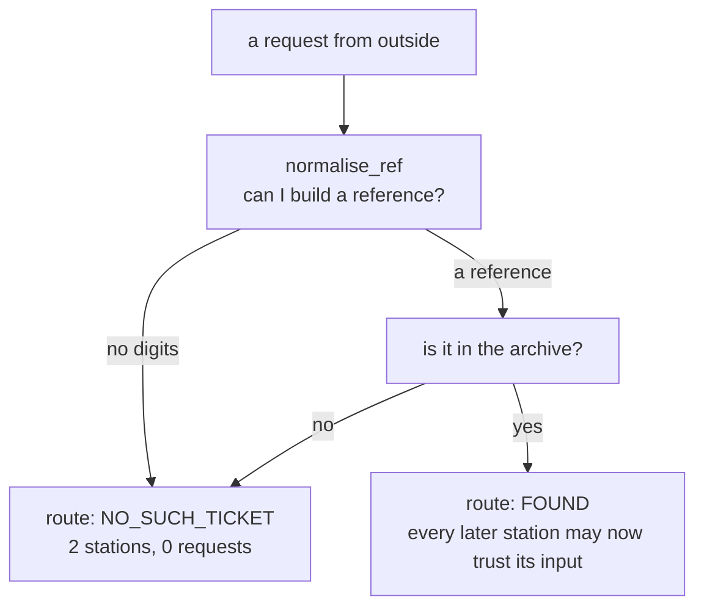

# 1.3 — One station decides what is real

## One-line answer

Every station in a pipeline is entitled to assume its input is real, and **exactly one** station is
responsible for making that true — so existence is checked at the mouth, and a miss leaves as a
route rather than as a sentence for the next station to read.

## The story

You go to the passport office to collect a renewed passport. There is a counter at the entrance
before you can join any queue. The person there asks for your reference number, types it in, and
looks at the screen.

If the number is good, they give you a token and point you at a chair. From that moment on, every
person you meet inside — the one who checks your fingerprints, the one who takes the photograph,
the one who hands over the book — works on the assumption that you are a real applicant with a real
file. None of them re-checks your reference. That would be absurd; there are eleven counters inside
and each of them re-typing your number would be eleven chances to type it wrong.

If the number is bad, you do not get a token. You are sent to a different desk entirely.

Now imagine the entrance counter, faced with a bad number, giving you a token anyway with
"reference not found" written where the name should go. You would be processed. Somebody would take
your fingerprints. Somebody would take your photograph. And at the very end a person would be
holding a passport book, looking at a name field that says "reference not found", with no idea what
to do and no authority to send you away, because you have a token and a token means you are real.

## The idea in plain language

Every pipeline has a **mouth** — the place where things from outside come in. The mouth has one job
that no other station can do: decide what is real.

This matters because of an asymmetry that is easy to miss. Inside a pipeline, every station is
allowed to be trusting. `classify` may assume it has been handed a real ticket; `archive_clerk` may
assume the text it searches for came from somewhere. That trust is what makes the stations small
and readable. But trust has to be *paid for* by something, and the mouth is what pays.

The mistake this part exists to prevent has a name worth learning: **laundering**. A pipeline does
not average away bad input. It processes it, stage by stage, and each stage adds legitimacy — a
category, a citation, a review stamp — until what comes out the far end is nonsense in a suit. The
output is not merely wrong; it is wrong *and audited*, which is worse, because the audit is what
people trust.

The fix is two words: **route, don't narrate.**

A station that discovers a problem has two ways of saying so:

- **Narrate.** Return a sentence — `"no ticket with ref 'ticket:8842'"` — as its normal output. The
  next station receives a string, because a string is what it always receives, and carries on.
- **Route.** Emit a *route*, which is a label the graph branches on, and let the edge list send the
  run somewhere else entirely.

Narrating puts the discovery in the data. Routing puts it in the control flow. Only one of them
stops the next station from running.

## Why Sutra needs it

Day 4 met the single-agent version of this with a ticket number that did not exist, and the agent
apologised for a problem nobody had. The pipeline version is worse, and
[6.3](../06-the-run/6.3-a-reply-to-a-ticket-that-does-not-exist.md) measures exactly how much worse:
three model calls, ten stations, and a reviewed reply about `ticket:8842`.

Day 59 opens by drilling containment, and the `NO_SUCH_TICKET` route is the first thing it drills.
Day 66 makes the same point from the security side: everything that arrives from outside is
untrusted, and the mouth is the only place a boundary can be drawn cheaply.

## The paper behind it

> **End-to-end arguments in system design**
> doi:10.1145/357401.357402 (1984) · <https://doi.org/10.1145/357401.357402>

It argued that a function can only be implemented correctly and completely at the ends of a
communication system, so putting it in the middle is at best an optimisation.

Taught in
[Day 21 — End-to-end arguments](../../../day-21-errors-surface-not-swallow/papers/01-end-to-end-arguments.md).
Its bearing here is direct: "does this ticket exist?" is a question only the station holding the
archive can answer completely, so putting a hopeful version of that check in the classifier's prompt
is the middle-of-the-network mistake the paper is about.

## The mechanism

Two jobs live at the mouth and they are deliberately separate functions. The first turns whatever
somebody typed into a reference. The second decides whether that reference names anything.

```python
_REF_RE = re.compile(r"\b(ticket|kb)\b[:\s#-]*([0-9]+)", re.I)


def normalise_ref(raw: str) -> str:
    """Turn whatever a caller typed into an archive ref, without deciding whether it exists."""
    match = _REF_RE.search(raw.strip())
    if match:
        kind, number = match.group(1).lower(), match.group(2)
        return f"kb:KB-{number}" if kind == "kb" else f"ticket:{number}"
    digits = re.sub(r"[^0-9]", "", raw)
    return f"ticket:{digits}" if digits else ""
```

**Line by line:**

- `\b(ticket|kb)\b` looks for the words `ticket` or `kb` on their own. `\b` is a word boundary, so
  it matches `kb` in `kb:KB-104` and refuses to match the `kb` inside a longer word. Without those
  boundaries the pattern happily matches fragments, which is how this exact function had a bug: an
  earlier version of this file lost the boundaries and `KB-104` silently normalised to `ticket:104`,
  a reference to a ticket that does not exist.
- `[:\s#-]*` swallows whatever separator the person used — a colon, a space, a hash, a hyphen, or
  nothing at all. It is `*` rather than `+` because `ticket4521` should work too.
- `re.I` makes it case-insensitive, so `KB`, `Kb` and `kb` are one case rather than three.
- `kind, number = ...` reads the two captures out once and names them, because
  `match.group(2)` appearing three times in a return statement is how the next person introduces a
  bug.
- The last two lines are the fallback for a bare number. Stripping everything that is not a digit is
  crude on purpose: it means `please look at 4633 again` resolves, and it means a request with no
  digits at all resolves to the empty string, which is not a reference and will be rejected by the
  station below.
- **This function never asks whether the reference exists**, and that is the design. Normalising and
  checking are two questions, and a function that conflates them can only ever answer "something was
  wrong".

Now the station that does decide:

```python
def intake(node_input: str) -> Event:
    """Station 1: turn a request into a fact, or route on the fact that it is not one."""
    ref = normalise_ref(node_input)
    if ref not in DOCS:
        if KNOBS.validate_at_mouth:
            return Event(
                author="intake",
                output=f"no ticket with ref {ref!r}",
                actions=EventActions(route="NO_SUCH_TICKET", state_delta={"ref": ref}),
            )
```

**Line by line:**

- `ref not in DOCS` is the existence check, and it is a dictionary membership test. It is exact, it
  is instant, it costs no request, and it is the reason [1.1](1.1-ten-stations-two-of-which-think.md)
  could mark this station as one that does not think.
- `actions=EventActions(route="NO_SUCH_TICKET", ...)` is the routing. `route` is not a field on the
  event's data; it lives under `actions`, because in ADK 2.x it is something the node *did*, not
  something the node *said*. [2.2](../02-the-guess/2.2-the-route-is-an-action.md) is about that
  distinction.
- `output=` still carries a readable sentence. That is not narration — narration is when the
  sentence is the *only* signal. Here the route decides where the run goes and the sentence tells a
  human why, which is both halves done properly.
- `state_delta={"ref": ref}` writes the reference into the run's record even on the failing path, so
  the case file of a rejected request still says what was asked for
  ([6.2](../06-the-run/6.2-state-is-the-case-file.md)).
- `KNOBS.validate_at_mouth` is the ablation switch. Turning it off is
  [6.3](../06-the-run/6.3-a-reply-to-a-ticket-that-does-not-exist.md), and it exists so the argument
  for this station can be *shown* rather than asserted.

Run the mouth against six shapes of request:

```bash
cd days/day-58-triage-graph-v1/lab
uv run python mouth.py
```

**Line by line:**

- `mouth.py` drives the whole graph for each request, not just `intake`, because the claim is about
  what the *pipeline* does — and the cheapest way to see that is the last column.
- The three columns after the request are what was parsed, where the run ended up, and what it cost.

Measured on 2026-09-05:

```text
  request        normalised ref     lane taken            model calls
  '4521'         ticket:4521        replied                         3
  '#4521'        ticket:4521        replied                         3
  'ticket:4521'  ticket:4521        replied                         3
  '8842'         ticket:8842        not_found                       0
  ''                                not_found                       0
  'KB-104'       kb:KB-104          replied                         5
```

The first three rows are the same ticket typed three ways, ending in the same place at the same
price. That is the normaliser earning its keep.

Rows four and five are the finding. `8842` parses perfectly well — it is a valid-looking reference —
and it names nothing, so the run ends after two stations having spent **zero** requests. The empty
request does not even produce a reference, and lands in the same lane. One route handles both,
because "I could not build a reference" and "the reference names nothing" are the same answer to the
question the next station cares about: *is there a ticket here?*

The last row is the one that is easy to skim past. `KB-104` is a knowledge-base article, not a
ticket, and it does exist, so the floor processes it and spends five requests writing a reply about
a help article. That is not a bug in intake — intake was asked whether the reference is real and it
is. It is the floor having no opinion about what *kind* of thing it was handed, and it is the sort of
gap that only becomes visible when you print a table with an odd row in it.



## When it breaks

The interesting break is not a crash. It is the version where the mouth is *nearly* right.

Here is the real one from this lab. The regular expression above originally lost its word
boundaries, so the pattern was `(ticket|kb)[:\s#-]*([0-9]+)` with a piece of the file quietly
corrupted. `KB-104` went in and `ticket:104` came out. There is no ticket 104, so the request took
the `NO_SUCH_TICKET` lane and reported, perfectly honestly, that it could not find the thing it had
been asked about — while the thing it had been asked about was sitting in the archive under a
different key.

Nothing raised. The lane was right, the message was polite, the cost was zero, and the answer was
wrong. The only reason it was caught is that `normalise_ref` carries examples in its docstring and
they are executable:

```text
File ".../days/day-58-triage-graph-v1/lab/_stations.py", line 149, in _stations.normalise_ref
Failed example:
    normalise_ref("KB-104")
Expected:
    'kb:KB-104'
Got:
    'ticket:104'
```

That is the argument for keeping the two jobs in separate functions, stated by evidence. Existence
checking cannot be tested cheaply — it needs the archive — but *parsing* is a pure function from a
string to a string, so it can carry its own examples and they run in a second. Fold the two together
and the parsing bug becomes untestable except through the whole pipeline.

The second break is the one to reach for on purpose. Turn the check off:

```bash
uv run python launder.py --off
```

That is [6.3](../06-the-run/6.3-a-reply-to-a-ticket-that-does-not-exist.md)'s subject and the
numbers are there. The short version: ten stations instead of two, three model calls instead of
zero, and a reply beginning *"Thanks for reporting ticket:8842"*.

## In production

**What a professional writes instead.** The mouth is where the request is *canonicalised*, not just
checked: trimmed, case-folded, the reference resolved to an internal identifier, and the whole thing
stamped with a request id that every later station and every log line carries. The check is not
`ref in DOCS` but a repository lookup that also returns the record, so the pipeline reads the ticket
once instead of once per station — and so the answer to "does it exist" and the answer to "what is
it" cannot disagree, which they can when they are two separate queries.

They also distinguish the failure modes that this lab collapses into one lane. *Malformed* (I cannot
parse this), *not found* (I parsed it, nothing is there) and *not permitted* (it exists and this
caller may not see it) are three different answers, and the third one must not be distinguishable
from the second by an outsider, or your not-found lane becomes an enumeration oracle. That is Day
68's subject and it starts as a routing decision here.

**What degrades at scale.** The mouth becomes the hot path — every request touches it, and it is
now doing a database read. It also becomes the natural place to put rate limiting and deduplication,
because it is the only station that sees everything. The risk is that it accretes: today it
validates, next quarter it also enriches, logs, authorises, and de-duplicates, and the "small
station at the front" is four hundred lines that everything depends on.

**The failure mode that only appears with real traffic.** Real requests are not typed by you. They
arrive from an email integration with a subject line like `Re: Fwd: [#4521] still happening`, and
your normaliser finds `4521` and works. Then one arrives as `Re: Fwd: [#4521] see also #4610` and it
finds the first number, silently, and researches the wrong ticket. A normaliser that finds *one*
match in text that may contain several is a coin toss wearing a regular expression. The production
fix is to find them all and route on the count: none is not-found, one is fine, more than one is a
question for a human.

**The review comment a senior engineer leaves:** *"`intake` returns a string on the failure path and
the next node takes a string. That means a not-found is indistinguishable from a ticket whose text
happens to be an apology. Make it a route and give the failure its own terminal node — and please
split the parsing out, because right now I cannot test the reference formats without loading the
archive."*

**The interview question:** *"Where does your pipeline validate its input?"* The answer that shows
you have been burned: *"At exactly one station, the first one, and a failure there is a route rather
than a return value. The reason is that pipelines launder. Every stage downstream is written to
trust its input — that is what makes them small — so if the first station passes on a polite
sentence about a missing ticket, the classifier classifies the sentence, the researcher searches for
it, and the critic approves a reviewed reply about a ticket that does not exist. I have watched that
cost three model calls and produce something that looks audited. With the check at the mouth the
same request costs zero and stops after two nodes."*

## Check yourself

```bash
cd days/day-58-triage-graph-v1/lab
uv run python mouth.py
uv run python -m doctest _stations.py -v 2>&1 | tail -3
```

Now add a request of your own to `mouth.py` — try `Re: Fwd: [#4521] see also #4610` — and write down
which ticket the floor researched and whether that is the one you meant.

**Out loud, without scrolling up:** state the rule about which station may assume its input is real,
and explain the difference between routing on a miss and returning a sentence about it.

**Next:** [2.1 — A verdict is a form, not a paragraph](../02-the-guess/2.1-a-verdict-is-a-form.md).
