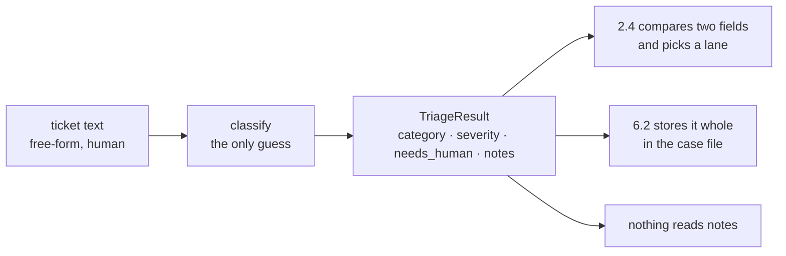

# 2.1 — A verdict is a form, not a paragraph

## One-line answer

The one station on this floor that is allowed to guess must hand its guess over as a **filled form
with fixed fields**, never as prose, because every station downstream branches on it and no station
should be reading sentences to find out what to do.

## The story

A doctor writes you a prescription. Look at what it actually is: a small printed sheet with boxes.
Name. Date. Drug. Strength. How many. How often. How long. Signature.

The doctor is the person in the building with the training to decide what you need. That decision is
genuinely a judgement — two doctors could reasonably differ. But the *output* of that judgement is
not a paragraph. It is a form, and the pharmacist reads the boxes.

Imagine the alternative. The doctor writes: *"I think this is probably a chest infection, give them
something reasonably strong, twice a day should be fine, for about a week or so."* Every word of
that is honest and it may even be better medicine — it says how confident the doctor is, which the
boxes cannot. And the pharmacist now has to make three decisions the doctor was supposed to make,
without the training, from behind a counter, at the end of a shift.

The judgement stays with the doctor. The form is how the judgement travels.

## The idea in plain language

`classify` is the only station on this floor that guesses. Everything else looks something up, does
arithmetic, or formats a string. That makes it valuable and it makes it dangerous, and the way to
have the first without the second is to constrain what it is allowed to produce.

A **schema** is the list of boxes: field names, types, and any limits on the values. Sutra met
schemas on Day 12 as a way to make a model return JSON instead of chat; here the point is different
and larger. The schema is not there to make the output parseable. It is there because **the shape of
the verdict is the interface for the whole rest of the pipeline**, and an interface written as prose
is not an interface.

Three concrete things follow from making the verdict a form:

1. **Downstream stations branch on fields, not on words.** `severity >= 4` is a comparison. "sounds
   urgent" is a second guess, made by code that cannot guess.
2. **The verdict can be stored and compared.** A form with four fields goes into the case file
   ([6.2](../06-the-run/6.2-state-is-the-case-file.md)) and can be counted across fifty-two tickets.
   A paragraph can only be read.
3. **The unknown case has a place to live.** A form can carry a box that says *I could not decide*.
   Prose expresses uncertainty by being vague, which is the one thing the next station cannot act
   on.

That third point is the one people leave out, and it is the reason the form below has a
`needs_human` field.

## Why Sutra needs it

Everything in sections 2 to 5 reads this form. The escalation decision in
[2.4](2.4-the-lane-that-declines-the-work.md) is a comparison on two of its fields. The research
floor is reached only on one branch of it. The case file stores it whole.

It also outlives today. Day 63 designs approval gates by classifying actions on blast radius, and
the first thing it will want is a machine-readable statement of what kind of thing this ticket is.
A pipeline whose classifier emits prose cannot have an approval policy, because a policy is a table
and a table needs columns.

## The mechanism

The form, declared once:

```python
class TriageResult(BaseModel):
    """What the classifier produces: the only guess on the floor, in a fixed shape."""

    category: str
    severity: int = Field(ge=1, le=4)
    needs_human: bool = False
    notes: str = ""
```

**Line by line:**

- `category: str` is what kind of problem this is. It is a string here rather than an enumeration
  for one honest reason: the classifier is allowed to say `other`, and the moment you make the
  category a closed enumeration you have to decide what happens when the real world produces a
  category you did not list. Section 8 comes back to this, because the archive's answer is
  uncomfortable.
- `severity: int = Field(ge=1, le=4)` is a number with a declared range. A severity of `7` is not a
  more urgent ticket, it is a broken classifier, and the seam refuses it rather than passing it to
  a comparison that will quietly say `True`.
- `needs_human: bool = False` is the box for *I could not decide*, and it defaults to `False` so
  that a station which forgets to set it is claiming competence rather than accidentally escalating
  everything. That default is a real decision and section 8 argues it is the wrong one for this
  floor.
- `notes: str = ""` is the only free-text field, and it exists so a human reading the case file has
  the ticket's own words to hand. **Nothing branches on `notes`.** The moment something does, you
  have re-invented prose as an interface.

The station that fills it:

```python
def classify(node_input: TicketText) -> Event:
    """Station 2: fill one typed form, and emit the route the floor branches on."""
    METER.spend("classify")  # MODEL CALL - one, pinned; see part 2.3
    low = node_input.text.lower()
    category, severity = "other", 1
    for name, words, sev in _RULES:
        if any(word in low for word in words):
            category, severity = name, sev
            break
    needs_human = category in {"security", "other"}
    result = TriageResult(
        category=category,
        severity=severity,
        needs_human=needs_human,
        notes=node_input.text[:120],
    )
```

**Line by line:**

- `node_input: TicketText` is the seam from [1.2](../01-the-floor/1.2-the-baton-has-a-declared-shape.md).
  The classifier is handed a ticket that is known to exist, so it never has to wonder.
- `METER.spend("classify")` is where the model call *would* go. In the lab it increments a counter
  instead, which is how every number in this day is real without spending a request. The real call
  is one `LlmAgent` with `output_schema=TriageResult`, shown in
  [2.3](2.3-the-one-model-call.md), and — this is the point — **the shape that comes out is
  identical**, which is precisely why the rest of the floor cannot tell the difference.
- `category, severity = "other", 1` sets the defaults *before* the rules run, so the fall-through
  case is written down rather than implied. A classifier with no default has an unwritten sixth
  category called "whatever the last iteration left in the variable".
- `break` on the first matching rule makes the rule list **ordered**, and order is a policy: a
  ticket that mentions both an outage and an invoice is an outage. Say that out loud once and the
  ordering stops being an accident.
- `needs_human = category in {"security", "other"}` is the uncertainty box being filled from the
  category rather than guessed separately. `other` means no rule matched, which is the classifier
  admitting it does not know.
- `notes=node_input.text[:120]` truncates deliberately. The case file wants a reminder, not a copy
  of the ticket — and [1.2](../01-the-floor/1.2-the-baton-has-a-declared-shape.md)'s production
  section explains why a fat baton is a liability once Day 61 starts writing it into checkpoints.

Now run the form over every ticket in the archive and count what comes out:

```bash
cd days/day-58-triage-graph-v1/lab
uv run python escalate.py --sweep
```

**Line by line:**

- `--sweep` calls `classify` directly on all fifty-two tickets rather than driving the whole graph,
  because the question here is about the verdict, not about the run.
- It prints the route tally first and the category tally second. Both matter, and
  [2.4](2.4-the-lane-that-declines-the-work.md) is about the first one.

Measured on 2026-09-05:

```text
  tickets in the archive     52
  ESCALATE                   28  (54%)
  HANDLE                     24

  category      tickets
  other           26
  billing         17
  export           4
  auth             3
  security         1
  outage           1
```

**Twenty-six of fifty-two tickets are `other`.** Half the archive matched no rule at all.

That number is only visible because the verdict is a form. Had `classify` produced a sentence, each
of those twenty-six would have been a fluent, plausible paragraph about a support ticket, and you
would have read three of them, found them reasonable, and shipped. The form makes the failure
countable, and a countable failure is one you can put in a test.



## When it breaks

Push a bad value through the form and it stops at the seam rather than at the comparison:

```text
pydantic_core._pydantic_core.ValidationError: 1 validation error for TriageResult
severity
  Input should be less than or equal to 4 [type=less_than_equal, input_value=7, input_type=int]
    For further information visit https://errors.pydantic.dev/2.13/v/less_than_equal
```

That is `Field(ge=1, le=4)` doing the job the range was declared for. Without it, `severity=7`
constructs happily, `severity >= 4` says `True`, and the ticket escalates — which in this case is
the *safe* direction, so nobody notices. Reverse the comparison somewhere and the same unchecked
field silently un-escalates. A range that is only enforced by the code that reads it is enforced
once per reader.

The break that is not an exception is the one in the table above, and it deserves naming precisely.
`ticket:4506` reads *"Cannot change the billing email. Saving a new billing email reverts to the old
one."* It is classified `other`. Look at the rule list and the reason is dull: the billing rule
matches on `invoice`, `charged`, `card`, `refund`, `receipt` and `plan`, and this ticket says
`billing`, which is not in the list.

There is no error. There is no warning. The verdict is a well-formed `TriageResult` that passes
every validation the seam applies, and it is wrong, and it sends the ticket to a human. This is the
difference between a schema and a classifier: **the schema guarantees the shape of the answer and
says nothing whatsoever about whether the answer is right.** A reader who takes "the output is
validated" to mean "the output is correct" has learned the wrong lesson from this section, and the
whole of section 7 exists because of that gap.

## In production

**What a professional writes instead.** The category becomes a closed enumeration with an explicit
`OTHER` member, and the *set of categories is versioned*, because a classifier's label set is an
interface with the reporting that runs on top of it. They also add a confidence field, and they add
it as a required field rather than an optional one, so that a station cannot forget to say how sure
it is. And the instruction that goes to the model states what to do when nothing fits, in the same
words as the schema's default, because the two disagreeing is a bug that produces perfect-looking
verdicts.

**What degrades at scale.** The form itself does not degrade. What degrades is the rule list, or in
the real version, the prompt. A category set chosen from a hundred tickets stops fitting at ten
thousand, and the symptom is not an error — it is the `other` bucket growing quietly, exactly as it
has here at 50%. The production instrument is a dashboard of category proportions over time, with an
alert on `other`, because the classifier does not know it has stopped working and neither will you.

**The failure mode that only appears with real traffic.** The severity field drifts in meaning. It
was defined by whoever wrote the first prompt, and after a year one team reads `4` as "wake somebody
up" and another reads it as "answer today". Nothing in the schema stops that; a range is not a
definition. The fix is prosaic and it is the one people skip: the meaning of each severity level
written down next to the field, in the same file, as a docstring the prompt is generated from — so
there is one definition rather than one per reader.

**The review comment a senior engineer leaves:** *"`category` is a free string and the router
compares it against string literals in three files. When somebody changes `outage` to `incident` in
the prompt, all three comparisons silently stop matching and every ticket takes the default lane.
Make it an enum, generate the prompt's list from the enum, and add a test that fails when they
diverge."*

**The interview question:** *"Your classifier is a language model. How do you stop the rest of the
system depending on its wording?"* The answer that shows you have done it: *"It emits a schema, not
prose — four fields, one of which is an explicit 'I could not decide'. Everything downstream branches
on fields, and nothing branches on the free-text field. That gives me two things a paragraph cannot:
the router is a comparison rather than a second guess, and the verdicts are countable. Counting them
is how I found that half our archive classified as `other`, which no amount of reading sample
outputs would have told me — every one of those looked perfectly reasonable on its own."*

## Check yourself

```bash
cd days/day-58-triage-graph-v1/lab
uv run python escalate.py --sweep
```

Now open `_RULES` in `_stations.py`, add `billing` to the billing rule's word list, and run the sweep
again. Write down what happened to the `other` count and to the escalation percentage, and then ask
yourself how you would have noticed the original gap without this table.

**Out loud, without scrolling up:** say why the verdict is a form rather than a sentence, and name
the field that exists so the classifier can admit it does not know.

**Next:** [2.2 — The route is an action, not the answer](2.2-the-route-is-an-action.md).
