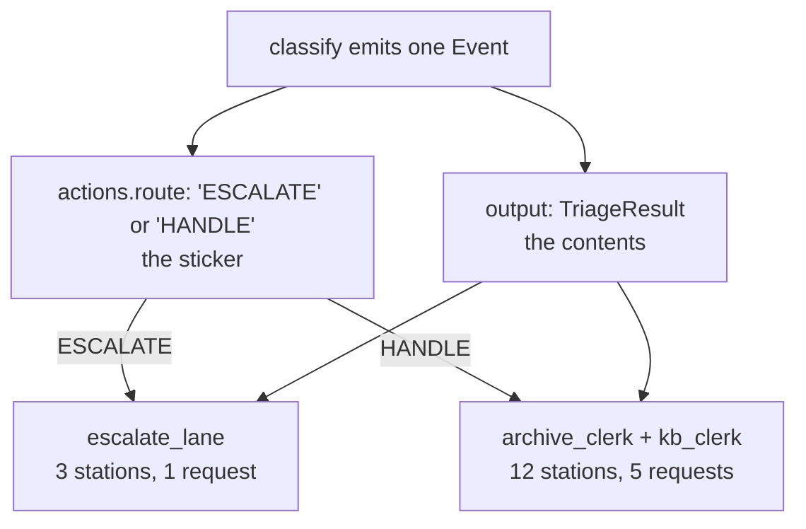

# 2.2 — The route is an action, not the answer

## One-line answer

In the 2.x Workflow Runtime a station says *where the run goes next* through
`Event.actions.route` and says *what it produced* through `Event.output` — two separate channels,
and collapsing them into one is the 1.x habit that makes a branch depend on the wording of a
sentence.

## The story

At a courier depot the parcels come off the van and go along a belt. At the end of the belt a person
picks up each parcel, glances at it, and slaps a coloured sticker on the outside: green for local,
blue for out of state, red for fragile. Then the parcel goes onto the belt again and the sorting
machine reads the sticker and pushes it down the right chute.

Two things are travelling and they are not the same thing.

Inside the parcel is the contents — somebody's shoes. On the outside is the sticker. The machine
never opens the parcel; it reads the sticker. The recipient never sees the sticker; they open the
parcel.

Now picture doing it the other way: no stickers, and instead the sorter writes "this one is fragile"
on a slip of paper and drops it *inside* the box. Everything still technically works, provided every
machine down the line opens every parcel, reads the slip, understands the handwriting, and puts it
back. The first machine that does not becomes the bug.

## The idea in plain language

An **event** in ADK 2.x is what a station emits when it has done its work. It carries several
different kinds of information, and two of them matter here:

- **`output`** — the value the station produced. This is the baton
  ([1.2](../01-the-floor/1.2-the-baton-has-a-declared-shape.md)): it travels down the edge to
  whatever station runs next, and it is the *contents of the parcel*.
- **`actions.route`** — a label saying which outgoing edge should be taken. The graph reads it and
  nothing else does. It is the *sticker*.

A **route** is a plain string, and it means nothing on its own. It gets its meaning from the edge
list: an edge can declare a route, and it is followed only when a station emits that route. If no
edge on that station matches, the branch stops there — no exception, exit code 0, which is a failure
Day 53 measured and named.

The reason `route` lives under `actions` rather than beside `output` is worth pausing on, because it
is the whole design in one word. `actions` is ADK's list of things a node *did to the run* — write
into state, transfer to another agent, escalate, choose a route. `output` is what the node *says*.
The framework separates the effects a node had from the value it computed, and a branch is an
effect.

This is trap #1 from the plan's §5.1 wearing everyday clothes. In 1.x you composed agents into
trees, and the ordinary way to express a branch was for a node to return a label and for the caller
to look at the returned value and decide. That code reads fine and it still runs. But it makes the
branch a property of the *data*, so anything that touches the data — a wrapper, a summariser, a
retry that reformats — can change where the run goes.

## Why Sutra needs it

This floor branches twice and both branches are load-bearing. `intake` routes `NO_SUCH_TICKET` or
`FOUND` ([1.3](../01-the-floor/1.3-one-station-decides-what-is-real.md)); `classify` routes
`ESCALATE` or `HANDLE` ([2.4](2.4-the-lane-that-declines-the-work.md)). One of those decides whether
the machine spends any money at all, and the other decides whether the machine is allowed to answer
a customer.

Day 63 designs approval gates and Day 64 builds one on the write path. An approval gate is exactly
this mechanism with a human between the sticker and the chute — so a floor whose branches are
already routes gets a gate by adding an edge, and a floor whose branches are parsed out of strings
gets a gate by rewriting every station that produces one.

## The mechanism

Here is the classifier's ending, which is the sticker and the contents leaving together:

```python
    hot = result.needs_human or result.severity >= 4
    route = "ESCALATE" if (hot and KNOBS.escalate_early) else "HANDLE"
    return Event(
        author="classify",
        output=result,
        actions=EventActions(
            route=route,
            state_delta={"triage_result": result.model_dump()},
        ),
    )
```

**Line by line:**

- `hot = result.needs_human or result.severity >= 4` is the branch condition, and it is two field
  comparisons on the form from [2.1](2.1-a-verdict-is-a-form.md). No string is inspected, no keyword
  is searched for. This line is readable by somebody who has never seen the classifier.
- `route = "ESCALATE" if ... else "HANDLE"` picks the label. The labels are shouted in capitals by
  convention only; the framework does not care. What the framework cares about is that the same
  spelling appears on an edge, which is why Day 53's part 5.2 measured a graph that quietly did half
  its work because a station said `INCIDENT` and an edge said `incident`.
- `output=result` sends the **whole verdict** on, not the route. The next station gets a
  `TriageResult` and can read every field of it. The branch has been taken and the data is intact —
  the sticker did not replace the contents.
- `actions=EventActions(route=route, ...)` is the sticker. Note that `EventActions` is constructed
  explicitly here rather than using the `Event(route=...)` shorthand; both work, and the explicit
  form is what makes the two channels visible on the page, which is why the lab uses it.
- `state_delta={"triage_result": result.model_dump()}` is a third thing the node did: write into the
  run's record. That is also an action, which is the tidy proof that `actions` really is "effects" —
  routing and state-writing sit together because they are the same kind of thing.

And the edge list that gives the labels meaning:

```python
edges = [
    (classify, {"ESCALATE": escalate_lane, "HANDLE": (archive_clerk, kb_clerk)}),
]
```

**Line by line:**

- The dictionary form is ADK's routing sugar: each key is a route label, each value is where that
  label goes. It expands into one `Edge` per entry, each carrying its own `route`.
- `"HANDLE": (archive_clerk, kb_clerk)` sends **one** route to **two** stations. That is a fan-out
  and it is section 3's subject. The important thing here is that a route is not "the next station",
  it is "which set of edges", and a set may have more than one member.
- There is no `else`. If `classify` ever emits a third label, neither edge matches and the branch
  simply ends. Day 53 called that out; [5.1](../05-the-graph/5.1-the-edge-list-is-the-floor-plan.md)
  shows what the graph looks like when you go looking for it.

Watch both channels on one run:

```bash
cd days/day-58-triage-graph-v1/lab
uv run python escalate.py
```

**Line by line:**

- Two tickets, chosen because they take different lanes: `ticket:4562` is classified `other` so it
  escalates, and `ticket:4610` is classified `auth` so the floor handles it.
- The `stations` column counts events, which is how many stations actually ran. That count is the
  visible consequence of the sticker.

Measured on 2026-09-05:

```text
  ticket         route      outcome      stations  calls
  ticket:4562    other      escalated           3      1
  ticket:4610    auth       replied            12      5
```

Same graph, same code, same edge list. One route label, and the difference is nine stations and four
requests.



## When it breaks

There is a failure here that produces no error at all, and it is a property of how `Event` is
constructed. Misspell the keyword:

```python
from google.adk import Event

event = Event(output="x", rout="incident")  # note the typo
print("route is:", event.actions.route)
print("output:", event.output)
```

**Line by line:**

- `rout=` instead of `route=`. A single missing letter, of the kind that survives review because the
  eye reads what it expects.
- Both values are printed rather than asserted, because the claim is about what silently did not
  happen.

Measured on 2026-09-05:

```text
route is: None
output: x
```

**No exception.** `Event` is a Pydantic model configured with `extra="ignore"`, so an unknown keyword
is discarded without complaint. The station returns successfully, the event has no route, no edge
matches, and the branch ends. The run exits 0 having done part of its work.

That is the same shape of failure Day 53 found twice, and it is worth stating as a rule rather than
an anecdote: **on this runtime, a branch that does not happen is usually silent.** An exception means
something ran and failed. Silence means something never ran, and there is no traceback for the road
not taken. The defence is not vigilance, it is the assertion in
[7.2](../07-acceptance/7.2-the-gate-that-goes-red.md) that a run reached a terminal station.

The second break is the one that comes from doing it the 1.x way. Suppose `classify` returned the
string `"ESCALATE"` as its `output` and the next station branched on it. Everything works. Then
somebody wraps the classifier to add a retry that, on the second attempt, returns
`"ESCALATE (retry)"`. The comparison stops matching. Nothing raises — a station returned a string, as
it always does — and every ticket takes the other lane, which on this floor means every ticket the
machine should have refused to answer now gets answered.

## In production

**What a professional writes instead.** The route labels are an enumeration shared by the station
and the edge list, so a typo is an `AttributeError` at import rather than a branch that never fires.
Day 53's build brief asks for exactly that as a `StrEnum`, and this is the day you find out why: a
route is a string in the framework, so the only place the spelling can be checked is your own code.

They also give every routing station a default edge. ADK exposes `DEFAULT_ROUTE`, an edge followed
when no other route on that node matches, and the production habit is to wire it to something that
records and alerts rather than to something that does the work. An unrouted branch then becomes a
counter going up instead of a run quietly doing less.

**What degrades at scale.** Routes do not degrade; the number of them does. Two labels is a branch,
five is a policy, and eleven is a state machine that somebody needs to draw. The signal that you
have crossed the line is a station whose route calculation has its own `if`/`elif` ladder longer than
the station's actual work — at that point the routing decision has become the station, and it wants
to be its own node with its own tests.

**The failure mode that only appears with real traffic.** A route label leaks into something that
was not meant to read it. Somebody puts the route in a log line, then somebody builds a dashboard
that counts log lines by route, and then somebody renames a label for clarity. The graph is fine and
the dashboard silently goes to zero. Route labels become an interface the moment anything outside
the graph reads them, and the time to decide whether they are one is before that happens.

**The review comment a senior engineer leaves:** *"This node puts the branch label in `output` and
the next node compares against it. That makes the control flow a property of the data, so any
wrapper that touches the payload can change where the run goes. Put it in `actions.route`, take the
label from the shared enum, and add the `DEFAULT_ROUTE` edge so we find out when neither branch
fires."*

**The interview question:** *"How does one step of your graph decide which step runs next?"* The
answer that shows you have been bitten: *"The node emits a route label in `actions.route`, and the
edge list says what each label means. That is separate from the node's output, which is the data and
travels on regardless. The reason I care about the separation is that routing on the returned value
makes the branch depend on the exact wording, and I have watched a run take the wrong lane because
a retry wrapper appended a suffix to a string. It is also worth knowing the failure is silent on
this runtime — a route no edge matches ends the branch with exit code 0 and one log line, and a
misspelled keyword on the event constructor is dropped without an error at all. So we assert that a
run reached a terminal node instead of trusting that it finished."*

## Check yourself

```bash
cd days/day-58-triage-graph-v1/lab
uv run python escalate.py
uv run python -c "from google.adk import Event; print(Event(output='x', rout='ESCALATE').actions.route)"
```

Now open `_stations.py`, change the route `classify` emits from `"HANDLE"` to `"HANDLED"`, and run
`uv run python escalate.py` again. Write down how many stations ran, what the exit code was, and how
you would have found out in a system with no table in front of you.

**Out loud, without scrolling up:** name the two channels an event carries and say which one the
graph reads, then describe what happens when a station emits a route no edge matches.

**Next:** [2.3 — The one model call, pinned and refused](2.3-the-one-model-call.md).
