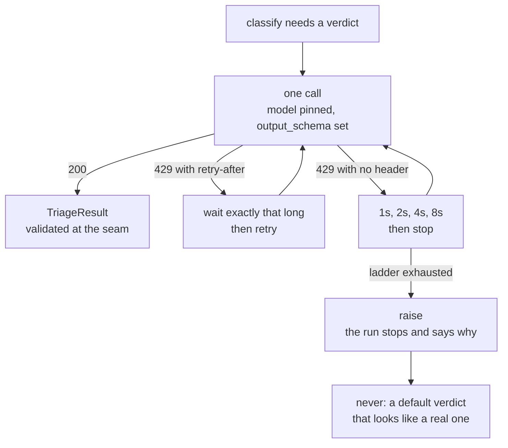

# 2.3 — The one model call, pinned and refused

## One-line answer

The classifier's model is **named explicitly, never defaulted**, its output is constrained to the
verdict schema, and when the free tier refuses the call the station waits, retries and then **says
it could not classify** — because a fabricated verdict is worse than a stopped run.

## The story

A prepaid electricity meter sits by the front door. You put credit on it and it counts down. There
is no bill at the end of the month, no grace period and nobody to call. When the credit reaches
zero the lights go off, and they go off at whatever moment the credit happens to run out — mid-
sentence, mid-meal, mid-anything.

People who live with one develop two habits. The first is that they know roughly what things cost:
the iron is expensive, the fan is not, and the water heater is what actually empties the meter. The
second is that they never let it run out during something that cannot be interrupted.

Neither habit is about saving money. They are both about the fact that the supply is *countable and
finite*, and that running out is not a slow decline. It is a switch.

## The idea in plain language

There is exactly one model call in this station, and three separate decisions govern it.

**Which model.** ADK lets an agent leave its model unset, and the framework fills in a default.
Convenient, and the wrong choice here for a reason that has nothing to do with quality: the default
is a value inside the library, so a patch release can change it, and the free-tier allowance you
measured belongs to the model you measured it on. An unpinned agent is an agent whose quota you do
not know. Naming the model is **ADK-73**, and it is one line.

**What comes back.** The station must produce a `TriageResult`
([2.1](2.1-a-verdict-is-a-form.md)). Asking a model politely for JSON and parsing what arrives is a
guess with extra steps. Declaring `output_schema` makes the shape a constraint on generation rather
than a hope about it, and the value the station emits is the same type whether a model or a rule
list produced it — which is why the whole rest of this floor is indifferent to the difference.

**What happens when it is refused.** A free tier does not degrade. It refuses, with HTTP **429**,
and the refusal is a normal Saturday rather than an emergency. There are exactly three honest
responses, in order: wait the amount you were told to wait and try again; if you were told nothing,
back off on a ladder and try again a bounded number of times; and when the attempts are spent,
**stop and say so**.

The one dishonest response is the tempting one: return a plausible default verdict so the pipeline
keeps moving. That is Principle 10's exact prohibition. A `TriageResult(category="other",
severity=1)` invented because the quota ran out is indistinguishable, downstream and in the case
file, from one the model actually produced — and this floor stores the verdict, branches on it, and
shows it to a human later.

## Why Sutra needs it

[1.1](../01-the-floor/1.1-ten-stations-two-of-which-think.md) counted the requests: a mean of 2.08
per ticket against twenty a day, which is nine or ten tickets before the switch flips. That is not a
rare edge case to handle defensively. On this project the refusal is a **routine** event, and the
station that meets it first is this one, because it is the first station on the floor that calls
anything.

Day 70 builds the Quota-Router, which asks a different question — *which provider still has
headroom?* — and it can only be built on top of a call path that already counts, honours
`retry-after`, and escalates rather than inventing. Day 72 turns the ladder below into the project's
standard backoff.

## The mechanism

The call, built as a node:

```python
# Pinned on Day 2 and recorded in docs/PACKAGES.md, whose row reads:
#   gemini-3.7-flash (model) | free tier; 20 requests per day | verified 2026-08-25
CLASSIFIER_MODEL = "gemini-3.7-flash"

# The free tier is per *day*, not per minute (docs/PACKAGES.md, read off a live 429 on Day 2).
FREE_TIER_PER_DAY = 20

BACKOFF = [1, 2, 4, 8]


def build_classifier() -> LlmAgent:
    """The classifier as an agent node. Constructing it sends nothing."""
    return LlmAgent(
        name="classify",
        model=CLASSIFIER_MODEL,
        instruction=(
            "Classify one support ticket into the triage form. "
            "If no category fits, use 'other' and set needs_human true. "
            "Never invent ticket contents."
        ),
        output_schema=TriageResult,
    )
```

**Line by line:**

- `CLASSIFIER_MODEL` is a module-level constant with the ledger row copied above it. The comment is
  not decoration: Principle 7 says a pin gets a dated row, and a constant whose provenance is three
  files away is a constant somebody will "tidy up".
- `LlmAgent(...)` constructs an agent, which on this runtime is one kind of node — Day 53 part 1.2
  established that a function, an agent, a join and a whole workflow are all `BaseNode`. Nothing is
  sent by constructing it, which is why `model.py` can print the configuration with a request budget
  of zero.
- `model=CLASSIFIER_MODEL` is the ADK-73 line. Leave it out and you get whatever
  `LlmAgent._default_model` currently holds.
- The `instruction` says what to do when nothing fits, in the same words as the schema's default
  (`other`, `needs_human` true). The instruction and the schema disagreeing is a bug that produces
  perfectly-shaped wrong answers, and the only defence is writing them next to each other.
- `"Never invent ticket contents."` is in the instruction because the station is handed a real
  ticket and must classify *that*, not embellish it. It is the prompt-level echo of
  [1.3](../01-the-floor/1.3-one-station-decides-what-is-real.md)'s rule.
- `output_schema=TriageResult` is the constraint. The verdict arrives in the declared shape, and the
  seam in [1.2](../01-the-floor/1.2-the-baton-has-a-declared-shape.md) then validates it on the way
  out of the station as well — belt and braces, and the braces are free.

And the refusal path:

```python
def ladder(retry_after: int | None) -> list[int]:
    """What the call path waits, in seconds, before it gives up and says so."""
    return [retry_after] if retry_after is not None else BACKOFF
```

**Line by line:**

- `retry_after` is the number the provider sent. When it is present the ladder is one entry, because
  the provider has already answered the question and inventing a different wait on top of its answer
  is not politeness, it is noise.
- `BACKOFF = [1, 2, 4, 8]` is the fallback for providers that say nothing: four attempts, doubling.
  Doubling rather than a fixed wait because a fixed wait from many callers arrives as a thundering
  herd at the same instant.
- The list is **finite**, and that is the whole design. A ladder with no last rung is a station that
  hangs. When the list is exhausted the station raises, and section 6 is about why raising is the
  correct ending.
- What this function conspicuously does not do is return a verdict. There is no `except: return
  TriageResult(category="other")` anywhere on this path, and there must never be one.

Run it and read the configuration:

```bash
cd days/day-58-triage-graph-v1/lab
uv run python model.py
```

**Line by line:**

- The script constructs the agent, prints what it was configured with, prints both ladders, and
  prints the framework default alongside the pin so the two can be compared on one screen.
- `requests sent 0` is asserted by the fact that nothing in the script calls the agent. Construction
  is free; that is the point of printing it.

Measured on 2026-09-05:

```text
  node type        LlmAgent
  name             classify
  model (pinned)   gemini-3.7-flash
  output_schema    TriageResult
  waits with header    [30]
  waits without header [1, 2, 4, 8]
  requests sent    0
  framework default    gemini-3.5-flash   <- what you get if you do not pin
```

The last line is the finding, and it is a correction to something a reader may have been told. The
plan's **ADK-73** row says the ADK default became a preview model. On the installed 2.7.1 it is
`gemini-3.5-flash`, which is not a preview at all — it is a perfectly ordinary model, and it is
**not this project's pin**. The advice does not change; the reason does. You pin not because the
default is unstable but because the default is *somebody else's choice about your quota*, and this
repo repinned from `gemini-3.5-flash` to `gemini-3.7-flash` in `CHANGELOG_PLAN.md` on 2026-08-24 for
reasons that would be silently undone by leaving the field blank.



## When it breaks

This is the refusal, recorded on Day 2 against this project's own key and quoted from
`docs/PACKAGES.md` rather than re-created here:

```text
429 RESOURCE_EXHAUSTED: You exceeded your current quota.
Please retry in ~53s
```

Two things about it are worth more than the status code.

The first is that the hint lies, or rather, it answers a different question than the one you are
asking. Day 2 sent twenty-eight requests across fifteen minutes, each one obeying the stated
`~53s`, and **every one was refused**. The allowance is per day. `Please retry in ~53s` is a backoff
suggestion about the *rate*, not a statement about when the *quota* returns, and a ladder that
treats it as the latter will politely wait fifty-three seconds at a time until midnight. That note
is in `docs/PACKAGES.md` and in ADR-0007 because it cost an evening to learn.

The second is what the station must do when the ladder ends. It raises. The exception travels up
through the runtime, and — this is the payoff of not catching it — the runtime is *able to see it*,
which is trap #4 from the plan's §5.1.
[6.4](../06-the-run/6.4-the-seam-that-drifted.md) shows exactly what a swallowed error does instead:
the station returns a friendly sentence, the run continues, and the apology becomes the body of the
reply sent to the customer.

There is a third failure that has no error text at all, and it is the one to guard against with a
test rather than with care. Somebody, at some point, will add this:

```python
    except QuotaExceeded:
        return Event(output=TriageResult(category="other", severity=1, needs_human=True))
```

It is defensible in review. It escalates, which is the safe direction. It keeps the desk running. And
it puts a verdict into the case file that nobody produced, indistinguishable from one somebody did,
and the `other` bucket — already half the archive per
[2.1](2.1-a-verdict-is-a-form.md) — grows for a reason that has nothing to do with tickets. A month
later somebody investigates why classification quality dropped, and the answer is not in the
classifier.

## In production

**What a professional writes instead.** The model string comes from configuration, not from a
constant, but the *default in that configuration* is the pin — so an unset environment variable gets
you the known-good model rather than the framework's. They record the model used **on each run**, in
the case file, because "which model produced this verdict" is the first question of every quality
investigation and it is unanswerable after the fact unless somebody wrote it down at the time.

They also separate the two things this part has treated as one. Rate limiting (too many requests per
minute, retry shortly, it will clear) and quota exhaustion (the day's allowance is gone, retrying is
pointless) both arrive as 429. Treating them identically is how you get a process that retries for
six hours. The production call path distinguishes them by the reason string and by whether the
retries are working, and only the first is retried at all.

**What degrades at scale.** The ladder becomes a stampede. Four retries from one caller is polite;
four retries from two hundred concurrent runs, all doubling from the same instant because they all
failed on the same upstream event, is a synchronised wave that arrives together on every rung. The
production fix is **jitter** — randomise each wait within a window — and it is one line that nobody
adds until the day they need it. Day 72 makes it standard.

**The failure mode that only appears with real traffic.** Quota is shared and your process does not
know it. Two services, one key: yours behaves perfectly, backs off correctly, and still fails all
day, because a batch job elsewhere spends the allowance at nine in the morning. No amount of
correctness in this station fixes that; it needs a shared, observable counter, which is precisely
the gauge Day 70's Quota-Router maintains.

**The review comment a senior engineer leaves:** *"The retry catches `Exception` and the last branch
returns a default verdict. That means a network blip and an exhausted quota and a bug in our own
serialisation all produce a ticket classified `other` with nobody able to tell which. Catch the
specific error, let everything else out, and when the ladder is exhausted raise — a stopped run is a
page, and a fabricated verdict is a silent quality regression."*

**The interview question:** *"What does your agent do when the model provider says no?"* The answer
that shows it has happened to you: *"Honours `retry-after` if it is there, otherwise backs off one,
two, four, eight seconds with jitter, and then stops and reports. It never returns a default result.
The reason I am firm about that is our free tier is twenty requests a day, so refusal is routine
rather than exceptional, and a fallback verdict would be indistinguishable from a real one in the
case file. I also learned the hard way that `retry-after` on that provider is about the rate, not the
quota — we obeyed it twenty-eight times over fifteen minutes and were refused every time, because the
window was a day. So the ladder is bounded and the last rung raises."*

## Check yourself

```bash
cd days/day-58-triage-graph-v1/lab
uv run python model.py
uv run python -c "from google.adk.agents.llm_agent import LlmAgent; print(LlmAgent._default_model)"
```

Now find the row for `gemini-3.7-flash` in `docs/PACKAGES.md` and read what it says about how the
quota number was obtained. Write down the difference between a number read from a documentation
table and a number read off a live refusal, and which one you would rather build a budget on.

**Out loud, without scrolling up:** give the three honest responses to a 429, in order, and say what
the fourth, dishonest one would look like in the case file a month later.

**Next:** [2.4 — The lane that declines the work](2.4-the-lane-that-declines-the-work.md).
