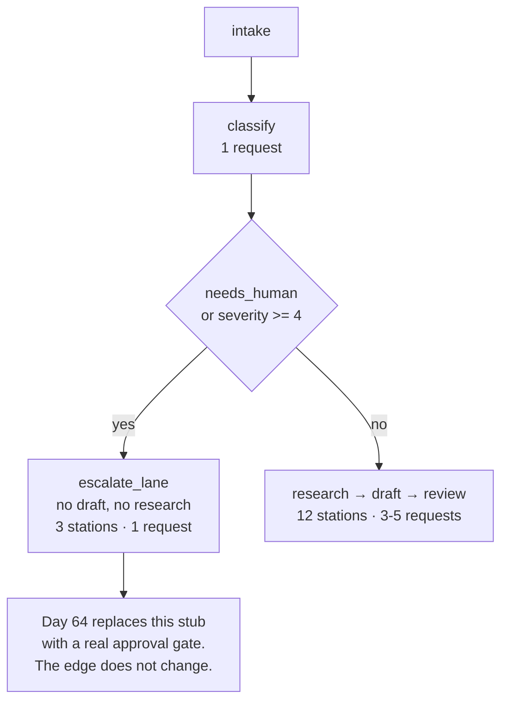

# 2.4 — The lane that declines the work

## One-line answer

Wire the escalation lane **first**, and check it **before** any expensive station runs: the most
important route in a pipeline is the one where the machine says *this is not mine to answer*, and on
this floor it costs three stations and one request instead of twelve and five.

## The story

At a bank counter you ask to withdraw a large sum in cash. The cashier types the amount, and the
screen stops them. Above a certain figure they cannot complete it, whatever they think. They get up,
walk to the desk behind, and a manager comes over with a key and a signature.

Notice when the stop happened. Not after the money was counted. Not after the notes were bundled and
the receipt was printed and the cashier had said "here you are". The stop is at the beginning,
before any of the work, because the point of the limit is not to undo a transaction — it is to
prevent one.

Notice also what the limit is not. It is not the cashier's opinion of you, and it does not depend on
whether they think the withdrawal is sensible. It is a number and a comparison. Everyone knows what
it is, including you, and it fires the same way every time.

## The idea in plain language

A pipeline that can do something must also be able to **decline** to do it, and where you put the
declining decision determines both what it costs and whether it is safe.

Two arguments say *check early*, and they are independent, which is why together they are decisive.

**Blast radius** (Principle 13). A ticket the machine flags as beyond its competence is exactly the
ticket it should not be writing a customer-facing reply about. If the escalation check runs after
the drafting loop, then by the time you decide not to send the draft, the draft exists — sitting in
state, in a log, in a trace, one careless integration away from being sent. The safest draft is the
one never written.

**Economics.** On this floor an escalated ticket costs one request and a handled one costs three to
five. If escalation is decided last, every escalated ticket costs the full five and then throws the
work away. On a twenty-request daily allowance that is not an optimisation, it is the difference
between the desk working in the afternoon and not.

The vocabulary, defined once: an **escalation lane** is a route that ends the machine's involvement
and hands the case to a person. It is a *terminal* path — nothing after it does work — and that is
what makes it different from a retry or a fallback, both of which try again in some other way.

The condition on this floor is two field comparisons on the verdict from
[2.1](2.1-a-verdict-is-a-form.md), and it is deliberately not a judgement:

- `needs_human` — the classifier said it could not decide.
- `severity >= 4` — the classifier decided, and what it decided is serious.

## Why Sutra needs it

This is the seam Phase 9 fills with a human. Day 62 teaches the four shapes a person can occupy in a
running system, Day 63 designs the policy for which actions need one, and Day 64 replaces the stub
at the end of this lane with a real approval gate that suspends the run and resumes it when somebody
answers.

The stub does not matter. **The edge does**, and it is permanent. A floor that has an escalation
route from today gets a human by changing what sits at the end of it; a floor without one gets a
human by re-wiring every path.

## The mechanism

The decision, at the end of the classifier:

```python
    hot = result.needs_human or result.severity >= 4
    route = "ESCALATE" if (hot and KNOBS.escalate_early) else "HANDLE"
```

**Line by line:**

- `hot` is computed from the two fields and nothing else. There is no keyword search, no second
  model call, no "if the notes sound urgent". A router that guesses is a second classifier, and now
  you have two things that can disagree.
- `or` rather than `and`: either condition alone escalates. The two conditions mean different things
  — *I do not know* and *I know, and it is bad* — and both are reasons to stop.
- `severity >= 4` compares against the top of the range declared in the schema. The `4` appears here
  and in `Field(ge=1, le=4)`, which is one duplication too many and is the kind of thing that should
  be a named constant; section 8 comes back to what happens when the two drift.
- `KNOBS.escalate_early` is the ablation switch: turning it off routes everything to `HANDLE` so the
  cost of *not* having this lane can be measured rather than asserted.

The lane itself:

```python
def escalate_lane(node_input: TriageResult) -> Event:
    """The honest exit: hand the case file to a human. No draft is written, and nothing is guessed."""
    return Event(
        author="escalate_lane",
        output=(
            f"ESCALATED: {node_input.category} severity {node_input.severity} "
            f"- {node_input.notes[:60]}"
        ),
        actions=EventActions(state_delta={"outcome": "escalated"}),
    )
```

**Line by line:**

- `node_input: TriageResult` — the lane receives the whole verdict, not a summary of it, so the
  person picking this up has the classifier's actual output rather than a sentence about it.
- The output is a human-readable line, because the consumer of this lane is a person. This is the one
  place on the floor where prose is the right answer, and it is right precisely because nothing
  downstream branches on it.
- `state_delta={"outcome": "escalated"}` is the machine-readable half, and it is what
  [7.1](../07-acceptance/7.1-every-part-passed.md) counts. The lane says the same thing twice, once
  for the human and once for the auditor, which is not duplication — they are two audiences.
- There is **no writer, no critic, no draft**. The station formats three fields and stops. That is
  the blast-radius argument implemented rather than described.

Now measure both lanes:

```bash
cd days/day-58-triage-graph-v1/lab
uv run python escalate.py
```

**Line by line:**

- Two tickets from the archive, one on each lane. `ticket:4562` ("two-factor codes rejected")
  classifies as `other`, so `needs_human` is true; `ticket:4610` classifies as `auth` and is handled.
- `stations` counts the events emitted, which is the number of stations that actually ran.

Measured on 2026-09-05:

```text
  ticket         route      outcome      stations  calls
  ticket:4562    other      escalated           3      1
  ticket:4610    auth       replied            12      5
```

**Three stations and one request against twelve and five.** The escalated ticket ran intake, the
classifier, and the lane. It never touched the archive index, never touched the knowledge base,
never entered the drafting loop, and produced no text that could be mistaken for a reply.

The one request it did spend is unavoidable and is the right one to spend: you cannot know whether a
ticket needs a human without reading it, and reading it is the classifier's job. What the early check
buys is that you spend **only** that one.



## When it breaks

Turn the check off and route everything to the handling lane:

```bash
uv run python escalate.py --sweep
```

**Line by line:**

- `--sweep` classifies all fifty-two tickets and tallies the routes, so the question "how wide is
  this lane?" gets a number instead of an impression.

Measured on 2026-09-05:

```text
  tickets in the archive     52
  ESCALATE                   28  (54%)
  HANDLE                     24

  category      tickets
  other           26
  billing         17
  export           4
  auth             3
  security         1
  outage           1
```

That is the break, and it is not the one this part set out to demonstrate. **Fifty-four per cent of
the archive takes the escalation lane.**

Read what that means with the cashier in mind. A limit that stops one withdrawal in fifty is a
control. A limit that stops one in two is not a control; it is the process, and the manager with the
key is now the actual cashier. Every argument this part made for the lane — that it is the exception,
that it is cheap, that it protects the expensive path — assumed the lane is narrow, and on this data
it is not.

The cause is dull and is worth tracing, because dull causes are the common ones. Twenty-six of the
twenty-eight escalations are `category == "other"`, and `other` means no rule matched. The lane is
not firing on tickets that need a human. It is firing on tickets the classifier did not understand,
and `needs_human` is doing double duty for two different facts: *this needs judgement beyond mine*
and *I could not parse this at all*. Those want different lanes and probably different people.

There is a second, quieter break in the same output. `severity >= 4` fires for exactly **two**
tickets in fifty-two — the one `security` and the one `outage`. The severity half of the condition is
carrying almost none of the load, so if you had tested the lane by writing an urgent-sounding ticket
and watching it escalate, you would have concluded the mechanism works and never discovered that in
practice it is the `other` bucket doing the routing.

[8.2](../08-in-production/8.2-a-gate-that-fires-on-half-the-traffic.md) takes this finding and asks
what to do about it.

## In production

**What a professional writes instead.** The escalation reason is recorded as a field, not inferred
from the lane. `escalated_because: "low_confidence" | "high_severity" | "policy"` costs one enum and
makes the sweep above into a dashboard: you can see the 54% split into its causes and fix the one
that is actually large. Without it, every escalation looks the same and the only available reaction
is to move the threshold.

They also make the lane's destination explicit rather than implicit. "A human" is not a destination;
a queue with a name, an owner and a service level is. The moment the lane exists somebody is
receiving its output, and if nobody has agreed to, the lane is a bin.

**What degrades at scale.** The lane fills faster than people empty it. At 54% and any real ticket
volume, the queue behind this route grows without bound, and the failure is not visible in the
pipeline at all — every run succeeds, every metric is green, and the damage is a backlog in a
different system. The instrument that catches it is queue depth and age, not anything on this floor.

**The failure mode that only appears with real traffic.** Escalation gets tuned by the wrong
feedback. The queue is full, someone raises the severity threshold from 4 to 5, the queue empties,
and everybody is pleased — and the tickets that stopped escalating did not become simpler, they
became answered by a machine that had previously said it should not. The threshold moved because of
a staffing problem and the consequence landed in customer replies. Any change to an escalation
condition needs to be reviewed as a safety change, however it was motivated.

**The review comment a senior engineer leaves:** *"The escalation check reads `severity >= 4` and the
schema says `le=4`, so this fires only on the maximum. That is fine until someone widens the range
to 5 for headroom, at which point this silently stops catching the old top severity. Name the
threshold once, next to the schema, and add a test that a severity at the declared maximum
escalates."*

**The interview question:** *"How does your pipeline decide not to answer?"* The answer that shows
you have run one: *"The classifier emits a verdict with a `needs_human` flag and a severity, and the
router compares those two fields before any expensive station runs. That ordering is deliberate on
both counts — an escalated ticket costs one model call instead of five, and more importantly no draft
is ever written for a ticket we decided we should not be answering, so there is nothing sitting in
state for an integration to send by accident. The uncomfortable part is what happened when I measured
it: fifty-four per cent of our archive took that lane, and almost all of it was the classifier's
`other` bucket rather than genuinely severe tickets. So the lane was working exactly as specified and
the specification was wrong."*

## Check yourself

```bash
cd days/day-58-triage-graph-v1/lab
uv run python escalate.py
uv run python escalate.py --sweep
```

Now open `_stations.py` and change `needs_human = category in {"security", "other"}` to
`needs_human = category == "security"`. Re-run the sweep, write down the new escalation percentage,
and then say what has happened to the twenty-six tickets the classifier does not understand.

**Out loud, without scrolling up:** give the two independent arguments for checking escalation before
the expensive stations, and state the measured cost of each lane in stations and requests.

**Next:** [3.1 — Two clerks who disagree about "similar"](../03-the-research-floor/3.1-two-clerks-who-disagree.md).
