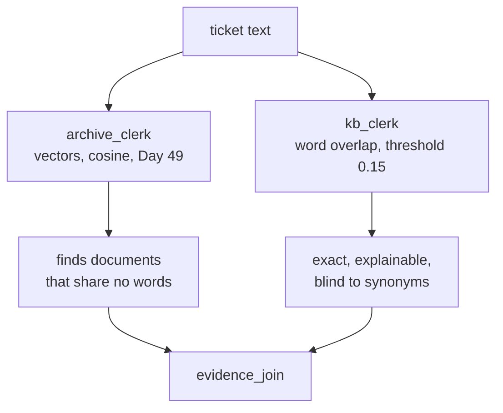

# 3.1 — Two clerks who disagree about "similar"

## One-line answer

The research floor runs **two different searches on purpose** — one by meaning over the ticket
archive, one by words over the knowledge base — because the two corpora are different in kind, and
measuring both reveals that one clerk finds something 100% of the time and the other 8%.

## The story

You go to a library looking for a book about how to keep a small vegetable garden alive through a
hot summer.

There are two ways to find it, and the library supports both. One is the catalogue: you type words
and it matches them against titles. If the book is called *Summer Vegetable Gardening* you find it
in five seconds. If it is called *Beating the Heat: A Practical Guide for Small Plots*, the
catalogue has nothing for you, because you searched for the words you would use and the author used
different ones.

The other way is the librarian. You describe what you want and they think for a moment and walk you
to a shelf. They are not matching words; they know what the books are *about*. They will find
*Beating the Heat*. They will also, on a bad day, confidently hand you something adjacent and
slightly wrong, because "about the same thing" is a judgement and they have made one.

A library that only had the catalogue would fail you on every book with a clever title. A library
where you had to ask the librarian for everything, including a book whose exact title you already
knew, would be slower and worse.

## The idea in plain language

This floor searches two different bodies of text, and they are different in ways that decide the
tool.

The **ticket archive** is fifty-two past tickets, written by different support agents, in whatever
words the customer happened to use. There is no controlled vocabulary. A customer says "keeps
logging me out", the ticket says "signed out mid-form", and the knowledge base says "unexpected
sign-outs". Matching words across that gap does not work, which is the entire reason Day 49 built a
vector index and Day 50 tuned it. This clerk searches by **meaning**.

The **knowledge base** is five articles, written by the desk, to a house style, using the desk's own
vocabulary deliberately and consistently. It is small, curated and controlled. This is exactly the
corpus where matching words is the *right* tool, and reaching for embeddings would be Day 50's "when
RAG is the wrong tool" made concrete. This clerk searches by **words**.

Two terms, defined here because both clerks are named after them:

- **Retrieval by meaning** — every document and the query are turned into vectors, and the closest
  vectors win. It finds documents that share no words with the query. Day 49 built this by hand;
  Day 50 tuned the chunk size and the `k`.
- **Retrieval by words** — the overlap between the words in the query and the words in the document.
  Exact, explainable, instant, and blind to synonyms.

The design claim is not "meaning is better". It is that **the corpus chooses the tool**, and a floor
with two different corpora should honestly have two different clerks.

## Why Sutra needs it

Phase 7's whole promise was that the desk could answer *"have we seen anything like this before?"*.
This is where that promise is spent: the archive clerk is the only station on this floor that makes
the phase's investment pay, and its result is what the drafter cites.

It is also where Day 50's tuning lands in a running system rather than a benchmark. The `k`, the
chunk size and the similarity floor argued for on Day 50 are the constants this clerk uses, and
[8.1](../08-in-production/8.1-the-green-run-that-helped-nobody.md) is what happens when one of them
is missing.

## The paper behind it

> **Retrieval-Augmented Generation for Knowledge-Intensive NLP Tasks**
> arXiv:2005.11401 (2020) · <https://arxiv.org/abs/2005.11401>

It proposed putting a retriever in front of a generator so the model writes from documents fetched
at query time rather than from what it memorised in training.

Taught in
[Day 49 — Retrieval-Augmented Generation](../../../day-49-retrieval-and-embeddings/papers/02-retrieval-augmented-generation.md).
Both clerks on this floor are the retrieval half of that arrangement, and the writer in
[4.1](../04-the-box/4.1-the-newsroom-drops-in-as-one-node.md) is the generation half. The reason
this part is measured rather than assumed is that the paper's arrangement is only as good as what
the retriever hands over, and this floor has two retrievers with wildly different hit rates.

## The mechanism

The clerk that searches by meaning:

```python
def archive_clerk(node_input: TriageResult, ref: str = "", ticket_text: str = "") -> Event:
    """Evidence branch 1: 'have we seen this before?', answered by Day 49's index. No model call."""
    hits = [
        found
        for _, found in search(_INDEX, ticket_text, k=3, floor=0.05)
        if not found.startswith(ref)
    ][:2]
    return Event(
        author="archive_clerk",
        output=hits,
        actions=EventActions(state_delta={"archive_hits": hits}),
    )
```

**Line by line:**

- `node_input: TriageResult` is the baton, and the clerk barely uses it. What it actually needs is
  the ticket's *text*, which arrives as `ticket_text` from session state — that split is
  [5.2](../05-the-graph/5.2-on-the-edge-or-in-the-register.md)'s subject and it is the reason this
  signature looks odd at first.
- `search(_INDEX, ticket_text, k=3, floor=0.05)` is Day 49's function with Day 50's knobs. `k=3`
  fetches three candidates; `floor=0.05` discards anything below a similarity of 0.05.
- `if not found.startswith(ref)` drops the ticket itself. Without it the top hit for every query is
  the query's own document, at a similarity of 1.0, which is true and useless. This one line is the
  difference between "similar tickets" and "this ticket".
- `[:2]` takes two after the filter rather than before, so removing the self-match does not silently
  leave you with one result.
- `state_delta={"archive_hits": hits}` records what was found in the case file, so
  [6.2](../06-the-run/6.2-state-is-the-case-file.md) can answer *what evidence did this run have?*
  after the fact.
- No `METER.spend`. This station does real retrieval over a real index and costs **zero** requests,
  which is [1.1](../01-the-floor/1.1-ten-stations-two-of-which-think.md)'s ratio in action.

The clerk that searches by words:

```python
def kb_clerk(node_input: TriageResult, ticket_text: str = "") -> Event:
    """Evidence branch 2: the knowledge base, matched on words rather than meaning."""
    words = set(re.findall(r"[a-z]{4,}", ticket_text.lower()))
    scored = []
    for candidate, text in _KB.items():
        kb_words = set(re.findall(r"[a-z]{4,}", text.lower()))
        scored.append((len(words & kb_words) / len(kb_words), candidate))
    scored.sort(reverse=True)
    hits = [candidate for score, candidate in scored[:1] if score >= 0.15]
```

**Line by line:**

- `[a-z]{4,}` keeps words of four letters or more, which throws away `the`, `and`, `is` and `on`
  without needing a stop-word list. Crude, and adequate for five articles.
- `set(...)` on both sides makes this about *which* words appear, not how often. For a five-article
  corpus that is the right simplification; for a large one it is not, and Day 49's tf-idf weighting
  is the reason why.
- `len(words & kb_words) / len(kb_words)` divides by the **article's** word count, not the ticket's.
  That choice matters: dividing by the ticket would let the longest article in the knowledge base
  win every query it is vaguely near, because a long document overlaps everything.
- `scored.sort(reverse=True)` sorts tuples, so it sorts by score first. It works because the score
  is the first element, which is the sort of thing that is obvious until somebody adds a field.
- `scored[:1] if score >= 0.15` takes at most one article, and only if it clears a threshold. That
  threshold is the abstention Day 50 part 4.1 argued for — the ability to return **nothing** — and
  the next section is about how often it fires.

Run both on four tickets:

```bash
cd days/day-58-triage-graph-v1/lab
uv run python clerks.py
```

**Line by line:**

- It calls the two clerk functions directly rather than driving the graph, because the question is
  about retrieval quality and the graph would only add noise.
- Four tickets: the founding ticket, the one it is really about, a different problem, and a billing
  ticket.

Measured on 2026-09-05:

```text
  ticket:4521  Ticket 4521. Keeps getting logged out. The customer is sig...
    archive (meaning)  ['ticket:4610#0', 'ticket:4568#0']
    kb      (words)    -

  ticket:4610  Ticket 4610. Signed out mid-form. The customer fills the l...
    archive (meaning)  ['ticket:4633#0', 'ticket:4701#0']
    kb      (words)    ['kb:KB-104']

  ticket:4633  Ticket 4633. Password reset link says expired. The custome...
    archive (meaning)  ['ticket:4610#0', 'ticket:4701#0']
    kb      (words)    ['kb:KB-311']

  ticket:4509  Ticket 4509. Charged twice in one month. Two identical cha...
    archive (meaning)  ['ticket:4581#0', 'ticket:4645#0']
    kb      (words)    -
```

The first row is Phase 7 paying off. Ticket 4521 says *"keeps getting logged out"*. Ticket 4610 says
*"signed out mid-form"* and contains the actual fix. **They share almost no words**, and the archive
clerk found it anyway. That is the entire argument for Day 49's index, running inside a pipeline
rather than inside a benchmark.

The same row is also the first sign of trouble, and it takes a moment to see. Ticket 4521 is about
unexpected sign-outs. KB-104 is *titled* "Unexpected sign-outs". The knowledge-base clerk found
nothing.



## When it breaks

Ask how often each clerk finds anything at all:

```bash
uv run python clerks.py --sweep
```

**Line by line:**

- `--sweep` runs both clerks over all fifty-two tickets and counts non-empty results. It is four
  counters and no cleverness, which is what makes it trustworthy.

Measured on 2026-09-05:

```text
  tickets                    52
  archive clerk found something   52  (100%)
  kb clerk found something         4  (8%)
  both                             4
  neither                          0
```

Both numbers are wrong, in opposite directions, and they are the two classic retrieval failures
sitting side by side in one table.

**The knowledge-base clerk finds an article for four tickets in fifty-two.** Not because the
knowledge base is irrelevant — KB-104 is precisely the answer to a whole family of sign-out tickets
— but because customers do not write in the desk's vocabulary. The clerk is working exactly as
specified and is very nearly useless, and the day it matters is
[8.1](../08-in-production/8.1-the-green-run-that-helped-nobody.md), where a reply goes out citing
nothing.

**The archive clerk finds something for all fifty-two.** That is not a success. Day 50 part 4.1 put
it exactly: *cosine never says it does not know.* With a floor of `0.05` — which is barely above
zero — every query has a nearest neighbour, so a billing ticket and a printer question both come
back with two confident-looking references. The clerk has no way of reporting *nothing in this
archive is about your problem*, and the drafter downstream cannot tell a strong match from a shrug.

Look again at the fourth row above with that in mind. Ticket 4509 is *"charged twice in one month"*,
and the clerk returned `ticket:4581` and `ticket:4645`. They may be relevant. Nothing in the output
says how relevant, because the similarity score was thrown away by the list comprehension.

That is the real defect in this station and it is one line long: `for _, found in search(...)`
discards the score. Day 50 spent four parts arguing for a similarity floor and this station keeps the
floor but drops the number, so no downstream station and no case file entry can distinguish a match
at 0.4 from a match at 0.06.

## In production

**What a professional writes instead.** The evidence carries its score. `[("ticket:4610", 0.41)]`
rather than `["ticket:4610"]`, so the drafter can be instructed to cite strong matches and mention
weak ones as "possibly related", the case file records how confident the retrieval was, and a
regression in retrieval quality shows up as a distribution shifting rather than as a complaint.

They also stop hand-rolling the second clerk. Word overlap normalised by document length is BM25
with the interesting parts removed, and every real search engine ships BM25. The reason to keep the
hand-rolled version here is Principle 4 — build it once so the library is a convenience rather than
a mystery — and the reason to replace it in production is that the library handles the term
weighting this version cannot.

The production shape of this floor is usually **hybrid**: run both retrievers over both corpora, then
merge the two ranked lists. Day 50's production part names the technique. The pipeline change is
small; the honest part is that you cannot merge two ranked lists without scores, which is the defect
above.

**What degrades at scale.** The archive clerk's index is rebuilt at import (`_INDEX = build_index(...)`)
and lives in one process's memory. That is fine for fifty-two documents and wrong for fifty thousand
in two ways: the rebuild becomes a startup cost every worker pays, and the index goes stale the
moment a ticket is added. Production moves it to a vector store that is written on ingest and read
on query, at which point *retrieval freshness* becomes a thing to monitor and the pipeline can serve
a customer an answer based on an index from Tuesday.

**The failure mode that only appears with real traffic.** The 8% is invisible in a demo and obvious
in aggregate. Every individual run looks fine — a reply went out, the critic approved it — and the
missing citation is only a problem when you count. A retrieval hit rate on a dashboard is worth more
than any number of sampled outputs, because sampled outputs are read by a person who already knows
what the answer should be.

**The review comment a senior engineer leaves:** *"The archive clerk throws the score away. That
means the floor of 0.05 is the only quality signal in the system and it is applied inside the clerk
where nobody can see it, and it means we cannot ever do hybrid ranking because we have nothing to
merge on. Return the scores and let the caller decide."*

**The interview question:** *"How do you know your retrieval is working?"* The answer that shows you
have measured rather than assumed: *"We run two retrievers over two corpora — embeddings over the
ticket archive because customers and agents use different words for the same failure, and word
overlap over the knowledge base because it is five curated articles written in one controlled
vocabulary. When I measured them across our archive, the word-based one returned an article for 8% of
tickets and the embedding one returned something for 100%. Both of those are failures. The first is
vocabulary mismatch and the fix is hybrid retrieval. The second is that cosine similarity always has
a nearest neighbour, so with a low floor it can never abstain, and the station was discarding the
score so nothing downstream could tell a real match from a shrug."*

## Check yourself

```bash
cd days/day-58-triage-graph-v1/lab
uv run python clerks.py
uv run python clerks.py --sweep
```

Now lower the knowledge-base threshold from `0.15` to `0.05` in `_stations.py` and re-run the sweep.
Write down the new hit rate, then read the articles it started returning for billing tickets and
decide whether you have fixed the recall problem or bought it with precision.

**Out loud, without scrolling up:** say why the two clerks use different retrieval methods, and give
the two opposite failures the sweep measured.

**Next:** [3.2 — The join hands over a dict keyed by node name](3.2-the-join-hands-over-a-dict.md).
