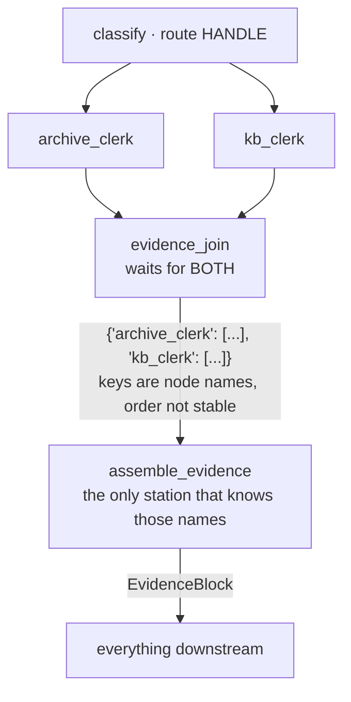

# 3.2 — The join hands over a dict keyed by node name

## One-line answer

A `JoinNode` waits for every branch that feeds it and hands its successor a **dictionary keyed by
the branch nodes' names** — which is the one undeclared seam on this floor, so exactly one station
exists to turn it into a declared type before anything else sees it.

## The story

At the end of a school term the class teacher has to produce one report card. She cannot write it
until every subject teacher has sent their piece: the maths mark, the science mark, the games
comment, the attendance figure. Six people, six slips of paper, arriving on six different afternoons.

She does not start when the first slip arrives. She waits until all six are in, and then she sits
down once and fills in the card.

Look at what is on her desk in the meantime: a pile of slips, each with the subject teacher's name at
the top. That pile is not a report card. It is *raw material organised by who sent it*, and the
whole job of the next hour is turning "six slips filed by author" into "one card organised by what
the parents need to read".

If she photocopied the pile and sent that home instead, every parent would receive something
technically complete and unreadable, and every parent would have to learn the staff list.

## The idea in plain language

The research floor is a **fan-out** followed by a **fan-in**.

- A **fan-out** is one station's route reaching more than one successor, so several branches run.
  Here `classify`'s `HANDLE` route goes to both clerks.
- A **fan-in** is where those branches come back together. In ADK that is a `JoinNode`, and the
  adk.dev routes page, fetched 2026-09-05, describes it exactly: *"A `JoinNode` is the fan-in
  barrier. This logic mechanism waits for every predecessor task to complete, and then passes its
  successor a record keyed by predecessor node name."*

Two consequences follow from that sentence and both matter.

**It waits for every predecessor.** Not the first, not a quorum — every one. That is what makes it a
barrier, and it is what makes the failure in this part's last section possible.

**The record is keyed by node name.** Not by branch order, not by a name you chose: by the
`__name__` of the function or the `name=` of the node. So the successor's input shape is coupled to
what your functions happen to be called, which is a coupling nobody chose and everybody inherits.

That second consequence is why this floor has a station whose only job is translation.
[1.2](../01-the-floor/1.2-the-baton-has-a-declared-shape.md) listed six seams and noted that exactly
one of them — the join's output — is a plain `dict` rather than a declared type. `assemble_evidence`
is the station that fixes that, in one place, so that renaming a clerk is a one-line change instead
of a search across the floor.

## Why Sutra needs it

Everything after the research floor reads evidence: the writer cites it, the critic checks the
citation against it, the case file stores it. If each of those read the join's dictionary directly,
then `kb_clerk` becoming `knowledge_base_clerk` would be a four-file change with no compiler to catch
the ones you missed.

It is also the seam that [6.4](../06-the-run/6.4-the-seam-that-drifted.md) breaks on purpose,
because the join is where a pipeline's failures most enjoy moving away from their cause.

## The mechanism

The wiring, which is three ordinary edges and one node:

```python
edges = [
    (classify, {"ESCALATE": escalate_lane, "HANDLE": (archive_clerk, kb_clerk)}),
    (archive_clerk, evidence_join),
    (kb_clerk, evidence_join),
    (evidence_join, assemble_evidence, draft_review_box, finalize),
]
```

**Line by line:**

- `"HANDLE": (archive_clerk, kb_clerk)` is the fan-out. One route, two successors, expressed as a
  tuple. Both clerks run.
- The next two lines are the fan-in, and note that they are **two separate edges into the same
  object**. This is the thing an agent tree could not express and a graph can — Day 53's trap #1
  argument, showing up as two lines that look unremarkable.
- `evidence_join` is a `JoinNode(name="evidence_join")`, declared once at module level. It is a node
  with no body; the waiting is the behaviour.
- The last line is a chain, which is sugar for three more edges. The join's successor is
  `assemble_evidence`, and nothing else is allowed to be, which is what makes the translation
  mandatory rather than conventional.

The translation station:

```python
def assemble_evidence(node_input: dict, ref: str = "") -> Event:
    """Adapter station: turn the join's dict into the declared baton. No model call."""
    if KNOBS.drift_baton:
        return Event(author="assemble_evidence", output=node_input)
    block = EvidenceBlock(
        ref=ref,
        archive=list(node_input.get("archive_clerk") or []),
        kb=list(node_input.get("kb_clerk") or []),
    )
    return Event(
        author="assemble_evidence",
        output=block,
        actions=EventActions(state_delta={"evidence": block.model_dump()}),
    )
```

**Line by line:**

- `node_input: dict` is annotated as a plain `dict` and that is deliberate, not laziness. The
  incoming shape genuinely is a dictionary whose keys are node names, and annotating it as something
  else would be a lie the runtime would then try to enforce.
- The two string literals `"archive_clerk"` and `"kb_clerk"` are the coupling to function names, and
  they appear **exactly here**. That is the whole point of the station: one place to update, one
  place to grep.
- `node_input.get(...) or []` handles two different absences with one expression — the key missing
  entirely, and the key present with a value of `None`. A branch that ran and found nothing and a
  branch that did not run look the same to this line, which is convenient and is also the seed of
  the failure below.
- `list(...)` copies rather than aliasing, so a later station mutating the evidence cannot reach back
  into the join's record.
- `EvidenceBlock(...)` is where the undeclared becomes declared. From this line onward, every station
  downstream has a typed object with named fields and no knowledge of the research floor's staffing.
- `state_delta={"evidence": block.model_dump()}` puts the evidence in the case file as data rather
  than as an object, because state is serialised and Day 61 will be checkpointing it.
- `KNOBS.drift_baton` is the ablation: return the raw dict and skip the translation, which is
  [6.4](../06-the-run/6.4-the-seam-that-drifted.md).

Watch the four stations of the research floor in sequence:

```bash
cd days/day-58-triage-graph-v1/lab
uv run python join.py
```

**Line by line:**

- It drives the whole graph on `ticket:4610` and filters the event stream down to the four stations
  that make up the research floor, printing each one's output type alongside its value.
- The type column is the point. It is the only way to see a `dict` becoming an `EvidenceBlock`.

Measured on 2026-09-05:

```text
  archive_clerk        list           ['ticket:4633#0', 'ticket:4701#0']
  kb_clerk             list           ['kb:KB-104']
  evidence_join        dict           {'kb_clerk': ['kb:KB-104'], 'archive_clerk': ['ticket:4633#0', 'ticket:4701#0']}
  assemble_evidence    EvidenceBlock  EvidenceBlock(ref='ticket:4610', archive=['ticket:4633#0', 'ticket:4701#0'], kb=['kb:KB-104'])
```

Read the third line carefully. The keys are `kb_clerk` and `archive_clerk` — the function names,
exactly as the documentation says. And note the **order**: `kb_clerk` appears first, although
`archive_clerk` is declared first in the edge list and printed first in the stream.

That ordering is not stable and must not be relied on. The two branches run concurrently, and the
dictionary is built as they complete. Day 54 measured this directly on parallel branches and found
the completion order varying across processes. Anything on this floor that iterated the join's
dictionary in order — taking "the first result" — would work all afternoon and produce a different
answer on a colleague's machine.

`assemble_evidence` is immune to that by construction, because it reads by key. That is a second
reason for the translation station, and it is the one that bites in production rather than in review.



## When it breaks

The adk.dev routes page, fetched on 2026-09-05, gives the warning in one sentence and it is worth
quoting because it describes a debugging session rather than an API:

> *"A predecessor that finishes without an output leaves the join with no value for that branch, and
> the resulting failure appears downstream, away from the node that caused it."*

That is the join's characteristic failure, and it has two flavours.

**The branch that produced nothing.** If `kb_clerk` returned an event with no output at all, the
join still fires — it waits for *completion*, not for a value — and the record has a key with
nothing behind it. `assemble_evidence`'s `or []` turns that into an empty list and the run continues
with silently less evidence. A reply goes out citing nothing, and the station that failed is two
stations back and reported success.

**The branch that never ran.** This is the sharper one, and Day 53's part 5.2 measured it: a join
reached down a route that triggers only one of its predecessors never fires at all, *and there is no
warning*. Everything downstream is skipped. The run exits 0 having emitted a handful of events. On
this floor the protection is structural — the `HANDLE` route fans out to both clerks, so either both
run or neither does — and that is not a coincidence, it is why the fan-out is written as one route to
a tuple rather than as two separately-routed edges.

The framework does give you a tool for the first flavour, and the same documentation page names it:

> *"Make sure that every node that feeds a join has an output of its own, and attach a retry
> configuration to any node that can fail."*

`RetryConfig` on a node is [8.3](../08-in-production/8.3-thirty-nodes-a-queue-and-a-timeout.md)'s
subject. The reason it belongs in a conversation about joins rather than in a general section on
resilience is exactly this: on a linear chain, a station that dies stops the run loudly, and on a
join it hands you a quiet hole.

## In production

**What a professional writes instead.** The adapter records **which branches reported**, not just
what they said. An `EvidenceBlock` in production carries something like
`sources_consulted: ["archive", "kb"]` alongside the results, so an empty `kb` list can be
distinguished from a `kb_clerk` that fell over. Without that field, "we searched and found nothing"
and "we did not search" are the same value, and only one of them should let a reply go out.

They also give the join's successor a **schema** rather than relying on a hand-written adapter.
`Workflow` and every node accept `input_schema`, so `assemble_evidence` can declare what it expects
and get the validation for free — at which point a renamed clerk fails at the seam with the message
[1.2](../01-the-floor/1.2-the-baton-has-a-declared-shape.md) showed, instead of producing an
`EvidenceBlock` with two empty lists.

**What degrades at scale.** Two branches is a join; ten is a barrier, and a barrier runs at the speed
of its slowest member. That is Day 44's tail-latency argument arriving in a new place: with ten
evidence branches, the run's latency is the maximum of ten, not the average, so one slow retriever
sets the pace for everything. The production answer is usually a deadline on the join rather than on
the branches — take what has arrived when time is up and record which sources were missing — which is
only possible if you have the `sources_consulted` field above.

**The failure mode that only appears with real traffic.** Key drift. Somebody refactors `kb_clerk`
into a shared helper and the node ends up named `search_kb`, or somebody wraps it with `node(...,
name=...)` for clarity. The graph still validates. The join still fires. `assemble_evidence` looks
up `"kb_clerk"`, finds nothing, and returns an empty list. Every run succeeds and the desk quietly
stops citing knowledge-base articles, and because [3.1](3.1-two-clerks-who-disagree.md) measured that
clerk at 8% anyway, nobody notices the difference between 8% and zero.

**The review comment a senior engineer leaves:** *"These string keys are node names, so this adapter
breaks silently when someone renames a function — and the failure is an empty list rather than an
exception. Either take the names from the node objects themselves rather than from literals, or add
a test that asserts both keys are present in the join's record for a handled ticket."*

**The interview question:** *"You fan out to several sources and merge the results. What does the
merge actually receive?"* The answer that shows you have wired one: *"A dictionary keyed by the
predecessor nodes' names, and the key order follows completion, not declaration, so it is not stable
across processes. Two things follow. First, exactly one station reads those keys and converts the
dictionary into a declared type, because otherwise the function names become an interface for
everything downstream. Second, the join waits for completion rather than for a value, so a branch
that finishes without producing anything leaves a hole that surfaces two stations later — we put a
retry policy on the fallible branches and record which sources actually reported, so 'searched and
found nothing' and 'never searched' are different values."*

## Check yourself

```bash
cd days/day-58-triage-graph-v1/lab
uv run python join.py
```

Now rename `kb_clerk` to `knowledge_base_clerk` in `_stations.py` — the function and its two
references in the edge list, but **not** the string in `assemble_evidence` — and run `join.py` again.
Write down what the `EvidenceBlock` contains, whether anything raised, and what the reply would have
cited.

**Out loud, without scrolling up:** describe what a `JoinNode` hands its successor and what its keys
are, and give the reason exactly one station on this floor is allowed to know those keys.

**Next:** [3.3 — What a lane costs](3.3-what-a-lane-costs.md).
