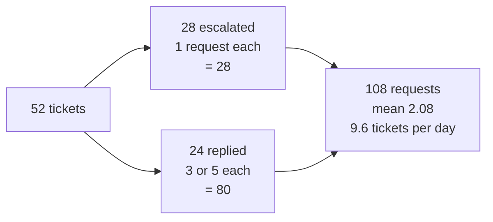

# 3.3 — What a lane costs

## One-line answer

A pipeline's price is **not a property of the code, it is a property of the path a ticket took**, so
the honest unit of cost is the lane — and on this floor the four lanes cost 0, 1, 3 and 5 requests,
which averages to 2.08 across the archive and puts the desk's capacity at under ten tickets a day.

## The story

An auto-rickshaw driver in a city with fixed route fares knows what every trip costs before anyone
gets in. Station to the market is one price. Station to the hospital is another. Station to the
airport is a third, and it is not three times the market fare because it is three times the distance
— it is a different number that everyone has agreed on.

Ask the driver "what does a trip cost?" and the question has no answer. Ask "what does the airport
trip cost?" and the answer is instant and exact.

A person budgeting for the month does not use an average trip. They count: two market trips a week,
one hospital trip a month, the airport twice a year. The average trip fare is a number that describes
nothing anybody ever pays.

## The idea in plain language

By this point the floor has four distinct paths through it, and each one ends somewhere different:

- **Not found** — the reference names nothing. Ends after `no_such_ticket`.
- **Escalated** — the classifier said a human is needed. Ends after `escalate_lane`.
- **Replied, no revision** — the critic approved the first draft.
- **Replied, one revision** — the critic sent it back once, then approved.

These are **lanes**, and they are the right unit for talking about cost for one reason: within a
lane the price is fixed, and between lanes it varies by a factor of five. Any single number that
covers all four is describing a ticket nobody sent.

There is a second reason, and it is the one that makes this a `production` part rather than an
arithmetic exercise. **The distribution across lanes is a property of your traffic, not of your
code.** You can read the code and derive the price of each lane exactly. You cannot read the code and
derive what it will cost tomorrow, because that depends on what kind of tickets arrive — and that
number moves without anybody deploying anything.

## Why Sutra needs it

[1.1](../01-the-floor/1.1-ten-stations-two-of-which-think.md) gave the headline: twenty requests a
day, 2.08 per ticket, nine or ten tickets. This part is where that 2.08 comes from, and where it
stops being a single number and becomes something you can act on.

Day 70's Quota-Router needs exactly this table. A router that moves work between providers has to
know what a unit of work costs before it can decide anything, and "a ticket costs about two
requests" is not a basis for a routing decision when the actual figure is anywhere between zero and
five.

## The mechanism

```python
SAMPLES = {
    "not found": "8842",
    "escalated": "ticket:4562",
    "replied, no revision": "ticket:4521",
    "replied, one revision": "ticket:4610",
}
```

**Line by line:**

- Four real references from the archive, one per lane, chosen because each *actually* takes that
  lane rather than because it is convenient. `8842` is genuinely absent; `4562` genuinely classifies
  as `other`; `4521` and `4610` genuinely differ in whether the critic sends the draft back.
- Naming the lane in the key rather than in a comment means the output table is self-labelling, which
  matters because this table is meant to be pasted into a design document.

The measurement itself is two loops:

```python
    for label, ref in SAMPLES.items():
        run = drive(graph, ref)
        breakdown = ", ".join(f"{k}={v}" for k, v in sorted(run.calls.items())) or "-"
        print(f"  {label:24} {len(run.events):>8} {run.total_calls:>6}  {breakdown}")
```

**Line by line:**

- `drive(graph, ref)` runs the whole graph from a clean session and returns the events, the final
  state and the meter. One run per lane; nothing is estimated.
- `run.calls` is the per-station counter from `METER`, not a total. Counting per station is what
  makes the breakdown column possible, and the breakdown is what turns "5 requests" into "the loop
  went round twice".
- `len(run.events)` is the station count. It is a useful second column because it separates two
  different kinds of expense: stations are latency and complexity, requests are quota.
- `sorted(...)` makes the breakdown deterministic, so the table does not reorder itself between runs
  and create noise in a diff.

Run it:

```bash
cd days/day-58-triage-graph-v1/lab
uv run python price.py
```

**Line by line:**

- The first block prices the four lanes from one run each.
- The second block drives **every ticket in the archive** through the graph and tallies where they
  ended up and what they cost in total. That is fifty-two full runs, and it is affordable because
  the meter counts rather than calls.

Measured on 2026-09-05:

```text
  lane                     stations  calls  breakdown
  not found                       2      0  -
  escalated                       3      1  classify=1
  replied, no revision           10      3  classify=1, critic=1, writer=1
  replied, one revision          12      5  classify=1, critic=2, writer=2

  whole archive (52 tickets)
    escalated     28
    replied       24
    model calls  108   mean 2.08 per ticket
```

The top table is the fare card, and every row is worth reading as a sentence.

**Zero for a request that names nothing.** That is [1.3](../01-the-floor/1.3-one-station-decides-what-is-real.md)'s
mouth, priced. Not "cheap" — zero. The floor cannot spend a request on a ticket it never accepted.

**One for an escalation**, and the one is the classifier, which is unavoidable: deciding whether a
human is needed requires reading the ticket. Two stations and four requests separate this row from
the row below it, and that gap is the whole argument of
[2.4](../02-the-guess/2.4-the-lane-that-declines-the-work.md).

**Three for a clean reply**, and look at the breakdown: `classify=1, writer=1, critic=1`. The
research floor — two clerks, a join and an adapter, four of the ten stations — contributes **zero**.
The most expensive-sounding part of a retrieval-augmented pipeline is free, because retrieval is
arithmetic.

**Five for a revised reply**, and the breakdown says why in four characters: `writer=2, critic=2`.
One trip around the loop in [4.2](../04-the-box/4.2-the-brake-belongs-to-the-critic.md) costs two
requests, which is 40% of that lane's price for one round.

The bottom block is the part that changes decisions. **108 requests for 52 tickets, a mean of 2.08.**
Against a free tier of twenty a day, that is 9.6 tickets — and the whole archive, run once, is 5.4
days of allowance.

Notice how the mean is built, because it is not what it looks like. Twenty-eight of the fifty-two
tickets escalated at one request each; twenty-four were replied to at three or five. The mean of
2.08 sits between two clusters and describes neither. If your escalation rate changes — and
[2.4](../02-the-guess/2.4-the-lane-that-declines-the-work.md) argues it is 54% for the wrong reasons
— that mean moves without a line of code changing.



## When it breaks

The break here is not an exception, it is an arithmetic mistake that everyone makes once: **budgeting
with the mean.**

Suppose you take 2.08 and plan for nine tickets a day. Now suppose Monday brings nine tickets that
all happen to be answerable — no escalations, and three of them get revised. The cost is
`6 × 3 + 3 × 5 = 33` requests against an allowance of twenty. The desk stops working at lunchtime,
having handled six tickets, on a day when nothing was unusual and nothing was broken.

The mean was correct and the plan built on it was wrong, because the mean was dominated by the cheap
lane and the expensive lane is the one that does the work. A budget wants the *worst realistic case*
per unit — five here — and a capacity figure derived from it: four answered tickets a day, guaranteed,
rather than nine on average.

There is a second break with a real error behind it, and it is what actually happens when the
arithmetic is ignored. The allowance runs out mid-run, and it does not run out politely at a station
boundary:

```text
429 RESOURCE_EXHAUSTED: You exceeded your current quota.
Please retry in ~53s
```

If that arrives at the writer on the second round, the run has already spent four requests: one on
the classifier, two on the first writer-critic round, one on the second writer. Those four are gone.
The ticket has no reply. The case file records a run that got as far as a draft and stopped. A
partially-spent run is the most expensive kind of failure there is, which is
[8.3](../08-in-production/8.3-thirty-nodes-a-queue-and-a-timeout.md)'s argument for checking the
budget *before* entering the loop rather than discovering it inside.

## In production

**What a professional writes instead.** Cost is a field in the case file, not a number in a document.
Every run records `requests_spent` and the per-station breakdown, so the fare card above is generated
from last week's traffic rather than from four hand-picked samples. That matters because the sample
is the weakest part of this measurement: I chose `ticket:4610` because I knew it revises once, and
nothing guarantees it is typical.

They also budget in the unit the provider bills in, which is usually **tokens as well as requests**.
This project's free tier is request-counted, so requests are the currency here — but the moment a
paid tier appears, a five-request run with a long retrieved context costs many times a five-request
run without one, and a request counter will report them as identical. Day 24 built the token
accounting; this is where the two meet.

**What degrades at scale.** The distribution shifts under you. A marketing campaign brings a wave of
one kind of ticket, the classifier handles them all confidently, the escalation rate drops from 54%
to 10%, and the mean cost per ticket nearly doubles — with no deploy, no incident and no code change.
Cost per unit of work is a *traffic* metric, and it belongs on the same dashboard as volume rather
than in a design document that was accurate the day it was written.

**The failure mode that only appears with real traffic.** Retries are invisible in a table like this
one. The meter counts calls the pipeline *intended* to make; a call that got a 429 and succeeded on
the second attempt is one intention and two requests against the allowance. Day 54 measured exactly
this on a loop and found nine calls behind six events. Any cost model built on application-level
counters understates the bill, and the only counter that does not lie is the one at the provider —
which is the gauge Day 70 goes and reads.

**The review comment a senior engineer leaves:** *"This budget uses the mean. Our cheap lane is 54%
of traffic and costs one request, so the mean is mostly telling us how often we decline work. Give me
the p95 cost per ticket and the capacity that follows from it, and put a hard cap in the run so a
pathological ticket cannot spend fifteen."*

**The interview question:** *"What does one unit of work cost in your system?"* The answer that shows
you have run it: *"It depends on the lane, and that is the point. A request naming a ticket that does
not exist costs zero because we validate before anything expensive. An escalation costs one — just
the classifier. A reply costs three, and five if the critic sends the draft back once, because a
round of that loop is two calls. Across our fifty-two ticket archive the mean is 2.08, but I do not
budget with the mean: 54% of tickets take the one-request lane and drag it down, so I plan with the
five-request case. That is the difference between claiming ten tickets a day on a twenty-request free
tier and honestly promising four."*

## Check yourself

```bash
cd days/day-58-triage-graph-v1/lab
uv run python price.py
```

Now set `KNOBS.brake` to `1` in `_stations.py` and run `price.py` again. Write down what happened to
the total for the archive, and then decide whether what you just did was a cost saving or a quality
cut — and how you would tell the difference from the numbers alone.

**Out loud, without scrolling up:** give the price of each of the four lanes, and explain why
budgeting with the mean of 2.08 would have the desk stop working at lunchtime.

**Next:** [4.1 — The newsroom drops in as one node](../04-the-box/4.1-the-newsroom-drops-in-as-one-node.md).
