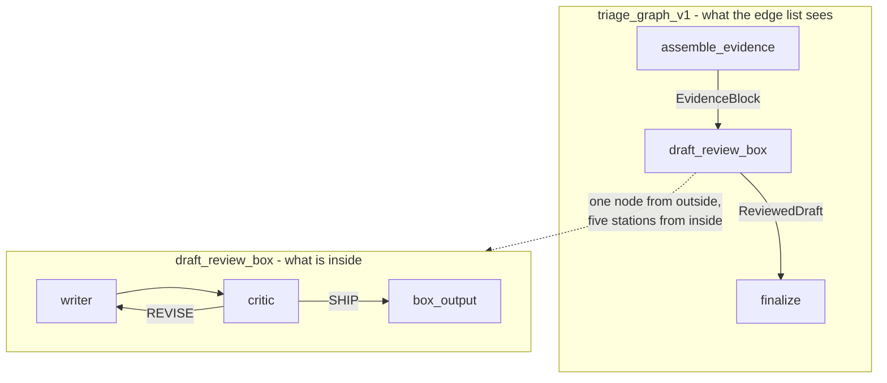

# 4.1 — The newsroom drops in as one node

## One-line answer

A whole `Workflow` is itself a node, so the writer-and-critic loop is **one station from outside and
a five-station graph from inside**, and the floor's edge list neither knows nor can reach into what
happens in there.

## The story

At the end of a school exam, the papers go into a room to be marked. The door is closed.

Inside that room there is a whole process. A marker reads a script and puts a number on it. A second
marker checks a sample. A borderline script goes to a third person. There is an argument about
question four. Somebody makes a note about a candidate whose handwriting is illegible and it goes
round again.

None of that is visible from the corridor. What comes out of the room is a list: candidate number,
grade. The office that publishes the results does not know how many people looked at a script, or
whether there was an argument, and it does not need to. It needs the list, and it needs to be able to
say the list came from the marking process.

The value of the closed door is not secrecy. It is that the marking process can be changed — a third
marker added, the sampling rate raised — without anybody in the results office being told, because
the *interface* is a list of grades and the interface did not change.

## The idea in plain language

Day 53 established that four different things can be a node: a plain function, an agent, a
`JoinNode`, and **a whole `Workflow`**. They are all `BaseNode`, which is why the edge list can hold
any of them without caring which.

That fourth case is the one this part is about, and it is the mechanism that keeps a growing pipeline
readable. The draft-and-review process is genuinely complicated: a writer produces a draft, a critic
judges it, and depending on the judgement the draft goes back to the writer or moves on. That is a
loop, with a condition, and a counter to stop it going round for ever
([4.2](4.2-the-brake-belongs-to-the-critic.md)).

Written into the main edge list, that is five more stations and two more routes on a floor that
already has eight. Written as its own `Workflow` and dropped in as one node, it is a single entry in
the edge list and the main floor's diagram stays readable.

The word for this is **encapsulation**, and it earns its keep in one specific way here. The main
floor's edges cannot reach *into* the box. There is no way to write an edge from `classify` to the
critic, because the critic is not a node on that graph. The boundary is enforced by the structure
rather than by a convention that somebody will break in a hurry.

## Why Sutra needs it

Day 57 builds the writer-and-critic pattern properly — what a critic must be given so that it is not
just the writer agreeing with itself, and how to know whether the critic improved anything. Today it
arrives as a component and gets a seat on the floor, and the reason the seam is worth doing carefully
is that Day 57's box will be revised, repeatedly, without this day's wiring being touched.

Days 60 and 61 make runs resumable, and a nested workflow is where the interesting questions live: a
run that died on the second critic pass is *inside* a node from the outer graph's point of view.
Seeing the nesting in the event paths today is what makes those days legible.

## The mechanism

The box, declared as its own graph:

```python
draft_review_box = Workflow(
    name="draft_review_box",
    edges=[
        (START, writer, critic),
        (critic, {"REVISE": writer, "SHIP": box_output}),
    ],
)
```

**Line by line:**

- `Workflow(name=...)` builds a graph object, and `name` is what will appear in the event paths and
  in the outer floor's diagram. It is the sign on the door.
- `(START, writer, critic)` is a chain, which expands to two edges: `START → writer` and
  `writer → critic`. `START` here is the box's own start, not the floor's — a nested workflow gets a
  fresh entry point and its `node_input` is whatever the outer edge delivered.
- `(critic, {"REVISE": writer, "SHIP": box_output})` is the loop and the exit in one line. `REVISE`
  routes **backwards** to `writer`, which is a cycle. A graph may contain cycles; Day 53 showed the
  framework accepts them provided the edge is routed, and the adk.dev routes page warns in as many
  words that *"a graph cycle is not bounded automatically"* — which is what
  [4.2](4.2-the-brake-belongs-to-the-critic.md) is entirely about.
- `box_output` is the box's own final station. Its job is to package what happened inside into one
  declared baton, so the door has a defined shape and not merely a location.

And the seat on the floor, which is one entry:

```python
edges = [
    (evidence_join, assemble_evidence, draft_review_box, finalize),
]
```

**Line by line:**

- The box appears in a chain exactly like a function would. Nothing in this line says it is a graph.
  That is the encapsulation: `assemble_evidence → draft_review_box → finalize` reads as three
  stations, and one of them happens to contain five.
- The baton into it is the `EvidenceBlock` from
  [3.2](../03-the-research-floor/3.2-the-join-hands-over-a-dict.md); the baton out of it is a
  `ReviewedDraft`. Two declared types, one node between them, and the floor's contract with the box
  is those two types and nothing else.

Ask the box what it is, then watch a real run:

```bash
cd days/day-58-triage-graph-v1/lab
uv run python box.py
```

**Line by line:**

- The first two lines print the box's type and its own edge count, so the claim "it is a graph" is
  checked rather than asserted.
- The rest prints the **full** `node_info.path` of every event in a run of the whole floor, rather
  than the leaf name the other scripts show. The full path is where the nesting becomes visible.

Measured on 2026-09-05:

```text
  the box as an object: Workflow named 'draft_review_box'
  its own edges:        2

  full node paths from one run of the whole floor:
    triage_graph_v1@1/intake@1
    triage_graph_v1@1/classify@1
    triage_graph_v1@1/archive_clerk@1
    triage_graph_v1@1/kb_clerk@1
    triage_graph_v1@1/evidence_join@1
    triage_graph_v1@1/assemble_evidence@1
    triage_graph_v1@1/draft_review_box@1/writer@1
    triage_graph_v1@1/draft_review_box@1/critic@1
    triage_graph_v1@1/draft_review_box@1/writer@2
    triage_graph_v1@1/draft_review_box@1/critic@2
    triage_graph_v1@1/draft_review_box@1/box_output@1
    triage_graph_v1@1/finalize@1
```

The path is an address and it reads left to right like one. Six stations sit directly on
`triage_graph_v1`. Five sit one level deeper, under `draft_review_box`, and the nesting is right
there in the string.

Two details in that output are worth more than the nesting itself.

**The counter after the `@`.** `writer@1` and `writer@2` are the same station on its first and second
pass. The loop is not inferred from repeated names; the runtime numbers each execution, so an event
stream from a cyclic graph is unambiguous. Day 53 introduced this; here it is what lets
[6.1](../06-the-run/6.1-the-event-stream-is-the-story.md) count rounds without a counter of its own.

**The box's events are in the outer stream.** Encapsulation hides the box from the *edge list*, not
from the *trace*. Everything that happened inside is visible to whoever is watching the run, at a
path that says where it happened. That is the right way round, and it is worth saying explicitly
because "encapsulated" and "opaque" are easy to confuse: the floor cannot *wire into* the box, and an
operator can absolutely *see into* it.



## When it breaks

The box's contract is two types, and the failure is what happens when the inner graph stops honouring
the outgoing one.

Delete `box_output` and route `SHIP` straight to nothing, or have the critic's final event carry a
plain string instead, and the box's output stops being a `ReviewedDraft`. `finalize` is annotated
`node_input: ReviewedDraft`, so the seam catches it with the message
[1.2](../01-the-floor/1.2-the-baton-has-a-declared-shape.md) showed. That is the good case: the
boundary was declared, so the boundary is where it fails.

The bad case is the one where the box's *internals* leak into the outer floor's assumptions, and it
does not announce itself. Look at the writer's signature:

```python
def writer(node_input, evidence: dict | None = None, critique: str = "", rounds: int = 0) -> Event:
    """Inside the box: write a reply from the evidence, and from the critique if there is one."""
```

**Line by line:**

- `node_input` is deliberately **not annotated**, and this is the one place on the floor where that
  is correct rather than lazy. The writer sits in a loop: on the first pass the edge into it carries
  an `EvidenceBlock` from outside the box, and on every later pass it carries the critic's verdict
  string. One parameter, two types, depending on which time round it is.
- `evidence`, `critique` and `rounds` are read from **session state** instead
  ([5.2](../05-the-graph/5.2-on-the-edge-or-in-the-register.md)). That is not a preference. A station
  inside a loop cannot take its real input from the edge, because the edge changes meaning between
  iterations.

So the box reaches out into the run's shared state for the evidence that the outer floor put there.
The door is closed for *edges* and wide open for *state*, and that asymmetry is the thing to know
about nested workflows on this runtime. Rename the state key `evidence` in `assemble_evidence` and
nothing about the box's declared contract changes — both types still match, the graph still
validates, the seam still passes — and the writer silently drafts from an empty `EvidenceBlock`.
[6.4](../06-the-run/6.4-the-seam-that-drifted.md) is that failure, measured.

## In production

**What a professional writes instead.** The box is built by a function, not declared at module level:
`build_draft_review_box(brake: int) -> Workflow`. Day 53's build brief already asks for the outer
graph to be built by a function so that a validation error surfaces at the call site rather than as
an import error, and the same argument applies with more force to a component other days will
parameterise. A module-level graph is also a shared mutable object, which matters the moment two runs
happen at once.

They also give the box an explicit `input_schema` and `output_schema`. `Workflow` accepts both — they
are fields on the class — so the contract at the door can be declared on the door rather than
inferred from whatever `finalize` happens to be annotated with. That turns "the box's contract" from
a convention into something the runtime checks.

**What degrades at scale.** Nesting depth. Two levels is readable, and the paths above prove it.
Four levels produces addresses like `app@1/triage@1/research@1/rerank@1/scorer@1` in every log line
and every trace span, and the useful part of the name is at the end where it is hardest to read. The
practical limit most teams land on is two, sometimes three, with anything deeper extracted into a
separately-deployed service — at which point it stops being a node and becomes a network call, with
Day 44's whole retry-and-timeout conversation attached.

**The failure mode that only appears with real traffic.** State-key collisions between the box and
the floor. The box writes `draft`, `rounds`, `verdict` and `critique` into the same session state
that the outer floor uses for `ref`, `evidence` and `outcome`. Today those names do not clash. Add a
second box — a summariser with its own `rounds` — and they do, silently, with the second box's
counter picking up the first's value. The production fix is prefixing state keys by component, which
costs nothing today and is a migration later.

**The review comment a senior engineer leaves:** *"The box is a module-level `Workflow` shared by
every run, and it reads four keys out of the shared session state that nothing in its own definition
declares. Build it in a function, declare its `input_schema`, and namespace those keys — otherwise
the second time we nest something we will spend a day on a counter that is off by one."*

**The interview question:** *"How do you keep a multi-agent pipeline readable as it grows?"* The
answer that shows you have grown one: *"Sub-graphs. A whole workflow is a node on this runtime, so
the writer-critic loop is one entry in the main edge list and five stations inside its own graph. The
main floor cannot wire into it — there is no edge from a station on the outer graph to the critic,
because the critic is not a node there — but the trace still shows everything, at a path like
`triage/draft_review_box/critic@2`, with a counter per execution so a loop is unambiguous. The thing
to watch is that the boundary only covers edges. Both graphs share one session state, so the
encapsulation is real for control flow and not for data, and that is where the surprising bugs are."*

## Check yourself

```bash
cd days/day-58-triage-graph-v1/lab
uv run python box.py
```

Now count how many events came from inside the box and how many from the floor, then find the two
paths that differ only by the number after the `@` and say what happened between them.

**Out loud, without scrolling up:** say what a nested `Workflow` looks like to the graph that
contains it, and name the one thing the closed door does **not** protect.

**Next:** [4.2 — The brake belongs to the critic](4.2-the-brake-belongs-to-the-critic.md).
