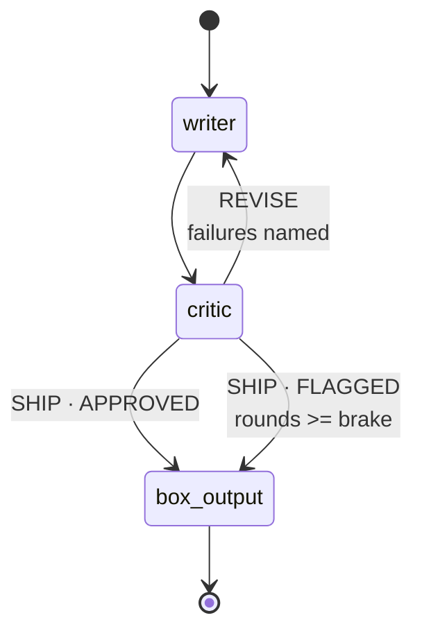

# 4.2 — The brake belongs to the critic

## One-line answer

The station that decides whether to go round again must be the station that **counts the rounds**,
and when the count runs out the loop ships the draft with a flag rather than looping for ever or
silently dropping the work.

## The story

A learner driver sits behind the wheel with an instructor beside them. The car has two sets of
pedals. The learner has a brake. The instructor also has a brake.

The instructor's pedal is not there because the learner is careless. It is there because of the
specific situation where a learner most needs stopping: the moment they have decided to keep going.
A learner who is committed to a manoeuvre and has misjudged it is not going to brake, because from
inside the decision the manoeuvre still looks fine. The person who can see that it is not is the
person not making it.

The pedal is on the passenger side deliberately. Put both pedals in front of the learner and you have
a car with two brakes and one opinion.

## The idea in plain language

The box is a loop: the writer drafts, the critic judges, and a bad judgement sends it back to the
writer. Loops need a way out, and there are two of them.

The **natural exit** is that the critic approves. That is the one everybody designs.

The **brake** is what happens when the critic never approves. A critic will always find something —
that is its job, and a critic that stops finding things has stopped working — so "loop until the
critic is happy" is not a terminating condition, it is a hope. The adk.dev routes page, fetched
2026-09-05, says so in the framework's own words: *"A graph cycle is not bounded automatically. Make
sure the exit condition eventually becomes true."*

The design question is **which station owns the count**, and there is only one defensible answer.

Put the counter in the writer and the writer decides when to stop being criticised. That is the
learner with both pedals. It is also structurally odd: the writer's job is to produce text, and now
it has a second job it will do badly, because at the moment the brake matters the writer is holding a
draft it believes in.

Put the counter in the critic and the station that judges also decides when judging must end. It
already has the information — it is the one that knows how many verdicts it has issued — and it is
not emotionally invested in the draft.

There is a third option that looks tidier and is worse: put the counter in the graph, as some kind of
maximum-iteration setting. It does not exist here (a routed cycle is unbounded), and even where such
a thing exists it stops the loop *without a verdict*, which means the run ends with a draft nobody
approved and nobody flagged.

## Why Sutra needs it

Day 59 is the containment lab, and the first runaway it drills is a loop that does not end. The brake
in this part is the small, in-place version of that argument, and Day 59's version adds the thing
this one lacks: a guard *outside* the loop, because a brake inside the thing it stops is a brake the
thing can decline to press.

It also decides what the desk does under pressure. `FLAGGED` is not a failure state, it is a
different product: a reply that a human should look at before it goes out. Day 63 designs which
things need a human, and a draft that hit the brake is the clearest possible candidate.

## The mechanism

The critic, with the rubric and the brake in one function:

```python
def critic(node_input: str, rounds: int = 0, evidence: dict | None = None) -> Event:
    """Inside the box: judge the draft against a fixed rubric, and emit the verdict as a route."""
    METER.spend("critic")  # MODEL CALL - one per round; see part 4.2
    block = EvidenceBlock(**(evidence or {"ref": ""}))
    failures = []
    if block.kb and not re.search(r"KB-\d+", node_input):
        failures.append("cites the article")
    if block.kb and resolution_of(block.kb[0])[:24] not in node_input:
        failures.append("names the fix")
    if "refund" in node_input.lower():
        failures.append("promises no money")
```

**Line by line:**

- `rounds: int = 0` comes from **session state**, not from the edge — the writer wrote it there on
  its way past. That is how the critic knows which pass this is without the graph telling it.
- `failures` is a list of *named* rubric items rather than a score. A number tells the writer it did
  badly; a list tells it what to change, and the writer reads exactly that list on the next pass.
- `if block.kb and ...` — both citation checks are **guarded by whether there is a knowledge-base
  article at all**. That guard is reasonable and it is also the defect that
  [8.1](../08-in-production/8.1-the-green-run-that-helped-nobody.md) is about: when the knowledge
  base clerk finds nothing, the rubric has nothing to check and approves anything.
- `resolution_of(block.kb[0])[:24] not in node_input` checks that the draft contains the article's
  actual instruction, not merely its number. Citing a source you did not use is the failure this
  line exists for, and twenty-four characters is enough to be specific without being brittle.
- `"refund" in node_input.lower()` is a hard content rule with no model in it. A support desk must
  not promise money, and that is a policy, not a judgement — so it is a string check, and it is in
  the rubric where a reviewer can see it rather than in a prompt where they cannot.

Then the three endings, in the order they are tested:

```python
    if not failures:
        return Event(
            author="critic",
            output="APPROVED",
            actions=EventActions(route="SHIP", state_delta={"verdict": "APPROVED"}),
        )
    if rounds >= KNOBS.brake:
        return Event(
            author="critic",
            output=f"BRAKE after {rounds} rounds, still failing: {failures}",
            actions=EventActions(
                route="SHIP",
                state_delta={"verdict": "FLAGGED", "flagged": True, "failures": failures},
            ),
        )
    return Event(
        author="critic",
        output=f"REVISE: {failures}",
        actions=EventActions(
            route="REVISE",
            state_delta={"verdict": "REVISE", "critique": ", ".join(failures)},
        ),
    )
```

**Line by line:**

- Approval is tested **first**, so a draft that satisfies the rubric on its last permitted round
  ships as `APPROVED` rather than as `FLAGGED`. Order the two the other way and a perfectly good
  draft gets flagged for being late, which is a distinction nobody wants to explain to a reviewer.
- `rounds >= KNOBS.brake` is the brake, and the route it emits is **`SHIP`, the same route as
  approval**. That is the important design choice in this whole part: hitting the brake does not
  abandon the draft and does not throw. It leaves by the normal door carrying different paperwork.
- `state_delta={"verdict": "FLAGGED", "flagged": True, "failures": failures}` records three things:
  the verdict, a boolean anything can test, and **what was still wrong**. That last one is what makes
  a flagged reply useful to the human who picks it up rather than merely suspicious.
- The `REVISE` branch writes `critique` into state as a comma-joined string, which the writer reads
  on its next pass. The loop's payload travels through state, not along the edge, for the reason
  [4.1](4.1-the-newsroom-drops-in-as-one-node.md) gave: the edge into the writer means something
  different on each iteration.

Watch it with the brake wide open, then closed:

```bash
cd days/day-58-triage-graph-v1/lab
uv run python brake.py
```

**Line by line:**

- It runs the whole floor on `ticket:4610` — chosen because that ticket genuinely needs one revision
  — and prints only the three stations inside the box, plus the case-file fields the loop wrote.
- `--brake N` overrides `KNOBS.brake`, which is how the same ticket can be made to hit the brake
  without changing the ticket or the rubric.

Measured on 2026-09-05:

```text
  brake = 3

    writer       Thanks for reporting ticket:4610. We have seen this before in ticket:4633#0. See K
    critic       REVISE: ['names the fix']
    writer       Thanks for reporting ticket:4610. We have seen this before in ticket:4633#0. See K
    critic       APPROVED
    box_output   ReviewedDraft(text='Thanks for reporting ticket:4610. We have seen this before in

  rounds      2
  verdict     'APPROVED'
  flagged     False
  model calls 5
```

The loop did its job. The first draft cited KB-104 but did not include the fix, the critic named
exactly that (`'names the fix'`), the writer added it, and the second draft was approved. Two rounds,
five requests, and the reply is better than the first attempt — which is the only justification for
spending the extra two.

Now squeeze it:

```bash
uv run python brake.py --brake 1
```

**Line by line:**

- `--brake 1` overrides `KNOBS.brake` for this run only. Same ticket, same rubric, same writer:
  the single integer is the whole difference.
- One is chosen rather than two because `ticket:4610` needs exactly one revision, so a brake of
  one is the smallest value that changes the outcome.

Measured on 2026-09-05:

```text
  brake = 1

    writer       Thanks for reporting ticket:4610. We have seen this before in ticket:4633#0. See K
    critic       BRAKE after 1 rounds, still failing: ['names the fix']
    box_output   ReviewedDraft(text='Thanks for reporting ticket:4610. We have seen this before in

  rounds      1
  verdict     'FLAGGED'
  flagged     True
  model calls 3
```

Same ticket, same rubric, same writer. Three requests instead of five, and the reply that leaves is
the *first* draft — the one the critic had just said was inadequate — carrying `flagged: True` and
the reason it was flagged.

That is honest degradation, and it is worth naming the three properties that make it honest. The work
is not lost. The failure is recorded rather than inferred. And the flag is a field a downstream
system can act on, so "ship it and flag it" is a real policy rather than a shrug.



## When it breaks

Set the brake to zero and the loop never runs at all:

```bash
uv run python brake.py --brake 0
```

**Line by line:**

- `0` is the degenerate setting: no revision can ever be permitted.
- It is worth running rather than reasoning about, because the off-by-one below is not visible
  from reading the comparison.

Measured on 2026-09-05:

```text
  brake = 0

    writer       Thanks for reporting ticket:4610. We have seen this before in ticket:4633#0. See K
    critic       BRAKE after 1 rounds, still failing: ['names the fix']
    box_output   ReviewedDraft(text='Thanks for reporting ticket:4610. We have seen this before in

  rounds      1
  verdict     'FLAGGED'
  flagged     True
  model calls 3
```

The writer has already incremented `rounds` to `1` by the time the critic runs, so `1 >= 0` brakes on
the very first verdict. No revision ever happens. Note that this is byte-for-byte the same output as
`--brake 1`: on this floor the two settings are indistinguishable, because a round is counted before
it is judged, and off-by-one in a brake is the sort of thing you discover by printing rather than by
reading.

The box still works, still costs three requests, and has quietly become a writer with a rubber
stamp. Nothing raises, which is the point. A brake of `0` and a brake of `3` are the same code path,
the same event shapes and the same exit route, and the difference between "we review our drafts" and
"we do not" is one integer in a config file that no test asserts on.

The more instructive break is the one this design *prevents*, so it is worth reaching for
deliberately. Delete the `rounds >= KNOBS.brake` branch and the critic has only two endings: approve,
or send back. Now find a ticket the writer cannot satisfy — one where the knowledge base article's
instruction is long enough that the writer's `[:24]` prefix check never matches — and the loop runs
until something outside it stops.

What stops it is not graceful. There is no iteration limit on a routed cycle; the framework said so.
On a free tier the answer is the quota:

```text
429 RESOURCE_EXHAUSTED: You exceeded your current quota.
Please retry in ~53s
```

The run dies partway through, having spent its way there two requests at a time — the writer and the
critic on every pass. And it does not merely fail one ticket. It spends the *day's* allowance, so the
next nine tickets fail too, on a floor that is working perfectly. That is the shape of a runaway, and
it is why Day 59 treats containment as a phase gate rather than as a tip.

## In production

**What a professional writes instead.** The brake is not a count, it is a **budget**, and it is
usually three things at once: a maximum number of rounds, a maximum number of requests for the whole
run, and a wall-clock deadline. Rounds alone is the weakest of the three, because a round's cost is
not constant — one long draft with a large retrieved context can cost several times another — and
Day 24's token accounting is what turns "three rounds" into "this much work".

They also make the brake **observable**. A counter of flagged replies per day is one of the most
useful quality signals a system like this produces: it rises when retrieval degrades, when the rubric
gets stricter, and when the model changes, and it rises before anybody complains. A flag written to
state and never counted is a flag nobody will ever look at.

**What degrades at scale.** The brake becomes a queue problem rather than a loop problem. At volume,
a rubric change that pushes the flagged rate from 2% to 20% does not show up as latency or errors —
it shows up as a backlog of flagged drafts in front of the humans who review them, in a different
system, on somebody else's dashboard. Day 62's human-in-the-loop patterns and Day 63's approval
design both start from that observation.

**The failure mode that only appears with real traffic.** The loop that succeeds slowly. Most drafts
approve on round one; a small tail takes two; and a very small tail takes three and flags. That tail
is where all the cost lives, and the mean hides it completely — a mean of 1.2 rounds is consistent
with 95% at one round and 5% at five. Percentiles of the round count are the right instrument, and
the reason to care is
[3.3](../03-the-research-floor/3.3-what-a-lane-costs.md)'s: budgeting with the mean of a two-cluster
distribution puts you out of quota by lunchtime.

**The review comment a senior engineer leaves:** *"The brake is inside the critic, which is right,
and there is nothing outside the box that would stop this loop if the critic itself started
misbehaving. Add a run-level request cap so a pathological ticket cannot spend the day's quota, and
please assert the brake value in a test — right now setting it to zero silently turns review off and
every check still passes."*

**The interview question:** *"Your reviewer agent keeps rejecting the draft. What happens?"* The
answer that shows it has happened to you: *"The critic owns the round count, and when it runs out the
critic ships the draft with a `flagged` verdict and the list of rubric items still failing. Three
deliberate choices in that. The counter lives with the critic rather than the writer, because the
writer is the station that has just decided its draft is fine. The brake exits by the same route as
approval, so a braked run produces a reply and a record rather than an exception and nothing. And the
reason it exists at all is that a cycle here is not bounded by the framework — I have watched an
unbounded version spend a whole day's free-tier quota on one ticket, which then fails the next nine
tickets that had nothing wrong with them."*

## Check yourself

```bash
cd days/day-58-triage-graph-v1/lab
uv run python brake.py
uv run python brake.py --brake 1
uv run python brake.py --brake 0
```

Now compare the reply text in the `--brake 1` run with the one from the default run and write down
what the customer would have lost. Then say which of the three properties of honest degradation the
`--brake 0` run still has, and which it has quietly given up.

**Out loud, without scrolling up:** say which station owns the round count and give the argument for
it, then explain why the brake exits by the same route as approval instead of raising.

**Next:** [4.3 — The stamp that may not change the answer](4.3-the-stamp-that-may-not-change-the-answer.md).
