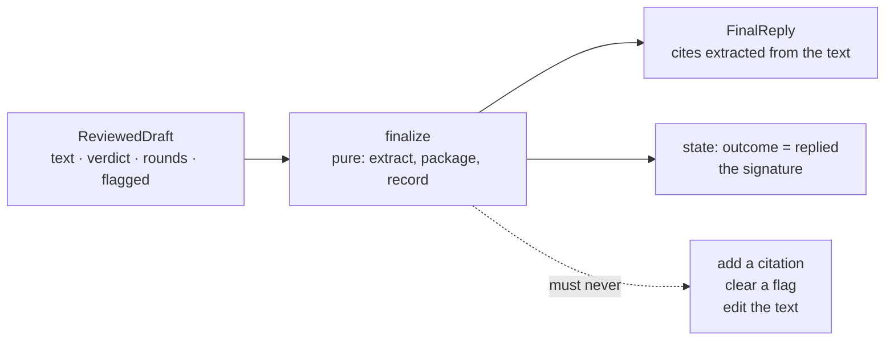

# 4.3 — The stamp that may not change the answer

## One-line answer

The last station declares the run finished and must therefore be **pure** — it may package, extract
and record, but the moment it can alter the answer, "finished" stops meaning anything and the audit
trail is auditing itself.

## The story

A parcel arrives and you sign for it. Your signature means one thing: this was delivered to me, at
this time. It does not mean the contents are correct, and it does not change them. The courier
cannot open the box, add something, and then have you sign for the improved version — the signature
would be worthless, because it would no longer be evidence about what arrived.

The narrow meaning is exactly what makes the signature useful. Everyone knows what a signature does
and does not cover, so a dispute about a missing item is a dispute with the sender, not an argument
about whether the courier tampered with it.

Now imagine a courier who is allowed to fill in gaps. The invoice says three items and two arrived,
so they write "3" on the docket, because that is clearly what was meant. Every parcel still gets
delivered, every docket still balances, and the docket has stopped being a record of anything.

## The idea in plain language

`finalize` is the last station on the floor. It takes the reviewed draft, extracts the citations,
packages everything into a `FinalReply`, and writes `outcome: replied` into the case file. Then the
run ends.

That station is doing two jobs that look alike and are not:

- **Packaging** — turning what happened into the declared output shape.
- **Deciding** — changing what the answer is.

It must do the first and must not do the second, and the reason is not tidiness. `finalize` is the
station whose state write says the run succeeded. It is, in effect, the signature. If the same
station can also improve the draft, add a citation it thinks is missing, or soften a sentence, then
the record of the run is being written by something with an interest in the run looking good.

The technical word for what `finalize` must be is **pure**: given the same input it produces the same
output, it reads nothing outside its arguments that it does not declare, and it changes nothing
except by returning a value. A pure last station has a property worth having — you can re-run it on
a stored draft and get the identical record, which is what makes a case file reproducible rather
than merely recorded.

## Why Sutra needs it

The whole of section 7 asks whether a run can be *accepted*, and every one of those acceptance checks
reads fields that `finalize` produced: the citations, the outcome, the flag. If `finalize` could add
a citation, then the invariant *"every reply cites something"* would be enforced by the station being
measured, which is not an invariant, it is a formality.

Day 64 puts a real approval gate before the write, and Day 65 kills the process mid-run to see
whether it resumes correctly. Both of those depend on being able to re-derive the final record from
the stored draft. A last station that made decisions cannot be replayed, because replaying it would
make them again, differently.

## The mechanism

```python
def finalize(node_input: ReviewedDraft, ref: str = "", evidence: dict | None = None) -> Event:
    """Station last: stamp the reviewed draft as the floor's product. No model call."""
    cites = re.findall(r"KB-\d+", node_input.text)
    reply = FinalReply(
        ref=ref,
        reply=node_input.text,
        cites=cites,
        rounds=node_input.rounds,
        flagged=node_input.flagged,
    )
    return Event(
        author="finalize",
        output=reply,
        actions=EventActions(
            state_delta={"outcome": "replied", "final": reply.model_dump()},
        ),
    )
```

**Line by line:**

- `node_input: ReviewedDraft` is the box's declared output from
  [4.1](4.1-the-newsroom-drops-in-as-one-node.md). `finalize` is handed the reviewed thing and
  nothing else it could use to second-guess it.
- `re.findall(r"KB-\d+", node_input.text)` **extracts** rather than decides. It reports which
  knowledge-base articles the draft actually mentions. It does not consult the evidence to work out
  which ones it *should* have mentioned, and that restraint is the whole part.
- `reply=node_input.text` copies the draft verbatim. No trimming, no tidying, no appending a
  signature line. Whatever the box approved is what gets recorded.
- `rounds` and `flagged` are carried through from the `ReviewedDraft` unchanged. `finalize` is not
  where a flag could be cleared, and it is worth noticing that a station which *could* clear it
  would be an extremely attractive place to fix a metric.
- `evidence` is in the signature and **is not used**. That is deliberate and slightly uncomfortable
  to leave in: it is the parameter a future version would reach for in order to "helpfully" add the
  citation that the writer omitted, and leaving it unused with this docstring is a note to that
  future version. If you would rather delete it, delete it — the argument survives either way.
- `state_delta={"outcome": "replied", ...}` is the signature itself. This is the write that makes the
  run count as a reply in every measurement in section 7.

Check the two properties that matter — that it copies rather than edits, and that it is
deterministic:

```bash
cd days/day-58-triage-graph-v1/lab
uv run python stamp.py
```

**Line by line:**

- Two hand-built `ReviewedDraft` values are passed directly to `finalize`, with no graph at all,
  because purity is a property of the function and a graph would only add noise.
- The first case is a draft that cites something, the second is a draft that cites nothing. The
  second one is the interesting case.
- Each is finalised **twice**, and the two results compared, which is the mechanical test for
  determinism.

Measured on 2026-09-05:

```text
  a reply that cites
    cites          ['KB-104']
    reply is draft True
    run twice, same True
  a reply that cites nothing
    cites          []
    reply is draft True
    run twice, same True
```

`reply is draft True` on both rows is the copying property: the text that goes into the record is
character-for-character the text the box approved.

`run twice, same True` is determinism, and it is what makes a stored case file re-derivable.

The row that carries the argument is the second one. A draft citing nothing produces `cites: []`, and
`finalize` records that and stamps the run `replied` anyway. It would have been so easy — three
lines — to look at `evidence`, notice a knowledge-base article was available, and append *"See
KB-104."* Every reply would then cite something, the invariant in
[7.1](../07-acceptance/7.1-every-part-passed.md) would pass, and the number it reports would be a
number about `finalize` rather than about the desk.

**The empty list is the finding.** A last station that reports a hole honestly is what allows
[8.1](../08-in-production/8.1-the-green-run-that-helped-nobody.md) to exist at all.



## When it breaks

There is no exception to show here, and that is precisely the difficulty: an impure last station
produces no error, ever. So the break has to be demonstrated by consequence rather than by traceback.

Add the three helpful lines:

```python
    if not cites and evidence and evidence.get("kb"):
        article = evidence["kb"][0].split(":")[1]
        cites = [article]
```

**Line by line:**

- `if not cites and evidence` fires only when the draft cited nothing and evidence was available,
  which is the narrowest, most defensible version of the change. It is not a sloppy edit; it is the
  edit a careful person makes.
- `cites = [article]` fills the field from the evidence rather than from the draft, and this single
  assignment is where the record stops describing the reply.

Now walk through what that does to the rest of the system. `FinalReply.cites` no longer means *"the
articles this reply mentions"*; it means *"the articles this reply mentions, or the one it should
have"*. The customer's reply text is unchanged — it still contains no citation — so a customer
reading it gets no article, and every dashboard says citations are at 100%.

Worse, the invariant in [7.2](../07-acceptance/7.2-the-gate-that-goes-red.md) that fails today
starts passing. The pipeline did not improve. The measurement moved into the thing being measured,
and the gate that was doing its job stopped.

There is a second break of the same family, and it is the one that actually reaches production
systems: making the last station **retry**. A `finalize` that notices an empty draft and asks the
writer for another one is no longer a stamp — it is a second, undeclared loop with no brake, sitting
outside the box that has one ([4.2](4.2-the-brake-belongs-to-the-critic.md)). Every argument in that
part about who owns the count applies here, and the station that owns it is not this one.

## In production

**What a professional writes instead.** The final record carries **provenance**, not just content: a
run identifier, the model and its version, the code version, the retrieval index version, and the
timestamp. Those are things `finalize` may legitimately add, because none of them changes the answer
— they describe how the answer was produced. The distinguishing test is worth keeping: a field is
safe to add here when it is a fact *about* the run, and unsafe when it is a fact the run was
supposed to produce.

They also separate two things this station does at once. Packaging the result and *emitting* it —
writing to a database, putting it on a queue, sending it — are different concerns with different
failure modes, and merging them is how a retried run sends two replies. Day 60's idempotency
argument starts exactly here, and Day 64 puts a human approval between the two.

**What degrades at scale.** The regular expression. `KB-\d+` over the draft text is fine for five
articles with a rigid naming scheme and wrong for a knowledge base with slugs, links and titles.
More to the point, extracting citations from prose is a parser for a format nobody defined. The
production shape is that the writer emits *structured* output — the reply text and the list of
sources it used, as separate fields — so `finalize` reads a field instead of guessing from text.
That change also makes the "cited but not used" failure detectable, which the regex cannot see at
all.

**The failure mode that only appears with real traffic.** The stamp becomes the integration point.
Somebody needs a webhook, and `finalize` is where the finished thing is, so the call goes there.
Now the last station makes a network request, and it can fail — after the draft was approved, after
the requests were spent, with the case file half written. The run's outcome now depends on somebody
else's uptime, and a station that was pure and instantly re-runnable is neither.

**The review comment a senior engineer leaves:** *"`finalize` takes `evidence` and does not use it.
Either drop the parameter or write a comment saying why it is there, because the next person will
see an empty `cites` list and an available article in the same function and connect them. And if
`cites` ever gets filled from anywhere but the draft text, the citation metric becomes a measurement
of this function."*

**The interview question:** *"How do you know a run of your pipeline actually succeeded?"* The answer
that shows you have thought about it: *"The last station writes the outcome, and that station is
pure — it packages the reviewed draft, extracts the citations from the text that will actually be
sent, and records both. It has no ability to improve the answer. That restraint is what makes the
acceptance checks worth running: when I measure how many replies cite a source, I am measuring the
pipeline rather than the reporting. We had a reply go out citing nothing and the record said so, and
that honesty is what let us find that our keyword retriever was missing the article for the very
ticket it was written about."*

## Check yourself

```bash
cd days/day-58-triage-graph-v1/lab
uv run python stamp.py
```

Now add the three "helpful" lines above to `finalize`, run `uv run python invariants.py`, and write
down what happened to the count of replies that cite something. Then remove them again and ask
yourself which version you would rather defend in an incident review.

**Out loud, without scrolling up:** give the test for whether a field is safe for the last station to
add, and say why an impure last station makes the acceptance checks meaningless rather than merely
inaccurate.

**Next:** [5.1 — The edge list is the floor plan](../05-the-graph/5.1-the-edge-list-is-the-floor-plan.md).
