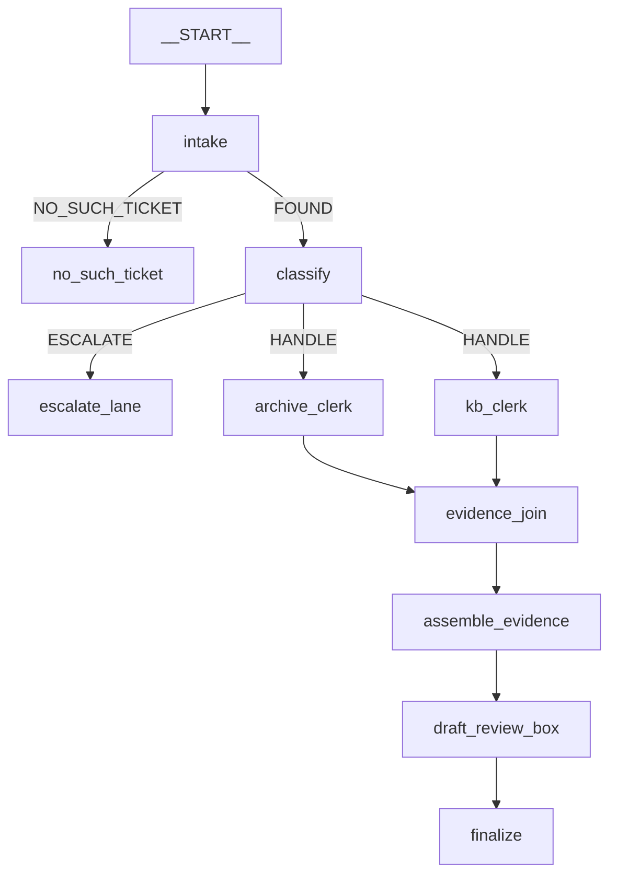

# 5.1 — The edge list is the floor plan

## One-line answer

Because the wiring is a **list of edges rather than a nesting of objects**, the whole floor is six
lines of data — which means the framework can check it before anything runs, and the architecture
diagram can be printed from the graph instead of drawn beside it.

## The story

Somebody is organising a wedding lunch and has to decide who sits where. They do it on one sheet of
paper: a grid of tables, and names written into places.

The sheet is the useful artefact, and it is useful because of what it is *made of*. It is small
enough to see at once. Two people can lean over it and argue. Somebody's aunt who must not be next
to somebody's uncle is a thing you can check by looking, before anybody has travelled anywhere.

Compare it to the alternative, which is how it actually goes wrong: no sheet, and instead a series of
instructions given to different people. Tell the caterer that the family table is near the window.
Tell the cousin to bring the elderly relatives in through the side door. Tell the photographer that
the speeches happen at the top table. Every instruction is correct. Nobody can see the plan, because
there is no plan — there is a distributed set of intentions, and the first time they are all in one
place is when everyone is standing in the room.

## The idea in plain language

Day 53's trap #1 is the plan's §5.1 first row: in ADK 1.x you composed agents by nesting them inside
each other, and in 2.x the composition is a **list of edges**, separate from the nodes.

This part is about the practical consequence of that, which is larger than it first sounds. When
composition is nesting, the shape of your system is a property of the objects — to know what runs
after what, you have to construct the objects and look at their relationships. When composition is a
list, the shape is **data**, and data can be read, printed, checked, diffed and reviewed without
running anything.

Three things follow immediately, and all three are visible in this floor:

1. **The framework can validate it.** Before a ticket arrives, ADK checks the graph it was handed.
   Day 53's section 3 is about what it catches and what it does not.
2. **You can generate the diagram.** A picture drawn by hand is out of date the first time somebody
   adds an edge. A picture printed from `graph.edges` cannot be.
3. **Two branches can arrive at the same station.** This is the thing a tree cannot express: an
   object can have only one parent, so a merge needs a copy. Two edges pointing at one node is
   ordinary here, and it is what makes the join in
   [3.2](../03-the-research-floor/3.2-the-join-hands-over-a-dict.md) possible at all.

## Why Sutra needs it

This is the file every remaining day of the project edits. Day 59 adds containment guards, Day 61
adds checkpoints, Day 64 puts an approval gate before the write, Day 67 adds guardrail callbacks.
All of those are edits to *this* wiring, made by somebody who has not read the whole floor.

A six-line edge list is a thing you can hand to a person on Day 64 and expect them to change safely.
A tree of nested objects spread over four files is not, and the difference will show up as bugs on
days that have nothing to do with graph composition.

## The mechanism

Here is the entire floor:

```python
def build_graph() -> Workflow:
    """Assemble the floor. Architecture is free: this function spends no model call."""
    return Workflow(
        name="triage_graph_v1",
        edges=[
            (START, intake),
            (intake, {"NO_SUCH_TICKET": no_such_ticket, "FOUND": classify}),
            (classify, {"ESCALATE": escalate_lane, "HANDLE": (archive_clerk, kb_clerk)}),
            (archive_clerk, evidence_join),
            (kb_clerk, evidence_join),
            (evidence_join, assemble_evidence, draft_review_box, finalize),
        ],
    )
```

**Line by line:**

- `def build_graph() -> Workflow` is a **function**, not a module-level object, and Day 53's build
  brief argued for this: a graph that fails validation fails at the call site with a traceback
  pointing at your code, rather than at import time where it looks like a broken package. It also
  gives every test a fresh graph.
- `(START, intake)` is the entry. `START` is ADK's sentinel for the graph's beginning, and the
  ticket text the caller passed arrives at `intake` as its `node_input`.
- `(intake, {...})` is the routing form: a dictionary from route label to destination. Two labels,
  two destinations, and this one line is the whole of
  [1.3](../01-the-floor/1.3-one-station-decides-what-is-real.md)'s mouth expressed as wiring.
- `"HANDLE": (archive_clerk, kb_clerk)` is one route reaching **two** stations — the fan-out. Written
  as a tuple rather than as two dictionary entries, because a dictionary cannot have the same key
  twice, and because writing it as one entry is what guarantees both clerks are reached or neither
  is.
- The next two lines are the fan-in, and they are the two-parents case: two separate edges into one
  `evidence_join` object. This is the line to point at when somebody asks what a graph buys over a
  tree.
- The last line is a **chain**, which is sugar for three consecutive edges. Chains and explicit edges
  mix freely, and the rule of thumb this floor follows is: a chain where the flow is linear and
  uninteresting, explicit edges where something branches or merges.
- Six entries, ten stations. The floor plan fits on a screen.

Now print the diagram from the object:

```bash
cd days/day-58-triage-graph-v1/lab
uv run python shape.py
```

**Line by line:**

- `shape.py` reads `graph.graph.edges` — the validated edge collection on the built `Workflow` — and
  emits mermaid. It never runs a ticket.
- For each edge it reads `from_node`, `to_node` and `route`, taking each node's `name` where it has
  one and falling back to `__name__` for a plain function.
- An edge whose route is `None` or `DEFAULT_ROUTE` prints without a label, so the picture is not
  cluttered with the ordinary case.

Measured on 2026-09-05:

```text
graph TD
    __START__ --> intake
    intake -->|NO_SUCH_TICKET| no_such_ticket
    intake -->|FOUND| classify
    classify -->|ESCALATE| escalate_lane
    classify -->|HANDLE| archive_clerk
    classify -->|HANDLE| kb_clerk
    archive_clerk --> evidence_join
    kb_clerk --> evidence_join
    evidence_join --> assemble_evidence
    assemble_evidence --> draft_review_box
    draft_review_box --> finalize
```

That output is a mermaid diagram, and pasting it into a document renders the picture below. Notice
what the printing has already done for you: the six authored lines have expanded into eleven edges,
because the dictionaries and the chain have been unrolled. **The graph you get is not the graph you
typed**, and this is the cheapest possible way to see the difference.



Three things are worth reading off this picture, and none of them is obvious from the six authored
lines.

**`draft_review_box` is one box.** The five stations inside it do not appear, because they are not
edges on this graph — [4.1](../04-the-box/4.1-the-newsroom-drops-in-as-one-node.md)'s encapsulation,
seen from the outside.

**Three stations are terminal**: `no_such_ticket`, `escalate_lane` and `finalize`. Nothing leaves
them. That is the list of ways this floor can end, and it is worth knowing by heart, because
[7.2](../07-acceptance/7.2-the-gate-that-goes-red.md)'s most useful assertion is that a run reached
one of them.

**`classify` has exactly two routes and no default.** A third label from the classifier matches
nothing, the branch ends, and the run exits 0 having done part of the job — the silent failure
[2.2](../02-the-guess/2.2-the-route-is-an-action.md) demonstrated. The picture makes the absence
visible in a way that reading the dictionary does not, because a missing default looks like nothing
in code and looks like a node with no escape in a drawing.

## When it breaks

Break the wiring rather than the stations and the framework answers immediately, before a ticket
exists. Point an edge at a station that no route reaches:

```python
def build_broken() -> Workflow:
    """A station nothing points at. The graph is still a valid Python object."""
    return Workflow(
        name="broken",
        edges=[
            (START, intake),
            (intake, {"FOUND": classify}),
            (escalate_lane, finalize),
        ],
    )
```

**Line by line:**

- `escalate_lane` appears only as the *source* of an edge. Nothing routes into it, so it can never
  run.
- The `NO_SUCH_TICKET` route is gone too, so `intake` can emit a label that matches no edge.
- Nothing here is a syntax error and nothing is a type error. It is a perfectly well-formed list of
  tuples, which is why the check has to be the framework's rather than Python's.

Measured on 2026-09-05, constructing that `Workflow`:

```text
ValidationError:
1 validation error for Workflow
  Value error, Graph validation failed. The following nodes are unreachable from START: ['escalate_lane', 'finalize'] [type=value_error, input_value={'name': 'broken', 'edges...t 0x00000201BD669A80>)]}, input_type=dict]
    For further information visit https://errors.pydantic.dev/2.13/v/value_error
```

Rejected at construction, by name, before any ticket exists. That is the payoff of composition being
data: the framework got to read the plan.

Be precise about the limit, though, because it is narrower than it looks. This fires for a node that
**is in the graph** — it appears in some edge — and cannot be reached from `START`. A node that
appears in **no** edge at all is not unreachable; it is simply *absent*, and the graph is built
without it and says nothing. Day 53's `orphan.py` shows exactly that: a station defined, never wired,
and missing from the node list with no complaint.

And route problems are not caught at all. A route no edge matches is discovered at runtime, silently,
as a branch that ends.

That asymmetry is the reason `shape.py` earns its place in the lab rather than being a novelty. The
class of bug the framework cannot catch is exactly the class a **picture** makes obvious: a route
label with no arrow, a station with no way out, a fan-out with only one branch. Printing the graph
turns an invisible failure into a visual one, and it costs eleven lines.

The failure that survives even the picture is spelling, and it deserves saying once more here because
this is the file where it happens. `classify` emits `"HANDLE"`; the edge says `"HANDLE"`. If somebody
changes one of them, the diagram still draws an arrow labelled with the *edge's* spelling, looking
entirely healthy, and no ticket ever takes it. A generated picture proves the wiring is what you
wrote. It cannot prove the wiring is what the stations say.

## In production

**What a professional writes instead.** The generated diagram is checked in and regenerated by the
build, so a pull request that changes the wiring shows the picture changing in the diff. That is a
small habit with a large effect on review quality: a reviewer who is shown eleven edges becoming
thirteen asks a different question from one shown six lines of Python becoming seven.

They also assert on the shape, not just look at it. Day 53's build brief asks for a `graph_report()`
returning the node count, the edge count, the routed-edge count and the terminal nodes — as data a
test can compare against expected values. That test is what catches the wiring change nobody
mentioned in the pull request description.

**What degrades at scale.** The picture stops fitting. Eleven edges is a diagram; sixty is a hairball
and nobody looks at it, which means the benefit quietly evaporates at exactly the size where it would
matter most. The production answer is to lean harder on the same property that made this work: nest
sub-graphs so the top-level picture stays at ten or so boxes, and generate one picture per level.
`draft_review_box` appearing as a single node above is the beginning of that discipline rather than a
convenience.

**The failure mode that only appears with real traffic.** The graph is right and the traffic does not
take it. Every edge is wired, the picture is correct, and in three months of production one branch
has never once been followed — because the route that reaches it depends on a classifier output that
never occurs. The edge list cannot tell you that; only counting can. Instrumenting **edges traversed**
rather than nodes executed is the version of this that catches dead branches, and it is the same
counter that catches the opposite problem in
[8.2](../08-in-production/8.2-a-gate-that-fires-on-half-the-traffic.md).

**The review comment a senior engineer leaves:** *"`classify` routes two labels and has no
`DEFAULT_ROUTE`. If it ever emits a third, the run ends quietly having done half the work and we find
out from a customer. Wire the default to a node that records and alerts, and regenerate the diagram
in this PR so the new arrow is visible."*

**The interview question:** *"How do you know what your agent pipeline actually does?"* The answer
that shows you have maintained one: *"The composition is a list of edges rather than nested objects,
so the whole floor is six lines of data and I generate the architecture diagram from the graph
object itself — it cannot go stale, and it shows me that my six authored lines expand into eleven
edges, which is not obvious from the source. The framework validates reachability before anything
runs, so an unreachable node is rejected at construction. What it does not catch is a route label no
edge matches, and that fails silently with exit code 0 — so I also assert that a run reached one of
the three terminal stations, and I keep the generated picture in the repo so a wiring change shows up
in the diff."*

## Check yourself

```bash
cd days/day-58-triage-graph-v1/lab
uv run python shape.py
```

Paste the output into a mermaid renderer and look at the picture. Then count how many authored lines
`build_graph` has and how many arrows the picture has, and say which construct is responsible for the
difference.

**Out loud, without scrolling up:** name the three terminal stations on this floor, and explain why
two edges pointing at one station is something a tree could not express.

**Next:** [5.2 — On the edge or in the register](5.2-on-the-edge-or-in-the-register.md).
