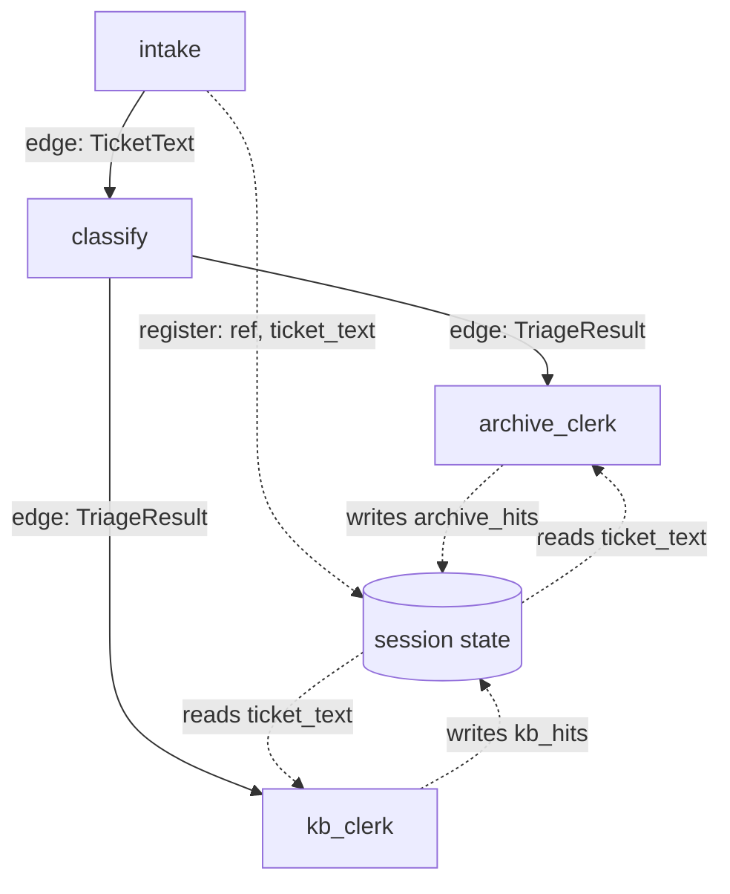

# 5.2 — On the edge or in the register

## One-line answer

A node parameter named `node_input` is filled from the **edge**; every other parameter is looked up
in **session state by its own name** — so a station takes its baton from whoever ran before it and
anything else from the run's shared register.

## The story

You are sent to the shop for milk. You carry that instruction in your head: milk. It came from the
person who sent you, it is small, and it is the reason you are walking.

There is also a list stuck to the fridge with a magnet. It has been added to all week by whoever
noticed something running out — rice, matches, a bulb for the hallway. Nobody handed it to you. It
was there before you were sent, it will be there when you get back, and anyone in the house can read
it or add to it.

Two kinds of information, and they behave completely differently. The instruction in your head is
*for this trip* and it came from *one person*. The list is *for the house* and it accumulates.

If you try to carry the whole list in your head you will forget the bulb. If you try to put "milk" on
the fridge instead of telling anyone, you will not go to the shop.

## The idea in plain language

Every station on this floor gets its information from one of two places, and ADK decides which by
looking at the parameter's **name**.

- **`node_input`** — filled from the edge. This is the baton
  ([1.2](../01-the-floor/1.2-the-baton-has-a-declared-shape.md)): the output of whichever station ran
  immediately before, coerced to the annotated type.
- **any other parameter name** — looked up in **session state** under that exact name. Session state
  is the run's shared register: a dictionary that lives for the whole run, that any station can read,
  and that stations write to with `state_delta`.

That is a small rule with a large consequence, and it is the reason
`archive_clerk(node_input: TriageResult, ref: str = "", ticket_text: str = "")` looks strange at
first. The clerk is handed a *verdict* by the edge, because the classifier ran before it — but what
the clerk actually needs is the *ticket text*, which the classifier did not pass on and had no reason
to.

You could solve that by making the classifier hand on a bigger baton containing both the verdict and
the ticket. People do, and it is the wrong answer here for two reasons. Every station between the
source and the consumer would have to carry a field it does not use, and the baton grows every time
somebody downstream needs one more thing — which is how a pipeline ends up passing a single
`context` object that contains everything and means nothing.

The rule of thumb this floor follows:

| Put it on the edge | Put it in the register |
| --- | --- |
| the result of the station that just ran | facts established earlier that several stations need |
| the thing the next station is *about* | the run's accumulating record |
| what changes at every hop | what is written once and read later |

## Why Sutra needs it

Day 47 made sessions persistent and Day 61 will checkpoint them. What gets checkpointed is the
register, not the batons — a baton exists for the instant between two stations, and the register is
the thing that has to survive a process dying.

That makes this part's distinction load-bearing rather than stylistic. Anything a resumed run needs
must be in state by the time the checkpoint is taken, and
[6.2](../06-the-run/6.2-state-is-the-case-file.md) is about what this floor actually leaves there.

## The mechanism

Look at three stations' signatures and where each parameter comes from:

```bash
cd days/day-58-triage-graph-v1/lab
uv run python register.py
```

**Line by line:**

- The first half uses `inspect.signature` to read the real parameter names off the real functions,
  rather than repeating them in a table that could drift from the code.
- The rule it applies is exactly ADK's: the name `node_input` means the edge, anything else means
  state.
- The second half drives a full run and dumps the register at the end, so the two halves of the
  output can be read against each other.

Measured on 2026-09-05:

```text
  station          parameter        comes from
  archive_clerk    node_input       the edge
  archive_clerk    ref              session state
  archive_clerk    ticket_text      session state
  kb_clerk         node_input       the edge
  kb_clerk         ticket_text      session state
  writer           node_input       the edge
  writer           evidence         session state
  writer           critique         session state
  writer           rounds           session state

  what the register held at the end of the run:
    archive_hits     ['ticket:4633#0', 'ticket:4701#0']
    critique         'names the fix'
    draft            'Thanks for reporting ticket:4610. We have seen this before in tic
    evidence         {'ref': 'ticket:4610', 'archive': ['ticket:4633#0', 'ticket:4701#0
    final            {'ref': 'ticket:4610', 'reply': 'Thanks for reporting ticket:4610.
    kb_hits          ['kb:KB-104']
    outcome          'replied'
    ref              'ticket:4610'
    rounds           2
    ticket_text      'Ticket 4610. Signed out mid-form. The customer fills the long onb
    triage_result    {'category': 'auth', 'severity': 2, 'needs_human': False, 'notes':
    verdict          'APPROVED'
```

Read the two clerks first. Both take `node_input` from the edge — a `TriageResult` — and both reach
into the register for `ticket_text`. Neither of them uses the verdict for anything much. The baton is
almost incidental to what they do, and that is fine: the edge decided *when* they run, and the
register supplied *what they work on*.

`ticket_text` got into the register at the mouth. Look back at
[1.3](../01-the-floor/1.3-one-station-decides-what-is-real.md)'s `intake`: alongside its route it
wrote `state_delta={"ref": ref, "ticket_text": DOCS[ref]}`. That is one station writing two facts
that four later stations read, none of which is adjacent to it on the graph.

Then read the writer, and this is the case that makes the rule necessary rather than merely
convenient. The writer sits inside a loop
([4.2](../04-the-box/4.2-the-brake-belongs-to-the-critic.md)). On its first pass the edge into it
comes from `assemble_evidence` and carries an `EvidenceBlock`. On its second pass the edge into it
comes from the *critic* and carries a verdict string. **Same parameter, two different types,
depending on which time round it is.** There is no annotation that is true of both, which is why
`node_input` on the writer is deliberately unannotated, and why everything the writer actually needs
— the evidence, the critique, the round number — comes from the register instead.



## When it breaks

Get the name wrong and the failure is loud, which is the good news. Rename `ticket_text` in
`intake`'s `state_delta` to `ticket_body` and leave the clerks alone, and the clerk asks the register
for a key that is not there.

There is a subtler and much more common version, and it comes from the defaults. Every state-bound
parameter on this floor has one:

```python
def kb_clerk(node_input: TriageResult, ticket_text: str = "") -> Event:
    """Evidence branch 2: the knowledge base, matched on words rather than meaning."""
    words = set(re.findall(r"[a-z]{4,}", ticket_text.lower()))
```

**Line by line:**

- `ticket_text: str = ""` gives the parameter a default, which makes the station constructible and
  callable in a unit test without a session — genuinely useful, and it is how
  [7.1](../07-acceptance/7.1-every-part-passed.md)'s node-level checks call these functions directly.
- The cost is that a **missing key is indistinguishable from an empty ticket**. If nothing ever wrote
  `ticket_text`, this line runs on `""`, finds no words, scores every article at zero, returns no
  hits, and reports success.

That is the shape of the register's characteristic failure: not an exception, a **default**. The
clerk did its job on nothing and said so in the only way it can, by returning an empty list — and
[3.1](../03-the-research-floor/3.1-two-clerks-who-disagree.md) already measured that this clerk
returns an empty list 92% of the time anyway, so the signal is buried in noise.

There is one more thing worth doing with that register dump, and it is the reason `register.py` prints
**every** key rather than the ones it expects. Twelve keys are there at the end of this run, written
by six different stations, and no single station knows about more than four of them. The register is
the one part of this floor that nobody owns.

Compare that with the twelve keys against the list of what a resumed run would need, and the useful
question falls out: is `critique` still meaningful after a restart, or is it a scratch value from a
loop that has since moved on? Nothing in the register says which keys are the run's *record* and
which are a station's *working memory*, because a dictionary cannot say that. Day 61 has to answer it
before it can checkpoint anything.

## In production

**What a professional writes instead.** State keys are namespaced by the component that owns them:
`triage.ref`, `triage.ticket_text`, `box.rounds`. It costs nothing today and it is the difference
between adding a second nested workflow safely and spending an afternoon on a round counter that is
off by one, which [4.1](../04-the-box/4.1-the-newsroom-drops-in-as-one-node.md) flagged as the
collision waiting to happen.

They also declare what is in the register. `Workflow` accepts a `state_schema` field, and using it
turns the register from an untyped dictionary that any station may add to into something with a
declared shape — at which point a misspelled key is a validation error rather than a silent default.
That is the same argument [1.2](../01-the-floor/1.2-the-baton-has-a-declared-shape.md) made about
edges, applied to the other channel, and it is the one most pipelines skip.

**What degrades at scale.** The register grows and everything in it is copied. It is serialised into
the session store on every write, and from Day 61 it will be written into every checkpoint. A
`ticket_text` of a few hundred characters is nothing; the same field holding a customer's full email
thread, multiplied by every checkpoint of every run, is a storage and a privacy problem at once — and
Day 69 will ask which of those copies contains personal data. The production habit is to keep
identifiers in the register and fetch the bulk on demand.

**The failure mode that only appears with real traffic.** Concurrent writes. Two branches of a
fan-out both writing the same key is a race, and Day 54 measured exactly that on parallel branches.
On this floor the two clerks write `archive_hits` and `kb_hits` — different keys, deliberately — so
there is no race today. Add a third clerk that writes `hits` and merge it with an existing one and
there is, and it will resolve differently on a loaded machine than on yours.

**The review comment a senior engineer leaves:** *"This node reads `ticket_text` from state with a
default of empty string, so if the key is ever missing it silently searches for nothing and returns
no results. Either drop the default and let it fail, or return something that distinguishes 'searched
and found nothing' from 'had nothing to search with' — right now those are the same empty list."*

**The interview question:** *"How does data move between the steps of your graph?"* The answer that
shows you have wired one: *"Two channels. The parameter called `node_input` is filled from the edge —
it is the previous station's output, coerced to whatever type I annotated. Every other parameter is
looked up in session state by its own name. The split matters because a station in a loop cannot take
its real input from the edge: our writer gets an evidence block on the first pass and the critic's
verdict on the second, so its `node_input` is deliberately unannotated and everything it actually
uses comes from state. The trap is that state-bound parameters have defaults, so a missing key looks
like an empty value rather than an error — so we dump the whole register at the end of a run rather
than asserting on the keys we expect, because the keys we expect are exactly the ones we would not
notice going missing."*

## Check yourself

```bash
cd days/day-58-triage-graph-v1/lab
uv run python register.py
```

Now rename the key `ticket_text` to `ticket_body` in `intake`'s `state_delta` only, and re-run
`uv run python clerks.py`. Write down what the clerks returned, whether anything raised, and how many
stations later you would have noticed in a real system.

**Out loud, without scrolling up:** state the rule ADK uses to decide whether a parameter comes from
the edge or from state, and give the reason the writer's `node_input` is left unannotated.

**Next:** [6.1 — The event stream is the story](../06-the-run/6.1-the-event-stream-is-the-story.md).
