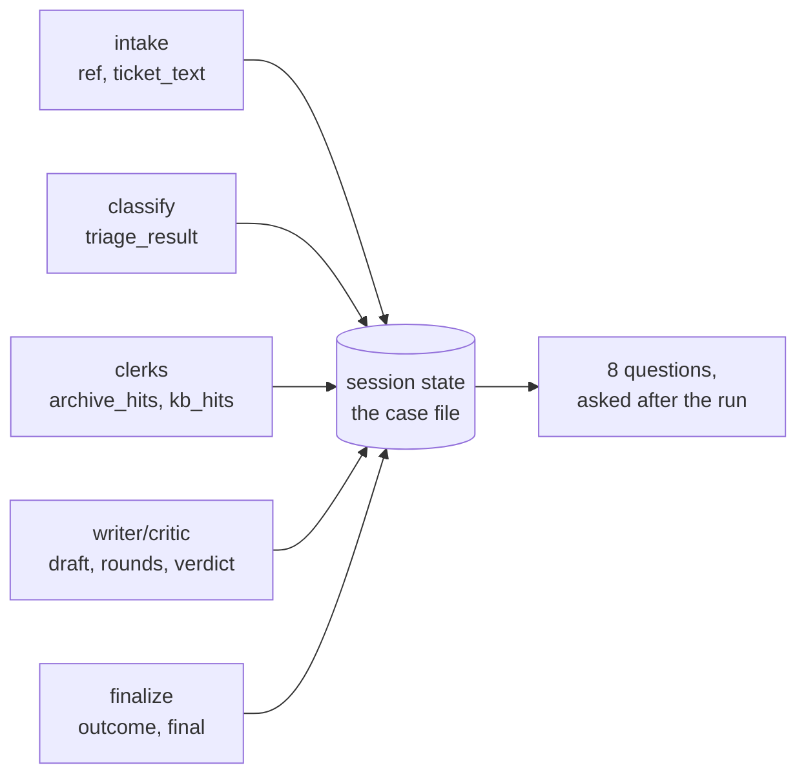

# 6.2 — State is the case file

## One-line answer

The event stream is the run **as it happened**; session state is the run **as it can be queried
afterwards** — and the test of a case file is whether it answers a fixed list of questions without
anybody re-reading the source.

## The story

A car has a service book. Every time it goes in, somebody writes a line: the date, the mileage, what
was done, which parts went in.

The value of that book is not sentimental. It shows up at exactly one moment, which is when you are
selling the car and a stranger is deciding whether to trust it. They flip through it and ask specific
questions. Was the timing belt done, and at what mileage? Has it been serviced every year or are
there gaps? Did the same garage do all of it?

A book that answers those is worth real money. A book with a stamp on every page and no mileage
figures answers none of them, and it is worth nothing — not because it is dishonest, but because it
was written to record that something happened rather than to answer a question somebody would later
ask.

The stranger's questions are known in advance. Everybody who has ever bought a used car asks them.
The book either has the columns or it does not.

## The idea in plain language

Session state is a dictionary that lives for the run: any station can write into it with
`state_delta`, any station can read from it by parameter name
([5.2](../05-the-graph/5.2-on-the-edge-or-in-the-register.md)), and when the run finishes it is still
there.

That last property is what makes it different in kind from the stream. The stream is a sequence you
watch; state is a record you **query**. And a record that can be queried is only useful if you
decided in advance what it would be asked.

So the design method for a case file is backwards from how people usually do it. You do not write
down what each station happens to produce and hope it is enough. You write the list of questions
first, and then check that every one of them has a key behind it.

For this floor the questions are:

| The question | The key that answers it |
| --- | --- |
| Which ticket? | `ref` |
| What did the classifier decide? | `triage_result` |
| What did the archive clerk find? | `archive_hits` |
| What did the knowledge-base clerk find? | `kb_hits` |
| How many writer rounds? | `rounds` |
| What was the critic's last verdict? | `verdict` |
| Was it shipped with a flag? | `flagged` |
| How did the run end? | `outcome` |

That is the artefact. Eight questions, eight keys, and the test of the design is running it.

## Why Sutra needs it

Day 47 made sessions database-backed, so this dictionary already survives the process. Day 61
checkpoints it, and Day 65 kills a run mid-flight and expects it to resume — which is only possible
if everything needed to continue is in the register rather than in a local variable.

The nearer use is the whole of section 7. Every run-level invariant in
[7.1](../07-acceptance/7.1-every-part-passed.md) is a question asked of the case file across many
runs, and an invariant whose key does not exist cannot be checked at all.

## The mechanism

The questions, written down as data rather than as prose:

```python
QUESTIONS = [
    ("which ticket?", "ref"),
    ("what did the classifier decide?", "triage_result"),
    ("what did the archive clerk find?", "archive_hits"),
    ("what did the kb clerk find?", "kb_hits"),
    ("how many writer rounds?", "rounds"),
    ("what was the critic's last verdict?", "verdict"),
    ("was it shipped with a flag?", "flagged"),
    ("how did the run end?", "outcome"),
]
```

**Line by line:**

- The list pairs a **question in English** with the key that should answer it. Writing the question
  down is the part people skip, and it is the part that makes a missing key obvious — an absent key
  in a dictionary is nothing, while an unanswered question is visible.
- It is module-level data, so it can be imported by a test. The same list that prints the table below
  is the list an acceptance check should iterate.

And the lookup, which is deliberately unforgiving:

```python
    for question, key in QUESTIONS:
        value = run.state.get(key, "-- not recorded --")
        text = repr(value)
        print(f"    {question:<36} {text[:70]}")
```

**Line by line:**

- `run.state.get(key, "-- not recorded --")` uses a sentinel that could never be a real value.
  Defaulting to `None` or `""` would make a missing key look like a recorded absence, which is the
  exact confusion [5.2](../05-the-graph/5.2-on-the-edge-or-in-the-register.md) warned about.
- `repr(value)` rather than `str(value)`, so an empty list prints as `[]` and is distinguishable from
  an empty string.

Run it against the ticket that exercises everything:

```bash
cd days/day-58-triage-graph-v1/lab
uv run python casefile.py
```

**Line by line:**

- Default argument is `ticket:4610`. It goes down the full lane, revises once, and cites an article,
  so if any key is going to be populated it will be on this run.

Measured on 2026-09-05:

```text
  case file for ticket:4610
    which ticket?                        'ticket:4610'
    what did the classifier decide?      {'category': 'auth', 'severity': 2, 'needs_human': False, 'notes': 'Ti
    what did the archive clerk find?     ['ticket:4633#0', 'ticket:4701#0']
    what did the kb clerk find?          ['kb:KB-104']
    how many writer rounds?              2
    what was the critic's last verdict?  'APPROVED'
    was it shipped with a flag?          '-- not recorded --'
    how did the run end?                 'replied'
```

Seven of eight questions answered from a dictionary, with no source code and no stream. That is a
case file working.

The eighth is the finding. **`flagged` is not recorded at all** on a run that was approved.

Go and look at why, because the cause is instructive and utterly ordinary. In
[4.2](../04-the-box/4.2-the-brake-belongs-to-the-critic.md) the critic writes `flagged: True` only on
the braking branch:

```python
return Event(
    author="critic",
    output=f"BRAKE after {rounds} rounds, still failing: {failures}",
    actions=EventActions(
        route="SHIP",
        state_delta={"verdict": "FLAGGED", "flagged": True, "failures": failures},
    ),
)
```

**Line by line:**

- `state_delta` here writes three keys, and it is the **only** place `flagged` is ever written.
- The approval branch a few lines above writes `{"verdict": "APPROVED"}` and nothing else, because at
  the moment somebody wrote it, there was nothing to say.

So on a happy run the key is absent, and the case file cannot distinguish *this reply was not
flagged* from *nobody thought about whether to flag it*. Those are different facts and the record
holds neither.

It is worth being precise about the damage, because "a missing boolean" sounds trivial. Anything that
counts flagged replies has to use `state.get("flagged", False)`, which quietly asserts that absence
means false — a reasonable assumption today, and a wrong one the moment a new path ships a reply
without going through the critic at all. The case file has pushed a decision onto every one of its
readers, and each reader will make it independently.

The same run on the founding ticket makes a second gap visible:

```bash
uv run python casefile.py ticket:4521
```

**Line by line:**

- The positional argument picks the ticket. `ticket:4521` is the founding ticket and it takes the
  ordinary handled lane, so the same eight questions are asked of a completely ordinary run.

Measured on 2026-09-05:

```text
  case file for ticket:4521
    which ticket?                        'ticket:4521'
    what did the classifier decide?      {'category': 'auth', 'severity': 2, 'needs_human': False, 'notes': 'Ti
    what did the archive clerk find?     ['ticket:4610#0', 'ticket:4568#0']
    what did the kb clerk find?          []
    how many writer rounds?              1
    what was the critic's last verdict?  'APPROVED'
    was it shipped with a flag?          '-- not recorded --'
    how did the run end?                 'replied'
```

`kb_hits` is `[]` — recorded, and empty. That is the case file doing its job properly: the clerk ran,
found nothing, and said so, which is exactly the distinction `flagged` fails to make. One approved
reply, one round, and no knowledge-base article behind it, all queryable.

Hold on to that row. [8.1](../08-in-production/8.1-the-green-run-that-helped-nobody.md) is about what
it means.



## When it breaks

The break is the one above, generalised: **a case file records what stations chose to say, and
nobody owns the whole of it.**

Six stations write into this register. Each one wrote what was in front of it. No station was
responsible for the case file as an artefact, so nothing made anyone ask "is `flagged` always
present?" — and the only reason it was noticed here is that the question list exists and the sentinel
is loud.

Try it the other way round to see how easily it hides. Replace the sentinel with the obvious default:

```python
        value = run.state.get(key, False)
```

**Line by line:**

- `False` is a plausible default for a boolean field and it is what most code does.
- The row now prints `False`, which is *correct*, and which is also indistinguishable from a genuine
  recorded `False`. The gap disappears from the table, and it has not disappeared from the system.

The second break is one this floor genuinely has and this part is the place to name it. **State keys
are not namespaced.** `rounds`, `verdict`, `critique` and `draft` are written by stations inside the
box; `ref`, `evidence` and `outcome` by the floor. They do not clash today.
[4.1](../04-the-box/4.1-the-newsroom-drops-in-as-one-node.md) explained why that is luck rather than
design: add a second nested workflow with its own `rounds` and the two counters become one, silently,
with the second box reading the first's value.

There is no error text for either of these, and that is the honest summary of this part. A case file
does not fail. It is quietly incomplete, and the only instrument that finds that is a written list of
questions and a sentinel loud enough to see.

## In production

**What a professional writes instead.** The case file is a **declared type**, not an accumulated
dictionary. `Workflow` accepts a `state_schema`, and using it means the eight keys above are fields
with types and defaults, so `flagged` is `False` because the schema says so rather than because every
reader guessed. It also means a station writing a key nobody declared is an error rather than a
surprise in three weeks.

They also record **provenance** alongside content: which model version produced the verdict, which
retrieval index the clerks searched, which code version ran. That is the same argument
[4.3](../04-the-box/4.3-the-stamp-that-may-not-change-the-answer.md) made about the stamp, and the
reason it belongs in the case file is that "why did this run behave differently from that one" is
answerable only if both runs said what they were made of.

**What degrades at scale.** The register is written on every `state_delta`, and from Day 61 it is
copied into every checkpoint. `ticket_text` sits in it for the whole run, so a long customer email is
serialised repeatedly. The production habit is identifiers in the case file and bodies in storage —
which also makes Day 69's question much easier, because the case file then contains references to
customer data rather than copies of it.

**The failure mode that only appears with real traffic.** The case file is complete for the paths you
tested. A new lane ships — an auto-close for duplicates, say — that never touches the critic, and
every run down it has no `verdict` and no `rounds`. The dashboard counting approvals silently starts
under-reporting, and because it was already using `.get(key, default)`, nothing anywhere raises. The
defence is asserting completeness per outcome: every run that ended `replied` must have all eight
keys, and that assertion belongs in the gate.

**The review comment a senior engineer leaves:** *"`flagged` is only written on the braking branch, so
on the happy path the key is absent and every consumer has to default it. Write it on both branches,
or better, declare the state schema so the default lives in one place. Right now 'not flagged' and
'never considered' are the same value and we will eventually care about the difference."*

**The interview question:** *"After a run finishes, what can you find out about it?"* The answer that
shows you have designed one rather than inherited one: *"We keep a fixed list of eight questions —
which ticket, what the classifier decided, what each retriever found, how many drafting rounds, the
critic's verdict, whether it shipped flagged, how it ended — and every one maps to a session state
key. Writing the questions down first is the point: when I ran it, seven were answered and the eighth
came back as a sentinel, because the flag was only ever written on the failing branch. That is the
characteristic failure of a case file. It does not error, it is quietly incomplete, and every reader
papers over the hole with a different default."*

## Check yourself

```bash
cd days/day-58-triage-graph-v1/lab
uv run python casefile.py
uv run python casefile.py ticket:4521
uv run python casefile.py ticket:4562
```

The third run escalated. Write down which of the eight questions it can answer and which it cannot,
then decide which of the unanswerable ones are genuinely not applicable and which are gaps.

**Out loud, without scrolling up:** give the design method for a case file, and explain why
`'-- not recorded --'` is a better default in that script than `False`.

**Next:** [6.3 — A reply to a ticket that does not exist](6.3-a-reply-to-a-ticket-that-does-not-exist.md).
