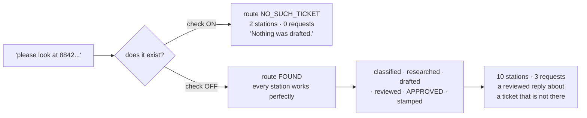

# 6.3 — A reply to a ticket that does not exist

## One-line answer

Turn off the one existence check at the mouth and the floor does not fail — it **launders**: every
station works perfectly on a request that names nothing, and out the far end comes a reviewed,
approved reply about `ticket:8842`, for three model calls, with exit code 0.

## The story

A bill arrives for a house number that is not on the street.

Somewhere a meter reading was entered against an address that does not exist. Nothing rejected it,
because the field accepted the format. The billing run picked it up and applied the tariff — correctly,
using the right tariff. The tax was added, correctly. The discount for paying by direct debit was
applied, correctly. The envelope was printed and addressed and posted.

Every step in that chain did its job properly. Nobody was careless. The tariff is right, the tax is
right, the arithmetic is right, and the bill is for a house that is not there.

And here is the part that makes it hard to fix afterwards: the bill *looks* more trustworthy than a
handwritten note would. It has a reference number and a breakdown and a payment stub. Every stage it
passed through added a layer of officialness, and none of them added a single check that the house
exists — because that was the first stage's job, and the first stage let it through.

## The idea in plain language

**Laundering** is what a pipeline does to bad input. It does not average it away and it does not
amplify it. It *processes* it, and each stage adds legitimacy: a category, a retrieved source, a
review stamp. What comes out is not merely wrong. It is wrong and **audited**, which is worse,
because the audit is the thing people trust.

[1.3](../01-the-floor/1.3-one-station-decides-what-is-real.md) made the argument for checking
existence at the mouth. This part is the measurement, and the measurement matters because the
argument is easy to nod along to and hard to feel. "Validate your input" is advice everyone agrees
with and half of everyone skips, because the cost of skipping it is invisible until you make it
visible.

The ablation is one boolean. `KNOBS.validate_at_mouth` is `True` in the shipped floor; setting it
`False` makes `intake` fall back to using whatever the caller typed as the ticket text, instead of
routing to `NO_SUCH_TICKET`. Nothing else about the floor changes. Same stations, same edges, same
rubric, same critic.

That is the honest way to argue for a control: **run the system with it and without it, and show both
outputs.** A control that has never been switched off is a control nobody has priced.

## Why Sutra needs it

Day 59 opens the containment lab and the `NO_SUCH_TICKET` route is the first drill. Day 66's threat
model asks a harder version of the same question — not *does this ticket exist* but *should I be
believing what is inside it* — and the answer has the same shape: a boundary at the mouth, drawn
once, cheaply.

Day 4 met the single-agent version of this: an agent asked about a ticket that did not exist
apologised for a problem nobody had. What follows is why the pipeline version is worse rather than
merely bigger.

## The mechanism

The ablation, in `intake`:

```python
    ref = normalise_ref(node_input)
    if ref not in DOCS:
        if KNOBS.validate_at_mouth:
            return Event(
                author="intake",
                output=f"no ticket with ref {ref!r}",
                actions=EventActions(route="NO_SUCH_TICKET", state_delta={"ref": ref}),
            )
        text = node_input
        return Event(
            author="intake",
            output=TicketText(ref=ref, text=text),
            actions=EventActions(route="FOUND", state_delta={"ref": ref, "ticket_text": text}),
        )
```

**Line by line:**

- The `if ref not in DOCS` branch is entered identically in both arms. The reference is bad either
  way; the only question is what the station does about it.
- With the check on, it routes `NO_SUCH_TICKET` and the run ends two stations later.
- With the check off, `text = node_input` uses **the caller's raw request** as if it were the
  ticket's body. This is not a strawman: it is the most natural thing to write when you want the
  system to be helpful rather than pedantic, and it reads as robustness.
- The route emitted is `FOUND`. That single word is the lie the rest of the floor believes, and every
  station downstream is entitled to believe it
  ([1.3](../01-the-floor/1.3-one-station-decides-what-is-real.md)'s rule).
- `state_delta={"ref": ref, "ticket_text": text}` writes the fabricated ticket into the register,
  where the clerks will read it ([5.2](../05-the-graph/5.2-on-the-edge-or-in-the-register.md)).

The request used for the demonstration is deliberately realistic:

```python
REQUEST = "please look at 8842, the customer says the password reset link is not working"
```

**Line by line:**

- It is the shape of a real message from a colleague: a reference and a sentence of context. Not
  `""`, not `"asdf"` — those get caught by everything.
- `8842` parses cleanly to `ticket:8842`, so this is not a parsing failure. The reference is
  well-formed and names nothing.
- The trailing description contains `password` and `reset`, which the classifier's rules match. That
  matters: if the text were meaningless the classifier would return `other` and the ticket would
  escalate, which is the safe lane. **The laundering only happens when the nonsense is plausible.**

Run both arms:

```bash
cd days/day-58-triage-graph-v1/lab
uv run python launder.py
```

**Line by line:**

- No flag means the check is on. This is the shipped behaviour.

Measured on 2026-09-05:

```text
  validate_at_mouth = True
  request: 'please look at 8842, the customer says the password reset link is not working'

  intake                 | no ticket with ref 'ticket:8842'
  no_such_ticket         | NOT FOUND: no ticket with ref 'ticket:8842'. Nothing was drafted.

  outcome     'not_found'
  model calls 0
```

Two stations. Zero requests. `Nothing was drafted.` Now switch the check off:

```bash
uv run python launder.py --off
```

**Line by line:**

- `--off` sets `KNOBS.validate_at_mouth = False`. It is the only difference between the two runs.

Measured on 2026-09-05:

```text
  validate_at_mouth = False
  request: 'please look at 8842, the customer says the password reset link is not working'

  intake                 | TicketText(ref='ticket:8842', text='please look at 8842, the customer says the password reset...
  classify               | TriageResult(category='auth', severity=2, needs_human=False, notes='please look at 8842, the ...
  archive_clerk          | ['ticket:4633#0', 'ticket:4562#0']
  kb_clerk               | []
  evidence_join          | {'archive_clerk': ['ticket:4633#0', 'ticket:4562#0'], 'kb_clerk': []}
  assemble_evidence      | EvidenceBlock(ref='ticket:8842', archive=['ticket:4633#0', 'ticket:4562#0'], kb=[])
  writer                 | Thanks for reporting ticket:8842. We have seen this before in ticket:4633#0.
  critic                 | APPROVED
  box_output             | ReviewedDraft(text='Thanks for reporting ticket:8842. We have seen this before in ticket:4633...
  finalize               | FinalReply(ref='ticket:8842', reply='Thanks for reporting ticket:8842. We have seen this befo...

  outcome     'replied'
  model calls 3
  reply       'Thanks for reporting ticket:8842. We have seen this before in ticket:4633#0.'
  cites       []
```

Read that station by station, because the horror is in how well everything worked.

`intake` produced a well-formed `TicketText`. `classify` read it and returned `auth`, severity 2 —
**a correct classification of the sentence it was given**. The archive clerk searched by meaning and
found two genuinely password-related tickets; that retrieval is not wrong either. The join merged
them. `assemble_evidence` declared the baton. The writer wrote a grammatical, on-topic reply. The
critic applied its rubric and found nothing to complain about. `finalize` extracted the citations,
found none, and stamped the run `replied`.

Ten stations. Not one of them made a mistake. And the product is:

```text
Thanks for reporting ticket:8842. We have seen this before in ticket:4633#0.
```

A reply about a ticket that does not exist, telling the customer it has been seen before, citing a
real ticket from someone else's account.

The arithmetic of the two arms is the argument in one line: **2 stations and 0 requests, against 10
stations and 3 requests.** The check does not cost anything. It saves three requests out of a daily
twenty and prevents a false reply, and the only thing standing between the two outcomes is a
dictionary membership test.



## When it breaks

The failure has already happened above; what breaks *afterwards* is the ability to notice.

Look at what the case file says about that run, and compare it with a genuine one from
[6.2](6.2-state-is-the-case-file.md):

- `outcome` is `'replied'`, exactly like a real run.
- `verdict` is `'APPROVED'`, exactly like a real run.
- `rounds` is 1, which is the most common value on real runs.
- `cites` is `[]`, which [8.1](../08-in-production/8.1-the-green-run-that-helped-nobody.md) shows is
  true of twenty out of twenty-four genuine replies.

**There is no field in the case file that distinguishes this run from a good one.** Every acceptance
check in section 7 passes on it. Every dashboard counts it as a successful reply. The only artefact
that shows anything is wrong is the reply text itself, and the reply text is the one thing nobody
reviews at volume because there are thousands of them and they all look fine.

That is the property that makes laundering different from ordinary bugs, and it is worth stating
plainly: **an ordinary bug makes your metrics worse; laundering makes them better.** Turning the
check off increases the number of tickets successfully replied to. If you were optimising for reply
rate, this ablation would look like an improvement.

There is a second, quieter consequence in that output. The archive clerk returned
`ticket:4633#0` and `ticket:4562#0` — real tickets, from the real archive, belonging to real
customers — and the reply quoted one of them back at a request that came from outside. A boundary
failure at the mouth became a **data disclosure** at the far end, because the pipeline's job is to
fetch internal documents and put them in a reply. Day 66 will call that the lethal trifecta, and this
is the smallest possible worked example of it.

## In production

**What a professional writes instead.** The existence check is not a boolean in a config object; it
is unconditional, and the "helpful" fallback does not exist in the code at all. There is a real
version of the helpfulness, though, and it is worth building: when a reference does not resolve, the
right answer is often *ask*, not *guess* — a clarification back to the requester, which is Day 62's
elicitation shape. The distinction is that asking is a lane on the graph, with its own terminal
station, and guessing is a station pretending.

They also make the fabricated case impossible to represent. `TicketText` in this lab can be
constructed with any `ref`; a production version takes the record from the repository rather than the
reference from the request, so there is no way to build one for a ticket that was never read. The
strongest boundary is the one where the invalid state cannot be expressed, not the one where it is
checked.

**What degrades at scale.** The mouth is where identity and permission checks belong too, and they
have the same shape as this one. At scale the question stops being *does this ticket exist* and
becomes *does this ticket exist and may this caller see it* — and a system that got the first check
wrong will get the second wrong in the same place. That is Day 68's least-privilege argument arriving
at the front door.

**The failure mode that only appears with real traffic.** Requests do not come from you. They come
from an email integration, a chat command, a webhook retry, a colleague pasting a reference from a
different system entirely — and a reference from a different system is *exactly* the shape of this
failure: well-formed, plausible, and naming nothing here. That is not an edge case, it is a Tuesday,
and it is why the check has to be structural rather than a thing you remember.

**The review comment a senior engineer leaves:** *"If the reference does not resolve, this falls back
to treating the request text as the ticket body. That means a reference from another system produces
a fully-drafted, critic-approved reply quoting our internal tickets back at whoever asked. Delete the
fallback. If we want to be helpful about unresolvable references, that is a clarification lane with
its own terminal node, not a default inside intake."*

**The interview question:** *"What is the worst bug you have had in a pipeline?"* The answer worth
giving: *"Not a crash — a laundering bug. Our first station stopped rejecting references that did not
resolve and started treating the request text as the ticket body. Nothing failed. The classifier
classified it correctly, retrieval found genuinely related tickets, the writer wrote a good reply, the
critic approved it, and we sent someone a reply about a ticket that did not exist, quoting a real
customer's ticket at them. Three model calls, exit code 0, and the case file was indistinguishable
from a successful run — same outcome, same verdict, same round count. The thing I took away is that
laundering does not make your metrics worse. It makes them better, because it converts rejections
into successful replies, so you cannot find it by watching for a regression."*

## Check yourself

```bash
cd days/day-58-triage-graph-v1/lab
uv run python launder.py
uv run python launder.py --off
```

Now change `REQUEST` to something with no recognisable words — `"please look at 8842"` on its own —
and run the `--off` arm again. Write down which lane it took and why, then say what that tells you
about when laundering does and does not happen.

**Out loud, without scrolling up:** define laundering, give the two runs' cost in stations and
requests, and name the property that makes it impossible to detect from the metrics.

**Next:** [6.4 — The seam that drifted](6.4-the-seam-that-drifted.md).
