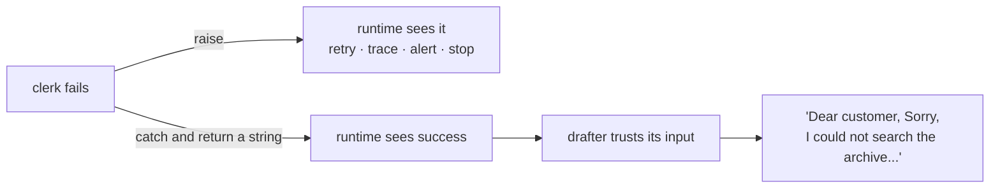

# 6.4 — The seam that drifted

## One-line answer

When a station stops honouring a contract, **the failure appears where the value is used, not where
it was produced** — and a station that catches its own error to be helpful converts that distance
into an apology printed inside the customer's reply.

## The story

A tailor takes your measurements and writes them on a slip: chest, waist, sleeve. The slip goes to
the cutter in the back room, who cuts the cloth, and then to the machinist, who sews it.

The tailor measures in inches. The cutter, new this month, reads the slip as centimetres.

Nothing goes wrong in the front room. The tailor did the job properly and the numbers on the slip are
correct. Nothing goes obviously wrong in the cutting room either — the cutter cuts confidently to the
numbers in front of them, and cloth is cloth. The first person who knows is the machinist, holding
pieces that will not go together, in a room where nobody took a measurement and nobody made a
mistake.

Ask the machinist what went wrong and they will tell you about the pieces. They are describing the
place the problem surfaced, and the place the problem surfaced is the one place it did not happen.

## The idea in plain language

[1.2](../01-the-floor/1.2-the-baton-has-a-declared-shape.md) showed a declared seam catching a bad
value **at the edge**, before the receiving station's body ran. That is the good case, and it is good
precisely because the failure and its cause are in the same place.

This part is about the two ways that property gets lost.

**The value travels further than the contract does.** Not every hop on this floor is a declared edge.
The research floor's output reaches the writer through *session state*, not along an edge — the
writer reads `evidence` from the register
([5.2](../05-the-graph/5.2-on-the-edge-or-in-the-register.md)). State has no annotations, so nothing
validates it, and a station that fails to write a key produces a failure wherever somebody reads it.
The adk.dev routes page, fetched 2026-09-05, describes this for joins in one sentence: *"A predecessor
that finishes without an output leaves the join with no value for that branch, and the resulting
failure appears downstream, away from the node that caused it."*

**Somebody catches the error.** This is trap #4 from the plan's §5.1, and it is the more damaging of
the two because it does not merely move the failure, it **deletes** it. A station that catches an
exception and returns a friendly string has *succeeded* as far as the runtime is concerned: the node
completed, the event was emitted, the trace span is green, no retry policy fires, and the string is
handed to the next station as if it were data.

## Why Sutra needs it

Day 21 established that errors surface rather than being swallowed, and that day's paper is the
end-to-end argument. This is the pipeline-scale version: a floor with ten stations has nine places to
put a `try` block that turns a failure into a sentence.

It also matters for what comes next. Day 59 contains runaway agents, and containment depends on the
runtime being able to *see* that something went wrong. Day 60's retries and Day 61's checkpoints have
the same dependency. Every mechanism in Phase 9 is built on exceptions actually being exceptions.

## The mechanism

Start with the distance. The ablation switch is in `assemble_evidence`, the one station whose job is
to declare the join's output ([3.2](../03-the-research-floor/3.2-the-join-hands-over-a-dict.md)):

```python
    if KNOBS.drift_baton:
        return Event(author="assemble_evidence", output=node_input)
```

**Line by line:**

- It returns the join's raw dictionary instead of building an `EvidenceBlock`. That is a one-line
  change and it is the shape of a real refactor: somebody decides the adapter is redundant because
  "the dict already has everything".
- Crucially it **also skips the `state_delta`**, so `evidence` is never written to the register. That
  is not an extra bug bolted on; it is what actually happens when you delete an adapter, because the
  state write lived inside it.
- The event is emitted successfully. The station reports that it worked.

Run the whole floor with it:

```bash
cd days/day-58-triage-graph-v1/lab
uv run python drift.py --drift
```

**Line by line:**

- `--drift` sets `KNOBS.drift_baton = True`; without it the script runs the normal floor, which is
  the comparison arm.
- The script prints the traceback rather than swallowing it, because the traceback is the teaching.

Measured on 2026-09-05:

```text
  File "C:\Users\nisha_gnzw\AppData\Roaming\Python\Python312\site-packages\google\adk\workflow\_base_node.py", line 166, in run
  File "C:\Users\nisha_gnzw\AppData\Roaming\Python\Python312\site-packages\google\adk\workflow\_function_node.py", line 542, in _run_impl
  File "C:\Users\nisha_gnzw\OneDrive\Desktop\Projects\sutra\days\day-58-triage-graph-v1\lab\_stations.py", line 376, in writer
  File "C:\Users\nisha_gnzw\AppData\Roaming\Python\Python312\site-packages\pydantic\main.py", line 263, in __init__
pydantic_core._pydantic_core.ValidationError: 1 validation error for EvidenceBlock
ref
  Field required [type=missing, input_value={}, input_type=dict]
    For further information visit https://errors.pydantic.dev/2.13/v/missing
```

Read the third line of that traceback: **`in writer`**.

The station that failed is the writer. The station that caused it is `assemble_evidence`, two
stations earlier, on the other side of a join, in a different file section. In between, the run
passed through the box's boundary and started a new nested workflow, and none of that appears in the
error.

Look at what the writer was actually doing:

```python
    block = EvidenceBlock(**(evidence or {}))
```

**Line by line:**

- `evidence` came from the register and is `None`, because nothing wrote it.
- `evidence or {}` turns that into an empty dictionary — the defensive default that
  [5.2](../05-the-graph/5.2-on-the-edge-or-in-the-register.md) warned about.
- `EvidenceBlock(**{})` then fails on the first required field, `ref`. The writer is correct code
  being handed nothing, and it is the one holding the traceback.

Note also `input_value={}`. The error faithfully reports the value it received, and the value it
received is the *default*, not the missing key. The most useful clue — that nothing wrote `evidence`
at all — has already been erased by the `or {}` one line earlier.

Now the second mechanism, which is what happens when somebody decides that traceback is unfriendly.
`swallow.py` is two stations, a clerk and a drafter, and the clerk's archive is unreachable:

```python
def clerk(node_input: str) -> Event:
    """The evidence clerk, with the archive unreachable."""
    try:
        raise ConnectionError("archive index unavailable")
    except ConnectionError as exc:
        if SWALLOW:
            return Event(author="clerk", output=f"Sorry, I could not search the archive: {exc}")
        raise


def drafter(node_input: str) -> Event:
    """The next station, which trusts its input because a station is entitled to."""
    return Event(author="drafter", output=f"Dear customer, {node_input}")
```

**Line by line:**

- `raise ConnectionError(...)` stands in for any real failure of a station that talks to something:
  a database, an index, an HTTP call.
- The `except` block is the whole subject. With `SWALLOW` off it re-raises, which is correct. With it
  on, it returns a **string** describing the problem, which is the single most common way this gets
  written.
- `drafter` does exactly what every station on this floor does: it trusts its input and builds on it.
  It is not defensive, and it should not be — that is
  [1.3](../01-the-floor/1.3-one-station-decides-what-is-real.md)'s rule.

Both arms:

```bash
uv run python swallow.py
uv run python swallow.py --swallow
```

**Line by line:**

- The first run lets the exception out; the second catches it. Nothing else differs.

Measured on 2026-09-05:

```text
  swallow = False
  clerk      None
  run raised
```

```text
  swallow = True
  clerk      'Sorry, I could not search the archive: archive index unavailable'
  drafter    'Dear customer, Sorry, I could not search the archive: archive index unavailable'
  run finished, exit 0
```

**`Dear customer, Sorry, I could not search the archive: archive index unavailable`.**

That is the apology becoming the reply. The drafter did nothing wrong; it composed a letter from the
evidence it was given, and the evidence it was given was an error message. The run finished. Exit
code 0.

Count what the swallow cost, because each item is a separate mechanism that stopped working:

| Lost | Why |
| --- | --- |
| the retry | `RetryConfig` fires on exceptions; a returned string is a success |
| the trace | the span is green, so nothing looks wrong in the timeline |
| the alert | error rate is zero, because there was no error |
| the containment | Day 59's guards watch for failures they can see |
| the truth | the customer got the internal error text |



## When it breaks

The two mechanisms above compose, and the composition is the version that reaches production.

Put the swallow in `assemble_evidence` — catch the `ValidationError`, return an empty
`EvidenceBlock`, log a warning — and the drift failure stops raising anywhere at all. The writer
receives a valid, empty evidence block. It writes:

```text
Thanks for reporting ticket:4610.
```

No archive reference, no article, no fix. The critic's rubric is guarded on `if block.kb`
([4.2](../04-the-box/4.2-the-brake-belongs-to-the-critic.md)), and `block.kb` is empty, so there is
nothing to check and the draft is `APPROVED`. `finalize` extracts no citations, records `cites: []`,
and stamps the run `replied`.

That is a run indistinguishable from the twenty genuine ones
[8.1](../08-in-production/8.1-the-green-run-that-helped-nobody.md) counts, produced by a research
floor that was completely broken. The exception that would have told you took two steps: it moved
downstream, and then somebody caught it.

There is one more thing worth knowing about the raising arm, because it affects what you can assert.
In the un-swallowed run above the stream still contains an event — `clerk None` — before the
exception propagates. A run that died and a run that finished quietly both produce events, which is
why [6.1](6.1-the-event-stream-is-the-story.md) insists the useful check is *did the run end at a
terminal station*, not *did we get events*.

## In production

**What a professional writes instead.** Where a station genuinely must handle a failure, it handles
it by **routing**, not by returning prose — the same rule
[1.3](../01-the-floor/1.3-one-station-decides-what-is-real.md) applied at the mouth. A clerk whose
index is unreachable emits `route="EVIDENCE_UNAVAILABLE"` and the graph has an edge for it, going
somewhere that does not draft. The failure is then a first-class outcome with a terminal station and
a name in the case file, rather than a string pretending to be evidence.

They also attach `RetryConfig` to exactly the stations that can fail transiently, which the adk.dev
routes page recommends specifically for join predecessors:
*"attach a retry configuration to any node that can fail."*
[8.3](../08-in-production/8.3-thirty-nodes-a-queue-and-a-timeout.md) shows it working. The point
here is that the retry is a *consequence* of not swallowing — catch the error and there is nothing
for the policy to act on.

**What degrades at scale.** Distance grows with the graph. On a ten-station floor the drift travelled
two stations; on a forty-station graph with three nested workflows it travels further and crosses
more boundaries, and the traceback names a file whose author has never heard of the station that
caused the problem. This is the argument for declaring seams **everywhere**, including the state
schema, rather than only on the edges where it was convenient.

**The failure mode that only appears with real traffic.** Swallowing is introduced by an incident,
not by carelessness. Something falls over at four in the afternoon, a station raises, runs fail, and
the fastest fix is a `try` block that keeps the pipeline moving. It works, the incident closes, and
the swallow stays. Six months later nobody knows the error rate is zero because errors are being
converted into sentences. The countermeasure is a review rule rather than a technical one: a `try`
around a station's work needs a route in the same commit.

**The review comment a senior engineer leaves:** *"This catches `ConnectionError` and returns a
string. The runtime now thinks the node succeeded, so the retry policy never fires, the span is
green, and our error rate stays at zero while the text goes into the draft. If we need to survive a
missing index, emit a route and give it an edge — and let everything we did not anticipate raise."*

**The interview question:** *"Where do you handle errors in a pipeline like this?"* The answer that
shows you have cleaned one up: *"As far up as possible, and never by returning a value. On this
runtime a node that catches and returns a string has succeeded — the retry policy will not fire, the
trace span is green, the error rate stays at zero, and the string is fed to the next station as data.
I have seen the literal output `Dear customer, Sorry, I could not search the archive`, sent, exit code
0. The other half of it is distance: a station that stops writing a state key does not fail there, it
fails wherever somebody reads it, which for us was two stations later inside a nested workflow. So we
declare the seams, we route on expected failures instead of returning prose, and we let everything
else raise."*

## Check yourself

```bash
cd days/day-58-triage-graph-v1/lab
uv run python drift.py
uv run python drift.py --drift
uv run python swallow.py --swallow
```

Now add a `try`/`except ValidationError` around the `EvidenceBlock(...)` construction in `writer`
that returns an empty block, run `uv run python drift.py --drift` again, and write down what the
customer receives, what the case file says, and what the error rate would be.

**Out loud, without scrolling up:** name the five things a swallowed exception costs you, and explain
why the traceback in the drift run points at a station that did nothing wrong.

**Next:** [7.1 — Every part passed, the thing does not fit](../07-acceptance/7.1-every-part-passed.md).
