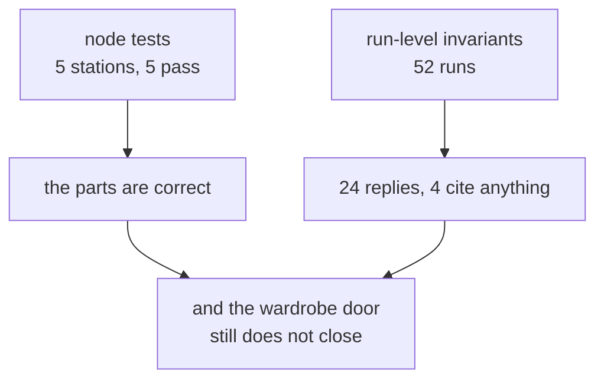

# 7.1 — Every part passed, the thing does not fit

## One-line answer

Node tests prove stations; a pipeline needs **statements about whole runs**, and this floor's node
tests all pass while four of twenty-four replies cite a source — which is a fact no test of any
single station could have produced.

## The story

A flat-pack wardrobe arrives in three boxes. You lay the pieces out on the floor and check them
against the list. Every panel is there. None is cracked. The screws are in the right little bags,
the correct count in each. The instructions are for this model.

Everything on the list is correct, and you have checked it properly.

Four hours later there is a wardrobe standing in the corner and the door does not close. Nothing is
broken. The door is the right door and the frame is the right frame, and somewhere in the sequence
two panels went together the wrong way round, and every individual piece is still exactly what it
said on the list.

The parts check told you that you had a wardrobe's worth of wardrobe. It could not tell you whether
what you built was a wardrobe, because that is not a property any part has.

## The idea in plain language

There are two levels at which this floor can be tested, and they answer different questions.

A **node test** takes one station, gives it an input, and checks its output. Day 23 built these:
`normalise_ref("#4521")` returns `"ticket:4521"`; `intake("8842")` routes `NO_SUCH_TICKET`;
`finalize` extracts `["KB-104"]` from a draft mentioning it. They are fast, they are precise, and
when one fails you know exactly which function to open.

A **run-level invariant** is a statement about a whole run, asserted over many runs. *Every reply
cites something. An escalated run produces no draft. No run spends more than six model calls. Every
run records an outcome.* None of these is a property of a station. Each of them is a property of the
**path** a ticket took, and the path is the thing assembly created.

The word "invariant" is worth defining precisely because it is stronger than "test". An invariant is
something that must be true of **every** run, not of a chosen example. So it is checked by running
the whole corpus and counting, rather than by picking a ticket and asserting.

That difference is the reason this part exists. A node test is a claim about code. An invariant is a
claim about behaviour, and behaviour is what you sell.

## Why Sutra needs it

Day 23 tested tools and callbacks; Day 31 wired the quality gate. Both work at the station level, and
by Day 58 the station level has stopped being sufficient — the floor has ten stations, four lanes and
a loop, and none of the interesting failures in section 6 lived inside a station.

Day 59 turns these invariants into the Phase 8 gate, Day 65 does the same for Phase 9, and Phase 12
turns them into evals that run nightly. The checks do not change; only the automation ascends. Which
means the ones written here are the ones you will live with.

## The paper behind it

> **End-to-end arguments in system design**
> doi:10.1145/357401.357402 (1984) · <https://doi.org/10.1145/357401.357402>

It argued that a correctness check can only be complete at the ends of a system, so checks placed in
the middle are optimisations rather than guarantees.

Taught in
[Day 21 — End-to-end arguments](../../../day-21-errors-surface-not-swallow/papers/01-end-to-end-arguments.md).
Its bearing here is exact and slightly uncomfortable: every node test on this floor is a check in the
middle. They are worth having — they localise faults, which is the optimisation the paper allows —
but the claim *the desk sends good replies* can only be checked at the end, over whole runs, which is
what the second half of this part does.

## The mechanism

The node tests first, so the contrast is fair:

```python
    return [
        ("normalise_ref('#4521') is ticket:4521", normalise_ref("#4521") == "ticket:4521"),
        ("intake routes on a miss", intake("8842").actions.route == "NO_SUCH_TICKET"),
        (
            "classify fills the form",
            isinstance(
                classify(TicketText(ref="ticket:4610", text=DOCS["ticket:4610"])).output,
                TriageResult,
            ),
        ),
        (
            "kb_clerk returns a list",
            isinstance(
                kb_clerk(
                    TriageResult(category="auth", severity=2), ticket_text=DOCS["ticket:4610"]
                ).output,
                list,
            ),
        ),
        (
            "finalize extracts citations",
            finalize(
                ReviewedDraft(text="see KB-104", verdict="APPROVED", rounds=1),
                ref="ticket:4610",
            ).output.cites
            == ["KB-104"],
        ),
    ]
```

**Line by line:**

- Every one of these calls a station **directly**, with no graph and no runner. That is possible
  because the state-bound parameters have defaults
  ([5.2](../05-the-graph/5.2-on-the-edge-or-in-the-register.md)), and it is the main practical
  benefit of writing stations as plain functions.
- `intake("8842").actions.route` reaches into the event's actions rather than its output, because
  what is being tested is the routing decision
  ([2.2](../02-the-guess/2.2-the-route-is-an-action.md)).
- The classifier check asserts the **type**, not the category. Asserting that a particular ticket
  classifies as `auth` would be testing the rule list, which changes; asserting the output is a
  `TriageResult` is testing the contract, which should not.
- `kb_clerk(...)` is checked for returning a list, not for returning a *particular* article — and
  that weakness is deliberate and is exactly what the second half of this part is about. A stricter
  version would have to encode which article, which is a fact about the corpus rather than the code.
- `finalize(...)` is called with a hand-built `ReviewedDraft`, which is possible because it is pure
  ([4.3](../04-the-box/4.3-the-stamp-that-may-not-change-the-answer.md)).

Then the invariants, which need whole runs:

```python
    for ref in tickets:
        run = drive(graph, ref)
        state = run.state
        if state.get("outcome") == "replied":
            replied += 1
            cited += bool((state.get("final") or {}).get("cites"))
        if state.get("outcome") == "escalated" and state.get("draft"):
            escalated_with_draft += 1
        if run.total_calls > BUDGET:
            over_budget += 1
        if "outcome" not in state:
            no_record += 1
```

**Line by line:**

- `for ref in tickets` runs **every ticket in the archive**, fifty-two full runs. That is the
  difference between an invariant and a test: an invariant that has been checked on one example has
  not been checked.
- `state.get("outcome") == "replied"` reads the case file rather than the stream, because these are
  questions about the *result* of a run. [6.2](../06-the-run/6.2-state-is-the-case-file.md) is what
  makes each of these one line.
- `bool((state.get("final") or {}).get("cites"))` is the citation invariant, and it reads the field
  `finalize` extracted from the reply text — so it is measuring what the customer would actually
  receive, not what evidence was available.
- `state.get("escalated") and state.get("draft")` is the blast-radius invariant from
  [2.4](../02-the-guess/2.4-the-lane-that-declines-the-work.md), asserted rather than assumed: a
  ticket the machine declined must have no draft sitting in its case file.
- `run.total_calls > BUDGET` is the cost invariant. `BUDGET = 6` comes from
  [3.3](../03-the-research-floor/3.3-what-a-lane-costs.md)'s worst lane plus one, and it is the check
  that catches the ratio drifting.
- `"outcome" not in state` catches a run that finished without any station recording how it ended,
  which is the case-file completeness check.

Run both levels together:

```bash
cd days/day-58-triage-graph-v1/lab
uv run python invariants.py
```

**Line by line:**

- The node tests print first and the invariants second, on purpose. The whole argument of this part is
  in the gap between the two blocks.

Measured on 2026-09-05:

```text
  node-level tests
    PASS  normalise_ref('#4521') is ticket:4521
    PASS  intake routes on a miss
    PASS  classify fills the form
    PASS  kb_clerk returns a list
    PASS  finalize extracts citations

  run-level invariants, over the whole archive
    replies                          24
    replies that cite something      4   <-- should equal replies
    escalated runs carrying a draft  0
    runs over the 6-call budget      0
    runs with no recorded outcome    0
```

Five node tests, five passes. Every station on this floor does exactly what it was written to do.

**Four of twenty-four replies cite a source.**

Twenty replies went out saying, in effect, *thanks for reporting this, we have seen it before* — with
no article, no fix, and no instruction the customer can act on. Each of them was approved by the
critic, stamped by `finalize`, and recorded as `outcome: replied`.

No node test could have found that. Trace back through which station is at fault and the answer is
that **none of them is**:

- `kb_clerk` searched and found nothing. It returned a list, correctly. Its test passes.
- The critic's rubric checks for a citation `if block.kb` — and when the clerk found nothing, there
  is nothing to require. Its logic is correct.
- `finalize` extracted the citations that were in the draft. There were none. Correct.

The bug is in the composition: the critic's standard depends on retrieval's success, so a retrieval
failure silently lowers the bar instead of raising an alarm. That relationship exists in no single
function, so it can only be caught by a statement about the run.

The other three invariants passing matters too, and it is worth not skipping. Zero escalated runs
carry a draft, which means [2.4](../02-the-guess/2.4-the-lane-that-declines-the-work.md)'s
blast-radius argument holds in practice and not just in the diagram. Zero runs exceed the budget.
Every run recorded an outcome. Three properties of the assembly, checked over the whole corpus, and
true.



## When it breaks

The instructive break is the temptation, and it is strong: make the invariant pass.

Three lines in `finalize` would do it — look at the evidence, notice an article was available, append
the citation. [4.3](../04-the-box/4.3-the-stamp-that-may-not-change-the-answer.md) walked through
exactly that change and why it is fatal. The invariant would report 24 of 24, the customer's reply
would be unchanged, and the measurement would have moved inside the thing being measured.

The subtler break is one this part has already committed, and it should be named rather than hidden.
Look again at the node test for the knowledge-base clerk:

```python
checks = [
    (
        "kb_clerk returns a list",
        isinstance(kb_clerk(verdict, ticket_text=text).output, list),
    ),
]
```

**Line by line:**

- `isinstance(..., list)` is true for `[]`. The test passes when the clerk finds the right article and
  when it finds nothing at all.
- Written that way, this test **cannot fail** for the reason the pipeline is actually broken. It is a
  type check wearing a behaviour check's name.

That is the characteristic failure of node tests on a pipeline: they drift towards asserting shapes,
because shapes are stable and behaviour is not. A test suite full of shape assertions is green
forever and tells you nothing, and the 4-of-24 above is what it was not telling you.

There is a third break with no output at all: an invariant that is never run over enough runs. Check
the citation rule on `ticket:4610` alone and it passes — that ticket is one of the four. Any invariant
verified on a hand-picked example has quietly become a test, and the property that made it an
invariant was the corpus.

## In production

**What a professional writes instead.** Invariants run in CI over a fixed corpus, and the corpus is
version-controlled next to them. That second half is what people skip: a run-level check is only
meaningful against a known set of inputs, so the archive is a test fixture with the same review
discipline as the code. Phase 12 turns this into an evalset; the shape is already here.

They also express invariants as **rates with thresholds**, not as booleans, because at real volume
some will never be 100%. *"At least 95% of replies cite a source"* is enforceable; *"every reply
cites a source"* will be violated once by a legitimate edge case and then disabled by whoever is on
call. The number in the threshold is a product decision written down, which is more than most systems
have.

**What degrades at scale.** Fifty-two runs is seconds because there are no model calls. With real
model calls it is fifty-two times two-ish requests against a twenty-a-day allowance, which is not a
CI job, it is a week. That is the honest reason this floor's stations are deterministic stand-ins,
and it is the tension every team with an LLM pipeline has: the checks you most want to run
continuously are the ones that cost the most to run. The usual resolution is recorded responses for
CI and a small live subset nightly, which is Day 60's replay machinery arriving early.

**The failure mode that only appears with real traffic.** Invariants rot in the direction of
whatever is currently failing. The citation rate is 17%, somebody argues that plenty of tickets
genuinely have no relevant article, the threshold is set to 15%, and it passes. The threshold was
derived from the failure rather than from what the desk should do, and there is now nothing in the
system that remembers it was ever supposed to be higher. Thresholds need a comment saying what they
were chosen from.

**The review comment a senior engineer leaves:** *"All five node tests assert types. `kb_clerk returns
a list` is true when it finds the right article and true when it finds nothing, so it cannot fail for
the reason we care about. Keep it as a contract check, but the thing that needs a test is the
run-level citation rate, and right now that is 4 out of 24."*

**The interview question:** *"Your unit tests all pass. How do you know the system works?"* The answer
that shows you have shipped a pipeline: *"I do not, from unit tests. They tell me each station honours
its contract, which localises faults and is worth having. What they cannot tell me is anything about
the path a request takes, because that is a property of the assembly. So we assert invariants over
the whole corpus: every reply cites a source, an escalated run carries no draft, no run exceeds its
call budget, every run records an outcome. Three of those pass. The citation one reports 4 out of 24,
and no station is at fault — our critic only requires a citation when retrieval found something, so a
retrieval miss silently lowers the standard instead of raising an alarm. That relationship does not
exist inside any function, so nothing but a run-level check was ever going to find it."*

## Check yourself

```bash
cd days/day-58-triage-graph-v1/lab
uv run python invariants.py
```

Now add a sixth invariant of your own — *every replied run recorded a `verdict`* — implement it in
`run_invariants`, and run it. Write down the number, and then say whether a node test could have
produced the same information.

**Out loud, without scrolling up:** give the difference between a node test and a run-level
invariant, and explain why no station is at fault for 4 replies out of 24 citing a source.

**Next:** [7.2 — The gate that goes red](7.2-the-gate-that-goes-red.md).
