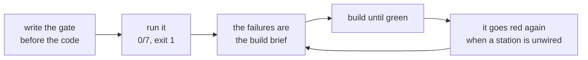

# 7.2 — The gate that goes red

## One-line answer

An eval is only worth having if it can **fail**, so the day's gate is written before the code and run
before anything exists — seven checks, seven failures, exit 1 — and each one is a sentence from a
part turned into something a machine can refuse.

## The story

A smoke alarm on the ceiling has a small button on it. Once a month somebody is supposed to press it
and listen for the noise.

Pressing that button does not detect smoke. It proves the alarm can still make a sound — that the
battery has charge, that the sounder works, that the thing on the ceiling is a working alarm rather
than a plastic disc.

An alarm nobody has ever tested is in a superposition: it might be protecting the house, or it might
have had a flat battery since spring, and from the ground the two look identical. The silence of a
house with no fire and the silence of a house with a dead alarm are the same silence.

That is why the button exists, and why the test is *making it go off on purpose*. The only evidence
that an alarm works is having heard it.

## The idea in plain language

Principle 11 says evals are tests. This part is the sharpest version of that: **a check that has
never been red is not a check.** It is a line of code that has always agreed with you, and there is
no way to tell it apart from one that cannot disagree.

So the gate is written **first**, before the build brief is done, and run immediately. It must fail.
If it passes on an empty repository, it is checking nothing.

The gate for this day is seven checks. Each one is a sentence from a part, made executable:

| The sentence | The part |
| --- | --- |
| The stations live in a module of their own | the hub's build brief |
| The batons are declared, in one module | [1.2](../01-the-floor/1.2-the-baton-has-a-declared-shape.md) |
| The graph builds | [5.1](../05-the-graph/5.1-the-edge-list-is-the-floor-plan.md) |
| A miss at the mouth is a route, not a sentence | [1.3](../01-the-floor/1.3-one-station-decides-what-is-real.md) |
| An escalated run produces no draft | [2.4](../02-the-guess/2.4-the-lane-that-declines-the-work.md) |
| Every reply cites something | [7.1](7.1-every-part-passed.md) |
| No run exceeds its call budget | [3.3](../03-the-research-floor/3.3-what-a-lane-costs.md) |

That mapping is the design rule worth taking away. A check that does not correspond to a claim
somebody made is a check nobody will maintain, and a claim with no check is an opinion.

## Why Sutra needs it

Day 59 is the Phase 8 gate, and its job is to decide whether the phase is honestly finished. It will
do that by running checks like these and reading the result — so the checks have to exist, and they
have to be capable of a verdict other than "fine".

The build brief in the hub asks you to write `sutra/triage.py`, `sutra/graph.py` and
`sutra/acceptance.py`. This gate is how you know when that is done, and — more usefully — it is how
you find out on the day somebody removes a station's wiring six weeks from now.

## The mechanism

Each check is a function that either returns a label or raises:

```python
def check_mouth():
    from sutra.triage import intake

    event = intake("8842")
    if event.actions.route != "NO_SUCH_TICKET":
        raise AssertionError(f"intake routed {event.actions.route!r} on a miss")
    return "a miss at the mouth is a route, not a sentence"
```

**Line by line:**

- The import is **inside** the function, not at the top of the file. That is deliberate: a missing
  module then fails one check with a readable message instead of stopping the whole script at import
  time with a traceback. The gate has to survive a repository where nothing exists yet, because that
  is exactly when it is first run.
- `intake("8842")` calls the station directly. No graph, no runner, no session — the gate is checking
  a claim, and the cheapest way to check this one is a function call.
- `event.actions.route != "NO_SUCH_TICKET"` asserts the route rather than the output, which is the
  distinction [2.2](../02-the-guess/2.2-the-route-is-an-action.md) drew. A version of this check
  that looked at the output string would pass on the laundering build in
  [6.3](../06-the-run/6.3-a-reply-to-a-ticket-that-does-not-exist.md), because that build also emits
  a sentence about the missing ticket.
- The `AssertionError` message includes **what it actually got**, so a failure is a diagnosis rather
  than a notification.
- Returning the sentence, rather than printing it, lets the runner decide the format and keeps the
  claim next to the code that checks it.

The runner is nine lines and has one job:

```python
def main() -> int:
    passed = 0
    for check in CHECKS:
        try:
            label = check()
        except Exception as exc:
            name = check.__name__.replace("check_", "").replace("_", " ")
            print(f"  FAIL  {name:<38} {type(exc).__name__}: {exc}")
        else:
            print(f"  PASS  {label}")
            passed += 1
    print()
    print(f"  {passed}/{len(CHECKS)} checks pass")
    return 0 if passed == len(CHECKS) else 1
```

**Line by line:**

- `except Exception` is broad **here and only here**. Everywhere else in this project that would be
  trap #4 ([6.4](../06-the-run/6.4-the-seam-that-drifted.md)); in a test runner the whole purpose is
  to turn any failure into a reported line and keep going, because the first failure is rarely the
  only one.
- It runs **every** check rather than stopping at the first. Seeing all seven failures at once tells
  you what you are building; seeing one tells you where to start and hides the rest.
- `type(exc).__name__: {exc}` prints the class as well as the message, so a `ModuleNotFoundError`
  (nothing written yet) reads differently from an `AssertionError` (written, and wrong).
- `return 0 if passed == len(CHECKS) else 1` makes the exit code the verdict, which is what lets
  `./m check` and any CI runner use this without parsing text.

Run it now, before writing a line of `sutra/`:

```bash
cd days/day-58-triage-graph-v1/lab
uv run python gate.py; echo "exit: $?"
```

**Line by line:**

- `echo "exit: $?"` prints the exit status, because a red gate that returns 0 is worse than no gate —
  and this is the one command in the day where the status is the point.

Measured on 2026-09-05:

```text
  FAIL  import                                 ModuleNotFoundError: No module named 'sutra.triage'
  FAIL  batons                                 ModuleNotFoundError: No module named 'sutra.triage'
  FAIL  builds                                 ModuleNotFoundError: No module named 'sutra.graph'
  FAIL  mouth                                  ModuleNotFoundError: No module named 'sutra.triage'
  FAIL  escalation writes nothing              ModuleNotFoundError: No module named 'sutra.acceptance'
  FAIL  citation invariant                     ModuleNotFoundError: No module named 'sutra.acceptance'
  FAIL  budget                                 ModuleNotFoundError: No module named 'sutra.acceptance'

  0/7 checks pass
exit: 1
```

**Zero of seven, exit 1.** The alarm makes a noise.

Read the failures as a plan rather than as a problem. They name three modules — `sutra.triage`,
`sutra.graph`, `sutra.acceptance` — and they say which claims depend on which. That is the build
brief, generated by the thing that will later certify it, which is a better specification than prose
because it cannot describe something it will not check.

Notice one thing about the citation check in particular. It is the invariant that
[7.1](7.1-every-part-passed.md) measured at 4 out of 24 in the lab. When the build brief is finished,
this gate will go from red to red — failing for a completely different reason, on a real finding
rather than on a missing import. That is the gate doing its job twice: first as a specification, then
as a critic.



## When it breaks

The way a gate breaks is by becoming incapable of failing, and it happens in three ordinary ways.

**The check that cannot fail.** [7.1](7.1-every-part-passed.md) already found one:
`isinstance(kb_clerk(...).output, list)` is true whether the clerk finds the right article or
nothing at all. Written into a gate, that check is green forever. The test for a suspect check is the
smoke-alarm one — break the thing it guards and confirm it goes red — and a check that survives the
breakage is decoration.

**The gate that is not run.** A gate in the repository that nothing invokes is in exactly the alarm's
superposition. This is why `./m check` exists and why Day 31 wired it: a check runs on every change
or it runs never.

**The exit code that lies.** This one has a real failure mode worth showing, because it is easy to
write by accident:

```python
def main() -> int:
    for check in CHECKS:
        try:
            check()
        except Exception as exc:
            print(f"  FAIL {exc}")
    return 0
```

**Line by line:**

- Every failure is printed, so a human watching the terminal sees the problem and might reasonably
  think the gate works.
- `return 0` unconditionally. Any automation reading the exit code sees success.
- The result is a gate that reports failures to whoever is looking and passes for everybody who is
  not — which is to say, it passes.

There is a fourth failure that is not the gate's fault and is worth anticipating, because it is what
makes people delete gates. The citation check will fail once the build brief is done, for the real
reason. Somebody will be under time pressure, and the cheapest way to get to green is to weaken the
check. That is the moment the gate stops being an instrument and becomes a formality, and the
countermeasure is social rather than technical: a threshold change is a product decision and needs
the same review as a feature.

## In production

**What a professional writes instead.** The gate is not a script that reads the repository, it is a
test suite, and it runs on every commit rather than when somebody remembers. The structure survives —
one function per claim, a readable label, all of them run — but the discovery, reporting and exit
codes come from the test runner. `pytest` gives you that for free, and the day's build brief asks for
`tests/test_triage_graph.py` for exactly this reason.

They also separate two kinds of check that this gate mixes. *Does it build and honour its contracts*
is a fast, deterministic check that belongs on every commit. *Does it behave correctly across the
corpus* is slower, needs fixtures, and belongs on a slower cadence — nightly, or on merge. Running
them together is fine at fifty-two deterministic runs and is not fine when those runs cost model
calls ([7.1](7.1-every-part-passed.md)'s tension).

**What degrades at scale.** The gate becomes the slowest thing in the pipeline and then people skip
it. That is not a discipline failure, it is a design one: at some size a full-corpus check has to
become a sampled check plus a full run on a schedule, and the sampling has to be deterministic so a
failure is reproducible. A flaky gate is worse than a slow one, because it teaches everybody to
re-run.

**The failure mode that only appears with real traffic.** The gate passes and the system is wrong,
because the corpus stopped being representative. Fifty-two synthetic tickets exercise the lanes you
thought of. Real traffic finds the request that is a forwarded email with two ticket references
([1.3](../01-the-floor/1.3-one-station-decides-what-is-real.md)'s production note), and no check
covers it because no ticket in the fixture looks like that. The habit that fixes it is adding a
fixture for every incident, so the corpus grows in the direction of what actually goes wrong.

**The review comment a senior engineer leaves:** *"Every one of these checks passed the first time you
ran it. Show me the commit where each of them was red — or break the thing it guards and paste the
output. A check that has only ever agreed with us is not evidence."*

**The interview question:** *"How do you know your evals are any good?"* The answer that shows you
have maintained a suite: *"I write them before the code and confirm they fail. Our day-one gate was
seven checks, zero passing, exit 1, and the failure list was a better build specification than the
document, because it could not describe anything it would not later verify. After that the rule is
that every check must have been red at least once for the reason it exists — otherwise you cannot
distinguish a passing check from one that cannot fail. We had a test asserting a retriever returned a
list, which is true when it finds the right article and true when it finds nothing, and it was green
through the entire period the retriever was broken."*

## Check yourself

```bash
cd days/day-58-triage-graph-v1/lab
uv run python gate.py; echo "exit: $?"
```

Now open `gate.py` and add an eighth check for a claim from any part of this day that is not in the
list. Run it, confirm it is red, and write down which sentence from which part it corresponds to. A
check you cannot map back to a claim is one to delete.

**Out loud, without scrolling up:** say why a gate is written before the code, and give the test for
whether a check that is currently green is worth keeping.

**Next:** [8.1 — The green run that helped nobody](../08-in-production/8.1-the-green-run-that-helped-nobody.md).
