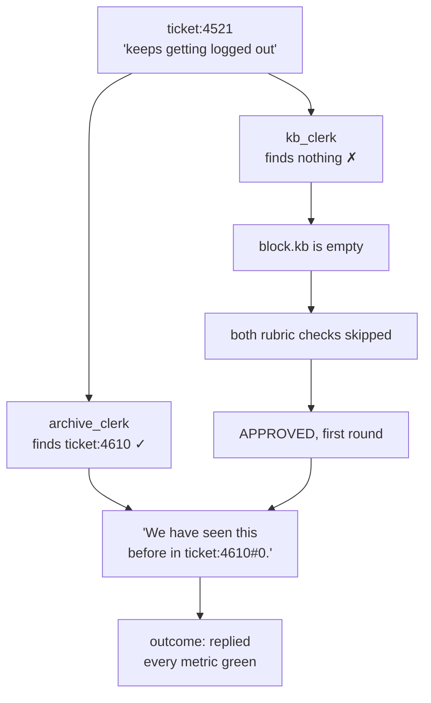

# 8.1 — The green run that helped nobody

## One-line answer

The founding ticket produces a run in which every station succeeds, the critic approves, the case
file is complete and the reply contains **no answer** — because the rubric only requires a citation
when retrieval found one, so a retrieval miss quietly lowers the standard instead of raising an
alarm.

## The story

You leave a phone at a repair shop. They fill in a job card: your name, the fault as you described
it, the date. You come back the next day and it is ready. The card has been completed — *checked,
cleaned, tested* — and there is a signature at the bottom.

You get home and the fault is still there.

Nothing on that card is a lie. Somebody did check it, and did clean it, and did test it. The card
does not have a line for *is the fault gone*, because the card was designed to record what the shop
did rather than what you came in for. Everything the shop measures about itself says this job went
well.

The uncomfortable part is that a shop with that card cannot find out it has a problem. Every job
completes. Every card is signed. The only signal is you coming back, and by then the shop has done
four hundred more.

## The idea in plain language

[7.1](../07-acceptance/7.1-every-part-passed.md) measured it: **four of twenty-four replies cite a
source.** This part is one of those runs, followed all the way through, because a rate is an argument
and a single run is a thing you can hold.

The run is `ticket:4521` — the founding ticket of this whole project, *"Keeps getting logged out"*.
The article that answers it is KB-104, *"Unexpected sign-outs"*, which says in one sentence to set
`SameSite=None` together with `Secure`. That article is in the corpus. It has been in the corpus
since Day 39.

The reply that goes out does not mention it.

The word for what this run is: **a false positive on your own success metric.** Not a failure that
was mis-measured — a *success* that was correctly measured against the wrong thing. Every check the
system applies to itself is satisfied, and the customer is no better off.

## Why Sutra needs it

Phase 7 exists to answer *"have we seen anything like this before?"* and Phase 8 exists to wire that
into a process. This run is the end-to-end demonstration that both phases can be individually green
and jointly useless, which is the most valuable thing an assembly day can produce.

It is also the honest bridge to what comes next. Day 59 gates this phase, and a gate that reports
"triage graph v1 runs end to end" without reporting this number would be exactly the job card in the
story.

## The mechanism

Take the run apart with the tools from section 6. First the stream:

```bash
cd days/day-58-triage-graph-v1/lab
uv run python stream.py ticket:4521
```

**Line by line:**

- `ticket:4521` is the founding ticket, and it takes the ordinary handled lane — nothing exotic
  happens in this run, which is the point.

Measured on 2026-09-05:

```text
  request: 'ticket:4521'

   #  path                                           route      output
   1  triage_graph_v1@1/intake@1                     FOUND      TicketText(ref='ticket:4521', text='Ticket 4
   2  triage_graph_v1@1/classify@1                   HANDLE     TriageResult(category='auth', severity=2, ne
   3  triage_graph_v1@1/archive_clerk@1              -          ['ticket:4610#0', 'ticket:4568#0']
   4  triage_graph_v1@1/kb_clerk@1                   -          []
   5  triage_graph_v1@1/evidence_join@1              -          {'kb_clerk': [], 'archive_clerk': ['ticket:4
   6  triage_graph_v1@1/assemble_evidence@1          -          EvidenceBlock(ref='ticket:4521', archive=['t
   7  triage_graph_v1@1/draft_review_box@1/writer@1  -          Thanks for reporting ticket:4521. We have se
   8  triage_graph_v1@1/draft_review_box@1/critic@1  SHIP       APPROVED
   9  triage_graph_v1@1/draft_review_box@1/box_output@1 -          ReviewedDraft(text='Thanks for reporting tic
  10  triage_graph_v1@1/finalize@1                   -          FinalReply(ref='ticket:4521', reply='Thanks

  10 events, 3 model calls
  ended at: finalize
```

Event 3 is Phase 7 working perfectly. `ticket:4610` — the SSO ticket that shares almost no words with
this one and contains the actual fix — found by meaning, exactly as
[3.1](../03-the-research-floor/3.1-two-clerks-who-disagree.md) showed. The expensive investment paid
off.

Event 4 is `[]`. The knowledge-base clerk found nothing, on the ticket whose article is titled with
its symptom.

Event 8 is the one that turns a retrieval miss into a shipped reply. `SHIP APPROVED`, on the **first**
round. Go back to the rubric in
[4.2](../04-the-box/4.2-the-brake-belongs-to-the-critic.md):

```python
    if block.kb and not re.search(r"KB-\d+", node_input):
        failures.append("cites the article")
    if block.kb and resolution_of(block.kb[0])[:24] not in node_input:
        failures.append("names the fix")
```

**Line by line:**

- Both checks are guarded by `if block.kb`. When the clerk found an article, the draft must cite it
  and must include its instruction — a genuinely strict rubric.
- When `block.kb` is empty, **both guards are false and neither check runs**. `failures` stays empty.
  The critic has nothing to object to and approves.
- Nothing here is a mistake in the ordinary sense. Requiring a citation to an article that does not
  exist would be worse. The defect is that "no article was found" and "no article was needed" are
  treated as the same situation, and only one of them should let a reply through.

Now the case file:

```bash
uv run python casefile.py ticket:4521
```

**Line by line:**

- The same eight questions from 6.2, asked of the run whose stream is printed above, so the
  stream and the record can be read against each other.

Measured on 2026-09-05:

```text
  case file for ticket:4521
    which ticket?                        'ticket:4521'
    what did the classifier decide?      {'category': 'auth', 'severity': 2, 'needs_human': False, 'notes': 'Ti
    what did the archive clerk find?     ['ticket:4610#0', 'ticket:4568#0']
    what did the kb clerk find?          []
    how many writer rounds?              1
    what was the critic's last verdict?  'APPROVED'
    was it shipped with a flag?          '-- not recorded --'
    how did the run end?                 'replied'
```

Complete, honest, and green. `outcome: replied`. `verdict: APPROVED`. One round, three model calls,
well inside budget. Nothing in this record would attract a second glance.

And here is what the customer receives:

```text
Thanks for reporting ticket:4521. We have seen this before in ticket:4610#0.
```

That is the whole reply. It tells a person whose account signs them out every few minutes that this
has happened before, and gives them an internal ticket reference. It does not contain the words
`SameSite`, `Secure`, or any instruction at all. The fix was in the archive, was retrieved, was
passed to the writer, and did not make it into the text.



## When it breaks

It has already broken. What is worth examining is why **nothing in the system can tell you**.

Walk the four instruments this day built and ask each one:

- **The gate** ([7.2](../07-acceptance/7.2-the-gate-that-goes-red.md)) has a citation invariant, and
  it is the one check that would catch this. It reports 4 of 24. It is also the check most likely to
  be weakened, because it fails for a reason nobody can fix in an afternoon.
- **The event stream** ([6.1](../06-the-run/6.1-the-event-stream-is-the-story.md)) shows the empty
  list at event 4. Visible to a human reading one run. Invisible in aggregate, because an empty list
  is a legitimate value.
- **The case file** ([6.2](../06-the-run/6.2-state-is-the-case-file.md)) records `kb_hits: []`
  faithfully, and records `outcome: replied` just as faithfully. Both are true.
- **The critic** approved, correctly, according to its rubric.

Only one of four notices, and it notices as a rate rather than as a run.

There is a sharper way to state the defect, and it generalises past this floor: **the quality bar was
made conditional on the evidence, so degrading the evidence lowers the bar.** Any pipeline where a
reviewer's standard is derived from what a retriever produced has this property. Turn retrieval off
entirely and the critic becomes maximally satisfied, because there is nothing left to check against.
The system's self-assessment improves as its inputs get worse, which is the worst possible direction
for a feedback signal to point.

Compare it with the run one part earlier. In
[6.3](../06-the-run/6.3-a-reply-to-a-ticket-that-does-not-exist.md) the floor answered a ticket that
did not exist; here it fails to answer a ticket that does. The two runs have **identical case files**
in every field that anything measures: `replied`, `APPROVED`, one round, three calls, `cites: []`.
The difference between "we invented a ticket" and "we had the answer and did not use it" does not
appear anywhere in the record.

## In production

**What a professional writes instead.** The rubric distinguishes the three cases, and it needs the
retrieval to tell it which one it is in:

1. an article was found and the draft uses it — approve;
2. an article was found and the draft ignores it — revise;
3. **no article was found** — this is not a pass, it is a different outcome.

The third case wants its own verdict. `INSUFFICIENT_EVIDENCE` shipped with a flag
([4.2](../04-the-box/4.2-the-brake-belongs-to-the-critic.md) already has the machinery) is honest,
countable and actionable, and it turns twenty invisible replies into twenty items on somebody's
list. That requires the evidence to carry
[3.1](../03-the-research-floor/3.1-two-clerks-who-disagree.md)'s missing scores, so the critic can
distinguish "found nothing" from "found something weak".

They also stop measuring citations and start measuring **resolution**. Did the customer come back?
Did the ticket reopen? A citation rate is a proxy chosen because it is cheap, and every proxy
eventually gets optimised instead of the thing it stands for
([4.3](../04-the-box/4.3-the-stamp-that-may-not-change-the-answer.md) shows how easily). Reopen rate
is the number that would have flagged this run, and it is the number nobody has on day one.

**What degrades at scale.** The failure is *popular*. The tickets most likely to miss the knowledge
base are the ones written in customer language rather than desk language, which is most of them — so
the 8% hit rate is not a tail, it is the body of the distribution
([3.1](../03-the-research-floor/3.1-two-clerks-who-disagree.md)). At volume the desk is mostly
sending polite acknowledgements, at three model calls each, and its dashboards report a healthy reply
rate.

**The failure mode that only appears with real traffic.** Nobody complains in a way that reaches you.
The customer whose problem was not solved replies to the same ticket, which arrives as a new request,
which the desk answers again — and the second answer is also an acknowledgement. The system now has a
*higher* reply count and a *worse* outcome, and the only place the truth lives is in the ticket
reopen rate that nothing on this floor computes.

**The review comment a senior engineer leaves:** *"The critic's citation checks are both guarded on
`block.kb`, so when retrieval finds nothing the rubric is empty and everything passes. That means our
quality bar moves with our retrieval quality, in the wrong direction. Make 'no evidence found' a
distinct verdict rather than an implicit pass — I would rather ship a flagged reply than an approved
one that says nothing."*

**The interview question:** *"Tell me about a bug that your tests could not have caught."* The answer
worth giving: *"A reply that passed every check and answered nothing. Our knowledge-base retriever
missed the article for the exact ticket it was written about — vocabulary mismatch, the customer said
'logged out' and the article said 'unexpected sign-outs'. Our reviewer required a citation only when
retrieval had found something, so with nothing found there was nothing to require and it approved on
the first round. Case file complete, outcome 'replied', three model calls, well inside budget. Four
of twenty-four replies cited a source and every one of them was recorded as a success. The lesson I
took is that a quality bar derived from the evidence gets *easier* as the evidence gets worse, so
'found nothing' has to be its own outcome rather than an absence of objections."*

## Check yourself

```bash
cd days/day-58-triage-graph-v1/lab
uv run python stream.py ticket:4521
uv run python casefile.py ticket:4521
uv run python invariants.py
```

Now add a fourth rubric item to the critic that fires when `block.kb` is empty — appending something
like `"no article found"` to `failures` — and run `uv run python invariants.py` again. Write down
what happened to the citation count, to the flagged count, and to the total model calls, and then
decide whether you have improved the desk or only moved the problem to whoever reads flagged replies.

**Out loud, without scrolling up:** explain how a retrieval miss ends up lowering the reviewer's
standard, and say which fields of this run's case file differ from the run in 6.3 that answered a
ticket which does not exist — and whether anything measures those fields.

**Next:** [8.2 — A gate that fires on half the traffic](8.2-a-gate-that-fires-on-half-the-traffic.md).
