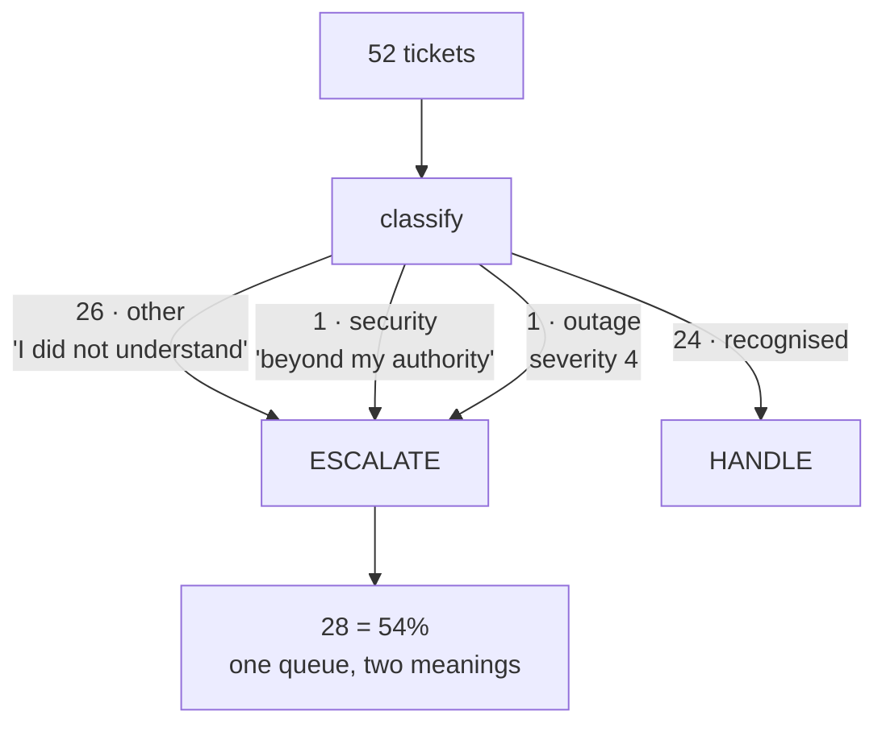

# 8.2 — A gate that fires on half the traffic

## One-line answer

The escalation lane takes **54% of the archive**, and twenty-six of those twenty-eight tickets are
there because the classifier did not understand them rather than because they need a human — so the
control that was designed as an exception has quietly become the process.

## The story

An office lobby has a security guard who checks bags. On the first day the rule is sensible: anyone
carrying a large bag gets it opened.

By the third month the rule has been widened after an incident, and now everybody's bag is checked.
There is a queue at eight forty-five. People start leaving bags in their cars. The guard, who has
two hundred bags to get through before nine, opens each one, glances, and waves it on — and a glance
is not a check.

Nothing was done wrong at any point. The rule was widened for a good reason and it is applied
consistently. But the security value of the check has gone to nearly zero, and it went there
precisely *because* it fires on everything. A control that stops one bag in two hundred can be done
properly. One that stops all of them will be done badly, by an ordinary person under time pressure,
every morning.

## The idea in plain language

[2.4](../02-the-guess/2.4-the-lane-that-declines-the-work.md) built the escalation lane and argued
for it on two grounds: blast radius and economics. Both arguments quietly assumed the lane is
**narrow**. Measured, it is not.

There is a general form of this worth naming, because it applies to every gate this curriculum will
build — Day 63's approval gates, Day 67's guardrails, Day 68's permission checks. **A control's value
depends on its rate.** Two things degrade as a gate widens, and they degrade in different places:

- **The human side.** Whoever is on the other end has finite attention. A queue that grows faster
  than it is emptied is answered by skimming, and skimming is indistinguishable from not checking.
  A gate that fires on half the traffic has moved the work rather than reviewed it.
- **The signal side.** A gate that fires constantly stops carrying information. If escalation means
  "something unusual", 54% is not unusual, and nobody can use the flag to prioritise anything.

The second thing to separate is **why** the gate fires. A gate has a stated purpose and an actual
trigger, and this floor's have come apart.

## Why Sutra needs it

Day 63 designs the approval policy for Sutra's real actions and Day 64 builds the gate. This part is
the evidence that a policy has to be designed against *measured* rates rather than intended ones,
because the intended rate here was "rare" and the measured rate is "most".

It also puts a number on what Phase 9 inherits. Day 62 asks what the human is shown and Day 65 asks
whether the whole thing survives being killed mid-run. Both of those get much harder when the human
queue holds more than half of everything.

## The mechanism

The condition, which is unchanged from
[2.4](../02-the-guess/2.4-the-lane-that-declines-the-work.md):

```python
    needs_human = category in {"security", "other"}
    ...
    hot = result.needs_human or result.severity >= 4
```

**Line by line:**

- `category in {"security", "other"}` is the line to look at hardest. `security` is a real reason to
  involve a person. `other` means **no rule in the classifier matched**, which is a statement about
  the classifier, not about the ticket.
- Putting both into `needs_human` merges two different facts under one name: *this is beyond my
  authority* and *I did not understand this*. They want different lanes and probably different
  people.
- `severity >= 4` is the other half of the condition, and the sweep below shows how little of the
  work it does.

Measure the rate rather than assuming it:

```bash
cd days/day-58-triage-graph-v1/lab
uv run python escalate.py --sweep
```

**Line by line:**

- It classifies every ticket in the archive and tallies routes and categories. No graph is driven, so
  the numbers are about the decision rather than about the run.

Measured on 2026-09-05:

```text
  tickets in the archive     52
  ESCALATE                   28  (54%)
  HANDLE                     24

  category      tickets
  other           26
  billing         17
  export           4
  auth             3
  security         1
  outage           1
```

Twenty-eight escalations. Read the category tally underneath and the composition is stark:

- **26** tickets are `other`.
- **1** is `security`.
- **1** is `outage`, which is the only one reaching `severity >= 4` by the severity route.

So of twenty-eight escalations, twenty-six are the classifier saying *I do not know*, and two are the
system working as designed. **The `severity` half of the condition fires for one ticket in
fifty-two.**

That last number is worth dwelling on, because of how it would have been missed. Test the escalation
lane the obvious way — write an urgent-sounding ticket, watch it escalate, see the one model call —
and everything works. [2.4](../02-the-guess/2.4-the-lane-that-declines-the-work.md) did exactly that
with `ticket:4562` and the mechanism was demonstrated correctly. What that test cannot show is
**which condition is actually carrying the traffic**, and the answer is the one nobody was testing.

Now find out why twenty-six tickets are `other`. The rule list is short:

```python
_RULES: list[tuple[str, tuple[str, ...], int]] = [
    ("outage", ("outage", "everyone", "all customers", "down for", "cannot sign in at all"), 4),
    ("security", ("private", "never invited", "another workspace", "leak"), 4),
    ("auth", ("signed out", "sign-in", "logged out", "reset", "password", "session"), 2),
    ("billing", ("invoice", "charged", "card", "refund", "receipt", "plan"), 2),
    ("export", ("export", "csv", "columns", "header", "download"), 2),
]
```

**Line by line:**

- Five categories, each with a tuple of trigger words and a severity.
- The billing row matches on `invoice`, `charged`, `card`, `refund`, `receipt` and `plan` — and
  **not on the word `billing`**. `ticket:4506` reads *"Cannot change the billing email"* and falls
  through to `other`, which escalates it.
- The `auth` row does not include `two-factor` or `recovery codes`, so `ticket:4562` and
  `ticket:4565` — both plainly authentication tickets — are `other` as well.
- Nothing is wrong with any individual row. The list is simply incomplete, which is the permanent
  condition of every keyword classifier and of every prompt-based one too.

The uncomfortable conclusion is that the escalation rate is **a measure of classifier coverage
wearing a safety control's clothing**. Improve the rule list and the rate drops, not because fewer
tickets need humans but because more of them got recognised.



## When it breaks

The break is what happens next, and it is a management decision rather than a code change.

The queue is full. Somebody proposes the obvious fix: stop escalating `other`. It is defensible —
those tickets are not dangerous, they are merely unrecognised — and it takes the rate from 54% to
under 4% in one line.

Try it and watch where the tickets go:

```python
    needs_human = category == "security"
```

**Line by line:**

- One set membership becomes one equality. Twenty-six tickets stop escalating.
- Every one of them now flows into the handling lane with `category: "other"` and `severity: 1`, and
  the floor drafts a reply for each.

Nothing raises. The escalation lane becomes appropriately narrow. And twenty-six tickets that the
classifier explicitly did not understand are now being answered by a writer whose evidence was
retrieved using a classification of `other` — which, per
[3.1](../03-the-research-floor/3.1-two-clerks-who-disagree.md), means the archive clerk returns its
usual two nearest neighbours and the knowledge-base clerk returns nothing.

Combine that with [8.1](8.1-the-green-run-that-helped-nobody.md) and the outcome is predictable:
twenty-six more acknowledgement-shaped replies, approved on the first round, citing nothing, all
recorded as successes. The escalation metric improves. The reply count improves. The desk gets worse.

That is the shape to watch for: **a change motivated by a queue length, landing in what customers
receive.** The queue was a staffing problem and the fix was applied to a safety control.

The second break is the one that arrives with a bigger corpus. Widen the rule list — add `billing`,
add `two-factor` — and the rate falls honestly. But nothing in the system distinguishes that
improvement from the dishonest one above; both show up as *escalations went down*. Without a recorded
reason per escalation, the two are the same number.

## In production

**What a professional writes instead.** The escalation reason is a field, not an inference. Something
like:

```python
class TriageResult(BaseModel):
    escalate_because: Literal["low_confidence", "high_severity", "policy", "none"] = "none"
```

**Line by line:**

- `Literal[...]` closes the set, so a new reason is a deliberate change to the schema rather than a
  new string appearing in a dashboard.
- `= "none"` makes not escalating the default, and makes the field present on every verdict — which
  is the completeness lesson from [6.2](../06-the-run/6.2-state-is-the-case-file.md).
- With this field the sweep above stops being one number and becomes three, and the 26/1/1 split is
  visible on a dashboard rather than in a lab script. It is also what tells you whether a falling
  rate is coverage improving or a control being loosened.

They also split the lane by reason, because the two populations need different handling.
*Low-confidence* tickets want a person who can classify them and feed that back into the rule list —
their value is training data. *High-severity* tickets want a person who can act. Sending both to one
queue guarantees the second is delayed by the first, which is the worst possible ordering.

**What degrades at scale.** The unrecognised bucket grows with corpus diversity, not with volume. A
rule list tuned on fifty-two tickets covers a narrower world than one tuned on five thousand, and the
`other` rate is the honest measure of that gap. It is the single most useful classifier metric to
have on a dashboard, and it degrades silently — nothing errors, the bucket just gets bigger.

**The failure mode that only appears with real traffic.** Seasonality. A product launch brings a wave
of tickets about a feature no rule covers, the `other` bucket doubles overnight, and the escalation
queue doubles with it — on a day when the team is already busy. The rate is not a property of your
system; it is a property of your system meeting the world, and it moves without a deploy.

**The review comment a senior engineer leaves:** *"`needs_human` is set for both `security` and
`other`, so 'this is beyond my authority' and 'I could not classify this' go to the same queue and we
cannot tell them apart. Add the reason to the verdict. Right now the only lever anybody has when the
queue is long is to stop escalating, and that lever silently routes tickets we did not understand
into the drafting path."*

**The interview question:** *"You have a human review step. How do you know it is working?"* The
answer that shows you have run one: *"By measuring how often it fires and why, not by checking that
it fires. Ours triggered on 54% of our archive, which is not a control, it is the process — and when
I broke the number down, twenty-six of twenty-eight escalations were the classifier saying it did not
recognise the ticket, and only two were genuine severity. The severity condition I had actually
tested was carrying one ticket in fifty-two. The dangerous part is the obvious fix: stop escalating
the unrecognised ones, and the rate looks healthy while twenty-six tickets nobody understood get
auto-drafted replies. So the reason for escalating is a field on the verdict, and the two reasons go
to different queues."*

## Check yourself

```bash
cd days/day-58-triage-graph-v1/lab
uv run python escalate.py --sweep
uv run python price.py
```

Now add `"billing"` and `"two-factor"` to the appropriate rule word lists in `_stations.py`, re-run
the sweep, and write down the new escalation rate and the new `other` count. Then re-run `price.py`
and say what happened to the total model calls for the archive — and whether that change is a cost
increase or a quality improvement.

**Out loud, without scrolling up:** give the two ways a control degrades as its rate rises, and say
what fraction of this floor's escalations are caused by the classifier rather than by the ticket.

**Next:** [8.3 — Thirty nodes, a queue and a timeout](8.3-thirty-nodes-a-queue-and-a-timeout.md).
