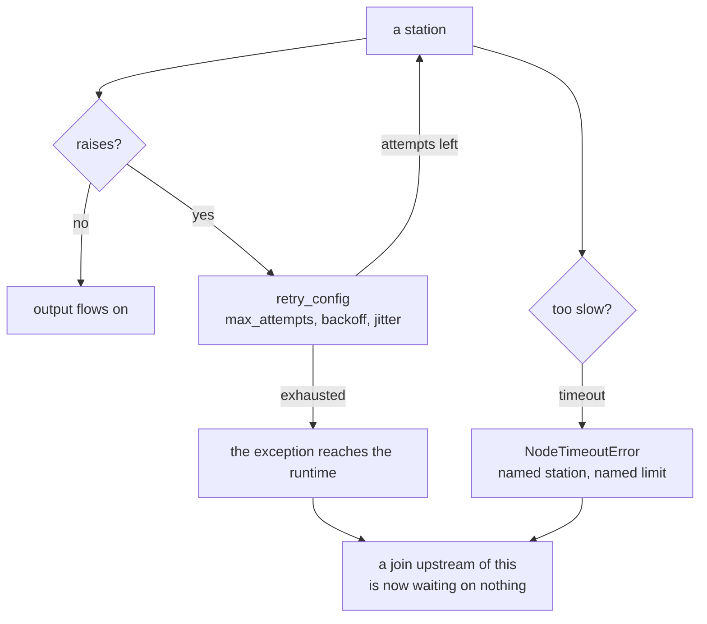

# 8.3 — Thirty nodes, a queue and a timeout

## One-line answer

A floor that runs from a command has no deadline and one caller; a floor that runs from a queue has
many callers, partial failures and a clock — and ADK gives every node `timeout` and `retry_config`
for exactly that, with the caveat that a station which dies without producing output stops a join
rather than failing at it.

## The story

A small restaurant at eight in the evening is not a different restaurant from the same place at
three in the afternoon. Same kitchen, same people, same menu.

At three, an order arrives and somebody cooks it. If the fish takes a while, it takes a while, and
the one table waits.

At eight there are fourteen orders on the rail. The fish still takes as long as it takes, and now
that time is not the fish's problem, it is the rail's — because table nine's starters are done and
going cold while table four's main is holding up the pass. The chef starts making decisions that
did not exist at three: send the plates that are ready, put the slow order to one side, tell table
four it will be a few more minutes.

Nothing about cooking changed. What changed is that there is a queue behind the thing, so *taking
longer* stopped being a private matter.

## The idea in plain language

Everything in this day has run one ticket at a time from a command line. That is the right way to
build it and it hides three things that arrive together the moment the floor is fed by a queue.

**A deadline exists.** Somebody is waiting, or a message will be redelivered, or a lock will expire.
"However long it takes" stops being available, and a station that hangs stops being slow and starts
being a failure.

**Failures become partial.** With one ticket, a station that dies fails the run and you see it. With
a fan-out, one branch dying leaves the others' work done and paid for, and — because
`evidence_join` waits for *every* predecessor — it leaves the run stopped in a place that is not
where the problem was.

**Runs interfere.** They share the model's quota, the retrieval index and, if anybody was careless
with state keys, each other.

ADK puts two of the answers on the node itself. Every node inherits `timeout` and `retry_config`
from `BaseNode`, so they are per-station properties rather than something wrapped around the graph:

- **`timeout`** — how long this station may take before the runtime gives up on it.
- **`retry_config`** — a `RetryConfig` with `max_attempts`, `initial_delay`, `backoff_factor`,
  `jitter`, `max_delay` and the exception types it applies to.

The adk.dev routes page, fetched 2026-09-05, says where they matter most, and it is a sentence worth
memorising for any fan-in: *"Make sure that every node that feeds a join has an output of its own,
and attach a retry configuration to any node that can fail."*

## Why Sutra needs it

Day 73 onwards runs Sutra ambiently — a nightly job, work arriving without a person typing a command
— and that is when this floor stops being driven one ticket at a time. Day 65 kills a run mid-flight
on purpose, and what it kills is a run with a deadline.

The nearer reason is [3.3](../03-the-research-floor/3.3-what-a-lane-costs.md)'s worst outcome: a run
that dies halfway has spent its requests and produced nothing. On a twenty-a-day allowance, a
partially-spent run is the most expensive failure available.

## The mechanism

Both knobs go on the node, at the point of declaration:

```python
@node(timeout=0.05)
async def slow_clerk(node_input: str) -> Event:
    """A station that takes longer than the floor is willing to wait for it."""
    await asyncio.sleep(0.5)
    return Event(author="slow_clerk", output="found it, eventually")


@node(retry_config=RetryConfig(max_attempts=3, initial_delay=0.01))
def flaky_clerk(node_input: str) -> Event:
    """A station that fails twice and then works, the shape of every network call."""
    ATTEMPTS["n"] += 1
    if ATTEMPTS["n"] < 3:
        raise ConnectionError(f"archive unreachable (attempt {ATTEMPTS['n']})")
    return Event(author="flaky_clerk", output=f"found it on attempt {ATTEMPTS['n']}")
```

**Line by line:**

- `@node(timeout=0.05)` sets the deadline for this station only. Fifty milliseconds is absurdly short
  and deliberately so — a demonstration of a deadline should fire every time rather than sometimes.
- `await asyncio.sleep(0.5)` stands in for any wait: a database, an index, a model that is thinking.
  The station is `async` because that is what lets the runtime cancel it; a synchronous station that
  blocks the thread cannot be timed out cleanly, which is worth knowing before you write one.
- `@node(retry_config=RetryConfig(max_attempts=3, initial_delay=0.01))` attaches a policy rather than
  a `try` block. This is the structural alternative to the swallow in
  [6.4](../06-the-run/6.4-the-seam-that-drifted.md): the station raises honestly and the *framework*
  decides whether to try again.
- `ATTEMPTS["n"]` is a module-level counter so the demonstration can prove the retries happened
  rather than assert it. Two failures, then success, is the shape of every transient network fault.
- `raise ConnectionError(...)` is a **specific** exception. `RetryConfig` takes an `exceptions` field,
  and retrying on bare `Exception` is how a bug in your own code gets attempted three times.

Run the deadline:

```bash
cd days/day-58-triage-graph-v1/lab
uv run python scale.py
```

**Line by line:**

- With no flag the script runs `slow_clerk`, the station whose work outlasts its deadline.
- The traceback is printed rather than swallowed, because the error class is the teaching.

Measured on 2026-09-05:

```text
  station: slow_clerk
  slow_clerk     None
google.adk.workflow._errors.NodeTimeoutError: Node 'slow_clerk' timed out after 0.05 seconds.
```

`NodeTimeoutError`, naming the station and the limit. That is a real error class from
`google.adk.workflow._errors`, not a generic timeout, so it can be caught, counted and alerted on
distinctly from anything else that goes wrong.

Note the event above it: `slow_clerk None`. The station emitted an event and produced **no output**
before being cut off. Hold on to that — it is the whole of the next section.

Now the retry:

```bash
uv run python scale.py --retry
```

**Line by line:**

- `--retry` swaps in `flaky_clerk`, which fails twice and then succeeds.
- The final line prints the attempt counter, so the retries are counted rather than assumed.

Measured on 2026-09-05:

```text
  station: flaky_clerk
  flaky_clerk    None
  flaky_clerk    None
  flaky_clerk    'found it on attempt 3'
  finished, attempts = 3
```

Three attempts, two of them failures, and the run finishes with the right answer. The station's code
contains no retry logic at all — it raises and it is re-run.

Look at the event stream, though, because it is telling you something that
[6.1](../06-the-run/6.1-the-event-stream-is-the-story.md) needs you to know. **Three events for one
station.** The two failed attempts are in the stream with `None` outputs. So a station with a retry
policy produces more events than it produced results, and anything counting events as work — a cost
model, a progress bar, an assertion on stream length — is now wrong. Day 54 measured the same effect
inside a loop and found nine calls behind six events; here it is two extra events behind one result.



## When it breaks

Put the timed-out station on a branch that feeds a join and the failure moves, exactly as the
documentation warns:

> *"A predecessor that finishes without an output leaves the join with no value for that branch, and
> the resulting failure appears downstream, away from the node that caused it."*

That is the `slow_clerk None` event above, in its proper context. The station **completed** — the
runtime got an event from it — and it completed with nothing. `evidence_join` is a barrier that waits
for every predecessor, so it fires with a hole where the archive results should be.
`assemble_evidence`'s `node_input.get("archive_clerk") or []` turns the hole into an empty list
([3.2](../03-the-research-floor/3.2-the-join-hands-over-a-dict.md)), and the writer drafts from
half the evidence, and the critic approves it because
[8.1](8.1-the-green-run-that-helped-nobody.md)'s rubric has nothing to check.

A timeout on one branch has become a slightly worse reply, with no error anywhere.

That is why the documentation's advice is two-part and why the second half is the one people skip.
*Attach a retry to any node that can fail* is the familiar part. *Make sure that every node that feeds
a join has an output of its own* is the part that turns a silent hole into a loud failure — because
a branch that raises after its retries are exhausted stops the run, and a branch that quietly
produces nothing does not.

The second break is the timeout that is set on the wrong thing. Suppose the drafting box gets
`timeout=30`. That box contains a loop, so a run that takes three rounds is inside its budget and a
run that takes four is killed — mid-round, having spent six requests, with a draft that will never
be reviewed. A deadline on a container is a deadline on however many iterations happen to fit, which
is a different quantity every time. Deadlines belong on the stations that make a single call, and the
loop wants a *round* cap ([4.2](../04-the-box/4.2-the-brake-belongs-to-the-critic.md)) rather than a
clock.

## In production

**What a professional writes instead.** Every station that touches something outside the process gets
both knobs, and the numbers come from measurement rather than from a round figure someone liked. The
retry gets **jitter** — `RetryConfig` has the field — because without it, many runs that failed on
the same upstream event all retry at the same instant and arrive as a wave. And the deadline is
derived from the caller's deadline rather than chosen locally: if the queue redelivers after thirty
seconds, the sum of the station timeouts on the longest path must be comfortably under thirty, or the
system does the work twice by design.

They also make the run's total budget a first-class thing rather than a per-station one. This floor
has a call budget asserted after the fact in
[7.1](../07-acceptance/7.1-every-part-passed.md); in production it is checked *before* entering the
expensive part, so a run that cannot afford to finish declines at the start instead of stopping in
the middle. That is [3.3](../03-the-research-floor/3.3-what-a-lane-costs.md)'s partially-spent run,
prevented rather than measured.

**What degrades at scale.** Concurrency turns the shared things into contention. Every run reads the
same in-memory retrieval index — rebuilt at import, per process
([3.1](../03-the-research-floor/3.1-two-clerks-who-disagree.md)) — so thirty workers means thirty
copies and thirty rebuilds at startup. Every run draws on the same quota, so the request budget stops
being per-run arithmetic and becomes a shared resource with a lock-shaped problem, which is exactly
what Day 70's Quota-Router is for. And every run writes to the session store, which is Day 47's
database now taking thirty times the traffic.

**The failure mode that only appears with real traffic.** The queue redelivers. A run takes longer
than the visibility timeout, the message is handed to a second worker, and now two workers are
drafting a reply to the same ticket — spending twice the quota, and possibly sending twice. Nothing
in this day's floor prevents that, because `finalize` is not idempotent in any way that survives two
processes ([4.3](../04-the-box/4.3-the-stamp-that-may-not-change-the-answer.md) made it pure, which
is necessary and not sufficient). That is Day 60's subject, and the reason it is a whole day.

**The review comment a senior engineer leaves:** *"Both retrieval branches feed a join and neither has
a timeout or a retry. If one of them hangs we wait for ever, and if one of them dies quietly the join
fires with a hole and we ship a reply drafted from half the evidence with no error anywhere. Put a
`RetryConfig` on both, put a timeout on both, and make the adapter distinguish 'searched and found
nothing' from 'did not report'."*

**The interview question:** *"What changes when your pipeline moves from a command line to a queue?"*
The answer that shows you have made that move: *"Three things arrive at once: a deadline, partial
failure, and runs interfering with each other. On this runtime the first two are per-node properties
— `timeout` and `retry_config` — so I put them on every station that talks to something outside the
process, with jitter on the retry and the timeouts summing to less than the queue's redelivery
window. The subtle one is the join. A station that dies after its retries are exhausted stops the run
loudly, which is what you want, but a station that finishes without producing an output leaves the
join with a hole, and that surfaces downstream as a slightly worse answer with no error at all. So
the rule is that every branch feeding a fan-in must produce an output or raise, and the adapter after
the join has to be able to tell the difference between an empty result and a missing one."*

## Check yourself

```bash
cd days/day-58-triage-graph-v1/lab
uv run python scale.py
uv run python scale.py --retry
```

Now change `max_attempts` to `2` and run the retry arm again. Write down what happened, how many
events appeared in the stream, and what a cost model that counted events would have reported.

**Out loud, without scrolling up:** name the two knobs ADK puts on every node, and explain why a
branch that times out before a join is more dangerous than one that raises.

**Next:** back to the hub — [Day 58](../../LESSON.md) — for the build brief, the request budget and
the ledger rows.
