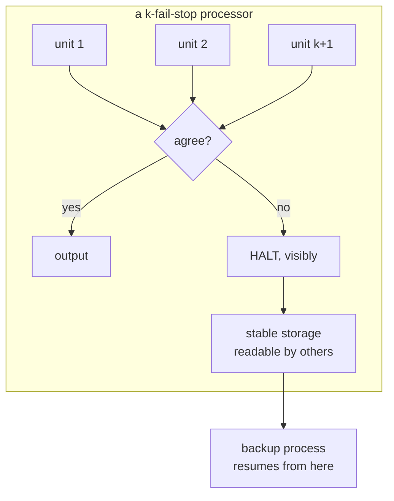

# Fail-stop processors: an approach to designing fault-tolerant computing systems

> **Read this after the parts.** Sections 1 to 6 built four brakes by hand and then argued that
> stopping is an answer. This document is where that argument came from, and it will land on
> something you have already measured rather than on nothing.

**Fail-stop processors: an approach to designing fault-tolerant computing systems** ·
`doi:10.1145/357369.357371` · ACM Transactions on Computer Systems 1(3), 222–238, August 1983 ·
<https://doi.org/10.1145/357369.357371>

Verified on 2026-09-05 against the Crossref record at
`https://api.crossref.org/works/10.1145/357369.357371`, which gives the title as *Fail-stop
processors* with the subtitle *an approach to designing fault-tolerant computing systems*, in ACM
Transactions on Computer Systems, volume 1, issue 3, pages 222–238, August 1983. The ACM Digital
Library page returns HTTP 403 without a subscription, which is why the record rather than the
landing page is the source for the citation.

## One-line answer

A processor that halts on detecting a fault — rather than continuing and producing a wrong result —
converts an arbitrary failure into one the rest of the system can reason about, and that
transformation is what makes fault tolerance tractable at all.

## The story

Before this document existed, the field had a problem it could not get around, and it was not a
problem about hardware.

Imagine you are designing a system out of components that can fail. You want it to keep working. The
obvious approach is redundancy: use three of everything and take the majority answer. Now write down
what you must assume about a failed component in order to prove your design works.

The honest answer, in the early days, was: **nothing.** A broken component can do anything. It can
produce plausible wrong numbers. It can produce different wrong numbers each time it is asked. It can
work correctly for the tests you run and incorrectly afterwards. It can, in the worst case, behave in
whatever way happens to be most damaging.

That is not a pessimistic assumption, it is the *absence* of an assumption, and it is ruinous for
anybody trying to build something. Every proof has to consider every behaviour. Every design has to
tolerate a component that actively appears to be working. The engineering problem was not "how do we
handle failures" — it was "how do we say anything at all about a component that has failed".

People were stuck there. This is the document that got them unstuck, and the way it did it was not
by finding a cleverer algorithm. It was by **changing what a component is allowed to do when it
breaks.**

## The idea in plain language

A **fail-stop processor** is a processor that, when something goes wrong inside it, does three
things:

1. **It stops.** It does not perform the state transformation it can no longer vouch for.
2. **Its stopped state is detectable** by other processors. They can find out that it has halted.
3. **Its storage is left in a state others can read** — the part of it that survives is inspectable,
   so the work it had done is not lost along with the processor.

The word "fail-stop" is doing something precise. Failures come in kinds, and the field ended up with
a hierarchy:

| Failure kind | What the component may do when broken |
| --- | --- |
| **Fail-stop** | halt, visibly, and nothing else |
| **Crash** | halt, but possibly without anybody noticing |
| **Omission** | drop some things it was supposed to do |
| **Byzantine** | anything at all, including appearing to work |

Each row is weaker than the one above it, in the sense that it permits more behaviours. A system
designed for a Byzantine failure tolerates everything and is enormously expensive. A system designed
for fail-stop failures is much cheaper to build and to reason about, **and is only correct if the
components really do fail that way.**

That "if" is the crux and it is the part most summaries drop. The paper is not claiming that
processors naturally fail by stopping. They do not. It is proposing that you **build** processors
that approximate the fail-stop property, using redundancy internally, so that the rest of your system
can be designed against a simple failure model instead of an arbitrary one.

So the contribution is an act of engineering economics: **spend effort locally, buy simplicity
globally.** You add machinery inside one component so that every other component's design gets
easier. That trade is the reason the idea survived.

## Why Sutra needs it

[4.1](../parts/04-fail-stop/4.1-stopping-is-an-answer.md) is the part that runs on this idea, and its
argument is the paper's argument with the components renamed: a system that can only produce results
makes every result untrustworthy, because the consumer has no way to tell an invented one from a real
one.

The measurement in that part is the paper's trade, priced for a support desk. Same failure, two
policies:

```text
policy  : refuse, usefully
    NO ANSWER for ticket 4610.
    contains a fix the archive never confirmed: no

policy  : carry on
    Reply for ticket 4610: This is a known issue with the sign-in redirect. Please clear your cookies and try again.
    contains a fix the archive never confirmed: yes
```

The second is the Byzantine case. Not malicious — nobody is attacking anything — but *arbitrary* in
the sense that matters: the component produced output that is indistinguishable from correct output
and is not correct. The first is the fail-stop case, and its value is entirely in what it lets
everything downstream assume.

The idea also shows up somewhere less obvious, and it is worth pointing at because it is the day's
own design. Every brake in section 2 is a fail-stop mechanism. The run fuse **raises** rather than
returning a truncated answer. The quota breaker **raises** rather than logging and continuing —
[2.4](../parts/02-where-a-brake-goes/2.4-the-circuit-breaker.md) measured the difference at zero
model calls against one. Plan §5.1's trap #4, *do not swallow exceptions*, is this paper's property
expressed as a framework rule.

## The mechanism

The paper's method, rather than its abstract.

**The k-fail-stop processor.** A fail-stop processor is built from `k + 1` processing units running
the same computation, plus stable storage. The units compare. If any unit disagrees with the others,
the processor as a whole halts. Such a processor is called *k-fail-stop*: it behaves as a fail-stop
processor **provided no more than `k` of its units fail.**

That proviso is the entire honesty of the design and it is what separates this from a claim of
perfect reliability. Fail-stop is not a property you achieve; it is a property you achieve *up to an
assumed number of internal failures*, and beyond that number the processor can do anything again.

The three components:

| Component | Purpose |
| --- | --- |
| `k + 1` processing units | run the computation redundantly so disagreement is detectable |
| stable storage | survives the halt, so the state at the moment of halting is readable |
| a halting mechanism | takes the processor out of service on disagreement, visibly |

**Why `k + 1` and not `2k + 1`.** This is the detail that shows what the fail-stop model buys you. To
*mask* `k` arbitrary failures by majority vote you need `2k + 1` units — you must outvote the broken
ones. To merely *detect* disagreement among `k` failures and stop, you need `k + 1`: as soon as two
units disagree, you know something is wrong, even though you do not know which one. **Detection is
cheaper than correction**, and fail-stop is the design that spends the cheaper one and converts the
saving into a simpler failure model for everybody else.

**Stable storage is not an afterthought.** A processor that halts and takes its state with it is a
crash, not a fail-stop. Property three above is what makes recovery possible at all: another
processor can read what the halted one had done and continue from there. That is exactly the gap
[2.5](../parts/02-where-a-brake-goes/2.5-the-kill-switch-and-what-it-leaves.md) measured in Sutra —
two kills leaving identical state and different amounts of work done — and it is why Day 60 is a
separate day.

**The programs on top.** Having defined the processor, the paper shows what you can now write: a
process running on a fail-stop processor is backed up by a process elsewhere, which detects the halt,
reads the stable storage and continues. That protocol is short and comprehensible **only because the
failure model is simple.** The same protocol against arbitrary failures is not short.



## The paper in one demo

The paper's contribution, stripped to nothing but itself: a processor that halts on a self-check
failure, a downstream consumer that can only ask whether the upstream is halted, and a switch that
turns the halting off.

**The file tree** — it lands in `days/day-59-runaway-agents-contained/lab/papers/fail-stop/`:

```text
lab/papers/fail-stop/
├── processor.py   # the fail-stop processor and the ablation switch
└── demo.py        # three values through it, and a downstream checker
```

**`processor.py`:**

```python
"""A fail-stop processor, and the switch that turns the property off."""

from __future__ import annotations

import os

# The ablation switch. `FAILSTOP=0` turns the paper's property off and nothing else changes.
FAIL_STOP = os.environ.get("FAILSTOP", "1") != "0"


class Halted(Exception):
    """The processor stopped. Its state is frozen and readable; it computed nothing further."""


class Processor:
    """Adds its input to a running total, and knows when its own arithmetic unit is faulty."""

    def __init__(self, name: str, faulty: bool = False) -> None:
        self.name = name
        self.faulty = faulty
        self.total = 0
        self.halted = False

    def step(self, value: int) -> int:
        """One state transformation, guarded by a self-check."""
        computed = self.total + value
        verified = self.total + value + (7 if self.faulty else 0)
        if computed != verified:
            if FAIL_STOP:
                self.halted = True
                raise Halted(f"{self.name}: self-check failed at value {value}; halting")
            # Ablation: no halt. The processor writes the value it cannot vouch for and carries on.
            computed = verified
        self.total = computed
        return self.total

    @property
    def status(self) -> str:
        return "HALTED" if self.halted else "running"
```

**Line by line:**

- `computed` and `verified` are the paper's `k + 1` units, reduced to two. Two units cannot tell you
  *which* one is wrong — and that is the point: detection needs only disagreement, not a majority.
- `if computed != verified` — disagreement is the trigger. Not an exception from below, not a
  timeout: the processor's own comparison of its own work.
- `self.halted = True` then `raise Halted(...)` — properties one and two of the definition. It stops,
  and the stop is **recorded on the object**, so somebody else can observe it. A bare `raise` would
  give property one only.
- `self.total` is left at its last good value — property three, stable storage. The demo's downstream
  reads it, which is what makes the halt recoverable in principle rather than merely safe.
- `computed = verified` under the ablation — the processor writes the value it cannot vouch for. One
  line, and it is the entire difference between the two runs below.
- `FAIL_STOP` read from the environment rather than passed in, so that neither `demo.py` nor the
  processor's own logic branches on it anywhere except that one place.

**`demo.py`:**

```python
"""Three processors in a line. The middle one develops a fault. Run it both ways."""

from __future__ import annotations

from processor import FAIL_STOP, Halted, Processor

VALUES = [10, 20, 30, 40]
EXPECTED = sum(VALUES)


def main() -> None:
    print(f"FAIL_STOP = {FAIL_STOP}")
    unit = Processor("adder-2", faulty=False)
    results: list[int] = []
    for index, value in enumerate(VALUES):
        if index == 2:
            unit.faulty = True  # the fault arrives partway through, as faults do
        try:
            results.append(unit.step(value))
        except Halted as exc:
            print(f"    {exc}")
            break

    print(f"    states written : {results}")
    print(f"    processor      : {unit.status}")
    print(f"    total          : {unit.total}   expected {EXPECTED}")

    if unit.halted:
        print("    downstream     : upstream is HALTED - discard partial result, re-run elsewhere")
        raise SystemExit(1)
    if unit.total == EXPECTED:
        print("    downstream     : upstream is running and the total is right - accept")
        raise SystemExit(0)
    print("    downstream     : upstream is running, so ACCEPT - and the total is wrong")
    raise SystemExit(0)
```

**Line by line:**

- `if index == 2: unit.faulty = True` — the fault arrives partway through a computation that was
  going fine, which is how faults arrive. A processor that is broken from the start is a much easier
  problem.
- The downstream checker asks **exactly two questions**: is the upstream halted, and is the total
  what I expected. That is deliberate and it is the paper's claim being tested — the first question
  is available *only* because of property two, and the second is the question a real downstream
  usually cannot ask, because it does not know the answer in advance.
- `if unit.halted: ... raise SystemExit(1)` — the halted branch comes **first**, before any check of
  the value. A downstream that examines the value before checking whether the producer halted is
  reading a partial result as if it were final.
- The final branch prints `ACCEPT - and the total is wrong`, which is the ablation's outcome stated
  in the downstream's own voice.

**The command, and the real output.** Both runs, on 2026-09-05:

```bash
cd days/day-59-runaway-agents-contained/lab/papers/fail-stop
FAILSTOP=1 uv run python demo.py; echo "exit: $?"
FAILSTOP=0 uv run python demo.py; echo "exit: $?"
```

**Line by line:**

- `FAILSTOP=1` is the paper's property on; `FAILSTOP=0` is the ablation. Nothing else differs between
  the two commands — same file, same values, same downstream.

```text
FAIL_STOP = True
    adder-2: self-check failed at value 30; halting
    states written : [10, 30]
    processor      : HALTED
    total          : 30   expected 100
    downstream     : upstream is HALTED - discard partial result, re-run elsewhere
exit: 1

FAIL_STOP = False
    states written : [10, 30, 67, 114]
    processor      : running
    total          : 114   expected 100
    downstream     : upstream is running, so ACCEPT - and the total is wrong
exit: 0
```

**The ablation is the whole argument.** With the property on, the downstream discards a partial
result and knows to re-run elsewhere. With it off, the downstream **accepts 114 as the answer to a
computation whose answer is 100**, and there is nothing in its input that could have told it
otherwise: the processor reports `running`, it produced a number, the number is plausible.

Note the exit codes, which are the same inversion
[4.1](../parts/04-fail-stop/4.1-stopping-is-an-answer.md) found in Sutra: the honest run exits 1 and
the wrong answer exits 0. That is not a quirk of this demo. It is what happens whenever a system's
tooling equates "produced output" with "succeeded".

**Zero budget:** no model, no network, no provider. Two files, the standard library, and an
environment variable.

## When it breaks

The claim does not hold in three places, and the paper is clearer about the first than most of its
descendants are.

**Beyond `k` internal failures, all bets are off.** A k-fail-stop processor behaves fail-stop
*provided no more than `k` of its units fail*. Past that, the units can agree on a wrong answer, and
the processor produces it confidently. Fail-stop is a property purchased up to an assumed failure
count, not a guarantee, and a design that treats it as a guarantee has hidden its assumption rather
than removed it.

**Correlated failures break the redundancy.** The `k + 1` units are only independent if their
failures are. Units that share a power supply, a clock, a batch of components — or, in software, a
library, a bug, a bad deploy — fail together, and units that fail together agree. This is the
standard critique of redundancy schemes and it applies in full here.

**The self-check has to be able to detect the fault.** The whole mechanism is founded on units
disagreeing. A fault that produces the same wrong answer in every unit is invisible. In the demo
above, the fault was a deterministic `+7` and the comparison caught it; a fault in the *specification*
rather than in the execution would be reproduced identically by all `k + 1` units, and the processor
would halt on nothing.

For an agent system specifically, there is a fourth limitation and it is the sharpest. The paper's
processor can compare two executions of a deterministic computation. **A model call is not
deterministic**, so "run it twice and compare" does not straightforwardly detect a faulty answer —
two runs disagreeing is the normal case, not the alarm. That is why Sutra's fail-stop mechanisms are
built on *detectable conditions* — a quota exhausted, an index missing, a cap reached — rather than on
redundant execution. It is the same property, obtained a different way, and it is worth knowing that
the paper's own method does not transfer.

## In production

**What survived.** The failure model did, comprehensively, and it is now so standard that most
engineers use it without knowing it has a name.

- **Fail-fast** as a design default — a service that detects an inconsistency and exits rather than
  serving degraded results — is this idea, and it is the received wisdom in modern distributed
  systems.
- **Crash-only design**, where the only way to stop a component is to kill it and the only way to
  start it is recovery, is a descendant: it makes the halt the *normal* path rather than the
  exceptional one.
- **The distinction between failure models** — fail-stop, crash, omission, Byzantine — is the
  vocabulary every distributed-systems design document uses to say what it does and does not
  tolerate, and this paper is where the strongest and most useful of those models is defined.
- **Process pairs and stable storage**, the paper's recovery structure, are recognisably the ancestor
  of every checkpoint-and-resume system, which is Day 60's subject.

**What did not survive.** The specific construction. Almost nobody builds a `k + 1`-unit processor
with a hardware comparator today. Two things replaced it:

- **Commodity hardware plus software-level replication.** It turned out to be cheaper to run three
  ordinary machines and handle disagreement in software than to build one processor that halts on
  internal disagreement. The economics that motivated a specialised processor in 1983 inverted.
- **Consensus protocols.** For systems that genuinely must tolerate arbitrary failures, the field
  went to Byzantine-tolerant agreement rather than to fail-stop approximation. The fail-stop model
  remains the assumption most systems design *against*; the fail-stop *processor* is not the thing
  they build.

So the paper's lasting contribution is the half that is a definition rather than the half that is a
device — which is a common shape, and worth noticing. The engineering was superseded within a decade.
The vocabulary is in every design review forty years later.

**What a professional takes from it today.** One sentence: **decide, explicitly, what your components
are allowed to do when they break, and then build them so that they do only that.** Sutra's version
of "only that" is: raise, do not return a value you cannot vouch for; make the stop visible in state;
leave what you had done readable. Three properties, one paper, and the reason Day 60 has something to
resume from.

## Check yourself

```bash
cd days/day-59-runaway-agents-contained/lab/papers/fail-stop
FAILSTOP=1 uv run python demo.py; echo "exit: $?"
FAILSTOP=0 uv run python demo.py; echo "exit: $?"
```

Now change `demo.py` so the downstream checks the total **before** checking whether the upstream
halted, and run the `FAILSTOP=1` arm again. Write down what it accepts.

**Out loud, without scrolling up:** *what did this paper actually claim, and what do we do
differently now?* — the claim is that halting on a detected fault, visibly, converts an arbitrary
failure into a simple one and makes everything downstream cheaper to design; what we do differently
is that we get the property from software replication and explicit detectable conditions rather than
from a purpose-built redundant processor, and for a system whose components are language models we
cannot get it by running the computation twice and comparing at all.
