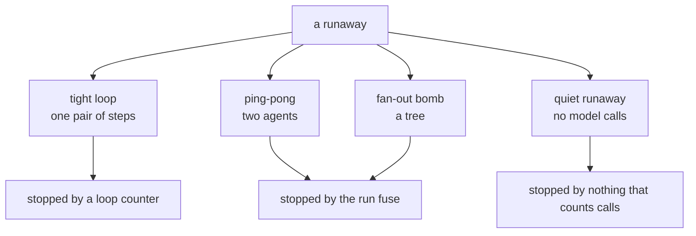

# 1.1 — A runaway is a missing stop, not a mistake

## One-line answer

A runaway agent is not an agent that does the wrong thing; it is an agent that never receives the
instruction to be finished, which is why every runaway in this day is built out of parts that are
each working exactly as designed.

## The story

You move into a flat and there is a tap in the back washroom that does not quite close. It drips.
You mean to call someone about it, and then you do not, because a drip is not an emergency and the
washroom door stays shut.

You go away for three weeks.

Nothing breaks while you are gone. The tap does not burst. The pipe does not crack. The washroom
floor has a drain in it and the water goes down the drain, quietly, at the rate it always did.
Every part of the system does its job. The tap lets water through, which is what a tap does. The
pipe carries water, which is what a pipe does. The drain takes it away.

You come back and there is a bill.

Nobody made a mistake. There is no faulty part to replace and no wrong decision to point at. The
only thing missing was somebody, at some point, deciding that enough water had come out.

## The idea in plain language

A **runaway** is a system that keeps working when it should have stopped.

That sentence is worth reading twice, because the instinct is to look for the broken part. There is
not one. The tap works. The critic that asks for one more revision is doing the job a critic is for.
The agent that decides a billing question belongs to the billing desk has read its instructions
correctly. The step that splits a big task into three smaller tasks is doing exactly what a planner
should do.

What is absent in each case is a **stopping condition that something other than the runaway itself
gets to evaluate.**

Two words for the rest of this day, defined once here:

- A **brake** is anything that can end a run: a counter, a limit, a deadline, a refusal, a kill. It
  is a general word and it covers mechanisms at very different altitudes.
- A **guard** is a brake that is *placed correctly* — outside the thing it is guarding, so that the
  thing it guards cannot decide not to obey it. Every brake in this day is checked against that test
  in [2.1](../02-where-a-brake-goes/2.1-a-guard-is-only-a-guard-if-it-is-outside.md), and two of
  them fail it.

There is a third word this day cannot avoid, and it is worth being precise about, because it decides
which brake you reach for. **Cost** here is not money. Sutra runs on free tiers, so the resource
that runs out is **requests**: a fixed number of model calls per minute and per day, per provider.
Day 24 built the accounting for it, and Day 51 spent a whole day on stretching it. A runaway spends
that number. When it is gone, every *other* ticket that day goes unanswered, which is why
containment on this project is not a tidiness concern.

**Why "runaway" is four different failures wearing one word.** People say "the agent went into a
loop" the way they say "the computer is slow", and it hides the thing you actually need to know:
which stop was missing. There are four shapes, they fail for different reasons, and — this is the
part that matters — **they are caught by different brakes.** The next four parts take one each:

| Shape | What you see | Which stop is missing |
| --- | --- | --- |
| **Tight loop** | one pair of steps repeating | nobody is allowed to say the work is finished |
| **Ping-pong** | two agents handing work back and forth | each one's stop counts only its own hand-offs |
| **Fan-out bomb** | one step becoming three, then nine | nobody bounded the depth of the tree |
| **Quiet runaway** | nothing at all on the quota dashboard | the stop counts model calls, and this makes none |

## Why Sutra needs it

Day 58 assembles the triage graph — intake, classify, research, draft, review — and hands Phase 8
its deliverable. It is the most capability Sutra has ever had in one run: five stations, a revision
loop, a research step that can fan out, and the ability to keep going without anybody watching.

Principle 13 says **blast radius before capability**. That principle has been easy to honour until
now, because until now nothing could run for long on its own. A tool call either returned or it
raised. Today it stops being easy, and this day is where the containment story has to catch up with
the capability that Phase 8 granted.

The Phase 8 gate is *triage graph v1 end-to-end*, and section 5 audits it. But a gate that only
checks that the machine runs has checked half a machine. The other half is whether it stops, and
that half is what sections 1 to 4 measure.

## The mechanism

There is nothing to build in this part. What there is, is a wall — because a day that studies
runaways on purpose has an obvious way to go wrong, and it is worth closing before the first demo
rather than after it.

Every runaway in this day runs behind a **fake model**: a `BaseLlm` subclass that returns a canned
string and counts how many times it was asked, so that the runtime treats it as a model in every
respect while no socket is ever opened.

```python
class CountingLlm(BaseLlm):
    """A model that answers from a list and counts how many times it was asked."""

    model: str = "fake/counting"
    replies: list[str] = ["ok"]
    hard_stop: int = 40
    calls: int = 0

    async def generate_content_async(
        self, llm_request: LlmRequest, stream: bool = False
    ) -> AsyncGenerator[LlmResponse, None]:
        self.calls += 1
        if self.calls > self.hard_stop:
            raise RunawayGuard(f"lab wall: {self.calls} calls exceeds hard_stop={self.hard_stop}")
        text = self.replies[min(self.calls - 1, len(self.replies) - 1)]
        yield LlmResponse(content=types.Content(role="model", parts=[types.Part(text=text)]))
```

**Line by line:**

- `class CountingLlm(BaseLlm)` — subclassing ADK's own model base class rather than mocking around
  it is what makes the demos real. The invocation cost manager counts these calls, `max_llm_calls`
  fuses on them, and plugin hooks fire around them, because as far as the runtime is concerned this
  *is* a model. Verified against the installed `google-adk==2.7.1` on 2026-09-05 with
  `python -c "import inspect; from google.adk.models.base_llm import BaseLlm; print(inspect.signature(BaseLlm.generate_content_async))"`.
- `model: str = "fake/counting"` — the model string. It deliberately does not look like a provider
  string, because a real one here would be a lie in a log.
- `replies: list[str]` with `min(self.calls - 1, len(self.replies) - 1)` — answer from the list, then
  repeat the last entry for ever. Repeating the last entry is not laziness: a critic that is never
  satisfied says the same thing every round, and that is exactly the behaviour being modelled.
- `hard_stop` and `RunawayGuard` — **the lab's own wall.** It is not an ADK mechanism and it is not a
  brake that the system under study has. It exists so that a demo of a *missing* brake cannot become
  a runaway on your machine. When a demo is stopped by this, the output says so in those words, and
  that distinction is load-bearing all day: *stopped by the system* and *stopped by the lab* mean
  opposite things.
- `async def generate_content_async(...)` with `yield` — the base class's contract is an async
  generator, not a coroutine returning a value. Yielding one response is a complete, non-streaming
  reply. This is plan §5.1 **trap #3** in miniature: 2.x yields events as they happen rather than
  collecting them into a list and returning it.

The second protection is a number written down **before** each demo runs. Every runaway below states
the most it can possibly spend, and every one of them spends zero, because the model is fake.
Section [5.4](../05-the-gate/5.4-criterion-4-the-budget-is-measured.md) adds those numbers up and
checks them.



## When it breaks

The way this framing breaks is that somebody hears "runaway" and reaches for the brake that worked
last time.

Here is that mistake with a number on it. The tight loop in
[1.2](1.2-the-critic-who-is-never-satisfied.md) is caught by a loop counter — three lines of code in
the critic. Apply the same fix to the ping-pong in
[1.3](1.3-two-caps-one-rally-twice-the-work.md), where both desks have a counter and both counters
are respected, and this is what you get:

```text
per-desk cap: 3   run fuse: none
    stopped by: front cap  rally length: 7
    rally: front -> back -> front -> back -> front -> back -> front
    model calls: 7   hand-offs: 7
```

Two desks, each capped at three, and the system did **seven**. Nobody's cap was violated. Nobody's
code was wrong. The brake that worked perfectly one part earlier is off by more than a factor of two
here, and it will be off by more as you add desks.

That is the failure this taxonomy exists to prevent, and it is not a coding error. It is reaching
for a mechanism without checking that its *scope* matches the shape's scope.

## In production

**What a professional writes instead.** They do not write a taxonomy in a document; they write it in
a configuration file, as the list of limits the system actually enforces, one per altitude, each
with the shape it is there for. The thing that makes it professional rather than decorative is that
each limit has a **test that removes it and expects the system to fail** — which is
[5.3](../05-the-gate/5.3-criterion-3-the-eval-goes-red.md), and which almost nobody writes.

**What degrades at scale.** The four shapes stay four, but their costs stop being comparable. On one
developer's machine a fan-out bomb and a tight loop both "spend some calls". With real traffic the
tight loop costs one call per round and the fan-out costs a power, so the same window produces bills
that differ by two orders of magnitude. Any dashboard that shows "runs in progress" and not "calls
in progress" hides that difference completely.

**The failure mode that only appears with real traffic.** All four shapes are rare per ticket and
common per day. A loop that fails to terminate on one ticket in five hundred is invisible in testing
and is three incidents a week at ten thousand tickets a day. Worse, the tickets that trigger it are
correlated — they are the hard, ambiguous ones — so they arrive together, which is precisely when
your remaining quota is smallest.

**The review comment a senior engineer leaves:** *"You've called this a loop guard, but the loop it
guards is one node. Which of the four shapes does it stop, and what is the answer for the other
three? If the answer is 'the fuse', say what the fuse is set to and show me the arithmetic against
our daily quota."*

**The interview question:** *"An agent of yours ran away overnight. Walk me through what you would
check."* The answer that shows experience is not a debugging procedure, it is a taxonomy: *"First I
would find out which shape it was, because that tells me which brake was missing rather than which
one failed. If it was one pair of steps repeating, a loop counter was absent or was consulted after
the quality check. If it was two agents handing work to each other, every loop counter in the system
can be intact and the rally still runs — I have measured that: two desks capped at three hand-offs
each produced seven. If it was a tree, nobody bounded the depth, and depth is the only number that
matters, because the cost is a power of the branching factor. And if it cost nothing per step, the
fuse never saw it, because `max_llm_calls` counts model calls and a loop made of tool calls makes
none."*

## Check yourself

```bash
cd days/day-59-runaway-agents-contained/lab
uv run python -c "from _fake import CountingLlm; m = CountingLlm(); print(m.model, m.hard_stop)"
```

Now open `lab/_fake.py` and find the line that raises `RunawayGuard`. Write down, in one sentence,
why that line is not a brake that Sutra has.

**Out loud, without scrolling up:** name the four shapes, and for each one say which stop is missing
rather than which part is broken.

**Next:** [1.2 — The critic who is never satisfied](1.2-the-critic-who-is-never-satisfied.md).
