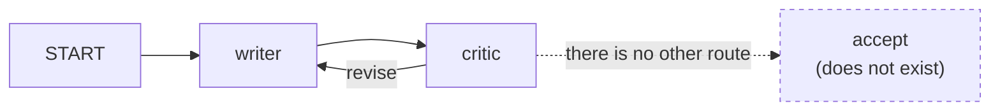

# 1.2 — The critic who is never satisfied

## One-line answer

The tight loop is two steps that each do their job correctly and between them contain no sentence
that means *this is finished*, and with the shipped default fuse of five hundred model calls it can
spend twenty-five times a whole day's free-tier quota inside a single run.

## The story

You take a shirt to a tailor to be altered. He measures, he pins, he tells you to come back on
Thursday.

On Thursday you try it on and he looks at the shoulders and says the seam is sitting a little
high. He pins it again. Come back Saturday.

On Saturday the shoulders are right and now he does not like the way the sleeve falls. He pins the
sleeve. Come back Tuesday.

On Tuesday the sleeve is good and he has noticed the collar.

He is not cheating you. He is a good tailor, and everything he says is true — the seam *was* high,
the sleeve *was* falling badly. The problem is that you never agreed what finished means, and a
tailor's eye will always find one more thing, because that is the eye you went to him for. You are
four visits in and you still do not have a shirt.

## The idea in plain language

The **tight loop** is the simplest runaway: a producer and a checker, wired so the checker can send
work back, with no condition under which the checker sends it forward.

The reason it is so common in agent systems is that the checker is usually the good idea. Day 57
builds the writer-and-critic pair, because a draft that has been reviewed is better than a draft
that has not. The critic exists to find problems. Asking a model to find a problem in a piece of
text is a request it can almost always satisfy, and *the same property that makes the critic useful
makes it unable to terminate.*

Three things have to be true for a tight loop, and they are worth separating because each one is a
place you could have intervened:

1. **There is a cycle.** Something routes work backwards. In a graph this is an edge from a later
   node to an earlier one; Day 53 established that the runtime accepts such an edge as long as it
   carries a route, and Day 54 built the loop shape on it.
2. **The exit is a judgement, not a fact.** "Is this good enough?" is answered by a model. "Have we
   been round three times?" is answered by a counter. The first cannot be relied on to become true;
   the second becomes true on a schedule you chose.
3. **Nothing outside the loop is counting.** If the only thing that could stop the loop is inside
   the loop, then the loop's own behaviour decides whether it ends.

Undo any one of the three and there is no runaway. That is the useful thing about listing them: it
tells you that "make the critic more decisive" is one of three fixes, and the weakest one.

## Why Sutra needs it

The triage graph's `draft → review` pair is exactly this shape. Day 58 wires it, and Day 57 gives
the critic its rubric. On this day the desk's revision loop is capped at two rounds, and the
`endtoend.py` run in [5.1](../05-the-gate/5.1-criterion-1-end-to-end.md) shows what that costs:
five model calls for a ticket that is answered, which is one classify plus one draft and one review
per round.

That "one classify plus two per round" is the arithmetic that
[3.4](../03-brakes-that-do-not-hold/3.4-the-brake-loosened-for-one-ticket.md) moves, and this part
is where the number comes from. It also matters that the desk is not a toy: the critic is the only
thing standing between a customer and a first draft, so nobody is going to accept "remove the
critic" as the containment story.

## The mechanism

The loop is a graph with two nodes and a back edge, and the writer is a real ADK agent with the
fake model behind it, so the runtime counts its calls the way it counts any model's.

```python
def review(node_input=None) -> Event:
    """Never satisfied on the merits. There is no exit route from this node at all."""
    global ROUNDS
    ROUNDS += 1
    return Event(route="revise", output=f"one more change please (round {ROUNDS})")


def main() -> None:
    model = CountingLlm(replies=["a draft of the reply"], hard_stop=WALL)
    writer = Agent(name="writer", model=model, instruction="write the customer reply")
    critic = FunctionNode(func=review, name="critic")
    workflow = Workflow(
        name="polish",
        edges=[
            (START, writer, critic),
            Edge(from_node=critic, to_node=writer, route="revise"),
        ],
    )
```

**Line by line:**

- `Event(route="revise", ...)` — the critic returns an `Event` carrying a **route**, which is the
  2.x way a node says where the work goes next. Day 53 established that a route is a label rather
  than an address: the node names a route and the *edges* decide what that route reaches.
- There is no branch in `review` at all. That absence is the part. A critic with an `if` that can
  return a different route is not a runaway; this one has no second route, so the graph has one
  path and it is a circle.
- `Agent(name="writer", model=model, ...)` — a real `LlmAgent`, used as a node. Day 53's phrase for
  it is that an agent is one node type rather than the unit of composition, and that is why a graph
  can mix an agent with a plain function like the critic.
- `(START, writer, critic)` — a three-element tuple is the chain form: `START → writer → critic`.
  Day 53 shows that the chain is sugar over `Edge` objects, which is why the fourth edge below can
  be written as an `Edge` and sit alongside it.
- `Edge(from_node=critic, to_node=writer, route="revise")` — the back edge, and the only reason the
  runtime accepts it is the `route`. An unconditional back edge is rejected at construction time;
  Day 54's `cycle.py` measures exactly that. **This is worth sitting with**: the runtime's only
  structural promise about loops is that you had to be deliberate enough to name a route. It does
  not promise the loop terminates.
- `hard_stop=WALL` — the lab's wall from [1.1](1.1-a-runaway-is-a-missing-stop.md), not a brake the
  system has.

Run it with no brake at all, with the lab wall pulled in so the shape is visible quickly:

```bash
cd days/day-59-runaway-agents-contained/lab
uv run python loop.py --wall 12
```

**Line by line:**

- `--wall 12` moves only the lab's own stop. Nothing about the graph, the agent or the runtime
  changes. `max_llm_calls` is left at its shipped default, so as far as the system is concerned this
  run is unconstrained.

Measured on 2026-09-05:

```text
fuse: none (max_llm_calls left at its default of 500)   lab wall: 12
    stopped by the LAB, not by the system: lab wall: 13 calls exceeds hard_stop=12
    model calls: 13   critic rounds: 12
```

Read the first phrase of the second line carefully. **Stopped by the LAB, not by the system.** With
the default configuration, the thing that ended this run was a line I wrote in the fake model to
protect my own machine. Sutra contributed nothing.

Now the same graph with a fuse:

```bash
uv run python loop.py --fuse 4
```

**Line by line:**

- `--fuse 4` sets `RunConfig(max_llm_calls=4)` on the run. That is the whole difference: one field
  on the configuration object that the runner is handed.

```text
fuse: 4   lab wall: 40
    stopped by the runtime fuse: LlmCallsLimitExceededError: Max number of llm calls limit of `4` exceeded
    model calls: 4   critic rounds: 4
```

Four calls, then a named error from the framework. The mechanism behind that number is
[2.3](../02-where-a-brake-goes/2.3-the-run-fuse.md); what matters here is the contrast. Same graph,
same critic, same fake model. One field.



## When it breaks

The dangerous version of this failure is not the one above. Nobody ships a critic with no exit
route; it is too obviously wrong when you draw the graph.

The dangerous version is the **default**. Here is what the shipped default actually means on this
project:

```bash
uv run python fuse.py --default
```

Measured on 2026-09-05:

```text
shipped default: max_llm_calls = 500
free tier:       20 requests per day
one run at the default can spend 500 calls, which is 25
    times the whole day's quota - so the default is not a brake on this project,
    it is a stop against an infinite loop in somebody else's billing account.
```

Twenty-five times the day's quota, in one run, without anybody having configured anything wrongly.
The default is not badly chosen — it is chosen for a user with a billing account, where five hundred
calls is a bad afternoon rather than a dead service. On a free tier it is not a brake at all.

And here is the error you get when the fuse does fire, verbatim, including the traceback ADK prints
before your own handler sees it:

```traceback
  File "C:\...\google\adk\flows\llm_flows\base_llm_flow.py", line 1498, in _call_llm_with_tracing
    invocation_context.increment_llm_call_count()
  File "C:\...\google\adk\agents\invocation_context.py", line 413, in increment_llm_call_count
    self._invocation_cost_manager.increment_and_enforce_llm_calls_limit(
  File "C:\...\google\adk\agents\invocation_context.py", line 99, in increment_and_enforce_llm_calls_limit
    raise LlmCallsLimitExceededError(
google.adk.agents.invocation_context.LlmCallsLimitExceededError: Max number of llm calls limit of `4` exceeded
```

That traceback is worth having in front of you once, because it is the thing you will actually
search for at eleven at night, and because it shows the failure **surfacing** rather than being
turned into a model reply. That is plan §5.1 **trap #4**: 2.x pushes errors through the runtime so
that callbacks and plugins can act on them. A 1.x-era habit of catching this and returning a
polite string would hide the single most important fact about the run.

## In production

**What a professional writes instead.** They give the critic two routes and make the second one
reachable by something that is not a judgement. In practice that means the critic node reads a
round counter out of state and returns `accept` when it is at the cap, regardless of quality —
which is [2.2](../02-where-a-brake-goes/2.2-the-loop-counter.md) — and the accepted-but-unfinished
draft goes to a human rather than to a customer. The important half of that sentence is the second
half: a cap with no escalation path converts a runaway into a silently poor answer, which is worse,
because now nothing is even alarming.

**What degrades at scale.** The loop cost is linear in rounds, so it looks harmless. What is not
linear is *which tickets loop*. Ambiguous tickets are exactly the ones where the critic can always
find something, and ambiguous tickets cluster — a product incident produces fifty of them in an
hour. Your average revision count barely moves and your worst hour spends everything.

**The failure mode that only appears with real traffic.** A critic that is graded on finding
problems drifts. Nobody changes the prompt; the *inputs* change, and a rubric that was calibrated
on last quarter's tickets is stricter on this quarter's. The loop count creeps from 1.2 to 1.9 to
2.6 over months, and no deploy is responsible for it. If your only alarm is on the cap being hit,
you get no warning at all until the day it starts being hit.

**The review comment a senior engineer leaves:** *"The critic can return `revise` and nothing else.
Draw the graph and show me the path to the exit — if you cannot draw it, the exit does not exist.
And when you add the cap, tell me where the capped draft goes, because 'accepted' and 'good' are
now different things and the customer cannot tell them apart."*

**The interview question:** *"Why can't you just tell the model to stop after three revisions?"* The
honest answer names the mechanism rather than the vibe: *"Because that instruction is not enforced
by anything. It is a sentence in a prompt, and whether it holds is a property of the model's output
that run. I ran exactly that experiment: the same instruction, the same graph, and the only variable
was whether the stub complied. When it did not, the run made twenty-one model calls; when it did, it
made four and stopped a round late anyway. Moving the same rule into an edge condition made it three
every time. It is the difference between a speed limit painted on a sign and a speed bump."*

## Check yourself

```bash
cd days/day-59-runaway-agents-contained/lab
uv run python loop.py --wall 12
uv run python loop.py --fuse 4
uv run python fuse.py --default
```

Now open `loop.py` and add a second route to `review` — return `Event(route="accept", ...)` when
`ROUNDS` reaches three — and add the edge that route needs. Run it again and write down the call
count.

**Out loud, without scrolling up:** name the three things that must all be true for a tight loop,
and say which of them "make the critic more decisive" addresses.

**Next:** [1.3 — Two caps, one rally, twice the work](1.3-two-caps-one-rally-twice-the-work.md).
