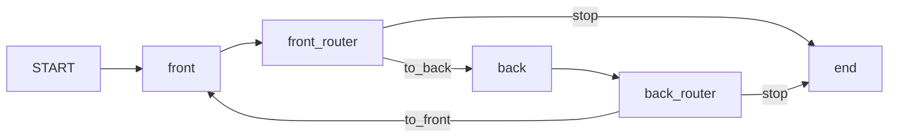

# 1.3 — Two caps, one rally, twice the work

## One-line answer

When two agents hand work to each other, every per-agent limit can be respected and the system
still does more than any of them authorised: two desks capped at three hand-offs each produced a
rally of seven, because a counter can only count what passes through the desk it lives in.

## The story

You go to a government office to change the address on a document. The man at counter four looks at
your form, and says the address change is handled at counter nine.

At counter nine the woman reads the same form and says that because your document was issued at
counter four, the change has to be initiated there. She is not being difficult. That is genuinely
the rule she was given.

Back at counter four the man says he cannot initiate anything until counter nine has verified the
new address, and points you back.

Both of them are following their instructions correctly. Neither is wrong. Neither is even being
unhelpful — each of them is trying to route you to the person who can actually do the thing. And if
you asked either one of them "how many times have you sent this person away today?", each would
honestly answer *twice*, which does not sound like a problem to either of them.

You have crossed the room four times.

## The idea in plain language

The **ping-pong** is a runaway made of hand-offs. Agent A decides the work belongs to B; B decides
it belongs to A; the work never lands.

Day 55 named the mechanism this runs on. **Transfer** hands over control and does not come back;
**agent-as-tool** is a call that returns. A ping-pong is a transfer loop, and it is specifically the
non-returning kind that produces it, because with a returning call there is always somebody holding
the original request who could give up.

The reason this shape deserves its own part, rather than being "a tight loop with two nodes", is
that **it defeats the brake that catches a tight loop.** A loop counter counts rounds of a loop it
was written into. In a ping-pong there is no single loop object: there are two desks, each with its
own state, each counting its own hand-offs. Both counters are correct. Neither of them is counting
the thing that is actually growing.

Say it as arithmetic. If each desk permits `n` hand-offs, the rally is not `n`. It is roughly `2n`,
because the two desks alternate and each one's count advances only on its own turn. With `d` desks
in a cycle it is roughly `d × n`, and `d` is a number nobody wrote down anywhere, because it is a
property of the *graph*, not of any agent in it.

There is a second, quieter reason the caps do not compose: **each desk's instruction is reasonable
in isolation.** Read the two instructions and look for the bug.

- The front desk: *"Billing questions belong to the back office; hand them over."*
- The back office: *"Customer-facing wording belongs to the front desk; hand it back."*

Now ask a question that is both: *"Draft the customer wording for this billing correction."* Neither
sentence is wrong. The failure lives in the space between them, and no reviewer reading either
agent's prompt on its own can see it.

## Why Sutra needs it

Day 55 gives the desk delegation and Day 57 gives it an orchestrator, so from Phase 8 onward Sutra
is a system where more than one agent can decide where work goes. That is the precondition for this
shape, and it arrived four days ago.

The concrete risk on this project is the research step. Day 58's triage graph delegates research,
and research can reasonably decide that what it has found is a billing matter rather than an
incident — which routes back to classification, which can reasonably send it to research again.
Nothing about that is a bug in either station. It is two correct rules meeting a ticket that sits on
the boundary between them, which is what a hard ticket *is*.

## The mechanism

Two desks, each an agent, each followed by a routing node holding that desk's own counter.

```python
def hand_off(desk: str, other_route: str):
    """Build one desk's routing function. Each desk counts only its own hand-offs."""

    def route(ctx: Context, node_input=None) -> Event:
        key = f"{desk}_handoffs"
        seen = ctx.state.get(key, 0) + 1
        ctx.state[key] = seen
        RALLY.append(desk)
        if seen > CAP:
            ctx.state["stopped_by"] = f"{desk} cap"
            return Event(route="stop", output=f"{desk}: cap of {CAP} reached")
        return Event(route=other_route, output=f"{desk}: this belongs to the other desk ({seen})")

    return route
```

**Line by line:**

- `key = f"{desk}_handoffs"` — **this line is the part.** Each desk writes its count under its own
  key, which is what a per-agent limit means. Nothing here is a mistake; it is what you would write
  if you were asked to cap a desk. The bug is that no key holds the total.
- `ctx.state` — session state, shared across the whole run. Note that the shared thing is *available*
  to both desks. Neither of them uses it for the total, because neither of them has any reason to
  think about a total; each was asked to limit itself.
- `if seen > CAP` — the cap is a real, working brake, and the output below shows it firing. This is
  not a demonstration of a broken guard. It is a demonstration of a working guard measuring the
  wrong quantity.
- `return Event(route=other_route, ...)` — the hand-off. `other_route` is `to_back` for the front
  desk and `to_front` for the back office, so the two functions are the same code with the
  destination swapped, which is exactly how two reasonable instructions end up in a cycle.

The graph wires each desk's agent to its router, and each router's `to_*` route to the other desk:

```python
workflow = Workflow(
    name="pingpong",
    edges=[
        (START, front, front_router),
        Edge(from_node=front_router, to_node=back, route="to_back"),
        (back, back_router),
        Edge(from_node=back_router, to_node=front, route="to_front"),
        Edge(from_node=front_router, to_node=end, route="stop"),
        Edge(from_node=back_router, to_node=end, route="stop"),
    ],
)
```

**Line by line:**

- `(START, front, front_router)` and `(back, back_router)` — two chains, each pairing a desk with
  its own router. Written as chains because that is the readable form for a straight line.
- The two `route="to_back"` / `route="to_front"` edges are the cycle. Draw them and the shape is
  obvious; read the two agents' instructions and it is invisible. That gap is the whole risk.
- Both routers have a `stop` edge to the same `end` node. **Two branches arriving at one node** is a
  thing a graph can express and an agent tree cannot — Day 53's argument for **trap #1**, the 2.x
  node model, put to work rather than stated.

Run it with each desk capped at three:

```bash
cd days/day-59-runaway-agents-contained/lab
uv run python pingpong.py
```

**Line by line:**

- No flags: both desks capped at three hand-offs, and `max_llm_calls` left at its default so that
  nothing above the desks is counting.

Measured on 2026-09-05:

```text
per-desk cap: 3   run fuse: none
    front: this belongs to the other desk (1)
    back: this belongs to the other desk (1)
    front: this belongs to the other desk (2)
    back: this belongs to the other desk (2)
    front: this belongs to the other desk (3)
    back: this belongs to the other desk (3)
    front: cap of 3 reached
    stopped by: front cap  rally length: 7
    rally: front -> back -> front -> back -> front -> back -> front
    model calls: 7   hand-offs: 7
```

Read the counts in the brackets. Each desk reaches `(3)` and stops there — **both caps held
exactly.** And the rally is seven, and seven model calls were made.

If you had been asked, before the run, "what is the most this can cost?", and you had read the code
for the front desk and seen `CAP = 3`, you would have said three. You would have been wrong by more
than a factor of two, having read the code correctly.

Lower the cap and the ratio stays:

```bash
uv run python pingpong.py --cap 2
```

**Line by line:**

- `--cap 2` lowers both desks' limits together. Only the caps move; the graph, the instructions
  and the absence of a run fuse are unchanged.

```text
    stopped by: front cap  rally length: 5
    rally: front -> back -> front -> back -> front
    model calls: 5   hand-offs: 5
```

Two becomes five. The pattern is `2n + 1`, and the `+1` is the desk that discovers the cap.

Now the brake that does work here, because it counts something that has no desk:

```bash
uv run python pingpong.py --fuse 4
```

**Line by line:**

- `--fuse 4` adds `RunConfig(max_llm_calls=4)` and leaves both per-desk caps at three, so the two
  brakes are present at once and you can see which one gets there first.

```text
per-desk cap: 3   run fuse: 4
    stopped by the runtime fuse: LlmCallsLimitExceededError: Max number of llm calls limit of `4` exceeded
    rally: front -> back -> front -> back
    model calls: 4   hand-offs: 4
```

Four calls and it is over. The fuse never asked which desk made the call. That is precisely why it
saw a rally that both desks' own counters could not.



## When it breaks

The version that reaches production is not two desks. It is three or four, and the cycle is not a
pair, it is a longer circuit that nobody has drawn — front desk to research, research to billing,
billing back to the front desk. Every hop is a defensible routing decision. The cycle only exists in
the union of them.

Here is the concrete break. Add one desk to the run above and keep every cap at three. The rally
becomes roughly `3 × 3` rather than `2 × 3`, so the same configuration file, unchanged, now
authorises half again as much work — and the change that caused it was *adding a specialist*, which
is the change everybody makes when quality is poor and which nobody thinks of as touching limits.

There is also a genuinely nasty variant: **the rally that terminates.** Suppose the back office's
instruction is slightly more assertive and it gives in on the fourth pass. The run ends. Nothing
alarms. You have paid seven model calls for a hand-off that should have been one, on every ticket of
that shape, for ever, and there is no error anywhere to tell you. This is the shape that hides in a
cost report as "our per-ticket cost is higher than we expected" rather than as an incident.

## In production

**What a professional writes instead.** They stop counting hand-offs per agent and start counting
them **per unit of work**. The counter goes on the thing that is being passed around — the ticket,
the request, the trace — not on the thing passing it. In practice this is a `hops` field in state
that every router increments and no router owns, plus a rule that a request arriving at a desk it
has already visited is escalated rather than routed. That second rule is the one people leave out,
and it is the only one that catches a three-desk circuit.

**What degrades at scale.** Hand-offs are the part of a multi-agent system that grows fastest as you
add agents, because the number of *possible* cycles grows with the number of edges rather than the
number of nodes. A six-agent system where any agent may delegate to any other has thirty ordered
pairs, and you will not enumerate them by reading prompts.

**The failure mode that only appears with real traffic.** Boundary tickets. The rally requires a
request that genuinely satisfies two desks' rules at once, which is rare, which means it is absent
from your test set and present in your traffic. It also correlates with the tickets that matter
most: a question that is both billing and technical is usually a customer who is unhappy about
both.

**The review comment a senior engineer leaves:** *"Both of these caps are per-agent, so the system's
limit is the cap times the number of desks in the cycle, and nobody has written down how many desks
are in the cycle. Put the counter on the ticket, and add a rule that a ticket returning to a desk it
has already visited goes to a human. Also: what does the trace look like? If I cannot see the rally
in one view, nobody will ever diagnose this."*

**The interview question:** *"You have per-agent limits everywhere. Why is that not enough?"* — *"It
is not enough because the limits do not compose. I measured this: two agents that each hand off to
the other, each capped at three hand-offs, both caps respected, and the run made seven model calls.
Each agent's count was correct. Nothing was counting the rally, because the rally is not an object
in anybody's code — it is a property of the graph. The fix is to move the counter onto the unit of
work rather than the worker, and the brake that caught it in the meantime was the run-level fuse,
which works precisely because it does not care which agent made the call."*

## Check yourself

```bash
cd days/day-59-runaway-agents-contained/lab
uv run python pingpong.py
uv run python pingpong.py --cap 2
uv run python pingpong.py --fuse 4
```

Now read the two desk instructions in `pingpong.py` and write down a request that is genuinely both
desks' job. Then predict the rally length at `--cap 5` before you run it.

**Out loud, without scrolling up:** explain why a loop counter that works perfectly on the tight
loop is off by a factor of two here, without using the word "bug".

**Next:** [1.4 — The shape that grows by a power](1.4-the-shape-that-grows-by-a-power.md).
