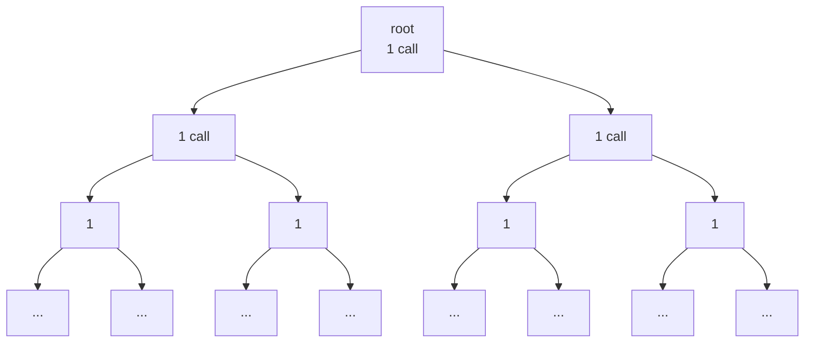

# 1.4 — The shape that grows by a power

## One-line answer

A step that splits itself into sub-steps costs the branching factor raised to the depth, so a
modest-looking cap of five levels at two branches each is sixty-three model calls — three times a
whole day's free tier, from one run, with a limit in place.

## The story

Somebody adds you to a group and there is a message: *pass this on to three people you know, and
ask them to do the same. It only takes a minute.*

Three is nothing. You can think of three people without trying. The person who sent it to you sent
it to three, and it took them a minute, exactly as promised.

By the time it has gone round five times, the message has reached three hundred and sixty-three
people. Nobody sent it to more than three. Nobody did anything except the small, reasonable thing
they were asked to do. There was no moment where somebody made a big decision.

The number that did all the work was not the three. It was the five.

## The idea in plain language

The **fan-out bomb** is a runaway where one unit of work produces several units of work, each of
which can do the same.

It is the shape that agent systems have arrived at most recently, because it requires a planner. Day
56 builds plan-and-execute, where a model is asked to break a task into steps. That is a genuinely
good pattern, and it contains this failure as a latent property: if a step of a plan can itself be
planned, the plan is a tree, and a tree with no depth limit has no size limit.

Two numbers describe it and only one of them matters:

- The **branching factor** — how many sub-tasks a task produces. Call it `b`.
- The **depth** — how many times a sub-task may itself be split. Call it `d`.

The total number of tasks is `(b^(d+1) − 1) / (b − 1)`, which is a formula you do not need to
remember, because the useful version is: **the cost is exponential in depth and only polynomial in
branching.** Halving the branching factor from four to two is a large-sounding change that helps a
little. Reducing the depth from five to four is a small-sounding change that removes more than half
the tree.

This is the opposite of most people's intuition, which is why the review conversation always ends up
about the wrong number. "Should the planner produce three sub-tasks or five?" is the question people
argue about. "How deep may this recurse?" is the question that decides the bill.

And there is a third thing, which is the reason this is a *runaway* rather than merely an expensive
operation: **`d` is often not written down anywhere.** The branching factor tends to be visible,
because it is in the prompt — "break this into at most three steps". The depth is emergent. It is
however many times the model happened to decide that a step was still too big.

## Why Sutra needs it

Day 56's planner and Day 58's research station are both places where one ticket becomes several
lookups. That is desirable: a ticket that touches billing and authentication genuinely needs two
searches, and a good agent does both.

What Sutra does not have, on the day this gate runs, is anything that stops the second search from
deciding it needs two more. The triage graph's fan-out is one level deep because the graph is drawn
that way, and the moment a planner is allowed to decide the shape rather than the graph author, the
depth becomes a model's opinion.

The free-tier arithmetic makes this sharper here than on a project with a billing account. Twenty
requests a day per model means the entire budget fits inside a tree of depth two.

## The mechanism

The recursion is deliberately plain Python rather than a graph, because the point of this part is
arithmetic and a graph would hide it behind machinery. The real graph-shaped fan-out — including
what a `JoinNode` does with the results — is Day 54's subject.

```python
def expand(task: str, depth: int, calls: list[str], cap: int) -> None:
    """One task asks a model how to split itself, then splits itself, recursively.

    `cap` of 0 means no depth cap - which is not a large cap, it is the absence of a cap, and the
    difference is the whole part.
    """
    calls.append(task)
    if len(calls) > WALL:
        raise BombGuard(f"lab wall: {len(calls)} model calls with no depth cap")
    if cap and depth >= cap:
        return
    for i in range(BRANCH):
        expand(f"{task}.{i}", depth + 1, calls, cap)
```

**Line by line:**

- `calls.append(task)` — one model call per task, before any splitting. Every node of the tree costs
  one call, including the leaves, which is why the total is the whole tree and not just the bottom
  row.
- `if len(calls) > WALL` — the lab's wall again, not a brake the system has.
- `if cap and depth >= cap: return` — **the only stopping condition.** Note `if cap and ...`: a cap
  of zero is falsy, so it means *no cap*, not *no depth*. That is a deliberate echo of the trap in
  [3.3](../03-brakes-that-do-not-hold/3.3-the-fuse-set-to-zero.md), where ADK's own
  `max_llm_calls=0` means unbounded for the same reason.
- `for i in range(BRANCH)` — the branching factor, applied uniformly. A real planner's branching
  varies per task; uniform branching gives the clean arithmetic, and the real case is bounded above
  by the maximum branching, so the arithmetic is still the number you must plan against.
- `depth + 1` passed down, `cap` passed unchanged — depth is per-path and the cap is global, which
  is what makes the cap a property of the system rather than of a task.

First, with no depth cap at all:

```bash
cd days/day-59-runaway-agents-contained/lab
uv run python fanout.py
```

**Line by line:**

- No flags: branching factor three, no depth cap. This is the configuration you get when a planner
  is allowed to decide whether a step needs planning and nobody wrote a limit.

Measured on 2026-09-05:

```text
branching factor 3, no depth cap, daily free tier 20 requests
    stopped by the LAB, not by the system: lab wall: 501 model calls with no depth cap
    model calls before the wall: 501
```

Five hundred and one, and it was still going. The lab stopped it. Nothing else was going to.

Now with a cap that looks careful:

```bash
uv run python fanout.py --depth 2
```

**Line by line:**

- `--depth 2` sets the only stopping condition the recursion has. The branching factor stays at
  three, so the change between this run and the last one is one number.

```text
branching factor 3, depth cap 2, daily free tier 20 requests
    model calls: 13
    free tier: 20 - 13 = 7 remaining
    depth  tasks at that depth  running total
        0                    1              1
        1                    3              4
        2                    9             13
```

Thirteen calls for **one ticket**. That leaves seven requests for the rest of the day.

And now the number that makes the point. Halve the branching factor — the change that feels like it
is making the system much more conservative — and add three levels of depth:

```bash
uv run python fanout.py --branch 2 --depth 5
```

**Line by line:**

- `--branch 2` is the change that feels conservative and `--depth 5` is the change that feels
  reasonable. Both flags are moved at once because the point is what they do together.

```text
branching factor 2, depth cap 5, daily free tier 20 requests
    model calls: 63
    free tier: 20 - 63 = -43 remaining
    depth  tasks at that depth  running total
        0                    1              1
        1                    2              3
        2                    4              7
        3                    8             15
        4                   16             31
        5                   32             63
```

**Minus forty-three.** Two branches sounds like the safe setting. Five levels sounds like a
reasonable limit. Together they are three times the daily quota, spent on one ticket, with both
limits in place and both of them chosen by somebody being careful.

Look down the middle column. The last row, on its own, is larger than the entire tree above it. That
is the property that makes depth the number to argue about: **more than half of any fan-out's cost
is in its deepest level.**



## When it breaks

The break that costs a night is not the uncapped tree. It is the **cap that is enforced in the wrong
place.**

Here is the shape. A planner is given the instruction *"break this into at most three steps"*, and
somebody, reasonably, considers that the branching factor to be controlled. It is enforced by the
prompt, so it is not enforced at all — that is [2.1](../02-where-a-brake-goes/2.1-a-guard-is-only-a-guard-if-it-is-outside.md)'s
argument and [3.1](../03-brakes-that-do-not-hold/3.1-the-guard-the-agent-can-talk-past.md)'s
measurement. Meanwhile the depth is not mentioned to anybody, because it is not a thing the planner
is aware of; the planner only ever sees one task at a time and has no idea how deep it is.

That is the genuinely uncomfortable property of this shape: **the component that is recursing cannot
see the recursion.** Each invocation is a small, sensible act. There is no vantage point inside the
system from which the tree is visible, unless somebody deliberately threads a depth counter through
every call — which is the fix, and it is a plumbing change that nobody wants to make until after the
incident.

The second break is subtler and is worth naming because it survives a depth cap. If sub-tasks are
executed **in parallel**, the depth cap bounds the total but not the *rate*. Day 54 measured what a
three-way fan-out does to event ordering; what it does to a per-minute quota is that the entire
bottom row arrives at the provider at once. A tree of sixty-three calls spread over a minute is
survivable on a five-requests-per-minute lane. The same sixty-three arriving in one burst is
fifty-eight rejections and a retry storm, which is
[3.2](../03-brakes-that-do-not-hold/3.2-three-retries-become-twenty-seven.md).

## In production

**What a professional writes instead.** The depth counter travels with the work, in the request
itself, and every spawn point reads it, increments it and refuses past a limit — the same "count the
work, not the worker" move that [1.3](1.3-two-caps-one-rally-twice-the-work.md) arrived at from a
different direction. On top of that they put a **total task budget** for the run, not just a depth
limit, because depth and branching multiply and a limit on one of them is not a limit on the
product. In a mature system the planner is also asked to produce the *whole* plan up front rather
than recursively, precisely so the tree is a data structure somebody can look at before it runs —
which is Day 56's plan-as-data argument, and this is the containment reason for it.

**What degrades at scale.** Memory and concurrency, before cost. Each pending sub-task holds
context; a tree of sixty-three holds sixty-three contexts, and a system that handles forty tickets
at once now holds two and a half thousand. The failure people meet first is not the quota, it is the
process being killed.

**The failure mode that only appears with real traffic.** Depth correlates with difficulty, and
difficulty correlates with importance. The tickets that recurse deepest are your escalations. So the
fan-out bomb does not fire uniformly at random across your traffic; it fires on the tickets where a
failure is most visible to a customer.

**The review comment a senior engineer leaves:** *"You have capped the branching factor and not the
depth, and the depth is the exponent. Show me the worst case as a number — branching to the power of
depth — and put it next to our daily quota in the same table. If those two numbers are not in the
same table, nobody is comparing them."*

**The interview question:** *"How do you bound a recursive planner?"* — *"By depth, and by a total
task budget, and I would argue for the total budget being the one that actually saves you. Depth
alone is deceptive: I measured a tree at branching two and depth five, which sounds conservative
twice over, and it was sixty-three model calls against a daily quota of twenty. More than half of
that was the last level, which is the general property — the cost is a power of the depth, so the
number people argue about in review, the branching factor, is the one that matters least. And the
counter has to travel in the request, because the component doing the recursing sees one task at a
time and cannot know how deep it is."*

## Check yourself

```bash
cd days/day-59-runaway-agents-contained/lab
uv run python fanout.py --depth 2
uv run python fanout.py --branch 2 --depth 5
```

Now find the depth `d` at which branching three first exceeds the twenty-request daily free tier.
Predict it from the table before you run `fanout.py --depth <d>` to check.

**Out loud, without scrolling up:** say which of branching and depth you would argue about in a
design review, and why the other one is the one everybody argues about instead.

**Next:** [1.5 — The quiet runaway the fuse cannot see](1.5-the-quiet-runaway-the-fuse-cannot-see.md).
