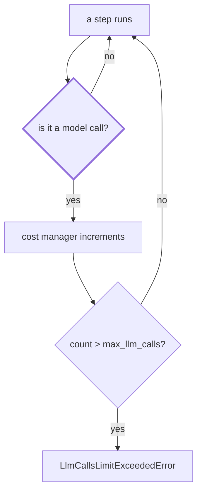

# 1.5 — 💥 The quiet runaway the fuse cannot see

## One-line answer

A loop made of tool calls rather than model calls costs nothing that anybody is counting, so a run
with `max_llm_calls=4` set read two hundred and one pages of an archive without the fuse ever
firing.

## The story

Your phone is at eighty per cent when you go to bed. In the morning it is at nine.

Nothing was on. The screen was dark all night, face down on the table. You did not get a call. You
were asleep in the same room and you would have noticed a light.

Later you find it in the battery screen: some app you installed months ago and forgot, waking every
few seconds all night to check something. It was never doing anything expensive. Each check took no
time at all and used almost nothing. It just never stopped checking, and there is no alert for a
thing that is not expensive, only for a thing that is.

## The story continued, as a scene

> 🎬 **The scene:** you have wired the run fuse. `max_llm_calls=4` on every entry point. You have
> tested it: the never-satisfied critic dies at four calls with a named error, and you have the
> traceback in your notes. You consider runaways handled.
>
> 😬 **The naive fix:** that *was* the fix. One field, applied everywhere, tested. It is the fix
> everybody arrives at, and it is a good one.
>
> 💥 **Why it fails:** the fuse counts model calls. It is implemented in
> `_InvocationCostManager.increment_and_enforce_llm_calls_limit`, and the only thing that calls it
> is the LLM flow. A loop whose steps are a retrieval lookup, a state write and a routing decision
> makes zero model calls, so the counter never increments and the limit is never compared against
> anything. The run is not slow at the provider. It is not visible in a quota dashboard. It is a
> `while` loop wearing a graph.
>
> 💡 **The insight:** **a brake can only see the quantity it counts.** Every limit you set is
> implicitly a claim about which resource is scarce, and a loop that consumes a different resource
> passes underneath it without touching it.

## The idea in plain language

The **quiet runaway** is a loop that does not make model calls.

It sounds like a contradiction — surely an *agent* loop involves the model? — and the reason it is
not is that a modern agent graph contains a great many steps that are not model calls. Day 53
established that a node is a unit of work rather than a unit of intelligence, and that a plain
Python function is a perfectly good node. Retrieval is a node. A state write is a node. A routing
decision computed from state is a node. None of them touch a provider.

So the graph has two kinds of step, and every brake you have built so far counts only one of them.

What does a quiet runaway actually cost? Not requests. It costs:

- **Wall-clock time**, which for a queue-backed system is throughput: this run is occupying a worker
  that other tickets need.
- **Memory**, because a loop that appends to state grows the session, and Day 47 made sessions
  persistent, so it grows something on disk.
- **The downstream systems** it is talking to. A retrieval loop is not free to the index; it is free
  to *you*.
- **The answer**, eventually, because a run that never terminates never produces one, and the
  customer is still waiting.

That last one is the reason this belongs in a security curriculum as well as a reliability one.
SEC-04 is containment, and a loop that consumes no quota but occupies a worker for ever is a
denial-of-service against your own queue. It is the cheapest possible attack: it needs no model
calls at all, so it is invisible to precisely the meter you built.

## Why Sutra needs it

Days 49 and 50 built retrieval and tuned it, and Day 52 wired it behind the desk. The research
station in Day 58's triage graph is a retrieval call, and retrieval is free — that was the whole
point of Phase 7 and it is written into the phase gate: *"Seen anything like this before?" answered
at $0.*

Free is exactly the property that makes it invisible here. A research loop that keeps deciding it
needs one more page is the cheapest runaway Sutra can produce and the only one that none of the
brakes built so far will catch.

## The mechanism

Two plain function nodes and a routed back edge. No agent, no model, and a fuse set anyway so that
you can watch it not fire.

```python
def fetch_page(ctx: Context, node_input=None) -> str:
    """Read one more page of the archive. No model, no network, no cost anybody counts."""
    global PAGES
    PAGES += 1
    if PAGES > WALL:
        raise LabWall(f"lab wall: {PAGES} pages read, {ctx.state.get('found', 0)} matches found")
    ctx.state["pages"] = PAGES
    return f"page {PAGES}"


def look_for_more(ctx: Context, node_input: str) -> Event:
    """Keep going until enough evidence is found. The archive never contains enough."""
    ctx.state["found"] = ctx.state.get("found", 0)
    return Event(route="next", output=f"not enough evidence yet ({node_input})")
```

**Line by line:**

- `def fetch_page(ctx: Context, node_input=None) -> str` — a `FunctionNode`'s function. It takes the
  run context and the previous node's output, and returns a plain string as its output. There is no
  `Agent` anywhere in this graph, which is the point: this is a fully legitimate 2.x graph that
  makes no model calls.
- `ctx.state["pages"] = PAGES` — a state write. This is the step that costs memory rather than
  quota, and on a persistent session it is the step that costs disk.
- `return Event(route="next", ...)` — the same routed back edge as every other loop in this section.
  Structurally identical to [1.2](1.2-the-critic-who-is-never-satisfied.md); economically its
  opposite.
- `ctx.state["found"] = ctx.state.get("found", 0)` — the exit condition that never advances. It is
  written to look like progress and it is a no-op, which is the honest model of a search loop whose
  stopping rule depends on finding something that is not there.
- `LabWall` — the lab's wall. Nothing in the system stops this.

Run it with the fuse deliberately set low:

```bash
cd days/day-59-runaway-agents-contained/lab
uv run python quiet.py
```

**Line by line:**

- No flags: `max_llm_calls=4`, the tightest fuse used anywhere in this day, and a lab wall of sixty
  pages.

Measured on 2026-09-05:

```text
run fuse: max_llm_calls=4   lab wall: 60 pages
    stopped by the LAB, not by the system: lab wall: 61 pages read, 0 matches found
    pages read: 61   model calls: 0   fuse fired: no
```

Sixty-one iterations under a four-call fuse. Now move only the lab's wall — change nothing about the
graph, the fuse, or the loop:

```bash
uv run python quiet.py --wall 200
```

**Line by line:**

- `--wall 200` moves the lab's own stop and nothing else. The fuse stays at four, which is the
  comparison the run exists to make.

```text
run fuse: max_llm_calls=4   lab wall: 200 pages
    stopped by the LAB, not by the system: lab wall: 201 pages read, 0 matches found
    pages read: 201   model calls: 0   fuse fired: no
```

Two hundred and one. The fuse is still four. It would be four at two thousand and one.

**There is no error in this output.** No traceback, no status code, no `LlmCallsLimitExceededError`.
The only reason the run ended is a line in the lab, and the only reason you can tell anything
happened is that the script prints the count itself. On a real system there would be no such line,
because nobody prints a counter for a loop they did not know was a loop.



## When it breaks

The break is that there is nothing to break. That is the finding.

Compare the four shapes on the one column that matters — whether anything in the system produced a
signal:

| Shape | Ended by | Signal produced |
| --- | --- | --- |
| Tight loop | the run fuse | `LlmCallsLimitExceededError`, with a traceback |
| Ping-pong | the run fuse | the same error, plus a rally visible in the event stream |
| Fan-out bomb | the run fuse or the depth cap | the same error, or a clean return |
| **Quiet runaway** | **nothing** | **none** |

Three of these four failures announce themselves. The fourth is diagnosed by somebody noticing that
a worker has been busy for a suspiciously long time, which requires that somebody is looking at
worker occupancy, which most teams start doing after the first time this happens.

And here is the part that makes it worth a whole document rather than a footnote: **the brake that
catches it is not a smaller version of the brakes that catch the others.** Counting model calls more
carefully will never find this. The brake that finds it counts something else — iterations of a
loop, or elapsed time — and section 2 has to say plainly that Sutra has the first of those written
only where somebody remembered to write it, and does not have the second at all. That is a gate
finding, and [5.2](../05-the-gate/5.2-criterion-2-every-shape-has-a-brake.md) records it as one.

## In production

**What a professional writes instead.** Two things, and both are boring. First, a **wall-clock
deadline on the whole run**, set at the entry point, checked between steps — because a deadline is
the only brake that is blind to what the steps are made of, and blindness is exactly the property
you want in a last resort. Second, a **step counter** for the graph, distinct from any per-loop
counter: total nodes executed in this run, capped. Both are cheap; neither exists by default; and
the reason people write them is almost always that they met this failure once.

On ADK specifically it is worth being exact about what you do and do not get. `FunctionNode` carries
a `timeout` field and the workflow package exports `NodeTimeoutError`, verified on the installed
`google-adk==2.7.1` on 2026-09-05 with
`python -c "import google.adk.workflow as w; print(sorted(n for n in dir(w) if not n.startswith('_')))"`.
**A per-node timeout is not a run deadline.** A node that finishes quickly two hundred times never
trips its own timeout. That distinction is the difference between believing you are covered and
being covered.

**What degrades at scale.** Worker occupancy. One quiet runaway is a slow ticket; forty of them, on
a pool of forty workers, is an outage in which every dashboard you own is green — quota untouched,
error rate zero, no failed requests — and no tickets are being answered.

**The failure mode that only appears with real traffic.** The loop needs a request for which the
stopping condition is never satisfiable. In testing, your archive contains the answer, so the loop
ends on the first pass and you never see it. In production, somebody asks about a product you do not
document, and the search for evidence that does not exist runs until something else stops it. Day
50's part on returning nothing is the upstream fix for this: a retriever that can honestly say *I
found nothing* gives the loop a fact to terminate on.

**The review comment a senior engineer leaves:** *"This loop makes no model calls, so `max_llm_calls`
does not apply to it and neither does the quota breaker. What ends this run if the archive never
matches? If the answer is a node timeout, that is not an answer — the node returns quickly every
time. Put a deadline on the invocation and a cap on total node executions."*

**The interview question:** *"Your run fuse limits model calls. What does it miss?"* — *"Anything
that does not call the model. I built one deliberately: a retrieval loop with `max_llm_calls` set to
four, which ran two hundred and one iterations without the fuse ever incrementing, because the fuse
is implemented inside the LLM flow and the loop never entered it. It costs no quota, so it is
invisible on a cost dashboard, and it produces no error, so it is invisible on an error dashboard.
What it costs is a worker and the answer. The brake that catches it has to count something the loop
actually consumes — elapsed time, or steps executed — and a per-node timeout does not count, because
each node is fast."*

## Check yourself

```bash
cd days/day-59-runaway-agents-contained/lab
uv run python quiet.py
uv run python quiet.py --wall 200
```

Now change `look_for_more` so that it routes somewhere else once `ctx.state["pages"]` reaches five,
add the edge that route needs, and confirm the run ends without the lab wall being involved.

**Out loud, without scrolling up:** explain why a per-node timeout does not stop this loop, and name
the two brakes that would.

**Next:** [2.1 — A guard is only a guard if it is outside](../02-where-a-brake-goes/2.1-a-guard-is-only-a-guard-if-it-is-outside.md).
