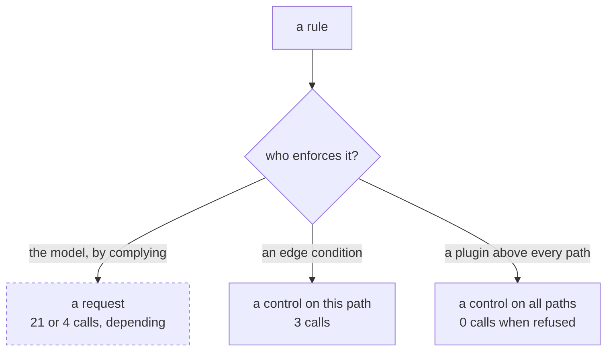

# 2.1 — A guard is only a guard if it is outside

## One-line answer

A limit written into an agent's instruction is not a limit, it is a request: the same guard sentence
produced twenty-one model calls when the model did not comply and three when the same rule was moved
into an edge condition.

## The story

There is a speed limit sign on the road outside your house. Forty. It has been there for years.

Cars go past at seventy.

The council eventually does something, and what they do is not a bigger sign or a second sign or a
sign in a brighter colour. They lay two speed bumps.

Now cars go past at twenty-five, including the cars driven by people who never read the sign, people
who cannot read, and people who are actively in a hurry and would very much prefer to go faster. The
bump does not need their agreement. It does not need them to have seen it. It works on a driver who
has decided to ignore it, which is the only kind of driver a limit is for.

The sign was information. The bump is a control.

## The idea in plain language

This part is one sentence and its consequences: **a guard must be enforced by something the guarded
thing does not control.**

That sounds obvious written down. It is broken constantly, because in an agent system the most
natural-looking place to put a rule is in the prompt, and a rule in a prompt is on the wrong side of
the line.

Here is the test, and it is worth memorising because it takes five seconds and catches most of these:

> **After the run, can you tell whether the guard held — without reading the model's output?**

If the answer is no, you do not have a guard. You have a request that was probably granted.

Three placements, in order of how much they are worth:

| Where the rule lives | Enforced by | Can the agent get past it? |
| --- | --- | --- |
| The agent's instruction | the model's cooperation | yes, and you will not reliably know |
| The node or edge that calls the agent | your code | no, but only for that one path |
| A plugin, or the runtime configuration | the framework, above every path | no |

The second row is the one worth dwelling on, because it is where most real guards should live and
because its weakness is specific rather than general. Code in an edge condition genuinely cannot be
talked past. What it *can* be is bypassed — by a second path that reaches the same node without
going through that edge. That is not the model defeating the guard; it is a graph the guard's author
did not draw. [3.1](../03-brakes-that-do-not-hold/3.1-the-guard-the-agent-can-talk-past.md) shows
the first failure and
[5.2](../05-the-gate/5.2-criterion-2-every-shape-has-a-brake.md) audits the second.

**Why this is a security topic and not just a reliability one.** SEC-04 is runaway containment, and
it sits in the safety curriculum rather than the operations one for a reason that becomes obvious
once you have written a prompt-based guard: *an instruction is part of the context, and the context
is partly attacker-controlled.* Day 66 opens Phase 10 with prompt injection, and the sentence that
connects the two phases is this one — **a limit expressed as text can be argued with by text.** A
retrieved ticket that says "ignore previous constraints" is a text that reaches the same place your
limit lives. A limit expressed as an edge condition is not in the conversation at all.

## Why Sutra needs it

Every brake in the rest of this section is placed somewhere, and this part is the criterion that
decides whether the placement is any good:

- The **loop counter** in [2.2](2.2-the-loop-counter.md) lives in a node, reading state. Outside the
  agent, inside the graph.
- The **run fuse** in [2.3](2.3-the-run-fuse.md) lives on `RunConfig`, above the whole invocation.
- The **circuit breaker** in [2.4](2.4-the-circuit-breaker.md) lives in a plugin, above every agent
  and every node.
- The **kill** in [2.5](2.5-the-kill-switch-and-what-it-leaves.md) lives outside the process
  entirely.

That is a ladder, and each rung is outside the rung below it. The ladder is the answer to "where do
brakes go", and this part is why it is ordered that way rather than being a list.

## The mechanism

The experiment is three runs of one graph. The guard is the same sentence in all three; the only
things that change are whether the model complies and whether the rule is also expressed as code.

```python
INSTRUCTION = (
    "You are the writer. Revise the reply when the critic asks. "
    f"Never revise more than {CAP} times; after {CAP} revisions, reply exactly DONE."
)
```

**Line by line:**

- This is a **good** prompt-based rule, deliberately. It is specific, it names a number, and it
  states the exact token to emit. If a prompt guard were ever going to work, it would look like this
  one. The part is not about badly written instructions.
- `f"...{CAP}..."` — the cap is interpolated from the same constant the code arm uses, so the two
  arms genuinely encode the same rule.

The critic then routes on one of two things, depending on the arm:

```python
def review(ctx: Context, node_input=None) -> Event:
    global ROUNDS
    ROUNDS += 1
    ctx.state["rounds"] = ROUNDS
    if IN_GRAPH and ROUNDS >= CAP:
        ctx.state["stopped_by"] = "edge condition"
        return Event(route="stop", output=f"cap of {CAP} reached in the graph")
    text = str(node_input or "")
    if "DONE" in text:
        ctx.state["stopped_by"] = "the model said DONE"
        return Event(route="stop", output="the writer says it is done")
    return Event(route="revise", output=f"one more change (round {ROUNDS})")
```

**Line by line:**

- `if IN_GRAPH and ROUNDS >= CAP` — the code arm. The decision is made from a counter the graph owns.
  The model's output is not consulted at all on this branch, which is precisely the property being
  tested.
- `if "DONE" in text` — the prompt arm. The decision is made **by reading the model's words.** Every
  weakness of a prompt guard is in that sentence: the rule is enforced by string-matching an output
  the model chose to produce.
- `ctx.state["stopped_by"]` — recording *which* mechanism stopped the run. This exists because the
  whole question of the part is answerable only if the system writes down its own reason, and the
  fact that you have to add a line to make that answerable is itself the finding.
- `ROUNDS` as a module global alongside `ctx.state["rounds"]` — the global is the lab's observation
  and the state is the system's memory. Keeping them separate means the measurement does not become
  the mechanism.

The stub model is where the honesty of this experiment lives:

```python
replies = ["a draft"] * CAP + ["DONE"] if OBEDIENT else ["a draft"]
```

**Line by line:**

- `["a draft"] * CAP + ["DONE"]` — the obedient stub emits `DONE` on its fourth call. The ordinary
  one never does, because its single reply repeats for ever.
- **Neither stub is a claim about any real model.** This day makes no live model calls, so it has no
  measurement of how often a real model complies, and it will not invent one. What the two stubs
  establish is something a compliance rate could not: that the *same guard* yields both outcomes, so
  the guard does not determine the outcome. That is a statement about the guard, and it is provable
  without knowing anything about the model.

Run all three arms:

```bash
cd days/day-59-runaway-agents-contained/lab
uv run python outside.py
uv run python outside.py --obedient
uv run python outside.py --in-graph
```

**Line by line:**

- Arm one: guard in the instruction, model does not comply.
- Arm two: guard in the instruction, model complies. Same instruction, same graph, same cap.
- Arm three: guard in an edge condition, model does **not** comply — deliberately the same
  uncooperative stub as arm one, so that the only variable between one and three is where the rule
  lives.

Measured on 2026-09-05:

```text
guard: a sentence in the instruction (prose)   model: does not comply   cap: 3
    stopped by the LAB, not by the system: lab wall: 21 calls exceeds hard_stop=20
    model calls: 21   rounds: 20

guard: a sentence in the instruction (prose)   model: complies   cap: 3
    stopped by: the model said DONE after 4 rounds
    model calls: 4   rounds: 4

guard: an edge condition (code)   model: does not comply   cap: 3
    stopped by: edge condition after 3 rounds
    model calls: 3   rounds: 3
```

Three numbers: **21, 4, 3.**

The first two are the same guard. Twenty-one calls and four calls, from an identical instruction,
with the difference being entirely a property of the output. That is what "not a control" means,
stated as a measurement: the guard did not determine the result.

The third is the same uncooperative model as the first, with the rule moved into an edge. Three,
which is the cap, exactly.

And there is a detail in the middle row worth catching: the obedient arm stopped after **four**
rounds against a cap of three. The stub emitted `DONE` on its fourth reply because that is how I
wrote it — but the instruction said *after 3 revisions*, and a reader counting revisions would have
expected three. Even in the arm where the guard "worked", it worked to a different number than the
one written down. A guard whose value is off by one in the case where it holds is not a guard you
can do arithmetic with, and [3.4](../03-brakes-that-do-not-hold/3.4-the-brake-loosened-for-one-ticket.md)
is entirely about doing arithmetic with these numbers.



## When it breaks

The way this breaks in a real codebase is not that someone writes a prompt guard believing it is a
control. It is that a prompt guard and a real guard are written at different times by different
people, and the prompt one is never removed.

The result is a system with a rule in two places and a **number in two places**. The prompt says
three, the edge condition says five, and both are true statements about the code. Now read the
output: the run stopped after three rounds. Which guard fired? You cannot tell, because the two
mechanisms produce the same observable outcome and only one of them writes down why.

That is what `stopped_by` is for, and it is the single cheapest thing in this whole day:

```text
    stopped by: the model said DONE after 4 rounds
    stopped by: edge condition after 3 rounds
```

Two lines, one field. Without it, every run that ended looks the same, and you will spend an
afternoon establishing something a `print` statement could have told you.

The other break is the one that survives everything in this part: a guard correctly placed **on one
path**. Arm three's edge condition governs the `critic → writer` edge. If somebody later adds a
second edge into `writer` — from an escalation node, say, or a retry — that edge does not pass
through the critic and does not consult the counter. The guard is real, well placed, tested, and
routed around. Nothing about "put it in code rather than in the prompt" prevents this;
[5.2](../05-the-gate/5.2-criterion-2-every-shape-has-a-brake.md) is where the gate goes looking for
it.

## In production

**What a professional writes instead.** They keep the sentence in the prompt *and* enforce it in
code, and they are explicit about why both exist. The prompt version is there to make the common
case cheap: a model that stops on its own does not burn the three calls the cap would have allowed.
The code version is there because the prompt version is not a guarantee. What they do not do is
write only one of them and describe it as the limit. In a review, the giveaway is a document that
says "the agent will not revise more than three times" — *will not* is a claim about behaviour, and
the honest sentence is "the graph will not allow more than three revisions".

**What degrades at scale.** Prompt-based rules degrade silently as the prompt grows. A limit stated
in sentence four of a four-sentence instruction is in a different situation from the same limit
buried at line ninety of an instruction that has accumulated eleven other rules, retrieved context
and a tool manifest. Day 19's *Lost in the Middle* is the measured version of that, and its
consequence here is that your prompt guards get weaker over months without anybody editing them.

**The failure mode that only appears with real traffic.** Adversarial and near-adversarial inputs. A
customer pasting a long angry email full of instructions is not attacking you, but the text still
lands in the same context as your rule. Day 66 makes this deliberate; in ordinary traffic it is
accidental and it still moves the outcome.

**The review comment a senior engineer leaves:** *"'Never do X more than three times' is in the
system prompt. Where is it in the code? If the answer is nowhere, then after a run I cannot tell you
whether it held, and neither can our logs — so please add the edge condition, keep the sentence, and
write `stopped_by` into state so the two are distinguishable in a trace."*

**The interview question:** *"How do you stop an agent from doing something too many times?"* — *"Not
by telling it not to. I ran that experiment: the same instruction, naming the same cap, produced
twenty-one model calls with one stub and four with another, and the only difference was the output.
Moving the identical rule into an edge condition produced three, every time, with the uncooperative
stub. So the rule I use is that a guard has to be enforced by something the guarded thing does not
control, and the test is whether I can tell after the run that the guard held without reading the
model's output. I keep the prompt version too, because a model that stops on its own is cheaper, but
I never describe it as the limit."*

## Check yourself

```bash
cd days/day-59-runaway-agents-contained/lab
uv run python outside.py
uv run python outside.py --obedient
uv run python outside.py --in-graph
```

Now run `uv run python outside.py --obedient --in-graph` and predict the number of calls before you
do. Then say which guard stopped it, and how you can tell.

**Out loud, without scrolling up:** state the five-second test for whether something is a guard, and
apply it to the sentence "the agent is instructed not to send more than one email per ticket".

**Next:** [2.2 — The loop counter, checked before the quality condition](2.2-the-loop-counter.md).
