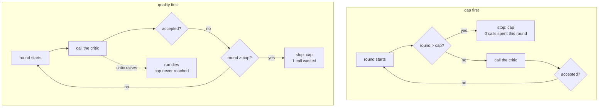

# 2.2 — The loop counter, checked before the quality condition

## One-line answer

A loop cap consulted *before* the quality check costs one fewer call per run and, more importantly,
still holds when the quality check itself fails — the ordering that asks the critic first died with
the critic and never consulted the cap at all.

## The story

A bus conductor stands at the door with a clicker. Forty-two seats, and he counts people on.

There is a right way and a wrong way to do his job, and the difference shows up on a wet evening at
a busy stop. The right way: he looks at the clicker, sees forty-two, and puts his arm across the
door. He does not check whether the next person has the right change, whether they are going far,
whether they look like they are in a hurry. The bus is full. That is the whole conversation.

The wrong way is to let them on, take the fare, work out the ticket, and *then* notice the clicker
says forty-three. Now there is a person on a full bus holding a ticket, and the argument that
follows is not about the rule, it is about the fact that you already took their money.

The order is not a style preference. It decides what happens when the second check goes wrong.

## The idea in plain language

A **loop counter** is the most local brake there is: a number in state that goes up once per round,
and a rule that ends the loop when it hits a cap.

Day 54 built it. This part is about the one line of it that is usually written the wrong way round.

Inside a revision loop there are two questions:

- **The quality condition:** *is this good enough?* Answered by a critic, which is usually a model
  call.
- **The cap:** *have we been round enough times?* Answered by a counter, which is arithmetic.

Both can end the loop. The order in which you ask them looks like a detail and is not, for two
reasons.

**The cheap reason: cost.** If you ask the critic first and then check the cap, the run that ends at
the cap has made one critic call whose answer was thrown away. One call per run, on every capped
run, for ever. On a free tier of twenty requests a day that is not rounding error.

**The reason that matters: failure.** The critic can fail. It is a network call to a provider, so it
can time out, it can return something unparseable, and it can return HTTP 429 — which on this
project is not an exotic case, it is Tuesday. If the cap is checked *after* the critic, then a run in
which the critic fails never reaches the cap at all. **The brake is downstream of the thing most
likely to break.**

That is the general principle, and it is worth stating in a form you can carry to other code:
**check the conditions that cannot fail before the conditions that can.** A counter cannot fail. A
network call can. Putting the counter second means that the counter's protection is conditional on
the network call succeeding, which is the opposite of what a brake is for.

## Why Sutra needs it

The triage desk's `review` station is exactly this loop. In Day 58's graph it decides between
`revise` and `accept`, and the accept branch is reached either because the draft is good or because
the round cap was hit. `endtoend.py` in [5.1](../05-the-gate/5.1-criterion-1-end-to-end.md) shows
the cap firing at two rounds and the run ending at the `send` station.

The 429 case is the live one. Day 2 met the free-tier limit for real and Day 24 built the accounting
around it, and the day's own budget in [5.4](../05-the-gate/5.4-criterion-4-the-budget-is-measured.md)
is denominated in exactly the resource that runs out. A critic that fails with 429 in the middle of
a loop is a normal Tuesday on this project, and the ordering in this part decides whether that
Tuesday ends with a capped draft going to a human or with a loop that is now unbounded because its
only brake was behind the thing that just broke.

## The mechanism

The loop is stripped to the two checks and the ordering flag, because that is the whole subject.

```python
def loop() -> tuple[int, str]:
    """One revision loop. The only difference between the arms is the order of two checks."""
    calls = 0
    for round_no in range(1, ROUNDS_WATCHED + 1):
        if not QUALITY_FIRST and round_no > CAP:
            return calls, f"cap of {CAP} reached before the critic was asked"
        calls += 1
        try:
            if critic(round_no):
                return calls, "critic accepted"
        except CriticUnavailable as exc:
            if QUALITY_FIRST:
                raise
            return calls, f"cap held while the critic was down ({exc})"
        if QUALITY_FIRST and round_no > CAP:
            return calls, f"cap of {CAP} reached after the critic was asked"
    raise NoStop(f"{ROUNDS_WATCHED} rounds and nothing stopped it")
```

**Line by line:**

- `if not QUALITY_FIRST and round_no > CAP` — the cap, checked **before** `calls += 1`. Nothing has
  been spent when this returns, which is where the one-call saving comes from.
- `calls += 1` — the critic call. Counted rather than estimated, so the two arms can be compared by
  a number rather than by argument.
- `except CriticUnavailable` with `if QUALITY_FIRST: raise` — this is the honest modelling of the
  two orderings under failure. In the quality-first arm the exception propagates, because there is
  no cap check upstream of it to fall back to. In the cap-first arm the loop can still return, and
  it returns *saying* the cap held.
- `raise` rather than swallowing — plan §5.1 **trap #4**. The quality-first arm does not quietly
  return a default when the critic dies; the error surfaces, which is correct behaviour and is also
  precisely why the run ends with no answer.
- `raise NoStop(...)` at the end — the lab's wall for this script. If neither ordering stops the
  loop within the watched rounds, that is a bug in the demo and it says so rather than looping.

Four runs, because there are two orderings and two states of the critic:

```bash
cd days/day-59-runaway-agents-contained/lab
uv run python counter.py
uv run python counter.py --quality-first
```

**Line by line:**

- The first run is cap-then-quality with a critic that is never satisfied — the ordinary case.
- `--quality-first` swaps only the order of the two checks. The cap is the same, the critic is the
  same, the loop is the same.

Measured on 2026-09-05:

```text
order: cap, then quality   cap: 3   critic: never satisfied
    stopped: cap of 3 reached before the critic was asked
    critic calls: 3

order: quality, then cap   cap: 3   critic: never satisfied
    stopped: cap of 3 reached after the critic was asked
    critic calls: 4
```

**Three against four.** Both stopped at the cap; both are correct; one of them spent a call finding
out something it already knew. On twenty requests a day, a desk running four capped tickets has
spent four requests — a fifth of the day — on critic calls whose answers were discarded.

Now break the critic, which is the reason the ordering is not merely thrift:

```bash
uv run python counter.py --critic-fails
uv run python counter.py --critic-fails --quality-first
```

**Line by line:**

- `--critic-fails` makes `critic()` raise on the first call with a 429, which is the error this
  project meets more than any other.
- The second command adds the ordering flag, so the two runs differ only in which check is first.

```text
order: cap, then quality   cap: 3   critic: raises
    stopped: cap held while the critic was down (critic call failed: HTTP 429 from the provider)
    critic calls: 1

order: quality, then cap   cap: 3   critic: raises
    the loop died with the critic: CriticUnavailable: critic call failed: HTTP 429 from the provider
    critic calls: 1   the cap was never consulted
```

Read the last four words of the last line. **The cap was never consulted.**

In the quality-first arm the loop did stop — the exception took it down, honestly, and that is
better than swallowing it. But it stopped *because of the failure*, not because of the brake. The
brake was never reached. If the critic had failed in a way that returned a value rather than raising
— an empty reply, a malformed response parsed to "not accepted" — the quality-first loop would have
gone round again, and again, with a cap sitting after the failing call, never evaluated.

That is the real content of the ordering: in the cap-first arm the counter's protection is
unconditional, and in the quality-first arm it is conditional on the critic working.



## When it breaks

The break is not the ordering. It is the cap with nowhere to go.

A loop that ends at its cap has produced a draft that the critic did not accept. Something has to
happen to that draft, and there are only three options: send it to the customer, throw it away, or
give it to a person. Only the third is defensible, and it is the one that requires work, so it is
the one that gets left out.

Here is what leaving it out looks like in a system that is otherwise correct. The desk's `review`
station returns `accept` at the cap, the graph routes `accept` to the send station, and the reply
goes out. Every brake worked. The loop was bounded. The quota was respected. And the customer
received a draft that the system's own critic had, on its last look, judged inadequate — with
nothing anywhere recording that this reply is different from a reply the critic actually liked.

Day 58's graph avoids this by routing the capped path to escalation rather than to send, and the
lab's desk does the same:

```python
    def review(ctx: Context, node_input: str) -> Event:
        spend.visit("review", model=True)
        rounds = ctx.state.get("rounds", 0)
        if rounds >= max_revisions:
            ctx.state["stopped_by"] = "revision cap"
            return Event(route="accept", output=f"accepted after {rounds} rounds")
        return Event(route="revise", output=f"revise (round {rounds})")
```

**Line by line:**

- `ctx.state["stopped_by"] = "revision cap"` — the field from
  [2.1](2.1-a-guard-is-only-a-guard-if-it-is-outside.md), written here so that the downstream station
  can tell a capped acceptance from a genuine one. Without this line the two are indistinguishable
  everywhere downstream, for ever.
- `if rounds >= max_revisions` **before** any quality logic — the ordering this part argues for,
  applied in the desk itself.
- `max_revisions` as a parameter rather than a module constant — so that
  [3.4](../03-brakes-that-do-not-hold/3.4-the-brake-loosened-for-one-ticket.md) can move it and
  measure what moves with it, which is a thing you cannot do with a constant frozen at import time.

## In production

**What a professional writes instead.** The counter lives on the unit of work rather than in a
module global, for the reason [1.3](../01-four-runaways/1.3-two-caps-one-rally-twice-the-work.md)
gave: per-worker counters do not compose. It is checked first, its cap is a named constant with the
measurement it came from in the comment beside it, and the capped exit routes somewhere a human
looks. The other thing they add, which is small and disproportionately useful, is a **metric on the
distribution of rounds** rather than on cap hits. Cap hits tell you when you are already failing;
the distribution tells you three weeks earlier that the mean has moved from 1.2 to 1.9.

**What degrades at scale.** The cap becomes a queueing parameter rather than a quality one. At low
volume, raising the cap from two to four buys better drafts. At high volume it doubles the
worst-case work per ticket, and the thing that breaks first is not quality or cost but throughput:
every worker is now potentially busy twice as long, so the queue depth doubles for the same arrival
rate.

**The failure mode that only appears with real traffic.** Correlated cap hits. The tickets that
exhaust the cap are the ambiguous ones, and ambiguity arrives in bursts — an incident, a bad release,
a confusing billing change. So the escalation queue that the capped path feeds is empty for a week
and then receives forty items in an hour, which is exactly when the humans are also busiest.

**The review comment a senior engineer leaves:** *"The cap is checked after the critic call, so a
capped run costs one wasted request and, worse, a critic that 429s skips the cap entirely. Move the
check above the call. And where does a capped draft go? If it goes to the same place an accepted one
goes, we are sending the customer work our own critic rejected, and nothing downstream can tell."*

**The interview question:** *"You have a revision loop with a maximum. Where exactly do you check the
maximum, and why?"* — *"Before the quality check, for two reasons. The cheap one is that checking it
after costs one wasted model call on every capped run; I measured three calls against four for the
same cap. The real one is that the quality check is a network call and can fail. If the cap is
downstream of it, then a critic that 429s means the cap is never evaluated — I ran that too, and the
quality-first arm died with the critic having never consulted its own brake. The general rule is to
evaluate the conditions that cannot fail before the ones that can. And separately: the capped exit
has to go somewhere different from the accepted exit, with a `stopped_by` field saying which, or
nothing downstream can tell an accepted draft from an abandoned one."*

## Check yourself

```bash
cd days/day-59-runaway-agents-contained/lab
uv run python counter.py
uv run python counter.py --quality-first
uv run python counter.py --critic-fails --quality-first
```

Now change `critic()` so that instead of raising it returns `False` on failure, and re-run the
quality-first arm. Write down what stops the loop.

**Out loud, without scrolling up:** give the general rule about the order of two checks, and say
which of a counter and a network call is allowed to go second.

**Next:** [2.3 — The run fuse: what `max_llm_calls` counts](2.3-the-run-fuse.md).
