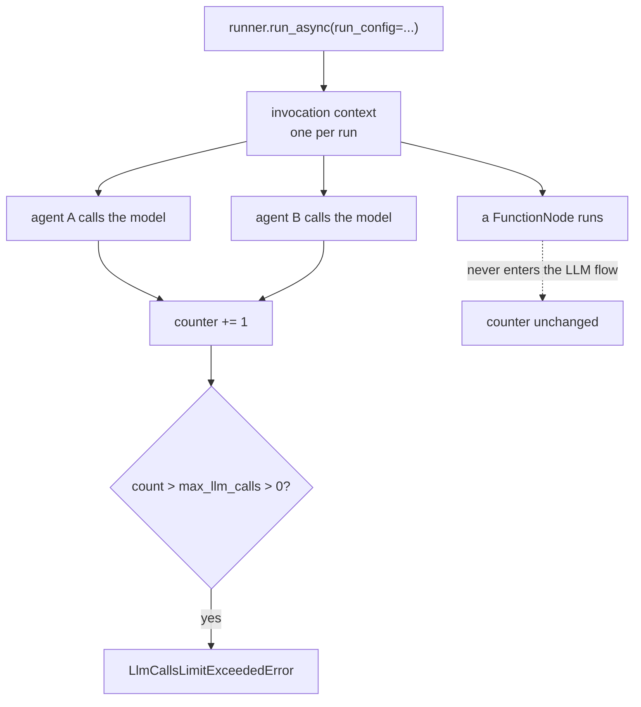

# 2.3 — The run fuse: what `max_llm_calls` counts

## One-line answer

`max_llm_calls` is one field on `RunConfig` that counts every model call in an invocation, across
every agent and node in it, which is why it catches the rally that no per-agent counter can see —
and its shipped default of 500 is twenty-five times this project's entire daily free tier.

## The story

The washing machine, the geyser and the iron are all on, and somebody plugs in a heater. Everything
goes dark.

You go out to the landing and open the little metal box on the wall, and one of the switches has
flicked down. You push it back up and the lights come on.

The trip switch did not know what a geyser is. It did not check whether the iron was more important
than the heater, or whether you were halfway through something. It has exactly one input — total
current through this flat — and one behaviour. It is the least intelligent device in the building
and it is the reason the building is still standing.

The reason it works is not cleverness. It is **position**. It sits where all the current passes,
which is a place none of the appliances can see and none of them can argue with.

## The idea in plain language

The **run fuse** is a limit on the number of model calls in one invocation.

An **invocation** here means one call to the runner: one user message going in, however many nodes,
agents, loops and hand-offs that produces, until the run ends. That scope is the whole reason this
brake exists as a separate thing from
[2.2](2.2-the-loop-counter.md)'s counter. A loop counter's scope is a loop. The fuse's scope is
everything.

Three properties follow from that, and they are the three things worth knowing:

1. **It sees across agents.** [1.3](../01-four-runaways/1.3-two-caps-one-rally-twice-the-work.md)
   measured two desks capped at three producing a rally of seven. The fuse set to four ended it at
   four, because it never asked which desk was calling.
2. **It counts model calls only.** That is its blind spot, and it is complete rather than partial:
   [1.5](../01-four-runaways/1.5-the-quiet-runaway-the-fuse-cannot-see.md) ran two hundred and one
   iterations under a fuse of four. The fuse is not weak against a quiet runaway; it is absent.
3. **It is per run, not per day.** Two runs of four calls each is eight calls, and the fuse is
   satisfied both times. Nothing in it accumulates. That is what
   [2.4](2.4-the-circuit-breaker.md) is for.

## Why Sutra needs it

Sutra's free tier is twenty generate requests per day per model, which Day 2 met as a live 429 and
`docs/PACKAGES.md` records. That number is the reason the fuse is not optional here.

It is also the reason the **default** is the interesting part rather than the mechanism. A default
of five hundred is a sensible number for someone with a billing account, where the fuse's job is to
stop an infinite loop before it becomes a large invoice. On this project five hundred is not a limit
in any useful sense — a single run at the default can spend the whole day twenty-five times over.
Leaving it alone is not a decision to accept the framework's judgement; it is a decision to have no
run-level brake at all.

## The mechanism

The fuse is one field, and setting it is one argument to `run_async`:

```python
config = RunConfig(max_llm_calls=CAP)
...
async for _event in runner.run_async(
    user_id="learner", session_id=session.id, new_message=message, run_config=config
):
    ...
```

**Line by line:**

- `RunConfig(max_llm_calls=CAP)` — `RunConfig` is ADK's per-invocation configuration object. It
  carries a great many fields; `max_llm_calls` is the one this day cares about. Verified against the
  installed `google-adk==2.7.1` on 2026-09-05 with
  `python -c "from google.adk.agents.run_config import RunConfig; print(RunConfig.model_fields['max_llm_calls'].default)"`,
  which prints `500`. The adk.dev page consulted the same day was
  `https://adk.dev/runtime/runconfig/`.
- `run_config=config` — passed to the **run**, not to the agent and not to the graph. That is the
  placement argument from [2.1](2.1-a-guard-is-only-a-guard-if-it-is-outside.md) in its cleanest
  form: the limit is a property of the invocation, so no node inside the invocation can reach it.
- `async for _event in runner.run_async(...)` — the run is an async iterator of events, which is
  plan §5.1 **trap #3**: 2.x yields events as they happen. The fuse fires mid-iteration, which is
  why it arrives as an exception out of the `async for` rather than as a return value.

Where it is enforced is worth reading once, because it explains both what the fuse catches and what
it cannot. From the installed package, `google/adk/agents/invocation_context.py`:

```text
  def increment_and_enforce_llm_calls_limit(
      self, run_config: RunConfig | None
  ) -> None:
    """Increments _number_of_llm_calls and enforces the limit."""
    # We first increment the counter and then check the conditions.
    self._number_of_llm_calls += 1

    if (
        run_config
        and run_config.max_llm_calls > 0
        and self._number_of_llm_calls > run_config.max_llm_calls
    ):
      # We only enforce the limit if the limit is a positive number.
      raise LlmCallsLimitExceededError(
          "Max number of llm calls limit of"
          f" `{run_config.max_llm_calls}` exceeded"
      )
```

**Line by line:**

- `self._number_of_llm_calls += 1` — a counter on the invocation context, which is the object that
  spans the whole run. **That single fact is why the fuse sees the rally**: there is one of these per
  invocation, not one per agent.
- `run_config.max_llm_calls > 0` — the condition that makes zero mean *unbounded* rather than
  *none*. It is documented in the field's own docstring and it is the subject of
  [3.3](../03-brakes-that-do-not-hold/3.3-the-fuse-set-to-zero.md).
- `self._number_of_llm_calls > run_config.max_llm_calls` — strictly greater, and the increment
  happens first, so a fuse of four permits exactly four calls and raises on the fifth attempt. The
  measured output below shows `model calls: 4`, which agrees.
- `raise LlmCallsLimitExceededError(...)` — it raises. It does not return a degraded response, it
  does not log and continue. Plan §5.1 **trap #4** in the framework's own code: the failure is
  surfaced so that plugins and callbacks can act on it.
- The only caller is in the LLM flow (`flows/llm_flows/base_llm_flow.py`), which is the mechanical
  statement of the blind spot: a step that never enters the LLM flow never increments this counter.

Run the fuse against the never-satisfied loop at two settings:

```bash
cd days/day-59-runaway-agents-contained/lab
uv run python fuse.py
uv run python fuse.py --cap 8
```

**Line by line:**

- No flags: `max_llm_calls=4`.
- `--cap 8`: the same graph and the same critic with the fuse doubled, so the output is the fuse's
  value rather than any property of the loop.

Measured on 2026-09-05:

```text
max_llm_calls: 4
    LlmCallsLimitExceededError: Max number of llm calls limit of `4` exceeded
    model calls made before it stopped: 4

max_llm_calls: 8
    LlmCallsLimitExceededError: Max number of llm calls limit of `8` exceeded
    model calls made before it stopped: 8
```

Exactly the cap, both times. The fuse is boring, which is the highest praise a brake can get.

Now the default, priced against this project rather than described:

```bash
uv run python fuse.py --default
```

**Line by line:**

- `--default` reads the shipped default out of the model field rather than quoting it from memory,
  and divides it by the free-tier daily limit recorded in `docs/PACKAGES.md`.

```text
shipped default: max_llm_calls = 500
free tier:       20 requests per day
one run at the default can spend 500 calls, which is 25
    times the whole day's quota - so the default is not a brake on this project,
    it is a stop against an infinite loop in somebody else's billing account.
```



## When it breaks

The fuse fails in the direction you would want a fuse to fail: loudly. What breaks is what people do
with the noise.

Here is the whole error, as it actually arrives, including the traceback ADK logs before your
handler sees it:

```traceback
  File "C:\...\google\adk\flows\llm_flows\base_llm_flow.py", line 1548, in _call_llm_with_tracing
    async for llm_response in agen:
  File "C:\...\google\adk\flows\llm_flows\base_llm_flow.py", line 1498, in _call_llm_with_tracing
    invocation_context.increment_llm_call_count()
  File "C:\...\google\adk\agents\invocation_context.py", line 413, in increment_llm_call_count
    self._invocation_cost_manager.increment_and_enforce_llm_calls_limit(
  File "C:\...\google\adk\agents\invocation_context.py", line 99, in increment_and_enforce_llm_calls_limit
    raise LlmCallsLimitExceededError(
google.adk.agents.invocation_context.LlmCallsLimitExceededError: Max number of llm calls limit of `4` exceeded
```

The two mistakes people make with this, in the order they make them:

**First, catching it and returning a reply.** The handler looks like `except
LlmCallsLimitExceededError: return "Sorry, I could not complete that request."` and it is
catastrophic in a quiet way. The run now looks successful to everything downstream. The customer
gets an apology instead of an answer, the metrics record a completed run, and the fact that a
containment mechanism fired — the single most important thing that happened — is nowhere. Principle
10 and **trap #4** are both about this exact line of code.

**Second, raising the fuse to make the error go away.** The fuse firing is information: this run
wanted more calls than you budgeted. There are two possible reasons, and they need opposite
responses. Either the work genuinely needs more calls, in which case raising the fuse is right *and*
you must re-derive everything sized against it — which is
[3.4](../03-brakes-that-do-not-hold/3.4-the-brake-loosened-for-one-ticket.md) — or there is a
runaway, in which case raising the fuse converts a caught runaway into an uncaught one. Choosing
between those requires looking at the events, and raising the number is what people do instead of
looking.

There is a third failure that is not a mistake so much as a limit worth stating plainly. **The fuse
does not know what the calls were for.** A run that legitimately needs six calls and a run that is
in a rally of six look identical to it. It is a blunt instrument by design, and its bluntness is
exactly why it works where the smart per-agent counters did not.

## In production

**What a professional writes instead.** They set the fuse **per entry point**, from the worst case
they computed rather than from a round number. The desk's synchronous path, the nightly batch and
the developer's debug loop have three different worst cases and should have three different fuses.
The arithmetic that produces the number is
[6.1](../06-in-production/6.1-brakes-are-a-system.md)'s subject, and the review rule that comes with
it is that a pull request changing a fuse must show the arithmetic.

They also **never leave it at the default in production**, and they say so in the code with a
comment naming the run the number came from — the same discipline Day 50 applied to `TOP_K` and
`CHUNK_SIZE`. A bare `max_llm_calls=12` is an opinion; `max_llm_calls=12  # worst case per ticket
is 1 + 2 * MAX_REVISIONS = 9, plus 3 for retries, measured 2026-09-05` is a decision.

**What degrades at scale.** Nothing about the fuse itself: it is a counter on an object and it costs
nothing. What degrades is its *usefulness* as the system grows, because a single number has to cover
increasingly different runs. The first sign is somebody setting it high enough for the worst path,
which makes it useless for the common path. The answer is more entry points, not a bigger number.

**The failure mode that only appears with real traffic.** The fuse fires on your hardest tickets,
which are your most important ones, and it fires as an *exception* rather than as a degraded answer.
If your alerting treats all exceptions the same, a fuse trip looks like a crash, and the on-call
response to a crash is to restart the thing — which re-runs the ticket, which trips the fuse again.
Distinguishing "contained" from "broken" in your alerting is a five-minute change that nobody makes
until the second time.

**The review comment a senior engineer leaves:** *"`max_llm_calls` is not set on this path, so it is
500, which is twenty-five days of our quota in one run. Set it from the worst case and put the
arithmetic in the comment. And do not catch `LlmCallsLimitExceededError` here to return a friendly
message — let it out, and let the caller decide, because a contained runaway that reports as a
successful run is worse than one that reports as an error."*

**The interview question:** *"What does a run-level call limit buy you that a loop counter does
not?"* — *"Scope. A loop counter counts a loop it was written into, so it is blind to anything that
spans two agents. I measured that: two agents each capped at three hand-offs produced a rally of
seven, both caps intact. A run fuse of four ended the same rally at four, because it counts model
calls for the whole invocation and never asks who is calling. The price of that bluntness is that it
counts only model calls, so a loop made of tool calls is completely invisible to it — I ran two
hundred and one iterations under a fuse of four. And the default matters: ADK ships 500, which is
fine on a billing account and is twenty-five times our daily free tier, so leaving it alone is
choosing to have no run-level brake."*

## Check yourself

```bash
cd days/day-59-runaway-agents-contained/lab
uv run python fuse.py
uv run python fuse.py --cap 8
uv run python fuse.py --default
```

Now compute the fuse you would set for the desk's synchronous path, given that
[5.1](../05-the-gate/5.1-criterion-1-end-to-end.md) measures five model calls for an answered ticket
at two revisions. Write down the number and the sentence that justifies it.

**Out loud, without scrolling up:** state the fuse's scope in one sentence, and name the one class of
runaway it cannot see.

**Next:** [2.4 — The circuit breaker: the brake denominated in requests](2.4-the-circuit-breaker.md).
