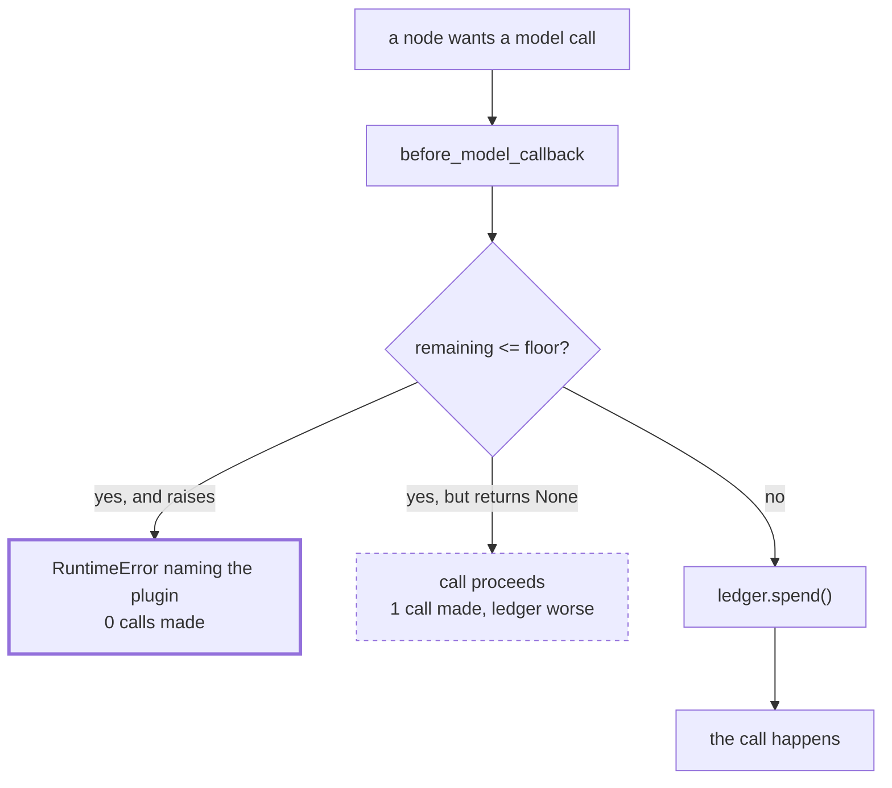

# 2.4 — The circuit breaker: the brake denominated in requests

## One-line answer

A plugin that consults the day's quota ledger before every model call is the only brake that
outlives a single run, and when it refuses it costs **zero** model calls — against one for the same
breaker written to log instead of raise.

## The story

The electricity in the flat is on a prepaid meter. You put money on a card, tap it, and the meter
counts down.

There is a small display on the wall showing what is left. When it gets low it beeps. When it hits
zero the power goes off, and it goes off whether or not you are in the middle of something, whether
or not the rice is half cooked, whether or not you meant to top it up on Friday and forgot.

The thing that makes a prepaid meter different from a fuse in the same flat is what it is counting.
The fuse counts what is flowing right now. The meter counts what has flowed **since you last paid**,
and it does not reset when you leave the room. You can trip the fuse five times in an evening and
the meter carries every one of those evenings forward.

## The idea in plain language

A **circuit breaker** here is a brake that consults a ledger which **outlives the run**.

That is the entire distinction from [2.3](2.3-the-run-fuse.md), and it is worth being exact about
it. The fuse counts calls in one invocation. Start a second invocation and the fuse's counter is
fresh. A fuse of four, applied to a hundred runs, permits four hundred calls and is satisfied every
time.

The free tier is not per run. It is per day. So the resource that actually runs out is counted by
nothing the fuse can see.

The breaker fixes that by asking a different question before each call: *given everything spent
today, may this call happen?* Three pieces make it up:

- A **ledger** — how much has been spent in the current window, per provider. Day 24 built the
  accounting; this part needs only the count and the limit.
- A **floor** — the level below which the answer is no. Not zero, and the reason it is not zero is
  the interesting part.
- A **refusal** that is an error rather than a value, so that everything upstream can see it.

**Why the floor is not zero.** A breaker that refuses only when the remaining count reaches zero has
already spent the requests you need in order to do anything about it. Reporting a refusal, escalating
to a human, writing an audit record — on a real system some of those cost a call. More practically,
a floor gives you a reserve for the requests you have not yet decided to make: the one retry that
would genuinely have succeeded, the health check, the run that is already half finished and should
be allowed to complete. A floor is not caution, it is a working allowance.

## Why Sutra needs it

Principle 15 says zero budget is a feature, and Principle 10 says fail honestly. This part is where
those two meet, because when quota runs out the honest behaviour and the cheap behaviour are the
same behaviour: refuse, say so, and do not invent an answer.

The concrete failure it prevents on this project is the one where a runaway at four in the afternoon
means every ticket after four in the afternoon goes unanswered. The fuse contains the *run*. Only
the breaker contains the *day*, and the day is the unit the customer experiences.

It is also the part that Day 70 grows up into. The Quota-Router routes to whichever provider has
headroom; this is its simpler ancestor, which only knows how to say no. Refusing comes first because
refusing is always safe and routing is not: a router with a bug sends work somewhere, and a breaker
with a bug sends work nowhere.

## The mechanism

The ledger is deliberately small. It knows how much is left and what the floor is.

```python
@dataclass
class Ledger:
    """Requests spent against a provider in the current window."""

    provider: str
    spent: int
    limit: int = DAILY_LIMIT

    @property
    def remaining(self) -> int:
        return self.limit - self.spent

    def check(self, floor: int = FLOOR) -> None:
        """Raise when a call would take the ledger below the floor. Called before the call."""
        if self.remaining <= floor:
            raise QuotaExhausted(
                f"{self.provider}: {self.remaining} of {self.limit} requests remain, "
                f"floor is {floor} - refusing the call"
            )
```

**Line by line:**

- `spent` and `limit` rather than a single "remaining" number — because the two are read from
  different places in a real system. The limit comes from the provider's published free tier, dated
  in `docs/PACKAGES.md`; the spent count comes from your own records. Keeping them apart means a
  disagreement between them is visible rather than averaged away.
- `def check(...) -> None` that raises rather than returning a boolean — a returning check invites
  the caller to ignore it, and the whole point of a brake is to be un-ignorable. This is trap #4
  applied to your own code rather than to the framework's.
- `if self.remaining <= floor` — `<=`, so the floor is a level you do not go *to*, not one you go
  below. Off-by-one here means the reserve is one smaller than you documented.
- The message carries `remaining`, `limit` and `floor` — three numbers, so the log line answers "why
  did it refuse" without anybody having to reproduce the state.

The breaker itself is an ADK plugin, which is what puts it outside every agent and every node:

```python
class QuotaBreakerPlugin(BasePlugin):
    """Refuses a model call when the day's ledger has no headroom left."""

    def __init__(self, ledger: Ledger, swallow: bool = False) -> None:
        super().__init__(name="quota_breaker")
        self.ledger = ledger
        self.swallow = swallow
        self.refusals = 0

    async def before_model_callback(self, *, callback_context, llm_request):
        try:
            self.ledger.check(floor=FLOOR)
        except QuotaExhausted:
            self.refusals += 1
            if self.swallow:
                return None
            raise
        self.ledger.spend()
        return None
```

**Line by line:**

- `class QuotaBreakerPlugin(BasePlugin)` — a plugin, not a callback on an agent. Day 14 introduced
  plugins as the layer above; this is the containment reason for that layer existing. A plugin's
  hooks fire for **every** model call in the app, so there is no path that avoids it, which is
  exactly [2.1](2.1-a-guard-is-only-a-guard-if-it-is-outside.md)'s criterion satisfied at the
  strongest available level.
- `async def before_model_callback(self, *, callback_context, llm_request)` — the hook signature,
  verified against the installed `google-adk==2.7.1` on 2026-09-05 with
  `python -c "import inspect; from google.adk.plugins.base_plugin import BasePlugin; print(inspect.signature(BasePlugin.before_model_callback))"`,
  which prints `(self, *, callback_context: 'CallbackContext', llm_request: 'LlmRequest') ->
  'Optional[LlmResponse]'`. The adk.dev page consulted the same day was `https://adk.dev/plugins/`.
  Note the keyword-only arguments: positional calls will not work.
- `before_model_callback` rather than `after_model_callback` — the check has to happen **before** the
  call, or the call it was meant to prevent has already been made. This is the same ordering argument
  as [2.2](2.2-the-loop-counter.md), one altitude up.
- `self.ledger.check(...)` inside a `try`, then `raise` — the refusal propagates. The return type is
  `Optional[LlmResponse]`, and returning a response here would *substitute* a reply for the model
  call, which is a legitimate thing the hook can do and a terrible thing to do with a refusal.
- `self.ledger.spend()` after the check passes — the ledger advances on permission, not on success.
  That is deliberately pessimistic: a call that is made and then fails has still consumed a request
  as far as most providers are concerned.
- `swallow` — the wrong version, kept in the code so it can be run rather than described. See
  the failure below.

Three runs: a full ledger, a nearly empty one, and the nearly empty one with the breaker written
badly.

```bash
cd days/day-59-runaway-agents-contained/lab
uv run python breaker.py
uv run python breaker.py --spent 18
uv run python breaker.py --spent 18 --swallow
```

**Line by line:**

- No flags: a ledger with all twenty requests unspent. The breaker permits, the fuse of four is what
  eventually applies.
- `--spent 18` leaves two of twenty, which is below the floor of three. The breaker should refuse.
- `--spent 18 --swallow` is the identical ledger with the breaker returning `None` instead of
  raising — the "log it and carry on" version.

Measured on 2026-09-05:

```text
ledger: 20 of 20 remain, floor 3   breaker: raising
    the run finished
    model calls: 1   refusals: 0   spent now: 1

ledger: 2 of 20 remain, floor 3   breaker: raising
    refused before the call: RuntimeError: Error in plugin 'quota_breaker' during 'before_model_callback' callback: gemini: 2 of 20 requests remain, floor is 3 - refusing the call
    caused by: QuotaExhausted: gemini: 2 of 20 requests remain, floor is 3 - refusing the call
    model calls: 0   refusals: 1   spent now: 18

ledger: 2 of 20 remain, floor 3   breaker: swallowing
    the run finished
    model calls: 1   refusals: 1   spent now: 18
```

**Zero model calls against one.** That is the whole part, in two numbers.

Look at what the middle run cost: nothing. Not one request. The breaker refused before the provider
was contacted, so the two remaining requests in the ledger are still there for whatever needs them.

Now look at the third run, and notice how nearly identical it is to a success. The breaker *did*
detect the problem — `refusals: 1` — and then returned `None`, which means "carry on", so the call
was made anyway. The run reports as finished. A ledger that was already past its floor is now one
request further past it. And the count of refusals, the one piece of evidence that anything was
wrong, exists only inside the plugin object where nothing downstream will ever read it.

The second run's error is worth reading twice, because ADK does something helpful with it:

```text
RuntimeError: Error in plugin 'quota_breaker' during 'before_model_callback' callback: gemini: 2 of 20 requests remain, floor is 3 - refusing the call
```

The runtime wraps a raising plugin in a `RuntimeError` that **names the plugin and the hook**, and
carries the original message through, with the original exception preserved as `__cause__`. That is
trap #4 working in your favour: you do not merely get told that something refused, you get told
which control refused and why, in one line, without having to reproduce anything.



## When it breaks

The breaker's characteristic failure is not that it refuses when it should not. It is the
`--swallow` arm above, and it happens because of a real tension: **a raising breaker takes the run
down, and taking the run down feels aggressive.**

Somebody looks at a stack trace caused by their own quota control and reasonably thinks "this
shouldn't be an exception, it's an expected condition", and changes `raise` to a log line. The
change is one word. The system now has a quota control that controls nothing, and — this is the part
that makes it worse than never having built it — a dashboard showing that the breaker is working,
because `refusals` is going up.

The second break is the ledger being wrong, and it is worth stating because the breaker inherits
every weakness of the thing it reads. A ledger that is not updated on the error path is the specific
one to watch: if a call is made, fails with a 500, and nobody increments `spent`, then the ledger
drifts optimistic, and the breaker permits calls that the provider has already counted. Day 70 has
to solve this properly for a router; here the mitigation is the ordering in the code above —
`spend()` on permission rather than on success — which errs pessimistic, and being pessimistic about
a resource you cannot see is the correct direction to be wrong in.

## In production

**What a professional writes instead.** The ledger is not a file on one machine. It is shared state
— Redis, a database row, something with an atomic increment — because in any deployment with more
than one process the per-process ledger is wrong by a factor of the number of processes. They also
distinguish two floors rather than one: a **soft floor** where the system starts shedding
low-priority work (the nightly batch, speculative research) and a **hard floor** where it refuses
everything. A single floor turns a gradual problem into a cliff.

And they wire the refusal to a **route**, not just to an exception. Day 58's graph has an escalation
station; a quota refusal should reach it rather than propagating out of the runner as an unhandled
error, so that the ticket lands in a human's queue with a reason attached instead of disappearing.

**What degrades at scale.** The shared counter becomes contention, and then it becomes a
correctness problem: two processes reading nineteen, both deciding there is headroom, both spending.
The standard fix is an atomic decrement rather than read-then-write, and the standard mistake is to
implement the check and the spend as two separate operations, which is exactly what the code above
does — legitimately, because it is single-process teaching code, and illegitimately if it were
copied.

**The failure mode that only appears with real traffic.** Refusal storms. When the floor is reached,
*every* subsequent request refuses, instantly and cheaply, which means your system goes from
answering slowly to failing very fast. If anything upstream retries on failure, you have converted a
quota problem into a request flood aimed at your own service — the shape
[3.2](../03-brakes-that-do-not-hold/3.2-three-retries-become-twenty-seven.md) is about, arriving
from an unexpected direction.

**The review comment a senior engineer leaves:** *"The breaker catches `QuotaExhausted` and returns
`None` on the swallow path. That is not a breaker, it is a counter with an opinion. Let it raise, and
route the failure to escalation so the ticket reaches a person. Also, this ledger is per-process:
tell me what happens when we run four workers, because right now the answer is that our effective
limit is four times what we think it is."*

**The interview question:** *"You already limit calls per run. Why do you need a quota breaker as
well?"* — *"Because the per-run limit resets. A fuse of four is satisfied by every one of a hundred
runs, and a hundred runs is four hundred calls against a daily allowance of twenty. The breaker
reads a ledger that spans the window the provider actually bills against, so it is the only brake
denominated in the thing that runs out. I put it in a plugin's `before_model_callback` so it sits
above every agent and node, and I make it raise rather than log — I measured both: the raising
version costs zero model calls when it refuses, and the logging version costs one and reports the
run as successful. And the floor is not zero, because you need a reserve to report and escalate
with."*

## Check yourself

```bash
cd days/day-59-runaway-agents-contained/lab
uv run python breaker.py --spent 18
uv run python breaker.py --spent 18 --swallow
```

Now set `--spent 16` and predict whether it refuses before running it. Then change `FLOOR` in
`_ledger.py` to `5` and say which of your two predictions changes.

**Out loud, without scrolling up:** say what the breaker counts that the fuse does not, and explain
why the floor is three rather than zero.

**Next:** [2.5 — The kill switch and what it leaves on the floor](2.5-the-kill-switch-and-what-it-leaves.md).
