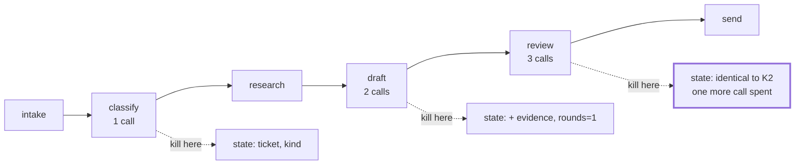

# 2.5 — The kill switch and what it leaves on the floor

## One-line answer

A brake declines the next step and a kill stops the current one, so the question that matters is not
how to stop a run but what state it leaves behind: killing the same ticket at three different
stations left three different amounts of work done and one, two or three model calls spent and
unrecoverable.

## The story

The washing machine is halfway through a cycle and you need to leave. You pull the plug.

The machine stops. That part works exactly as you would hope.

What is in the machine is a drum of wet clothes in soapy water, with the door locked, because the
lock is electric and the electricity is what you just removed. Nothing is broken. Nothing is lost.
But the clothes are not clean, they are not dirty either, they are in a state the machine has no
name for, and the next person to come along cannot tell by looking whether the cycle finished badly
or was interrupted well.

Pulling the plug is easy. Knowing what is in the drum is the job.

## The idea in plain language

A **kill** is stopping a run from outside, at a moment nobody chose.

Everything else in this section declines to do the next thing. The loop counter declines the next
round. The fuse declines the next model call. The breaker declines the next request. All of them act
at a boundary the system defined, which means the system is in a state it understands when they
fire.

A kill is different in exactly one way, and it is the way that matters: **it arrives in the middle
of something.** A signal lands between two lines of somebody's function. A process is terminated
while a node is halfway through writing state. That is not a rare edge case; it is the definition.

So the interesting questions about a kill are not about the mechanism. Pressing Ctrl-C is not a
design problem. The questions are:

1. **What has already happened that cannot be undone?** Model calls are spent. If the run sent an
   email, the email is sent.
2. **What state survives, and is it consistent?** Day 47 made sessions persistent, so the state a
   killed run wrote is on disk, and half-written state that looks complete is the worst kind.
3. **Can anybody tell it was killed?** A run that stops without a record is indistinguishable from a
   run that finished quietly, and those two need very different responses.
4. **Is it safe to run again?** Which is a question about idempotency, and it is Day 60's whole
   subject rather than this one's.

This part answers the first three, and stops honestly at the fourth, because Phase 9 is where the
answer is built.

## Why Sutra needs it

The phase gate for Phase 9 is *kill it mid-run; it resumes; a human approved the write*. That
sentence is Day 65's to prove. What today has to establish is the half of it that comes before
resumption: **what the kill leaves behind.** You cannot design a resume without first knowing what
state you are resuming from, and the honest way to find out is to kill a real run at several points
and look.

There is also a containment reason, which is SEC-04's. A kill switch is the last brake, the one you
reach for when every other brake has been wrong. A team that has never used theirs does not have
one; they have a plan to write one. The difference shows up at the worst possible moment.

## The mechanism

The lab injects the kill the way a signal actually arrives: after a station has done its work and
before the graph gets the result.

```python
class Killed(Exception):
    """What a kill looks like from inside the graph: an exception at an arbitrary station."""


def triage_graph(spend: Spend, max_revisions: int = 2, kill_at: str | None = None) -> Workflow:
    s = stations(spend, max_revisions=max_revisions, kill_at=kill_at)
    ...
```

**Line by line:**

- `kill_at: str | None` — the station to die inside. Passing it down to `stations()` rather than
  patching the built node matters: `FunctionNode` is a pydantic model and its function is not a
  settable field, so the wrapper has to be applied to the plain function *before* the node is
  constructed. That is a small API fact with a real consequence, and finding it out by trying the
  other way is how this code ended up in this shape.

```python
    if kill_at is not None:
        if kill_at not in plain:
            raise KeyError(f"no station named {kill_at!r}; stations are {sorted(plain)}")
        original = plain[kill_at]

        def killer(ctx: Context, node_input=None):
            original(ctx, node_input)
            raise Killed(f"killed inside {kill_at}; state at that moment: {ctx.state.to_dict()}")

        plain[kill_at] = killer
    return {name: FunctionNode(func=fn, name=name) for name, fn in plain.items()}
```

**Line by line:**

- `original(ctx, node_input)` **then** `raise` — the station does its work first. That ordering is
  the whole realism of the demo: a kill that arrives before a function runs leaves nothing behind and
  teaches nothing. The interesting case is the one where the work happened and the result never
  reached anybody.
- `ctx.state.to_dict()` — ADK's `State` is not a plain dict and `dict(state)` raises a `KeyError`,
  because iterating it hits integer indexing. `to_dict()` is the accessor, verified on the installed
  `google-adk==2.7.1` with
  `python -c "from google.adk.sessions.state import State; print([m for m in dir(State) if not m.startswith('_')])"`.
  Getting this wrong is what turned an early run of this demo into `KeyError: 0`, which was a bug in
  the lab masquerading as a finding.
- `raise KeyError(...)` naming the available stations — a typo in `--at` should say what the valid
  names are rather than silently doing nothing.

Kill the same ticket at three different stations:

```bash
cd days/day-59-runaway-agents-contained/lab
uv run python kill.py
uv run python kill.py --at draft
uv run python kill.py --at review
```

**Line by line:**

- The default kills inside `classify`, which is the second station and the first one that costs a
  model call.
- `--at draft` kills after research has stored its evidence and the first draft exists.
- `--at review` kills after the critic has looked at the draft but before its decision is acted on.

Measured on 2026-09-05:

```text
kill point: inside the 'classify' station
    Killed: killed inside classify; state at that moment: {'ticket': '4610', 'kind': 'incident'}
    stations visited: 2  ['intake', 'classify']
    model calls spent and not recoverable: 1

kill point: inside the 'draft' station
    Killed: killed inside draft; state at that moment: {'ticket': '4610', 'kind': 'incident', 'evidence': 'Signed out mid-form. The customer fills the long onboarding form and is returned', 'rounds': 1}
    stations visited: 4  ['intake', 'classify', 'research', 'draft']
    model calls spent and not recoverable: 2

kill point: inside the 'review' station
    Killed: killed inside review; state at that moment: {'ticket': '4610', 'kind': 'incident', 'evidence': 'Signed out mid-form. The customer fills the long onboarding form and is returned', 'rounds': 1}
    stations visited: 5  ['intake', 'classify', 'research', 'draft', 'review']
    model calls spent and not recoverable: 3
```

Three kills, and the useful reading is the **difference between the second and the third.**

Look at the state. It is identical: same ticket, same classification, same evidence, `rounds: 1`.
Look at the work: the third run visited five stations to the second's four, and spent three model
calls to the second's two.

**The review station ran and left no trace.** It read the draft, it made a model call, it decided
something, and because it was killed before its decision reached the graph, the state cannot tell
you that it happened at all. A resume that looks only at state will re-run the review, spend a
fourth call, and reach the same conclusion it already paid for.

That is the concrete answer to "what does a kill leave on the floor": **work that happened is not the
same as work that is recorded**, and the gap between them is measured in model calls you have
already spent.

There is a second reading, on the `rounds: 1` in both. The draft station incremented it before being
killed. So a resume that trusts `rounds` believes one revision round has completed — which is true
of the draft half and false of the review half. State that is half a round old is not obviously
wrong, which is what makes it dangerous.



## When it breaks

The kill itself does not break. What breaks is the assumption that it is clean.

Here is the shape, and it is the reason this part exists before Phase 9 rather than inside it. You
kill a run, you look at the session state, it looks coherent — a ticket, a classification, some
evidence, a round count — and you conclude that resuming is a matter of continuing from there.
Everything in that sentence is reasonable, and the two runs above show why it is not sufficient:
**two different amounts of work produced byte-identical state.**

The failure that follows is not a crash. It is paying twice. In the `--at review` case a resume
re-runs the review, and on a free tier of twenty requests a day, paying twice for every killed run
is a real number.

And there is a worse variant that this lab deliberately cannot demonstrate, so it is worth naming
rather than showing. If the killed station had done something **outside** the system — sent the
reply, written to a database, called a paid API — then re-running it does not merely cost twice, it
*does the thing twice*. The customer gets two emails. That is where idempotency comes in, and
idempotency is Day 60's subject; the honest thing this day can say is that the desk's stations are
all internal today, and the first station that touches the outside world is the one that makes this
question urgent.

The other real break is the one you can see in the demo's own history. The first version of this
script called `dict(ctx.state)` and produced:

```traceback
  File ".../days/day-59-runaway-agents-contained/lab/_desk.py", line 140, in killer
    raise Killed(f"killed inside {kill_at}; state at that moment: {dict(ctx.state)}")
  File "C:\...\google\adk\sessions\state.py", line 89, in __getitem__
    return self._value[key]
KeyError: 0
```

A `KeyError: 0` from inside the session state, raised while trying to report a kill. It looks like a
finding about ADK and it is a bug in the reporting code: `State` supports `to_dict()` and does not
support being passed to `dict()`. It is included here because **the diagnostic path is the path
least likely to have been tested**, and a kill handler that crashes while explaining the kill is a
very common way to lose the only information you needed.

## In production

**What a professional writes instead.** They separate three things that people call "the kill
switch" and which behave differently:

| Mechanism | What it does | What it leaves |
| --- | --- | --- |
| **Drain** | stop accepting new runs, let current ones finish | nothing half-done |
| **Cancel** | ask a run to stop at its next boundary | a clean checkpoint |
| **Kill** | terminate the process now | whatever was in flight |

A team that has only the third has one very blunt instrument. The first two are more work and are
what you actually use ninety-nine times out of a hundred; the third is what you need on the hundredth
occasion, and it is the one that must be tested, because it is the one you will use under pressure.

They also make the kill **leave a record**. A run that is killed writes a marker — killed, when,
where, by whom — before the process goes, or, more robustly, the supervisor writes it, because a
dying process is a bad place to put your last hope. Without that marker a killed run and a run that
finished quietly look the same in your data, for ever.

**What degrades at scale.** Killing one process is simple. Killing "the thing that is running away"
when it is one of forty pods requires that you can identify which pod, which requires per-run
identity in your logs, which is the sort of thing that is easy to add on a calm Tuesday and
impossible to add during the incident where you need it.

**The failure mode that only appears with real traffic.** Killed runs accumulate as invisible
partial state. At low volume you kill something twice a month and clean up by hand. At high volume
you have thousands of sessions that stopped somewhere in the middle, and nothing distinguishes them
from sessions that are merely idle. The clean-up job you eventually write has to guess, and it will
guess wrong on the ones that matter.

**The review comment a senior engineer leaves:** *"You have shown me that Ctrl-C stops it. Show me
what is in the session afterwards, and show me how the next run knows this session was killed rather
than abandoned. If the answer is that it looks at state, note that killing at `draft` and killing at
`review` leave identical state and differ by a model call — so state alone cannot tell you."*

**The interview question:** *"How do you stop an agent that is misbehaving right now?"* — *"Killing
the process is the easy half and it is not the interesting half. The question is what it leaves. I
killed the same ticket at three stations of our triage graph: at classify it left a ticket and a
classification and one spent call; at draft it left evidence and a round count and two; at review it
left **byte-identical state** to the draft case and three spent calls, because the review station
ran, made its call, and was killed before its decision reached the graph. So work done and work
recorded are different quantities, and a resume that reads only state will pay for the review twice.
In production I would want drain and cancel as well as kill, and a marker written by the supervisor
rather than by the dying process, because otherwise a killed run and a quiet one are the same row in
your database."*

## Check yourself

```bash
cd days/day-59-runaway-agents-contained/lab
uv run python kill.py --at draft
uv run python kill.py --at review
```

Now run `uv run python kill.py --at research` and write down what the state contains and how many
model calls were spent. Then say what a resume from that state would re-do.

**Out loud, without scrolling up:** explain how two kills at different stations produced identical
state, and say what a resume would need in addition to state in order to tell them apart.

**Next:** [3.1 — The guard the agent can talk past](../03-brakes-that-do-not-hold/3.1-the-guard-the-agent-can-talk-past.md).
