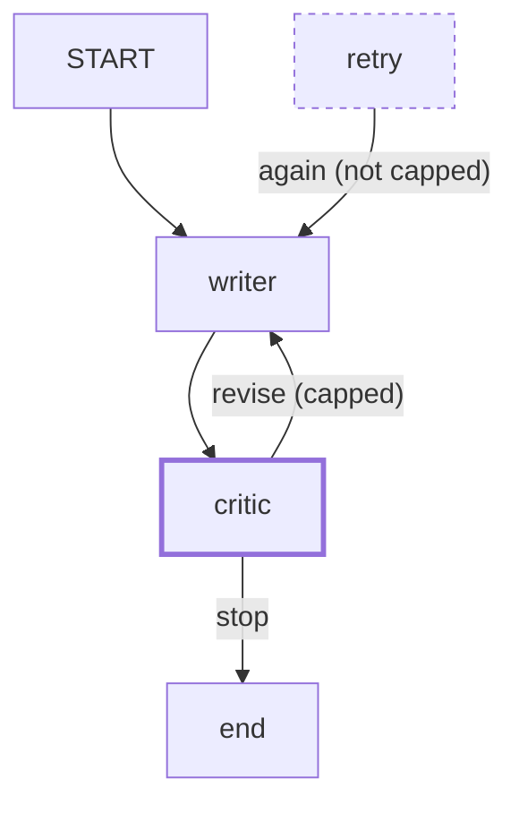

# 3.1 — 💥 The guard the agent can talk past

## One-line answer

A guard placed inside the thing it guards is not a weak guard, it is a guard whose result is decided
by the thing it was protecting you from — and the demonstration is that the same rule produced
twenty-one calls, four calls and three calls depending only on where it lived.

## The story

There is a tin of biscuits on the shelf and a child in the room, and you are going next door for ten
minutes.

You say: *three biscuits.*

You come back and there are four biscuits' worth of crumbs, and a completely sincere explanation
involving one that broke in half and therefore did not count as a whole one.

Nobody is lying. The rule was heard, the rule was even honoured in a sense, and the number is
nonetheless wrong. The rule was a sentence given to the party with the incentive, and the party with
the incentive was also the party doing the counting.

The version that works is not a sterner sentence. It is taking the tin next door with you.

## The idea in plain language

[2.1](../02-where-a-brake-goes/2.1-a-guard-is-only-a-guard-if-it-is-outside.md) stated the rule.
This part is the failure it prevents, run to the end, with the numbers.

There are three ways a guard ends up inside the thing it guards, and only the first is obvious:

1. **The rule is in the prompt.** Everybody recognises this one once it is pointed out.
2. **The rule is in the tool the agent calls.** A tool that refuses when a limit is exceeded looks
   like code, and it is code, but if the agent can reach the same effect by calling a *different*
   tool then the limit is not on the effect, it is on one route to it.
3. **The rule is in a node the graph can route around.** This is the one that survives code review,
   because the guard genuinely is code, genuinely is outside the agent, and is nonetheless on a path
   rather than on the system.

The unifying question is not "is this code or prose?" It is: **can the thing being limited reach its
goal without passing through the limit?** If yes, the limit is a suggestion however it is written.

## Why Sutra needs it

Every containment mechanism Sutra ships from today has to pass this test, and section 5's gate makes
it a criterion rather than a hope.

The specific risk on this project is the third kind. Day 53 established that composition is a list
of edges, and the great thing about a list of edges is that adding one is easy. The awkward
consequence is that a guard living on an edge is protected only for as long as nobody adds a second
edge into the node it protects. That is not hypothetical: an escalation path, a retry path and a
resume path are all reasonable additions, and all three arrive at an existing node from a new
direction.

## The mechanism

The whole demonstration is three runs of one graph. The rule is the same in all three:

```python
INSTRUCTION = (
    "You are the writer. Revise the reply when the critic asks. "
    f"Never revise more than {CAP} times; after {CAP} revisions, reply exactly DONE."
)
```

**Line by line:**

- Specific, numbered, and it names the exact token to emit. It is a well-written instruction. The
  part is not about sloppiness.

```bash
cd days/day-59-runaway-agents-contained/lab
uv run python outside.py
uv run python outside.py --obedient
uv run python outside.py --in-graph
```

**Line by line:**

- Arm one and arm two share the instruction and differ only in whether the stub complies.
- Arm three uses the **same uncooperative stub as arm one**, with the rule moved into an edge
  condition. So arms one and three isolate placement, and arms one and two isolate compliance.

Measured on 2026-09-05:

```text
guard: a sentence in the instruction (prose)   model: does not comply   cap: 3
    stopped by the LAB, not by the system: lab wall: 21 calls exceeds hard_stop=20
    model calls: 21   rounds: 20

guard: a sentence in the instruction (prose)   model: complies   cap: 3
    stopped by: the model said DONE after 4 rounds
    model calls: 4   rounds: 4

guard: an edge condition (code)   model: does not comply   cap: 3
    stopped by: edge condition after 3 rounds
    model calls: 3   rounds: 3
```

**21, 4, 3**, and the important comparison is 21 against 3, because those two runs have the same
model and differ only in where the rule lives.

Now the failure this part is named for, which is the third kind on the list above. Here is a guard
that is code, that is outside the agent, that a reviewer would approve — and that does not hold.

```python
workflow = Workflow(
    name="guarded",
    edges=[
        (START, writer, critic),
        Edge(from_node=critic, to_node=writer, route="revise"),
        Edge(from_node=critic, to_node=end, route="stop"),
    ],
)
```

**Line by line:**

- `Edge(from_node=critic, to_node=writer, route="revise")` — the guarded edge. The critic's function
  refuses to emit `revise` past the cap, so **this** path into `writer` is capped.
- `(START, writer, critic)` — and here is the other path into `writer`. It runs once, at the start,
  which is harmless.

The guard holds because there are exactly two edges into `writer` and one of them fires once. Now
imagine the entirely reasonable next change: a retry path, so that a writer failure is retried
rather than escalated.

```python
retry_edge = Edge(from_node=retry, to_node=writer, route="again")
```

**Line by line:**

- A third edge into `writer`, from a node the critic knows nothing about. Every revision reached
  through this edge bypasses the counter, because the counter lives in `critic` and this path does
  not go through `critic`.
- Nothing about this line is wrong in itself, and nothing in the runtime will object. Day 53 measured
  what the graph validator does and does not check: it rejects an unconditional cycle and an unwired
  node. It does not, and cannot, know that one of your nodes was load-bearing for a limit.

That is the failure: **the guard was never defeated, it was routed around.** And it was routed around
by a change that is smaller and more obviously correct than the change that added the guard.



## When it breaks

It breaks silently, and the silence is the finding.

Consider what you would see. The system does not error. The cap constant is still `3` and still
correct. The critic still enforces it, faithfully, on every request that reaches the critic. Tests
that exercise the original path still pass, because the original path is unchanged. The only symptom
is that some runs use more calls than the cap should permit, and "some runs use more calls" is
exactly what you would expect from a system with variable work per ticket.

The diagnostic that finds it is not a test, it is a question asked of the graph: **for each node,
how many edges arrive at it, and does every one of them pass a limit?** That is a question about the
graph as data — which Day 53 argued is the real gift of the 2.x node model, and this is the payoff.
The composition is a list you can iterate:

```python
for node in workflow.graph.nodes:
    incoming = [e for e in workflow.graph.edges if e.to_node is node]
    print(node.name, len(incoming))
```

**Line by line:**

- `workflow.graph.nodes` and `workflow.graph.edges` — the graph is inspectable after construction,
  which is what makes this check possible at all. In a 1.x agent tree the composition lived in the
  nesting and there was no list to iterate; that is **trap #1** stated as a capability rather than a
  warning.
- `e.to_node is node` — identity rather than name comparison, because a graph may legitimately carry
  two nodes with related names and you want the object.
- The output is a count per node, and the review question is about every node whose count is greater
  than one and which sits on a loop.

Run it against the lab's own triage desk. Measured on 2026-09-05:

```text
  __START__ 0
  intake 1
  classify 1
  escalate 1
  research 1
  draft 2
  review 1
  send 1
```

**`draft` has two.** One edge from `research` and one from the review station's `revise` route. That
is not a bug — it is what a revision loop looks like — and it is precisely the shape that makes the
question worth asking: if a limit on drafting were placed on either one of those edges, the other
edge would walk past it. On this desk the counter is in the review station's own state and every
revision passes through review, so the limit holds. The check does not tell you the answer; it tells
you which node to think about.

The second way it breaks is the one from [2.1](../02-where-a-brake-goes/2.1-a-guard-is-only-a-guard-if-it-is-outside.md)'s
middle row, and it deserves repeating because it is so cheap to miss. When the prompt rule "works",
it worked to a **different number** than the one written down: cap of three, stopped after four
rounds. If you had been relying on the prompt rule and had computed your quota budget from the
number in the prompt, your budget would be a third too small, and it would be a third too small
only on the runs where the guard appeared to be working.

## In production

**What a professional writes instead.** They put the limit where the *effect* is, not where the
*decision* is. If the thing to be limited is revisions, the counter goes on the state that records
revisions, and every path that increments it checks it — which in practice means the check lives in
the writer node itself rather than in the critic edge, because the writer is the thing all paths
must pass through. The rule of thumb is: **place the guard at the narrowest point that every path
crosses**, and if there is no such point, the graph is telling you something and you should listen.

They also keep the prompt sentence, deliberately, and say why in a comment. A model that stops on its
own is cheaper than one stopped by the cap, so the prompt rule earns its keep as an optimisation. It
is described as an optimisation and never as the limit, and that distinction is the whole of this
part compressed into a code comment.

**What degrades at scale.** The number of paths into a node grows faster than anybody tracks. Six
nodes with a few conditional routes is already more paths than a reviewer will enumerate by reading,
and the guard-placement question is per path. This is why the check above is worth writing as a test
rather than doing by eye: the eye stops scaling at about the size where the graph starts being
interesting.

**The failure mode that only appears with real traffic.** The bypassing path is usually the error
path — retry, escalate, resume — and error paths are rare in testing and common in production.
So the guard holds on every ticket you tried and fails on the tickets that were already going badly,
which is the worst possible correlation: your containment is weakest exactly when it is needed.

**The review comment a senior engineer leaves:** *"This cap lives in the critic, and the critic is on
one of the two edges into the writer. Your retry edge does not pass through it. Move the counter into
the writer, or add the check to every inbound edge, and add a test that asserts the number of
inbound edges to `writer` — so that the next person who adds a third one has to think about it."*

**The interview question:** *"Give me an example of a guard that is real code and still does not
work."* — *"A loop cap implemented in the critic node of a writer-critic pair. It is code, it is
outside the agent, it cannot be talked past by any output — and then somebody adds a retry edge into
the writer, and every revision reached down that edge skips the counter entirely. The guard was not
defeated, it was routed around, by a one-line change that is more obviously correct than the guard
was. The rule I take from it is to place the limit at the narrowest point every path crosses, and to
write a test that asserts how many edges arrive at that node, so the next person adding one has to
notice."*

## Check yourself

```bash
cd days/day-59-runaway-agents-contained/lab
uv run python outside.py
uv run python outside.py --in-graph
```

Now open `outside.py` and add a third node with an edge into `writer` that does not pass through the
critic. Run it and write down whether the cap still holds.

**Out loud, without scrolling up:** state the one question that decides whether a guard is real, and
explain why "it is code, not a prompt" is not a sufficient answer.

**Next:** [3.2 — Three retries become twenty-seven](3.2-three-retries-become-twenty-seven.md).
