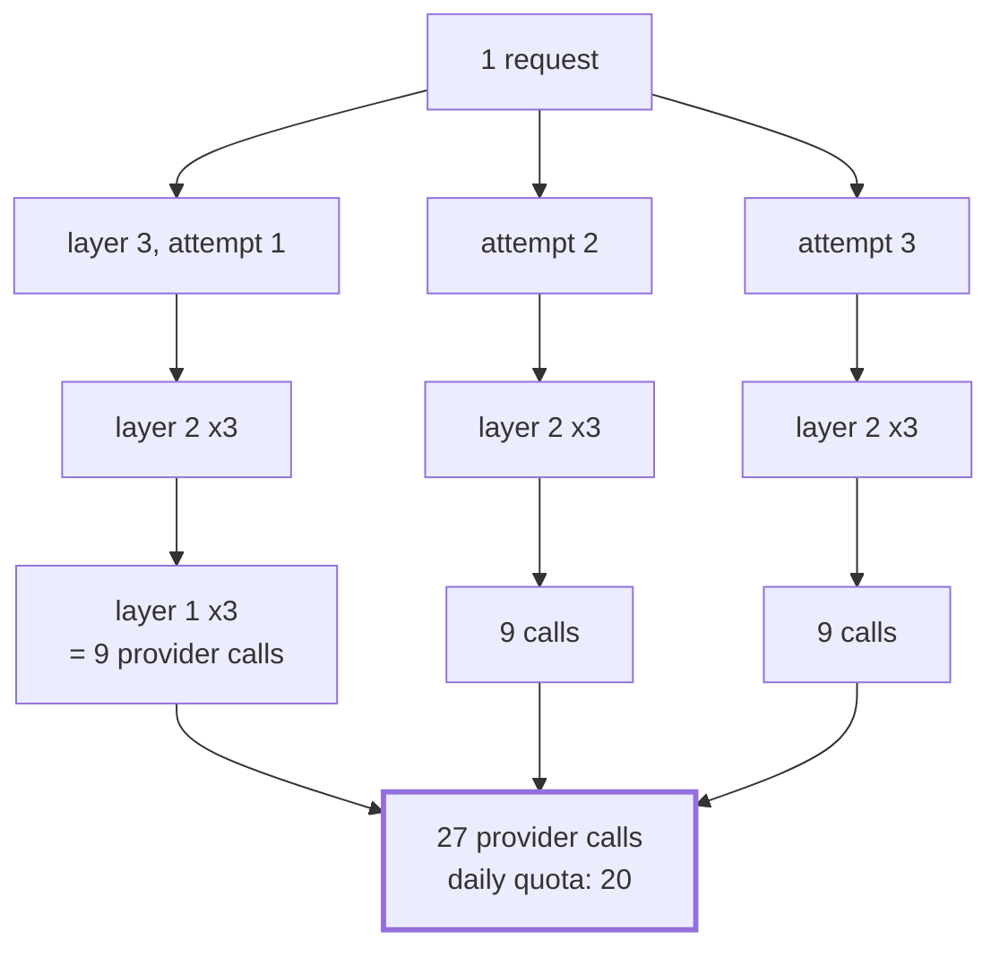

# 3.2 — 💥 Three retries become twenty-seven

## One-line answer

Retries at three layers multiply rather than add, so three sensible attempts at each of three levels
is twenty-seven calls against a daily free tier of twenty — and one shared attempt budget across the
whole stack turns the same failure into one call.

## The story

The office printer jams at ten past four on the day the reports are due.

Someone presses print again, because sometimes that works. The document does not come out, so they
press it twice more.

The person at the next desk needs the same document and does not know any of this has happened, so
they print it. Three times, for the same reason.

By half past four the print queue has forty-one jobs in it, the printer is still jammed, and when
somebody finally clears the paper the machine starts working through all forty-one. Nobody did
anything unreasonable. Everybody tried three times, which is what you do.

## The idea in plain language

A **retry storm** is what happens when more than one layer of a system retries the same failure.

The arithmetic is the entire idea and it is worth writing out, because people's intuition here is
reliably additive and the behaviour is multiplicative. If layer A retries three times, and each of
A's attempts calls layer B which itself retries three times, and each of B's attempts calls the
provider — then one request from the top produces `3 × 3 = 9` provider calls. Add a third retrying
layer and it is twenty-seven.

Written generally: `attempts ^ layers`. Same shape as
[1.4](../01-four-runaways/1.4-the-shape-that-grows-by-a-power.md)'s fan-out bomb, and it is worth
noticing that the two are the same phenomenon in different clothes. A fan-out bomb is a tree of
*work*; a retry storm is a tree of *attempts at the same work*. The second one is worse in one
specific way: every leaf of the tree is a call for a thing that has already failed, so the entire
structure is pure waste by construction.

The reason it is so hard to see in a codebase is that **no single layer is wrong**. Read any one of
them and you find a sensible retry with a sensible bound. The multiplication exists only in the
composition, and the composition is usually not written down anywhere, because the layers were added
by different people in different months.

Where the layers come from, on a project like this one:

| Layer | Why somebody added a retry there | Where it lives |
| --- | --- | --- |
| The provider SDK | transient network failures are real | somebody else's code |
| The client wrapper | 429 with `retry-after` deserves a wait and a retry | Day 44's client hardening |
| The tool | a tool that fails the agent once looks unreliable | the tool's own code |
| The node | a node failure should not fail the graph | `RetryConfig` on the node |
| The run | a failed run should be re-queued | the job queue |

Five plausible places. Nobody puts a retry in all five. Everybody puts one in two or three, and two
or three is enough.

## Why Sutra needs it

This is the runaway shape with Sutra's name on it, for one reason: **the error that provokes a retry
on this project is a quota error.**

A 429 means "you have made too many requests". The response to it, in every retry implementation
anybody writes, is to make another request. On a system whose scarce resource is requests per day,
a retry storm does not merely waste effort — it consumes precisely the thing whose exhaustion caused
the failure, and it does so fastest at the exact moment when there is least of it left.

Day 44 hardened the MCP client with retries and timeouts, and Day 72 will build honest backoff. Day
54 measured what retries do inside a loop: nine calls producing six events, with the retries
invisible in the event stream. Today's job is the composition — what those layers do to each other —
because that is the part no single day's code review can see.

## The mechanism

Three layers, each retrying, with the bottom one always failing:

```python
def provider_call() -> None:
    """The bottom of the stack. Always fails with the error that provokes a retry."""
    global CALLS
    CALLS += 1
    raise RuntimeError("429 Too Many Requests; retry-after: 4")


def layer(depth: int) -> None:
    """One retrying layer. Calls the layer below it, `ATTEMPTS` times, then gives up."""
    global BUDGET
    for _attempt in range(ATTEMPTS):
        if SHARED:
            if BUDGET <= 0:
                raise RuntimeError("shared attempt budget exhausted")
            BUDGET -= 1
        try:
            if depth == 1:
                provider_call()
            else:
                layer(depth - 1)
            return
        except RuntimeError as exc:
            if "shared attempt budget" in str(exc):
                raise
            continue
    raise RuntimeError(f"layer {depth} gave up after {ATTEMPTS} attempts")
```

**Line by line:**

- `raise RuntimeError("429 Too Many Requests; retry-after: 4")` — the failure is a quota error, on
  purpose, because that is the case where retrying is most tempting and most harmful. A `retry-after`
  header is present, which is what a correct implementation would honour and which none of these
  layers looks at.
- `for _attempt in range(ATTEMPTS)` — three attempts. Read on its own, this is a perfectly good
  retry loop. It is bounded. It gives up. It re-raises with a message naming the layer.
- `layer(depth - 1)` inside the `try` — **this is the multiplication.** Each attempt at this layer is
  a complete attempt-with-retries at the layer below, so the counts compose by multiplication rather
  than by addition. Nothing in the code says "multiply"; the nesting says it.
- `continue` on the exception — retry. The `if "shared attempt budget" in str(exc): raise` above it
  is how the shared-budget arm escapes: an exhausted budget is not a retryable failure and must not
  be swallowed by the retry loop that caused it.
- `if SHARED: BUDGET -= 1` — the fix arm. One counter for the whole stack, decremented by whichever
  layer is about to try. Six lines, and they are the only difference between the two behaviours
  below.

Run the storm:

```bash
cd days/day-59-runaway-agents-contained/lab
uv run python storm.py
```

**Line by line:**

- No flags: three layers, three attempts each, no shared budget. This is the default state of a
  system that has had three reasonable retries added to it over three months.

Measured on 2026-09-05:

```text
retry policy: 3 attempts at each of 3 layers
    gave up: layer 3 gave up after 3 attempts
    provider calls made: 27
    attempts x layers  : 3^3 = 27
    free tier          : 20 per day -> -7 remaining
```

**Twenty-seven calls for one request, against a daily allowance of twenty.** One failed ticket has
overdrawn the entire day, and it did so while every layer behaved exactly as designed and every
layer correctly gave up.

Add one more layer, which is the sort of thing that happens when you wrap a client:

```bash
uv run python storm.py --layers 4
```

**Line by line:**

- `--layers 4` adds one retrying layer. Not one retry — one *layer*, which is what adding a wrapper
  does.

```text
retry policy: 3 attempts at each of 4 layers
    gave up: layer 4 gave up after 3 attempts
    provider calls made: 81
    attempts x layers  : 3^4 = 81
    free tier          : 20 per day -> -61 remaining
```

Twenty-seven becomes eighty-one. The change that produced it was adding a wrapper with a sensible
retry in it.

Now the fix, which is not "fewer retries":

```bash
uv run python storm.py --budget-aware
```

**Line by line:**

- `--budget-aware` gives the whole stack **one** attempt budget instead of one per layer. Every layer
  still retries; they just draw from a common pool.

```text
retry policy: one shared budget
    gave up: shared attempt budget exhausted
    provider calls made: 1
    free tier          : 20 per day -> 19 remaining
```

**One call.** Not because retrying was removed, but because the total was made a property of the
request rather than of each layer.

That is the same move as [1.3](../01-four-runaways/1.3-two-caps-one-rally-twice-the-work.md)'s and
[1.4](../01-four-runaways/1.4-the-shape-that-grows-by-a-power.md)'s: **count the work, not the
worker.** Three parts have now arrived at it from three directions, which is a reasonable sign that
it is the actual rule rather than a trick.



## When it breaks

The break is that **it looks like it is working.**

Every layer's logs say the right thing. Layer one logs "retrying after 429, attempt 2 of 3". Layer
two logs the same. Layer three logs the same. A person reading any one log file sees a system
handling a transient failure gracefully and giving up politely, which is a well-engineered system.
Nobody reads three log files at once, and even if they did, the multiplication is only visible if
you count the *provider* calls, which is the one number none of the layers is in a position to
report.

There is a second, nastier form. Suppose the failure is genuinely transient and the third attempt at
layer one succeeds. Now there is no error at all — the request succeeded, everybody's retry worked,
and it cost some number of provider calls between one and twenty-seven that nobody recorded. Your
system is correct and your quota disappears at a rate that does not match your traffic, and the
investigation starts from "our per-ticket cost is higher than we modelled" rather than from an
incident.

And the specifically ugly interaction on this project: `retry-after: 4` is in the error and nothing
in the stack reads it. Three layers retrying immediately turn a four-second wait into twenty-seven
rejections in a fraction of a second, all of which count. Day 72's honest backoff is where that is
fixed properly; the observation for today is that **a retry that ignores `retry-after` is not a
retry, it is a repeat.**

## In production

**What a professional writes instead.** One retrying layer, chosen deliberately, and the others
explicitly not retrying — with a comment saying so, because "this does not retry" is a decision that
looks like an omission and will be helpfully corrected by the next person otherwise. Where more than
one layer must retry, the attempt budget travels with the request, exactly as in the `--budget-aware`
arm above, so the total is bounded regardless of how many layers there turn out to be.

On top of that, three things that all belong to the same family:

- **Honour `retry-after`.** It is the server telling you the answer.
- **Jitter.** Without it, every client that failed together retries together, which is how a
  recovering service is knocked over a second time.
- **A circuit breaker in front of the retries** — [2.4](../02-where-a-brake-goes/2.4-the-circuit-breaker.md)'s
  mechanism, which is the thing that stops the stack from retrying into a resource that is already
  exhausted.

**What degrades at scale.** The storm becomes correlated across requests. One ticket producing
twenty-seven calls is a bad ticket. Two hundred tickets hitting the same provider outage produce
five thousand four hundred calls, arriving together, at a service that is already unwell. This is
the mechanism behind most "we made our own outage worse" postmortems.

**The failure mode that only appears with real traffic.** Retries are invisible in testing because
tests do not fail transiently. Every retry path you own is, in effect, untested code that runs only
during incidents — which is why the retry storm is discovered during the first real provider outage
rather than before it.

**The review comment a senior engineer leaves:** *"We now retry in the client and in the node. That
is nine provider calls for one logical request, and the error we are retrying is 429, so we are
answering 'too many requests' with more requests. Pick one layer to own retries, mark the others
explicitly as non-retrying, honour `retry-after`, and put the attempt budget on the request so the
total is bounded whatever the stack looks like next year."*

**The interview question:** *"What is wrong with retrying at every layer?"* — *"They multiply. Three
attempts at three layers is twenty-seven provider calls for one request — I measured it — against a
daily free tier of twenty, so a single failed ticket overdraws the whole day. And every layer looks
correct in isolation: bounded attempts, gives up politely, logs sensibly. The multiplication is only
visible if you count provider calls, which no layer is positioned to do. Worse, on our system the
error being retried is a quota error, so the retry consumes exactly the resource whose exhaustion
caused the failure. The fix is not fewer retries, it is one attempt budget that travels with the
request: same layers, same code, and the same failure cost one call instead of twenty-seven."*

## Check yourself

```bash
cd days/day-59-runaway-agents-contained/lab
uv run python storm.py
uv run python storm.py --layers 4
uv run python storm.py --budget-aware
```

Now work out how many attempts per layer, at three layers, keeps the total inside twenty. Run
`storm.py --attempts <n>` to check, and say whether the answer is a number you would be happy to
ship.

**Out loud, without scrolling up:** explain why three retrying layers is twenty-seven and not nine,
and say what makes the shared budget different from lowering every layer's attempt count.

**Next:** [3.3 — The fuse set to zero, which is no fuse at all](3.3-the-fuse-set-to-zero.md).
