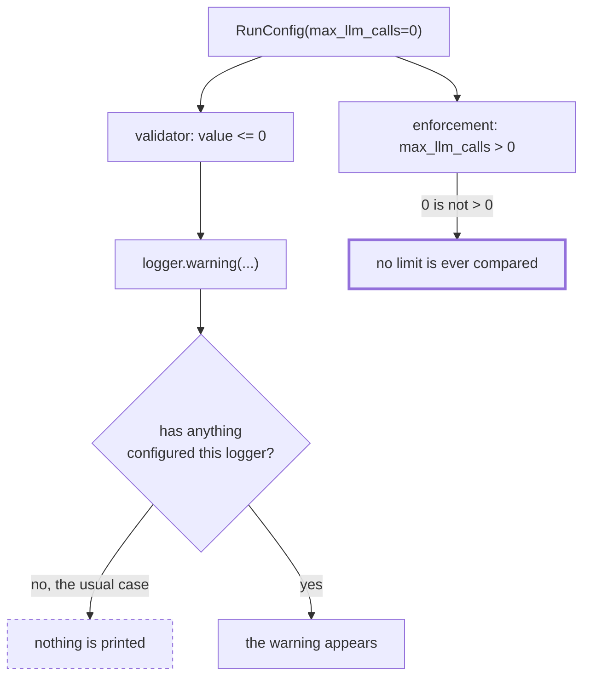

# 3.3 — 💥 The fuse set to zero, which is no fuse at all

## One-line answer

`max_llm_calls=0` means unbounded rather than forbidden, and the library warns you about it into a
logger a normal script never configures — so a run configured with the tightest-looking limit
available made sixteen model calls with the fuse never firing.

## The story

You are filling in a form at the bank to set a limit on a card. There is a box that says *daily
limit*.

You want the card locked for now, so you write **0**, which obviously means no spending.

It means no limit. The system reads a zero in that box as "the customer has not set a limit", which
is a completely defensible reading of a blank-ish value in a form, and it is the opposite of what
you meant. Somewhere in the bank's documentation this is written down. You did not read the bank's
documentation, because you were filling in a box labelled *daily limit* and you had a clear idea of
what zero meant.

Nobody made an error. The form accepted your input and did exactly what its rules say. You have a
card with no limit and a piece of paper that says you set one.

## The idea in plain language

There is a class of configuration value where a number means a quantity **and** a sentinel means a
mode, and where the sentinel is inside the same range as the quantity. `max_llm_calls` is one of
them.

The rule in ADK is that the limit is enforced only when it is a positive number. Zero and negatives
mean unbounded. This is documented — it is in the field's own docstring — and it is a normal
convention in software. It is also the convention that produces the most confident wrong belief,
because the value you would choose to express *maximum caution* is precisely the value that turns
the mechanism off.

Compare the two readings of the same line of code:

| `max_llm_calls=0` | |
| --- | --- |
| What it looks like it means | permit zero model calls; the tightest possible limit |
| What it means | do not enforce a limit; the loosest possible setting |

There is no middle ground between those and no partial credit. A person who believes the first has
a system with no run-level brake and a configuration file that appears to prove otherwise, which is
strictly worse than having no line at all — because the line will be read by the next reviewer as
evidence that the question was considered.

## Why Sutra needs it

The fuse is Sutra's only run-level brake, so a fuse that is off is a category of containment that is
absent. [2.3](../02-where-a-brake-goes/2.3-the-run-fuse.md) established that it is the brake that
catches the ping-pong, which is the shape no per-agent counter can see. Turn it off and that shape
has nothing above it except the quota breaker, which fires only when the day is nearly gone.

There is a second reason this belongs in a Sutra day specifically. Principle 7 is *never invent a
version* and Principle 8 is *never invent an API*, and both are really one instruction: **read the
thing rather than remembering it.** This part is what that instruction protects you from. A
remembered API is where `0` means zero.

## The mechanism

The relevant code is in the installed package, and the first thing worth doing is reading the field's
own docstring rather than guessing:

```text
  max_llm_calls: int = 500
  """
  A limit on the total number of llm calls for a given run.

  Valid Values:
    - More than 0 and less than sys.maxsize: The bound on the number of llm
      calls is enforced, if the value is set in this range.
    - Less than or equal to 0: This allows for unbounded number of llm calls.
  """
```

**Line by line:**

- `max_llm_calls: int = 500` — the default, from `google/adk/agents/run_config.py` in the installed
  `google-adk==2.7.1`, read on 2026-09-05.
- *"Less than or equal to 0: This allows for unbounded number of llm calls."* — it is documented,
  plainly, in the one place a reader is least likely to look: the source of a field they think they
  understand. This is not a defect in ADK. It is a defect in the habit of configuring from memory.

The library also warns:

```text
  @field_validator('max_llm_calls', mode='after')
  @classmethod
  def validate_max_llm_calls(cls, value: int) -> int:
    if value == sys.maxsize:
      raise ValueError(f'max_llm_calls should be less than {sys.maxsize}.')
    elif value <= 0:
      logger.warning(
          'max_llm_calls is less than or equal to 0. This will result in'
          ' no enforcement on total number of llm calls that will be made for a'
          ' run. This may not be ideal, as this could result in a never'
          ' ending communication between the model and the agent in certain'
          ' cases.',
      )

    return value
```

**Line by line:**

- `@field_validator('max_llm_calls', mode='after')` — a pydantic validator that runs when the
  `RunConfig` is constructed, so the warning fires at configuration time rather than at failure time.
  That is the right moment.
- `if value == sys.maxsize: raise ValueError(...)` — note the asymmetry. One nonsensical value
  **raises** and the other one **warns**. The raising case is the one nobody types by accident.
- `logger.warning(...)` — and here is the whole problem. It is a warning on a named logger, and the
  message is accurate and complete. It goes to stderr through a logger that a script which has not
  called `logging.basicConfig` will not display. The library did its part. The information does not
  arrive.

Run it and watch nothing happen:

```bash
cd days/day-59-runaway-agents-contained/lab
uv run python zero.py
```

**Line by line:**

- No flags: build `RunConfig(max_llm_calls=0)`, print the value back, and run the never-satisfied
  loop from [1.2](../01-four-runaways/1.2-the-critic-who-is-never-satisfied.md) under it with the
  lab's wall at fifteen.

Measured on 2026-09-05:

```text
building RunConfig(max_llm_calls=0)  [warnings not shown]
    config.max_llm_calls = 0
    stopped by the LAB, not by the fuse: lab wall: 16 calls exceeds hard_stop=15
    model calls: 16   fuse fired: no
```

Sixteen model calls under a fuse of zero. `config.max_llm_calls = 0` is printed back, so the
configuration is exactly what you asked for, and it did nothing.

Now turn the warning on, scoped to the one logger so the output stays readable:

```bash
uv run python zero.py --show-warning
```

**Line by line:**

- `--show-warning` attaches a handler to `google_adk.google.adk.agents.run_config` and sets its
  level, rather than calling `logging.basicConfig`, so that only this message appears rather than
  ADK's entire log stream. That scoping is itself the practical lesson: the warning is reachable, and
  reaching it takes a deliberate act.

```text
building RunConfig(max_llm_calls=0)  [warnings shown]
    LOG WARNING: max_llm_calls is less than or equal to 0. This will result in no enforcement on total number of llm calls that will be made for a run. This may not be ideal, as this could result in a never ending communication between the model and the agent in certain cases.
    config.max_llm_calls = 0
    stopped by the LAB, not by the fuse: lab wall: 16 calls exceeds hard_stop=15
    model calls: 16   fuse fired: no
```

The message was always there. It says exactly the right thing, including "never ending
communication", which is a fair description of what happens next. The two runs are otherwise
identical: same sixteen calls, same absent fuse. The only difference is whether anybody was
listening.



## When it breaks

It breaks at the worst possible time, which is when somebody is being careful.

The sequence is always the same. There is an incident, or a near miss, or a review comment. Somebody
goes to tighten the limits. They open the configuration, they find `max_llm_calls`, and they set it
to the most conservative value they can think of. On a system where the limit had previously been
left at its default of five hundred, this change makes things **strictly worse**: five hundred was a
bad brake, and zero is no brake.

The change also passes review. `max_llm_calls: 0` in a diff, in a commit titled "tighten runaway
limits", reads as obviously correct to anybody who has not read the field's docstring — which is
almost everybody, because the whole point of a well-named field is that you do not have to.

And it is invisible afterwards. There is no error. There is no failing test, unless somebody wrote
the test in [5.3](../05-the-gate/5.3-criterion-3-the-eval-goes-red.md) that removes a brake and
expects a failure. The system behaves exactly as it did before, right up until the run that would
have been caught.

Two neighbouring traps worth knowing, because they are the same shape:

- **`sys.maxsize`** raises rather than warns, so the "no limit, expressed as a very large number"
  idiom fails loudly here. That asymmetry is worth remembering: ADK treats one nonsense value as an
  error and the other as a mode.
- **The lab's own `fanout.py`** uses `if cap and depth >= cap`, so a depth cap of zero means no cap
  there too. That was written deliberately to echo this, and it is a reminder that once you have met
  this convention you will write it yourself without thinking.

## In production

**What a professional writes instead.** They never write a bare zero into a limit field. If the
intent is "make no model calls", that is not a limit, it is a different code path — you do not run
the agent. If the intent is "the tightest sensible limit", it is `1`, and it is written with the
reason beside it.

More generally, they add a **startup assertion** on the values that matter:

```python
assert RUN_FUSE > 0, "max_llm_calls <= 0 disables the fuse entirely (google-adk 2.7.1)"
```

**Line by line:**

- `RUN_FUSE > 0` — the condition is copied from the library's own enforcement, so the assertion fails
  exactly when the library would stop enforcing.
- The message names the version. A convention like this can change, and a message that says which
  version it was true of is a message the next reader can verify rather than trust.
- An assertion at startup rather than a comment, because a comment is not checked and this is the
  category of mistake that is made by somebody who did not read the comments.

They also turn the warning on. `logging` configuration is a five-line thing that teams postpone for
years, and this is one of the arguments for doing it: the library is *already telling you*, and the
cost of hearing it is one handler.

**What degrades at scale.** Nothing about the mechanism, but the blast radius of the mistake grows.
On a single-run system a disabled fuse costs one bad run. On a queue-backed system it costs every
run in flight when the bad ticket arrives, because they are all sharing the same quota and one of
them is now unbounded.

**The failure mode that only appears with real traffic.** The disabled fuse is harmless until
something loops, and something loops only on inputs you did not test. So the interval between the
mistake and its consequence is arbitrarily long, and by the time it fires, the commit that caused it
is months old and was titled "tighten limits".

**The review comment a senior engineer leaves:** *"`max_llm_calls: 0` disables the limit — check the
field docstring in 2.7.1. If you want the tightest limit, that is 1. And please add the startup
assertion, because this is not a mistake anybody makes twice but it is a mistake everybody makes
once."*

**The interview question:** *"Tell me about a configuration value that meant the opposite of what
somebody thought."* — *"`max_llm_calls` in ADK. Zero reads as 'allow no model calls' and means 'do
not enforce a limit', because the enforcement is guarded by `> 0`. I ran it: a graph configured with
zero made sixteen model calls and the fuse never fired. The library does warn, in the field
validator, and the warning is accurate — but it goes to a logger that a script which has not
configured logging will not print, so the information exists and does not arrive. What makes it
nastier than an ordinary gotcha is the direction: the person who types it is being cautious, and the
change makes the system strictly less protected than leaving the default alone. I add a startup
assertion that mirrors the library's own condition, and I name the version in the message."*

## Check yourself

```bash
cd days/day-59-runaway-agents-contained/lab
uv run python zero.py
uv run python zero.py --show-warning
uv run python -c "from google.adk.agents.run_config import RunConfig; print(RunConfig.model_fields['max_llm_calls'].default)"
```

Now try `RunConfig(max_llm_calls=-1)` and then `RunConfig(max_llm_calls=1)`, and write down which one
warns, which one raises, and which one is the tightest real limit.

**Out loud, without scrolling up:** say what `max_llm_calls=0` does, and explain why the library's
warning did not help.

**Next:** [3.4 — The brake loosened for one ticket](3.4-the-brake-loosened-for-one-ticket.md).
