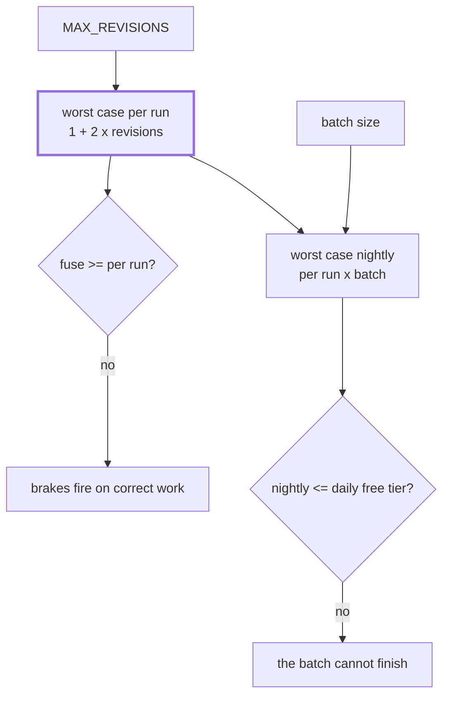

# 3.4 — 💥 The brake loosened for one ticket

## One-line answer

Brakes are sized against each other, so raising one without re-deriving the rest silently changes
the worst case everywhere: moving the revision cap from two to eight took the nightly worst case
from sixty model calls to two hundred and four, against a free tier of twenty, with no other line
changed.

## The story

The chair in the back room wobbles. You turn it over and there are four bolts, and one of them is
loose, so you tighten it.

Now it wobbles the other way.

What you have discovered is that the four bolts were not four independent decisions. They were one
decision made four times, and the chair was stable because they were all a bit loose together.
Tightening one changed how the other three carry the weight, and the only way to get a chair that
does not wobble is to loosen all four and tighten them again in order.

The mistake was not tightening the bolt. It was thinking the bolt was the thing.

## The idea in plain language

A system with several brakes at several altitudes has an **invariant**: each brake is sized against
the ones above and below it. Change one and the invariant is broken, whether or not anybody notices.

For the desk, four numbers form the chain:

| Altitude | The number | What it bounds |
| --- | --- | --- |
| the loop | `MAX_REVISIONS` | rounds of revision on one ticket |
| the run | `max_llm_calls` | model calls in one invocation |
| the batch | the nightly ticket count | invocations in one night |
| the window | the free tier | model calls in one day |

And two relations have to hold between them:

1. **The run fuse must be at least the worst case per run**, or ordinary work trips it.
2. **The worst case per run, times the batch, must be within the daily quota**, or the batch cannot
   finish.

Both relations mention the worst case per run, and the worst case per run is derived from
`MAX_REVISIONS`. That is why the revision cap is not a local number. It is an input to two other
constraints, and neither of them is anywhere near it in the codebase.

The reason this failure is so reliable is that raising a revision cap is **the most defensible
one-line change in the system.** A hard ticket did not get a good enough answer in two rounds; you
tested it by hand and the third round genuinely helped. The evidence is real, the fix is one
character, and it is correct as far as it goes.

## Why Sutra needs it

Every brake in this day now has a number, and the numbers were chosen at different times for
different reasons. `MAX_REVISIONS` came from Day 57's writer-and-critic work. The fuse comes from
[2.3](../02-where-a-brake-goes/2.3-the-run-fuse.md). The floor comes from
[2.4](../02-where-a-brake-goes/2.4-the-circuit-breaker.md). The free tier comes from a live 429 on
Day 2. Nobody has ever put them in the same table.

This part puts them in the same table and finds that they do not currently agree — which is a gate
finding, and [5.4](../05-the-gate/5.4-criterion-4-the-budget-is-measured.md) records it.

## The mechanism

The arithmetic is small enough to be a script, which is the point: if it fits in a script, it can be
run in CI, and if it can be run in CI it cannot silently stop holding.

```python
def worst_case_per_run(revisions: int) -> int:
    """One classify, then one draft and one review per revision round."""
    return FIXED + 2 * revisions
```

**Line by line:**

- `FIXED` is one, for the classify station. It is a named constant rather than a literal because the
  next person to add a model-calling station has to change this number, and a named constant is a
  place to notice that.
- `2 * revisions` — draft and review, once each per round. This is not a guess:
  [5.1](../05-the-gate/5.1-criterion-1-end-to-end.md) measures five model calls at two revisions and
  nine at four, and `1 + 2 * 2 = 5` and `1 + 2 * 4 = 9`. **The formula agrees with the measurement**,
  which is the only reason it is allowed in a document on this project.

```python
    findings = []
    if per_run > FUSE:
        findings.append(f"the run fuse ({FUSE}) is below the worst case per run ({per_run})")
    if FUSE > nightly:
        findings.append(
            f"the run fuse ({FUSE}) is above the whole nightly worst case ({nightly}), "
            "so it can never fire before the day is gone"
        )
    if nightly > DAILY_LIMIT:
        findings.append(
            f"the nightly worst case ({nightly}) exceeds the daily free tier ({DAILY_LIMIT}) "
            f"by {nightly - DAILY_LIMIT} requests"
        )
```

**Line by line:**

- `per_run > FUSE` — relation one. A fuse below the legitimate worst case is a brake that fires on
  correct work, which is how brakes get raised for the wrong reason.
- `FUSE > nightly` — relation two, stated in the form that is easy to miss. A fuse **larger than the
  entire night's work** is not a safety margin; it is a fuse that can never fire before the resource
  it is protecting is gone. A brake whose threshold is past the point of no return is decoration.
- `nightly > DAILY_LIMIT` — relation three, the one that decides whether the batch can run at all.
- Each finding names both numbers and, for the last one, the size of the gap. A finding that says
  "limit exceeded" makes you go and look things up; one that says "by 184 requests" is actionable.

Run it at the shipped settings:

```bash
cd days/day-59-runaway-agents-contained/lab
uv run python loosen.py; echo "exit: $?"
```

**Line by line:**

- No flags: `MAX_REVISIONS=2` as the desk ships it, the fuse at ADK's default of 500, and a nightly
  batch of twelve tickets.

Measured on 2026-09-05:

```text
MAX_REVISIONS=2  max_llm_calls=500  nightly batch=12 tickets
    worst case per run : 1 + 2 x 2 = 5 calls
    worst case nightly : 5 x 12 = 60 calls
    free tier          : 20 per day
    FINDING: the run fuse (500) is above the whole nightly worst case (60), so it can never fire before the day is gone
    FINDING: the nightly worst case (60) exceeds the daily free tier (20) by 40 requests
    findings: 2
exit: 1
```

**Two findings before anybody has loosened anything.** This is the honest state of the desk today:
the default fuse is useless at this scale, and a nightly batch of twelve tickets already needs three
times the free tier. Neither of those is a consequence of a mistake; they are the consequence of
four numbers having been chosen separately.

Now make the change this part is named for. A hard ticket needed more rounds, so:

```bash
uv run python loosen.py --revisions 8; echo "exit: $?"
```

**Line by line:**

- `--revisions 8` is the one-line change. Nothing else moves — not the fuse, not the batch size, not
  the quota.

```text
MAX_REVISIONS=8  max_llm_calls=500  nightly batch=12 tickets
    worst case per run : 1 + 2 x 8 = 17 calls
    worst case nightly : 17 x 12 = 204 calls
    free tier          : 20 per day
    FINDING: the run fuse (500) is above the whole nightly worst case (204), so it can never fire before the day is gone
    FINDING: the nightly worst case (204) exceeds the daily free tier (20) by 184 requests
    findings: 2
exit: 1
```

Five calls per run becomes seventeen. Sixty a night becomes **two hundred and four**. The overdraft
goes from forty requests to a hundred and eighty-four.

And notice what did **not** change: the number of findings. Still two. A system that only counts
findings would report that this change made no difference, which is a small lesson in its own right
about what a check reports rather than what it measures.

The third variable is the one nobody thinks of as a brake at all:

```bash
uv run python loosen.py --revisions 8 --batch 30
```

**Line by line:**

- `--batch 30` is not a limit and does not live in any configuration file about safety. It is how
  many tickets arrive. It multiplies the worst case exactly as the revision cap does.

```text
MAX_REVISIONS=8  max_llm_calls=500  nightly batch=30 tickets
    worst case per run : 1 + 2 x 8 = 17 calls
    worst case nightly : 17 x 30 = 510 calls
    free tier          : 20 per day
    FINDING: the nightly worst case (510) exceeds the daily free tier (20) by 490 requests
    findings: 1
```

Five hundred and ten calls, and — read the last line — **one** finding rather than two. The fuse
complaint disappeared, because at 510 the nightly worst case has finally grown past the default fuse
of 500, so the relation "the fuse is above the whole night's work" now holds. The system got
dramatically worse and one of its warnings switched off. That is what it looks like when you count
findings instead of reading them.



## When it breaks

The break is a commit titled "tuning" containing two one-line changes that were each correct.

Here is the scene, in the four beats:

> 🎬 **The scene:** a month from now. Three tickets a week come back from a human reviewer with
> "this draft is not good enough", and when you test them by hand the third and fourth revision
> rounds visibly help. You raise `MAX_REVISIONS` from 2 to 8. Separately, the demos have been
> tripping the fuse you set at 12 while you were developing, which is annoying, so you take the fuse
> line out and let it default.
>
> 😬 **The naive fix:** those *were* the fixes. Both are one line. Both are supported by evidence you
> gathered yourself. They ship in the same commit because they are both "tuning".
>
> 💥 **Why it fails:** at `MAX_REVISIONS=2` the fuse never mattered, because the worst case per run
> was five and anything above five would do. At 8 the worst case is seventeen, and the fuse is now
> 500 — a number that cannot fire before the entire day is spent twenty-five times over. The nightly
> batch's worst case goes from sixty calls to two hundred and four against a free tier of twenty, so
> the batch now exhausts the day on ticket two rather than ticket four, and every ticket after that
> is unanswered. **No test fails**, because the tests test tickets, and the thing that broke is a
> relation between four numbers that no test knows about.
>
> 💡 **The insight:** **a brake is not a number, it is a term in an inequality.** Change one term and
> the inequality has to be re-derived in the same change. The mechanical form of that rule is that
> the arithmetic lives in a script with an exit code, so "re-derive it" is a command rather than an
> intention.

The second break is subtler and it is about *which* number people reach for. Faced with the findings
above, the tempting fix is to lower `MAX_REVISIONS` back to two. But look at the table again: the
nightly worst case at two revisions is sixty against a quota of twenty. The revision cap was never
the binding constraint. The batch size was, and the batch size is the number that nobody classifies
as a safety parameter, so it is the number nobody re-derives.

## In production

**What a professional writes instead.** The arithmetic is a **test**, not a document. It takes the
constants from the same place the runtime takes them, computes the worst case, and fails the build if
the relations do not hold. That converts "somebody should check" into "the build is red", and it is
about thirty lines.

The review rule that goes with it is one sentence long and is worth adopting verbatim: **a change
that touches a brake constant must show the arithmetic in the pull request description.** Not a
justification, not a paragraph — the three numbers and the comparison. One line of arithmetic beats
one night of quota.

They also stop treating the batch size as unrelated. In a mature system the nightly batch reads the
remaining quota before it starts, computes how many tickets it can afford at the current worst case,
and processes that many — so the relation is enforced at run time rather than assumed at review
time. That is the direct ancestor of Day 70's quota router, which does the same arithmetic per call
instead of per batch.

**What degrades at scale.** The number of brake constants grows, and they stop fitting in one
person's head at about six. Once there are per-tenant limits, per-tool limits, per-provider limits
and a global limit, no reviewer can hold the relations, and the script is the only thing that can.

**The failure mode that only appears with real traffic.** The worst case is a *worst* case, so it
does not happen on most tickets, so a system whose arithmetic does not hold works fine for weeks. It
fails on the first day that enough hard tickets arrive together — which, as
[2.2](../02-where-a-brake-goes/2.2-the-loop-counter.md) noted, is exactly the day an incident is
already in progress.

**The review comment a senior engineer leaves:** *"This raises `MAX_REVISIONS` from 2 to 8, which
takes the worst case per run from 5 calls to 17 and the nightly worst case from 60 to 204 against a
daily quota of 20. Please put those numbers in the description, say what the fuse becomes, and say
how many tickets the nightly batch may now process. If the answer is fewer than twelve, that is a
product decision and it needs to be made explicitly rather than discovered at two in the morning."*

**The interview question:** *"How do you decide what to set a limit to?"* — *"Not in isolation, which
is the mistake I have watched happen. The limits form a chain: the loop cap determines the worst case
per run, the run fuse has to sit above that worst case, and the worst case times the batch size has
to fit inside the daily quota. So they are terms in an inequality, not independent knobs. I have a
script that computes it and exits non-zero when the relations do not hold — at our current settings
it reports that a nightly batch of twelve already needs sixty calls against a free tier of twenty,
which is a finding we chose rather than one we discovered. Raising the revision cap from two to eight
takes that to two hundred and four, and no test fails when you make that change, because the tests
test tickets and the thing that broke is a relation between four numbers."*

## Check yourself

```bash
cd days/day-59-runaway-agents-contained/lab
uv run python loosen.py; echo "exit: $?"
uv run python loosen.py --revisions 8; echo "exit: $?"
uv run python loosen.py --revisions 8 --batch 30
```

Now find a combination of `--revisions`, `--fuse` and `--batch` for which `loosen.py` reports zero
findings, and write down whether the desk that combination describes is one you would ship.

**Out loud, without scrolling up:** state the two relations that have to hold between the four
numbers, and name the one of the four that nobody classifies as a safety parameter.

**Next:** [4.1 — Stopping is an answer; continuing is not](../04-fail-stop/4.1-stopping-is-an-answer.md).
