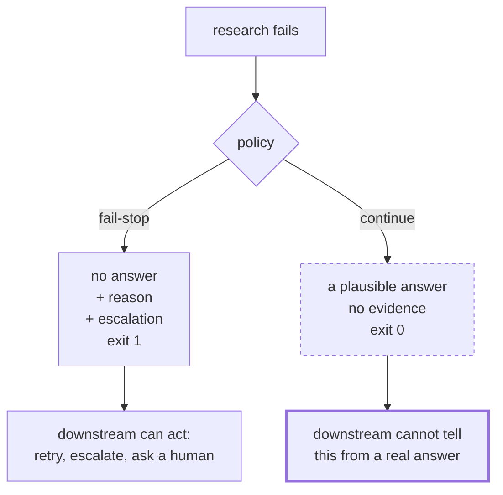

# 4.1 — Stopping is an answer; continuing is not

## One-line answer

A system that cannot compute correctly has exactly two options, and only one of them is honest: the
run that refused exited 1 with nothing invented, and the run that carried on exited 0 with a fix the
archive never contained.

## The story

You hand a prescription across the counter and the pharmacist looks at it for a while.

The handwriting is bad. He can read the dosage and he is not certain about the drug — it could be
one of two, and one of them is a heart medicine.

He could give you the one he thinks it probably is. He is experienced, and he is probably right, and
you are standing there waiting, and there is a queue behind you.

What he does instead is put the paper down and say: *I can't read this. I'm going to ring the
doctor. It'll take a few minutes.*

That is not him failing at his job. That **is** his job. The part of it that matters is not the
dispensing, which a machine could do; it is knowing the difference between a thing he knows and a
thing he has guessed, and refusing to let the second one out of the shop dressed as the first.

## The idea in plain language

When a system detects that it cannot do the thing correctly, it has two behaviours available:

- **Fail-stop:** halt, and make the halt visible, so that whoever depends on the result knows there
  is no result.
- **Continue:** produce something anyway.

Everything in sections 1 to 3 has been about *stopping*. This part is about why stopping is a
positive outcome rather than a failure to produce one, and the argument is sharper than "honesty is
good".

The argument is about **what the next component can do.** A downstream system, or a human, receiving
a result has to decide whether to trust it. If the upstream can only ever produce results, then
every result carries an unknown probability of being invented, and the downstream has no way to tell
the good ones from the bad ones — so it must either verify everything itself, which defeats the
point of the upstream, or trust everything, which means it is wrong sometimes and never knows when.

If the upstream can *stop*, and stopping is visible, then a result means something. That is the
whole trade, and it is why the property is worth paying for.

Principle 10 states it for this curriculum: **errors surface, escalate and are logged; never
fabricate a result to cover an error.** This part is that principle's mechanism, and section 4.2 is
its interface.

There is a specifically agentic reason it matters more here than in ordinary software. A function
that cannot compute usually raises, because it has no alternative — there is nothing for it to
return. A language model **always has something to return.** Ask it for a resolution to a ticket
whose research step failed, and it will write a fluent, plausible, well-formatted resolution, because
producing plausible text is the thing it does. The default behaviour of the component is to continue,
and continuing looks exactly like succeeding.

## Why Sutra needs it

The desk answers support tickets. A support answer that is confidently wrong is worse than no answer,
because a customer acts on it — clears their cookies, changes a setting, waits for a refund that is
not coming — and then has to be un-told.

Concretely: Days 49 and 50 built retrieval, and Day 50 spent a whole part on the desk's right to
return nothing. The reason that part exists is this one. A retriever that always returns its
best three rows, however bad, hands the drafting step something to write from, and the drafting step
will write from it. The refusal has to start at the component that first knows something is wrong,
and it has to survive all the way to the reply.

## The paper behind it

**Fail-stop processors: an approach to designing fault-tolerant computing systems** ·
`doi:10.1145/357369.357371` · ACM Transactions on Computer Systems 1(3), 222–238, 1983 ·
<https://doi.org/10.1145/357369.357371>

It defines a processor that, on detecting a fault, **halts rather than performing an incorrect state
transformation**, and whose halted state is detectable by other processors — turning an arbitrary
fault into one that the rest of the system can reason about.

Taught in [`papers/01-fail-stop-processors.md`](../../papers/01-fail-stop-processors.md).

## The mechanism

A research step that fails, and two policies for what happens next.

```python
def research(ticket: str) -> str:
    raise ResearchUnavailable(f"retrieval index unavailable for ticket {ticket}")


def draft(evidence: str | None) -> str:
    """Write the reply. With no evidence it writes a plausible one, which is the failure."""
    if evidence:
        return f"Reply for {ticket_line()}: {evidence}"
    return (
        f"Reply for {ticket_line()}: This is a known issue with the sign-in redirect. "
        "Please clear your cookies and try again."
    )
```

**Line by line:**

- `raise ResearchUnavailable(...)` — the failure is a *detected* one. That matters: fail-stop is
  about what you do having noticed, and a system that cannot notice has a different, harder problem.
- `def draft(evidence: str | None)` — the signature is the whole bug. Accepting `None` where evidence
  should be means the failure is representable as ordinary input, and a function that accepts a value
  will do something with it.
- The `return` with no evidence is not nonsense. It is a fluent, well-formed, entirely plausible
  support reply mentioning cookies and a sign-in redirect, which are real things associated with this
  class of ticket. **It is indistinguishable from a good answer by anything except knowing that no
  evidence was retrieved.** That is what "the model always has something to return" looks like when
  you write it out by hand.

Run the honest policy:

```bash
cd days/day-59-runaway-agents-contained/lab
uv run python refuse.py; echo "exit: $?"
```

**Line by line:**

- No flags: research fails, and the desk refuses rather than drafting.

Measured on 2026-09-05:

```text
question: customer bounced back to the sign-in page during single sign-on
policy  : refuse, usefully
    NO ANSWER for ticket 4610.
        what failed : research
        why         : retrieval index unavailable for ticket 4610
        what is true: the ticket was read and classified; no prior case was retrieved
        next        : escalated to a human queue; retry the index build, then re-run
        run id      : run-4610-01
    contains a fix the archive never confirmed: no
exit: 1
```

Now the other policy, with **everything else identical**:

```bash
uv run python refuse.py --carry-on; echo "exit: $?"
```

**Line by line:**

- `--carry-on` changes one branch: on `ResearchUnavailable`, draft anyway with no evidence. The
  question, the ticket, the classification and the drafting code are all the same.

```text
question: customer bounced back to the sign-in page during single sign-on
policy  : carry on
    Reply for ticket 4610: This is a known issue with the sign-in redirect. Please clear your cookies and try again.
    contains a fix the archive never confirmed: yes
exit: 0
```

Read those two outputs as a customer would.

The second one is **better**. It is shorter, it is polite, it is on topic, it contains an
instruction, and it does not mention any internal machinery. If you put both in front of ten people
and asked which system is working, most would pick the second.

It is also wrong. There is no evidence anywhere in the run that clearing cookies fixes this ticket.
The archive was not reached. The sentence was produced because a function was asked for a reply and
had no way to decline.

And now the line that should make you uncomfortable:

```text
exit: 1   # the honest refusal
exit: 0   # the invented answer
```

**The honest one is the failure.** Every piece of automation you own — the CI job, the health check,
the alerting rule, the retry policy, the dashboard that counts successful runs — reads those exit
codes, and every one of them will report the invented answer as the good outcome and the refusal as
the incident. If you do nothing about that, your entire operational apparatus is pointed in exactly
the wrong direction, and it will apply steady pressure on the team to make the refusals stop.



## When it breaks

Fail-stop breaks in two directions, and both are common.

**It stops too often.** A system that refuses on every imperfection refuses constantly, and a refusal
that arrives constantly is treated as noise. This is the real cost of the property and it should not
be waved away: every refusal is work that a human now has to do. If the escalation queue receives
forty items a day and the team can handle five, then thirty-five tickets are worse off than they
would have been with a mediocre automated answer — and the honest accounting has to include that.
The answer is not to refuse less; it is that the threshold for refusal is a product decision, made
explicitly, with the queue capacity as an input.

**It stops in a way nobody can act on**, which is [4.2](4.2-what-a-refusal-has-to-say.md)'s subject
and is visible in the third arm:

```bash
uv run python refuse.py --thin; echo "exit: $?"
```

**Line by line:**

- `--thin` replaces the structured refusal with the sentence every system emits by default.

```text
policy  : refuse, thinly
    Sorry, something went wrong.
    contains a fix the archive never confirmed: no
exit: 1
```

Technically perfect. It refused, it invented nothing, it exited non-zero. And there is no ticket
number, no failing component, no reason, no next step and no run id, so the person who receives it
can do exactly one thing: ask somebody. A refusal that cannot be acted on has paid the entire cost of
fail-stop and collected none of the benefit.

The third failure is the one that eats the property from the inside, and it is worth naming because
it is a code review comment rather than an incident. Somebody writes:

```python
except ResearchUnavailable:
    return draft(None)          # be resilient
```

**Line by line:**

- `except ResearchUnavailable:` — catching the specific exception, which looks like careful
  engineering.
- `return draft(None)` — and this is the whole failure. It converts a detected fault into an
  undetectable one. Before this line, the system knew it could not answer; after it, nobody knows
  anything, for ever.
- `# be resilient` — the comment is what makes it survive review. Resilience and fabrication are
  genuinely hard to tell apart from inside a diff, and the distinguishing question is: *does the
  fallback produce a claim about the world that nothing verified?*

This is plan §5.1 **trap #4** — do not swallow exceptions — in its most expensive form. 2.x surfaces
errors through the runtime precisely so that plugins and callbacks can act on them, and a `return`
in an `except` block is how that machinery gets bypassed one component at a time.

## In production

**What a professional writes instead.** They make the refusal a **first-class result type** rather
than an exception that escapes. Every stage returns either an answer or a refusal-with-reason, and
the type system carries that distinction so it cannot be dropped by accident. In a graph, that means
a refusal has a **route**: Day 58's desk sends the unknown-ticket case to escalation, and a research
failure should follow it. An exception propagating out of the runner is better than a fabrication and
worse than a routed refusal, because the routed version reaches a human queue with context attached
rather than a log file.

They also fix the exit-code problem above rather than living with it. Two distinct non-zero codes —
one for "refused, working as designed", one for "crashed" — and alerting that treats them
differently. It is a small change and it stops the operational pressure that otherwise slowly
converts fail-stop systems into continuing ones.

**What degrades at scale.** The refusal rate becomes a load-bearing number. At one refusal a day a
human absorbs it. At five per cent of ten thousand tickets it is five hundred a day and there is no
human. Systems at that scale need refusals to be *tiered* — some go to a queue, some to an automated
retry, some to a generic response that is explicitly labelled as generic — and the tiering has to be
designed rather than emerging from whoever is on call.

**The failure mode that only appears with real traffic.** Fabrication correlates with novelty. The
tickets where research fails are the ones about things your archive does not cover, which are your
new products, your new incidents and your new customers. So a system that continues rather than
stopping is most confidently wrong exactly where it is least tested, and the wrong answers cluster
on the topics where you can least afford them.

**The review comment a senior engineer leaves:** *"`except ResearchUnavailable: return draft(None)`
turns a detected failure into an undetectable one. Downstream cannot distinguish this reply from a
researched one, and neither can the customer. Return a refusal, route it to escalation, and put the
reason in it. Also: our honest path exits 1 and our fabricating path exits 0, so every alert we own
currently prefers the lie — give refusals their own exit code."*

**The interview question:** *"Your agent cannot complete a task. What should it do?"* — *"Stop, and
make the stop visible and actionable. The reason is not ethics, it is that a component which can only
produce results makes every result untrustworthy, so the consumer has to verify everything or trust
everything. I built both policies over the same failure: the refusing one printed what failed, why,
what was still true and what happens next, and invented nothing; the continuing one produced a
fluent, plausible support reply recommending a fix that appeared nowhere in our archive. The second
one reads better. The detail I would flag is that the honest path exited 1 and the fabricating path
exited 0, so all our tooling scored the lie as the success — that is a thing you have to fix
deliberately or your own alerting will erode the property."*

## Check yourself

```bash
cd days/day-59-runaway-agents-contained/lab
uv run python refuse.py; echo "exit: $?"
uv run python refuse.py --carry-on; echo "exit: $?"
uv run python refuse.py --thin; echo "exit: $?"
```

Now take the `--carry-on` output and write down every claim it makes about the world. Mark each one
as verified by the run, or not.

**Out loud, without scrolling up:** explain why a component that can stop makes its *successful*
results more valuable, and say what the exit codes in this lab get wrong.

**Next:** [4.2 — What a refusal has to say to be worth anything](4.2-what-a-refusal-has-to-say.md).
