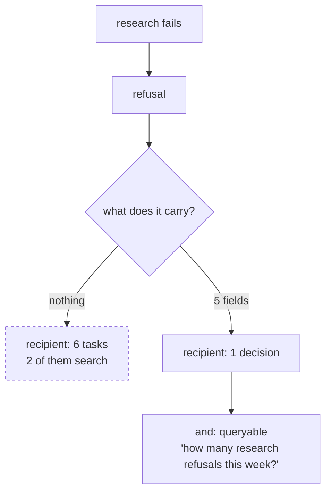

# 4.2 — What a refusal has to say to be worth anything

## One-line answer

*"Sorry, something went wrong"* and a five-field refusal naming the failed component, the reason,
what is still true, the next step and the run id both exit 1 and invent nothing, and only one of
them lets anybody do anything.

## The story

The board at the station says: **CANCELLED**.

That is all it says. Two hundred people are standing on the platform and every one of them now has
the same questions and no way to answer them. Is the next one running. Is it the line or is it this
train. Should I wait ten minutes or should I leave and find a bus. Is my ticket good on the bus.

Twenty minutes later a man with a radio comes out and says: the six-fifteen is cancelled, signal
fault at the junction, the six-forty-five is running and will be busy, your tickets are valid on the
number nine bus outside gate two.

Same fact. The train is still not coming. Everybody on that platform can now decide what to do, and
about a third of them leave immediately and are happier for it.

## The idea in plain language

[4.1](4.1-stopping-is-an-answer.md) established that stopping is the right behaviour. This part is
about the fact that **stopping is not free**, and that the price is paid by whoever receives the
refusal.

A refusal transfers work. Before it, the system was going to do something; after it, a person or
another system has to. Whether that transfer is a good deal depends entirely on how much of the work
travels with it. A refusal that carries context transfers a small, well-defined task. A refusal that
carries nothing transfers an investigation.

So the question is not *should it refuse* but *what does the refusal contain*. Five fields, and each
one answers a question the recipient would otherwise have to answer themselves:

| Field | The question it answers | Why it is not obvious |
| --- | --- | --- |
| **what failed** | which component? | the recipient sees a whole system, not your call graph |
| **why** | what was the error? | the verbatim message, not a category |
| **what is true** | how far did it get? | partial progress is real and re-doing it costs |
| **next** | what happens now, and what can I do? | says whether the recipient must act at all |
| **run id** | where do I look? | without it, "find the run" is the first task |

There is a sixth thing that is not a field, and it is the one people get wrong: **a refusal must not
contain a guess.** The moment it says "this is probably a caching issue", it has smuggled a
fabrication into the one message whose entire value was that it contained none. The refusal reports
what happened; it does not diagnose.

## Why Sutra needs it

Sutra's refusals are going to arrive somewhere specific. Day 58's graph routes the unknown-ticket
case to an escalation station, and from today the quota breaker and the containment guards produce
refusals that should go the same way. That escalation station feeds a human queue, and a human queue
is exactly where the difference between the two refusals in this part is measured in minutes per
item.

There is a second consumer, and it is the one that makes the structure non-negotiable: Day 22 gave
Sutra structured logging, and Days 84 to 88 will trace the whole system. A refusal that is a free-text
sentence is not queryable. A refusal with a `what failed` field lets you ask "how many refusals came
from research this week", which is the question that finds a broken index before anybody escalates
anything.

## The mechanism

The refusal is a function of the exception rather than a constant string, which is the structural
reason it can carry anything at all.

```python
def refusal(exc: Exception) -> str:
    if THIN:
        return "Sorry, something went wrong."
    return (
        f"NO ANSWER for {ticket_line()}.\n"
        f"    what failed : research\n"
        f"    why         : {exc}\n"
        f"    what is true: the ticket was read and classified; no prior case was retrieved\n"
        f"    next        : escalated to a human queue; retry the index build, then re-run\n"
        f"    run id      : run-4610-01"
    )
```

**Line by line:**

- `def refusal(exc: Exception) -> str` — it takes the exception. A refusal builder that takes no
  arguments can only produce a constant, and a constant cannot say why. This signature is the
  difference between the two arms.
- `NO ANSWER for ...` as the first line — the headline states the outcome before any detail, because
  a person scanning a queue reads the first line of forty items and the rest of two.
- `what failed : research` — the **component**, not the symptom. "Retrieval failed" tells a reader
  which part of your system to look at; "an error occurred" tells them to look at all of it.
- `why : {exc}` — the exception, interpolated **verbatim**. Not categorised, not prettified. The
  recipient will paste this string into a search box, and a paraphrase is not searchable. This is the
  same discipline as pasting a real traceback rather than describing one.
- `what is true: the ticket was read and classified; no prior case was retrieved` — the field almost
  nobody writes, and the one that saves the most work. It says what survived, which tells the
  recipient what they do **not** have to redo — and, after
  [2.5](../02-where-a-brake-goes/2.5-the-kill-switch-and-what-it-leaves.md), you should read it with
  suspicion, because that part measured two kills producing identical state and different amounts of
  spent work. What is true and what is recorded are not the same set.
- `next : escalated to a human queue; retry the index build, then re-run` — two clauses on purpose:
  what the **system** already did, and what a **person** could do. Without the first, the recipient
  does not know whether anything is in hand; without the second, they know it is their problem and
  not what to do about it.
- `run id : run-4610-01` — an identifier that resolves to the logs. In this lab it is a constant, and
  in a real system it is the invocation id that Day 22's structured logs carry, which is what turns a
  refusal into a starting point rather than a search.

Run the two arms:

```bash
cd days/day-59-runaway-agents-contained/lab
uv run python refuse.py; echo "exit: $?"
uv run python refuse.py --thin; echo "exit: $?"
```

**Line by line:**

- The two arms have the **same** failure, the same policy of refusing and the same exit code. The
  only variable is what the refusal says.

Measured on 2026-09-05:

```text
policy  : refuse, usefully
    NO ANSWER for ticket 4610.
        what failed : research
        why         : retrieval index unavailable for ticket 4610
        what is true: the ticket was read and classified; no prior case was retrieved
        next        : escalated to a human queue; retry the index build, then re-run
        run id      : run-4610-01
    contains a fix the archive never confirmed: no
exit: 1

policy  : refuse, thinly
    Sorry, something went wrong.
    contains a fix the archive never confirmed: no
exit: 1
```

Both are honest. Both exit 1. Both invented nothing, so by
[4.1](4.1-stopping-is-an-answer.md)'s criterion both are correct.

Now count the work each one transfers. Given the second message, the recipient must: find the ticket,
find the run, work out which stage failed, work out whether anything succeeded, decide whether to
re-run or to answer by hand, and decide whether anybody else needs telling. Six tasks, and the first
two are pure search.

Given the first, they must: decide whether to rebuild the index now or later. One task, and they
already know the answer to everything else.

**The refusal did not get more honest. It got cheaper to receive.**



## When it breaks

The refusal breaks by containing the wrong things, and there are three specific wrong things.

**It contains a guess.** Somebody adds a `likely cause` field, because it seems helpful, and it is
helpful about half the time. The other half it sends the recipient down a wrong path with your
system's authority behind it, and — worse — it re-introduces exactly the fabrication that
[4.1](4.1-stopping-is-an-answer.md) refused to allow in the answer. A refusal containing an invented
diagnosis is a fabrication that has escaped through the emergency exit.

**It contains too much.** The opposite failure: the refusal carries the full traceback, the request
payload, the retrieved rows and the model's partial output. It is now four hundred lines, and the
recipient reads none of it. Five fields, and a pointer to where the rest lives.

**It contains something it should not.** This is the one with teeth. The `why` field interpolates an
exception message, and exception messages contain whatever the failing code put in them — which can
be a customer's email address, a fragment of a ticket, an API key in a URL. A refusal is a message
that leaves your system: it goes into a queue, into a log, sometimes into a chat channel and
sometimes to the customer. Day 69's data-boundary work is where this is dealt with properly; the
rule worth adopting today is that **the `why` field is verbatim from your own exceptions and never
from a payload**, which is a constraint on how you write exception messages rather than on how you
write refusals.

There is also a break in the other direction, and it is the operational one from
[4.1](4.1-stopping-is-an-answer.md). If the refusal is good, and the queue receives forty of them a
day, the team will start treating the queue as a background hum. A refusal's value decays with the
volume of refusals, which means **improving the refusal is not a substitute for reducing the refusal
rate**, and a team that has done the first and not the second has built a very well-documented
backlog.

## In production

**What a professional writes instead.** The refusal is a **structured object**, not a formatted
string — a dataclass or a typed dict with those five fields, rendered differently for the three
audiences it has: a log line for machines, a queue item for the person who fixes it, and a customer
message that contains none of the internals and says only that the request needs a person. One
object, three renderings, and the renderings are separate functions so that nobody accidentally ships
the internal one to a customer.

The field they add that this lab does not have is a **class**: is this refusal transient (retry may
work), permanent (retrying is pointless), or a policy stop (the system refused deliberately, as the
quota breaker does)? Those three demand different downstream behaviour, and without the field the
downstream guesses — usually by retrying, which turns a permanent failure into
[3.2](../03-brakes-that-do-not-hold/3.2-three-retries-become-twenty-seven.md).

**What degrades at scale.** Free-text refusals become unqueryable at exactly the volume where you
need to query them. At ten a day you read them; at a thousand a day you need "group by what failed",
and if `what failed` was never a field you cannot get it back retrospectively — the information was
never captured, only rendered.

**The failure mode that only appears with real traffic.** Refusal messages are written once, by the
person who wrote the failing component, and are then read by people who did not. The author knows
what "index unavailable" means. The person on call at 3am, three months later, does not, and the
message that seemed self-explanatory turns out to assume a mental model nobody wrote down. The
cheapest defence is the `next` field, because it forces the author to write the action rather than
the diagnosis.

**The review comment a senior engineer leaves:** *"This refusal is a string. Make it an object with
`what_failed`, `why`, `what_is_true`, `next` and `run_id`, plus a class of transient / permanent /
policy — otherwise the caller cannot decide whether retrying is sane. And check what goes into
`why`: it interpolates an exception whose message includes the ticket text, which means customer
words end up in a chat channel."*

**The interview question:** *"What goes in an error message?"* — *"Enough that the recipient does not
have to investigate. I use five fields: which component failed, the verbatim error, what is still
true so they know what not to redo, what happens next split into what the system already did and
what a person can do, and a run id that resolves to the logs. I have run the comparison: the same
failure with a five-field refusal and with 'sorry, something went wrong' — both honest, both exit
non-zero, and one transfers a single decision while the other transfers six tasks, two of which are
pure search. The two things I am careful about are that it must not contain a guessed diagnosis,
because that is a fabrication escaping through the error path, and that the verbatim error must come
from my exceptions and not from customer data."*

## Check yourself

```bash
cd days/day-59-runaway-agents-contained/lab
uv run python refuse.py
uv run python refuse.py --thin
```

Now write the customer-facing rendering of the same refusal: one sentence, no internals, and no
claim about the cause. Then say which of the five fields it may contain.

**Out loud, without scrolling up:** name the five fields, and say why a `likely cause` field would be
a mistake.

**Next:** [5.1 — Criterion 1: the triage graph runs end to end](../05-the-gate/5.1-criterion-1-end-to-end.md).
