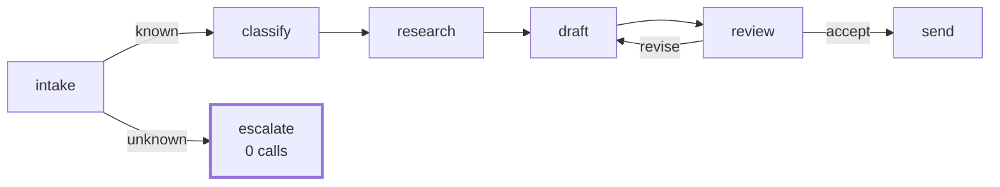

# 5.1 — Criterion 1: the triage graph runs end to end

## One-line answer

The Phase 8 gate says *triage graph v1 end-to-end*, and the version of that sentence a gate can use
names the tickets, the path each one must take and the calls each is allowed: five model calls for an
answered ticket, **zero** for an unknown one, and an exit code.

## The story

The driving test is not "can you drive". Nobody could pass or fail you on that.

It is a route. Out of the centre, left at the roundabout, the hill start on Mill Road, reverse around
the corner by the school, back in. The examiner has a sheet with boxes on it, and every box is a
thing that either happened or did not.

You can argue with the route. You cannot argue about whether you stalled on the hill, and that is
the entire reason the route exists in that form. A test made of opinions produces an argument. A test
made of observations produces a result.

## The idea in plain language

A **phase gate** is the moment where "it works" has to become a set of statements that can be
checked, and this is the first of six.

The plan's gate for Phase 8 is one sentence: *triage graph v1 end-to-end*. That sentence is a good
description and a bad test, because three people would check three different things. Turning it into
a criterion means answering four questions:

1. **On what input?** Named tickets from a fixture, not "a ticket".
2. **Through what path?** The stations visited, in order.
3. **At what cost?** Model calls, bounded by an expression rather than a number, so the bound moves
   correctly when a brake moves.
4. **What counts as failing?** An exit code, so that the answer is not a paragraph.

The fourth is the one that turns a document into a gate. Everything in this section ends in an exit
code for the same reason: a criterion you have to interpret is a criterion two people will interpret
differently, and a phase gate exists precisely for the moment when somebody wants to be finished.

**Three tickets, and the third is the important one.** Two of them are ordinary and go all the way
through. The third does not exist in the archive, and the criterion for it is that it leaves at
intake having spent **nothing** — because Day 50 established that returning nothing is an answer, and
[4.1](../04-fail-stop/4.1-stopping-is-an-answer.md) established that inventing one is the failure.
A gate that only tests the happy path has tested the half of the system that was never in doubt.

## Why Sutra needs it

Phase 8 built the composition layer — nodes and edges on Day 53, the three shapes on Day 54,
delegation on Day 55, planning on Day 56, the orchestrator and critic on Day 57 — and Day 58 wired
all of it into the desk. This criterion is the one that says those six days produced a working thing
rather than six working things.

It is also the baseline that every other criterion in this section is measured against. The brake
matrix in [5.2](5.2-criterion-2-every-shape-has-a-brake.md) is meaningless without a run that
completes; the budget in [5.4](5.4-criterion-4-the-budget-is-measured.md) is measured on these
numbers; and the eval in [5.3](5.3-criterion-3-the-eval-goes-red.md) is red exactly when this stops
being true.

## The mechanism

The criterion is a table of expectations, written before the run:

```python
EXPECTED = {
    "4610": {"last": "send", "max_model_calls": 1 + 2 * REVISIONS},
    "4712": {"last": "send", "max_model_calls": 1 + 2 * REVISIONS},
    "8842": {"last": "escalate", "max_model_calls": 0},
}
```

**Line by line:**

- `"last"` — the station the run must end at, which is the compact way of asserting the path. A
  ticket that ends at `send` was answered; one that ends at `escalate` was not, and the difference
  between them is what the criterion is about.
- `1 + 2 * REVISIONS` — the bound is an **expression**, not a literal. This is the same arithmetic as
  [3.4](../03-brakes-that-do-not-hold/3.4-the-brake-loosened-for-one-ticket.md): one classify, then a
  draft and a review per round. Writing `5` here would mean that raising the revision cap breaks the
  gate for the wrong reason, and somebody would then "fix" the gate.
- `"8842": ... "max_model_calls": 0` — **zero, not "few".** The unknown ticket must not reach the
  classifier at all. A criterion of "not many calls" would pass a system that classified a ticket it
  had already established does not exist.

The check itself runs each ticket and compares:

```python
    for ticket, question in QUESTIONS.items():
        spend = Spend()
        outputs = run(drive(triage_graph(spend, max_revisions=REVISIONS), question))
        want = EXPECTED[ticket]
        ok = spend.seen[-1] == want["last"] and spend.model_calls <= want["max_model_calls"]
```

**Line by line:**

- `spend = Spend()` per ticket — a fresh counter each time, so one ticket's cost cannot be hidden in
  another's. Sharing the counter across tickets is a real and easy mistake and it makes the whole
  table meaningless.
- `spend.seen[-1]` — the last station actually visited, recorded by the stations themselves rather
  than inferred from the output text. Asserting on the output string would pass a system that printed
  the right words from the wrong place.
- `spend.model_calls <= want["max_model_calls"]` — `<=`, because fewer calls than budgeted is not a
  failure. A gate that demanded exactly five would go red when somebody made the desk cheaper.

Run it:

```bash
cd days/day-59-runaway-agents-contained/lab
uv run python endtoend.py; echo "exit: $?"
```

**Line by line:**

- No flags: `MAX_REVISIONS=2`, the value the desk ships with.

Measured on 2026-09-05:

```text
MAX_REVISIONS=2
 ticket  path                                                       model   ok
   4610  intake -> classify -> research -> draft -> review -> draft -> review -> send     5  yes
   4712  intake -> classify -> research -> draft -> review -> draft -> review -> send     5  yes
   8842  intake -> escalate                                             0  yes
    findings: 0
exit: 0
```

**Criterion 1 passes.** Read the paths rather than the verdict, because the paths are the evidence.

Ticket 4610 goes through eight station visits: intake, classify, research, then draft and review
twice, then send. The `draft → review → draft` is the revision loop from
[2.2](../02-where-a-brake-goes/2.2-the-loop-counter.md) going round exactly once before the cap ends
it, and the run ends at `send` rather than at `escalate`, which is the difference between a reply
and an escalation.

Ticket 8842 visits two stations and stops. **Zero model calls.** No classification of a ticket that
does not exist, no research against an empty archive, no draft written from nothing. That is
[4.1](../04-fail-stop/4.1-stopping-is-an-answer.md)'s argument as a measurement: the honest path is
also the cheap one, which is the happiest alignment in this whole day.

Now move the brake and watch the bound move with it:

```bash
uv run python endtoend.py --revisions 4; echo "exit: $?"
```

**Line by line:**

- `--revisions 4` doubles the revision cap. If the criterion had been written with a literal `5` it
  would now fail; because it is an expression, the bound becomes nine and the criterion still tests
  what it was meant to test.

```text
MAX_REVISIONS=4
 ticket  path                                                       model   ok
   4610  intake -> classify -> research -> draft -> review -> draft -> review -> draft -> review -> draft -> review -> send     9  yes
   4712  intake -> classify -> research -> draft -> review -> draft -> review -> draft -> review -> draft -> review -> send     9  yes
   8842  intake -> escalate                                             0  yes
    findings: 0
exit: 0
```

Nine calls, four revision rounds, same terminal station. And `1 + 2 × 4 = 9`, which is the
confirmation that [3.4](../03-brakes-that-do-not-hold/3.4-the-brake-loosened-for-one-ticket.md)'s
formula is a description of this system rather than a plausible-looking equation.



## When it breaks

The criterion breaks in a way worth watching for, because it is the way gates usually get weakened:
**the expectation table gets edited to match the run.**

The sequence is that somebody changes the desk, the gate goes red, and the fastest way to green is to
change the number in `EXPECTED`. Sometimes that is correct — the desk genuinely got more expensive
for a good reason. Sometimes it is a regression being written into the specification. The two are
indistinguishable in a diff, which is why the bound is an expression: `1 + 2 * REVISIONS` cannot be
edited to match a run without somebody noticing that they are changing the *model* of the system
rather than a constant.

Here is the break made concrete. Break the unknown-ticket route — change intake so that an
unrecognised ticket is passed to the classifier "just in case", which is a change somebody makes
because it feels more forgiving:

```bash
uv run python endtoend.py --leaky-intake; echo "exit: $?"
```

**Line by line:**

- `--leaky-intake` makes intake emit the `known` route for a ticket it does not recognise, and lets
  the classifier deal with it. Nothing else about the desk changes, and the two ordinary tickets are
  unaffected.

```text
MAX_REVISIONS=2   intake: leaky
 ticket  path                                                       model   ok
   4610  intake -> classify -> research -> draft -> review -> draft -> review -> send     5  yes
   4712  intake -> classify -> research -> draft -> review -> draft -> review -> send     5  yes
   8842  intake -> classify -> escalate                                 1   NO
    findings: 1
    FINDING: 8842: ended at 'escalate' after 1 model calls, expected 'escalate' within 0
```

One call. The run still ends at `escalate`, so a criterion that checked only the terminal station
would pass this. The path check catches it, and the cost check catches it, and either one alone
would have. Two overlapping assertions on the same property is not redundancy; it is what stops a
criterion from being satisfiable in a way you did not intend.

The other break is subtler and this criterion does **not** catch it: the desk could produce a
terrible reply and still pass. Path and cost say nothing about quality. That is deliberate — quality
is Phase 12's subject, and Day 57's rubric is where the critic's judgement lives — but a gate day
should say plainly what its criteria do not cover rather than letting a green tick imply more than it
means.

## In production

**What a professional writes instead.** The expectations live in a fixture file rather than in the
test, so that adding a case is a data change; and each case carries a **reason** field saying why it
is in the set, because a gate accumulates cases for years and nobody remembers why ticket 8842 is
there. They also assert on **state**, not only on the path: `stopped_by` from
[2.1](../02-where-a-brake-goes/2.1-a-guard-is-only-a-guard-if-it-is-outside.md), the revision count,
whether evidence was retrieved. Path and cost are cheap proxies for what happened; state is what
happened.

**What degrades at scale.** Three tickets is enough to be a gate and nowhere near enough to be an
eval. The failure is that the three cases become the definition of correct, and the system gets tuned
until they pass. Phase 12 exists to replace this with an evalset; the honest framing today is that
this criterion checks that the machine is **assembled**, not that it is **good**.

**The failure mode that only appears with real traffic.** Real tickets do not sort neatly into known
and unknown. The interesting cases are the ones where the ticket exists but the archive has nothing
useful, or where the ticket id is malformed rather than absent, and the desk's intake has to decide
between three outcomes rather than two. A two-case gate makes a three-case world look binary.

**The review comment a senior engineer leaves:** *"The bound is `1 + 2 * REVISIONS` rather than 5 —
good, that survives a brake change. Two things: assert on `stopped_by` as well as the terminal
station, so we can tell a capped acceptance from a real one, and add a case where the ticket exists
and research returns nothing, because right now 'unknown ticket' is the only unhappy path we test."*

**The interview question:** *"What does 'it works end to end' mean, precisely?"* — *"It means named
inputs, an expected path, a bound on cost and an exit code. For our triage desk that is three
tickets: two that must reach the send station within `1 + 2 × MAX_REVISIONS` model calls — five at
our current cap, which the run confirms — and one unknown ticket that must leave at intake having
spent zero. The zero is the criterion I care most about, because it is the one that catches a system
classifying a ticket it has already established does not exist. And I write the bound as an
expression rather than a number, so that raising the revision cap moves the bound instead of breaking
the gate and tempting somebody to edit the expectation."*

## Check yourself

```bash
cd days/day-59-runaway-agents-contained/lab
uv run python endtoend.py; echo "exit: $?"
uv run python endtoend.py --revisions 4; echo "exit: $?"
```

Now change `EXPECTED["8842"]["max_model_calls"]` to `1` and re-run. The gate still passes. Write down
what that tells you about the difference between a criterion and a measurement.

**Out loud, without scrolling up:** state the four things a criterion needs, and say why the cost
bound is an expression rather than a number.

**Next:** [5.2 — Criterion 2: every shape has a brake, and the brake is tested](5.2-criterion-2-every-shape-has-a-brake.md).
